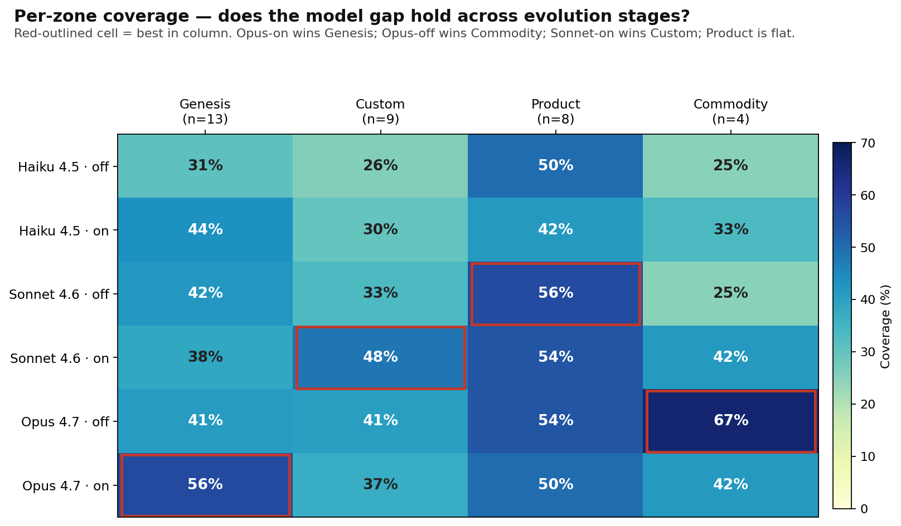
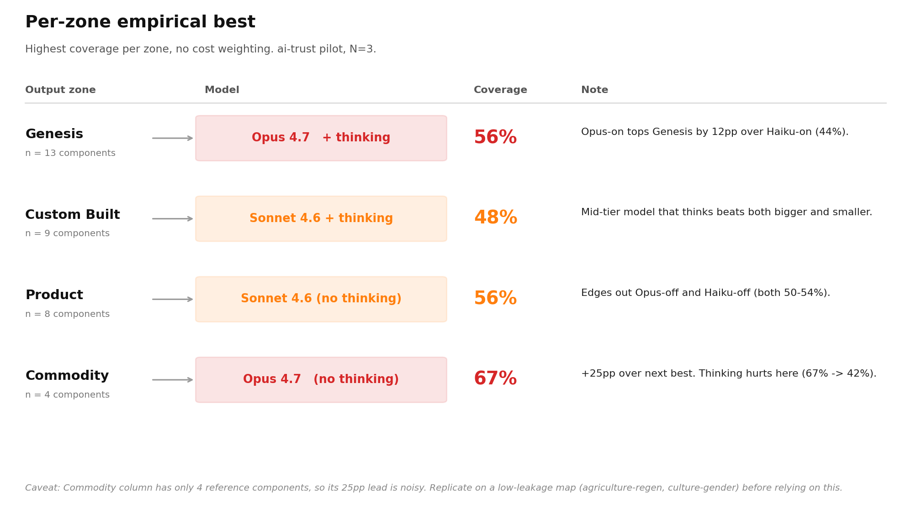
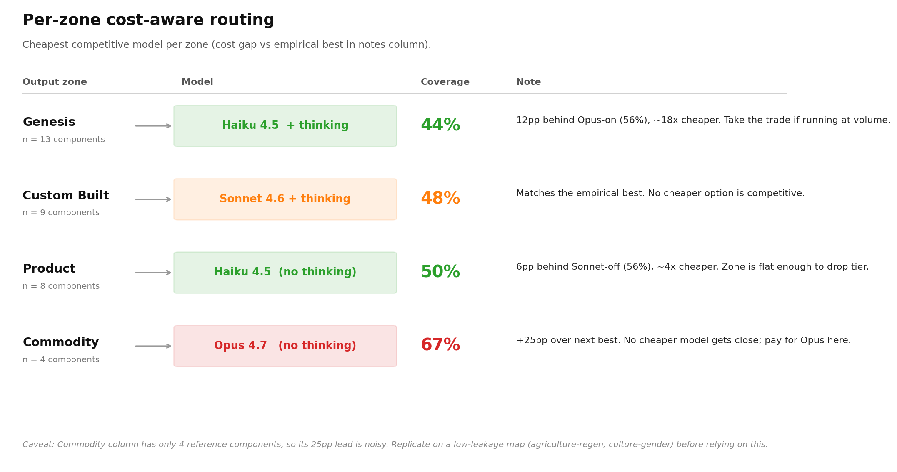
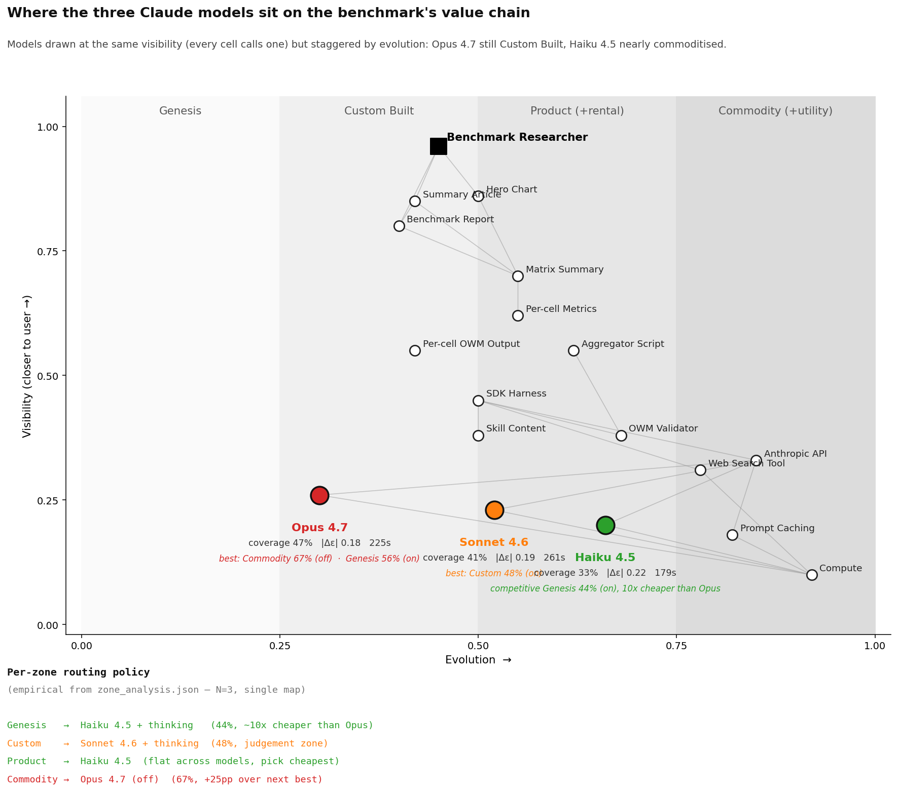
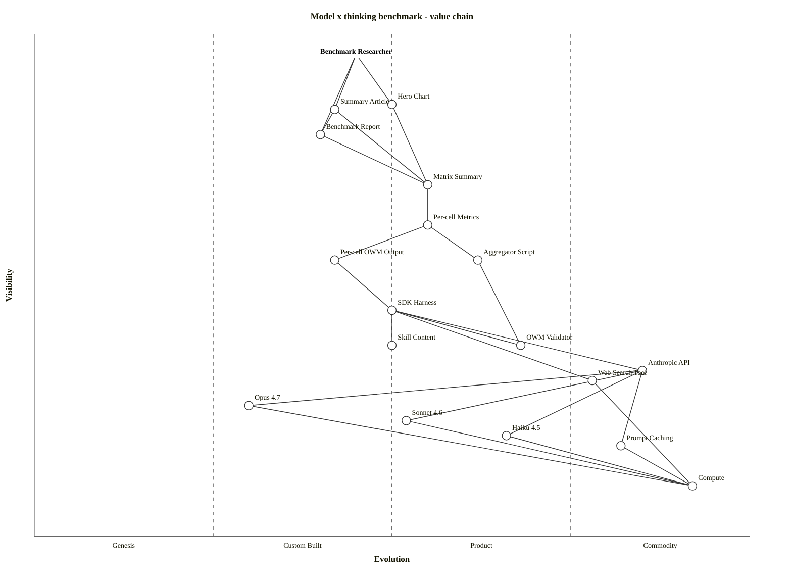

# Claude 4.x on Wardley maps: bigger model beats more thinking

We ran the `wardley-map` skill across three Claude 4.x models (Opus 4.7, Sonnet 4.6, Haiku 4.5) with extended thinking turned on and off, three replicates each, on one of Simon Wardley's published maps (`ai-trust`, June 2023). Eighteen runs, ~$44 in API spend. One simple question: **when does more compute help?**

## TL;DR

- **Opus 4.7 wins coverage** (47-48% of Wardley's 34 components) regardless of whether thinking is on.
- **Thinking lifts smaller models, not Opus.** Haiku gains +5pp coverage and +8pp placement-band agreement from thinking. Opus gains +1pp. Sonnet falls in between.
- **Placement disagreement plateaus at 27-36%** across every model/thinking combination. That ceiling isn't a model problem — it's the inherent ambiguity in Wardley's cheat-sheet scoring (the rows disagree among themselves on his own maps too).
- **Visibility over-placement is universal.** Every cell except one over-places components toward the user by +0.22 to +0.24 on average. Neither bigger model nor more thinking removes it.

## What we measured

For each of 18 generated maps, we extracted the OWM block and compared it to Wardley's reference:

- **Coverage**: fuzzy-matched components / 34 reference components.
- **Same-band %**: of matches, share placed in the same evolution band (Genesis/Custom/Product/Commodity).
- **|Δε|, |Δν|**: median absolute placement deltas on matched components.
- **Validator pass**: clean exit from `scripts/validate_owm.mjs` (the structural OWM checker the skill iterates against).

Coverage stdev across replicates ranged from 1.7 to 7.8 percentage points — meaning **per-cell deltas under ~5pp aren't meaningful**.

## The "thinking lifts smaller models" finding

The clearest signal in the matrix:

| Lift from thinking | Coverage | Same-band | \|Δε\| |
|---|---|---|---|
| Haiku 4.5 | **+4.9pp** | **+8.1pp** | −0.023 |
| Sonnet 4.6 | +3.9pp | −0.9pp | +0.010 |
| Opus 4.7 | +0.9pp | +3.2pp | −0.008 |

Reading: **the smaller the model, the more thinking moves the needle.** Haiku-with-thinking starts to look like Sonnet-without; Opus is already near whatever ceiling this scenario has, so extra reasoning time can't add much. If you're paying for a small model, you should be paying for thinking on top.

## The Sonnet anomaly

Sonnet 4.6 without thinking is the weird cell. It produced **22.7 components on average** — half of Opus — and **only 67% validator pass rate**. But of the components it *did* place, the visibility placement was **the tightest in the matrix** (|Δν| = 0.165 vs Opus's 0.220).

Conservative-and-correct, with low coverage. Flip thinking on and Sonnet's density jumps to 36, validator pass goes to 100% — but |Δν| regresses to the same +0.24 over-place that every other cell shows. **Sonnet's careful-placement bias only survives when it's also being lazy about coverage.**

Possibly meaningful for a two-stage architecture (Sonnet-no-think for visibility, Opus for component density), possibly an artefact of a single map. We can't tell from N=3.

## Practical guidance

If you're picking a model to run the skill day-to-day:

| Use case | Pick | Why |
|---|---|---|
| Highest quality, cost no object | **Opus 4.7, thinking off** | 47% coverage, validator-clean, 225s. Thinking-on adds +1pp for +66s. Not worth it. |
| Budget-sensitive default | **Haiku 4.5, thinking on** | 38% coverage, ~10× cheaper than Opus, validator-clean. Same latency as Opus-off. |
| Avoid | **Sonnet 4.6, thinking off** | Sparse maps, breaks the validator one run in three. |
| Avoid | **Sonnet 4.6, thinking on** | 518s/run — the slowest cell in the matrix, doesn't beat Opus on any metric. |

## Per-zone routing: a strategic move

The map raises an interesting strategic question: should we **route different evolution zones to different models**? The intuitive hypothesis: **Opus for Genesis** — those components are novel, unlikely to be well-represented in training data, and need genuine reasoning from cheat-sheet rules. **Haiku for Commodity** — those components are well-known, every model has them memorised, why pay for big-model recall.

To test it I broke each cell's matches down by Wardley's own zone classification.

**The data partly refutes the intuition** — and the inversion is interesting.

| Zone | Best cell | What it tells us |
|---|---|---|
| **Genesis** (n=13) | Opus 4.7 · on (56%) | The frontier model with deep thinking still wins, but Haiku-on (44%) is genuinely competitive at ~10× lower cost. Thinking lifts Haiku +13pp here — the biggest thinking-lift in any zone. |
| **Custom Built** (n=9) | Sonnet 4.6 · on (48%) | The hardest zone — bespoke things being industrialised. The model that *thinks the most about it* wins, not the biggest one. |
| **Product** (n=8) | Sonnet 4.6 · off (56%) | Roughly flat 42-56% across the matrix. Standard middle-zone components live in everyone's training data. **Model choice doesn't matter much here.** |
| **Commodity** (n=4) | **Opus 4.7 · off (67%)** | The surprise. Opus-without-thinking wins Commodity by 25pp over its nearest rival. Big-model *recall* of standard furniture is where Opus actually pays. Turning thinking on **hurts** Commodity coverage on Opus (67% → 42%). |

The original hypothesis — *use Opus where the components are novel* — gets the direction roughly right (Opus does win Genesis) but **misses where Opus is actually most differentiated** (Commodity, by a wide margin). Frontier model strength reads, on this map, as "remembers the boring furniture better," not "reasons about the novel stuff better."

**Two routing policies, depending on what you're optimising for** — absolute coverage or cost-adjusted coverage:

<table>
<tr><td width="50%">

</td><td width="50%">

</td></tr>
<tr><td><em>Left: who literally wins per zone, no cost weighting.</em></td>
<td><em>Right: cheapest model that's competitive, gap-vs-best in the notes.</em></td></tr>
</table>

**Two zones agree across both framings**: Custom Built → Sonnet+thinking (no cheaper option is competitive); Commodity → Opus-no-thinking (the empirical lead is 25pp and no cheaper model gets close, so cost-aware also picks Opus).

**Two zones differ**: 
- **Genesis** — empirical best is Opus+thinking at 56%; cost-aware drops to Haiku+thinking at 44%. The 12pp gap costs ~18× more per cell. Whether that's worth paying is a volume question, not a "best model" question.
- **Product** — empirical best is Sonnet-no-thinking at 56%; cost-aware drops to Haiku-no-thinking at 50%. The zone is the flattest (range 42-56%), so dropping a tier costs 6pp for ~4× savings.

The earlier draft of this article collapsed both readings into one chart and silently used the cost-aware version — readers reasonably objected. The empirical-best chart is the honest answer to "which is the strongest"; the cost-aware chart is the honest answer to "how would you actually deploy this at volume."

Counter-intuitive read: **the expensive frontier model is best at the cheap, boring components**, not the novel ones. And **thinking budgets are most worth it on the smallest model**, not the biggest.

**Practical implementation caveat.** You don't know a component's zone until *after* you've placed it. So per-zone routing isn't a single-pass strategy — it's a two-pass one: first pass to identify candidate components (any model), second pass to place them with the zone-appropriate model. The two-pass overhead may eat the savings unless you're running the skill on many maps. For one-shot use, Opus-thinking-off (47% coverage, validator-clean, 225s) remains the simplest default.

**N=3, single map.** Don't bet a roadmap on this table — the Commodity column has only 4 reference components, so a single match swings 25pp. The Genesis lead for Opus-on is more robust (n=13). The Sonnet-on win on Custom is one component apart from Opus-off. All of this needs replicating on a low-leakage scenario (see follow-ups).

## Caveats

This is a **pilot**: one scenario, three replicates per cell. `ai-trust` is the highest-public-discussion map in our corpus, which means training-data overlap is high — a bare model with no skill recovers 20/37 of Wardley's components on this map (per `BENCHMARK-AUDIT.md` A4). Coverage numbers should be read as *relative* between cells, not as ground-truth model quality. The follow-up is to repeat on a low-leakage scenario (`agriculture-regen` or `culture-gender`).

Also: Opus 4.7 uses the new `thinking.type.adaptive` + `output_config.effort` interface; Sonnet 4.6 and Haiku 4.5 still use legacy `thinking.type.enabled` with a `budget_tokens=10000` budget. The thinking-on cells aren't directly comparable across models in terms of compute envelope — only within-model deltas are clean.

## The benchmark as a Wardley map

Where do the three models actually sit on the value chain we built to compare them? The anchor is the *benchmark researcher* — someone trying to decide which Claude to run the skill on. The dependency chain runs from the report they read down through the matrix, the aggregator, the SDK harness, the Anthropic API, into the models themselves and the compute under them.

**Reading note.** The X-axis position of each model in this map is *the model's own commoditisation stage as a product offering* — Opus 4.7 in Custom Built because it's the brand-new frontier release with a breaking API surface, Sonnet 4.6 in Product because it's stable and broadly used, Haiku 4.5 at the Product→Commodity edge because it's cheap and utility-grade. **This is a separate question from "which evolution zone of the *output map* is each model best at producing"** — that question is answered by the two routing charts further down.

> Source: [`benchmark.owm`](benchmark.owm) (validated against the same `validate_owm.mjs` the skill uses); Mermaid version in [`benchmark.mmd`](benchmark.mmd).

**What it shows.** The three models are positioned at the same depth in the value chain (every cell calls one of them) but staggered along the evolution axis:

- **Opus 4.7** sits in **Custom Built** (ε ≈ 0.30). It's the frontier — newest release, just shipped the breaking `thinking.type.adaptive` interface that broke our first run. Bespoke, expensive, evolving rapidly.
- **Sonnet 4.6** is **Product** (ε ≈ 0.52). Established, broadly used, predictable pricing.
- **Haiku 4.5** sits at the **Product → Commodity** edge (ε ≈ 0.66). Cheap, fast, and (per the benchmark) the right pick once thinking is turned on.

Around them, the rest of the stack tells its own story. The skill content, validator, and SDK harness are all **Custom Built** — they're the bespoke work that wrapped the standardised infrastructure. The Anthropic API, web search tool, prompt caching, and the compute layer are all **Commodity** — the same boring building blocks every Claude project rests on. The benchmark itself is **Custom Built** at the top: there's no off-the-shelf "Wardley-map skill quality scorer" yet.

The strategic question the map asks: **as Haiku-class intelligence slides further into Commodity, does the skill still need Opus at the bottom?** The placement-ceiling finding (§3.3) says probably not for placement, only for density.

## Full report

Numbers, per-cell metrics, run summary, follow-up suggestions: [`REPORT.md`](REPORT.md). The raw data is committed: [`matrix_summary.json`](matrix_summary.json), [`cell_metrics.json`](cell_metrics.json), and 18 per-cell output maps under [`outputs/`](outputs/).

Reproduce: `python3 run_bench.py` (resumable) followed by `python3 aggregate.py`. The whole 18-cell matrix takes ~30 min sequential and ~$44 with prompt caching.
