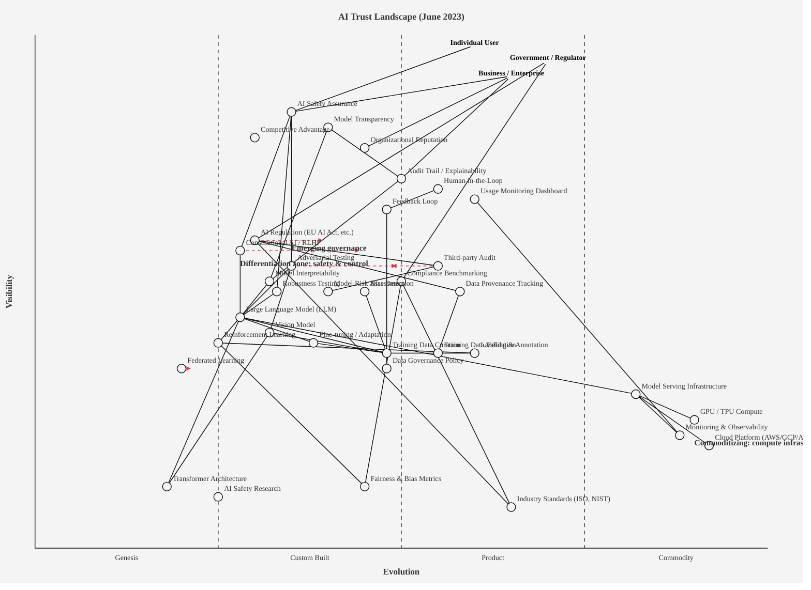

Perfect. Now I'll compose the full strategic analysis.

---

## OWM: AI Trust Landscape (June 2023)

```owm
title AI Trust Landscape (June 2023)
style wardley

// Three user anchors
anchor Individual User [0.98, 0.60]
anchor Government / Regulator [0.95, 0.70]
anchor Business / Enterprise [0.92, 0.65]

// === OUTCOMES LAYER ===
component AI Safety Assurance [0.85, 0.35]
component Model Transparency [0.82, 0.40]
component Competitive Advantage [0.80, 0.30]
component Organizational Reputation [0.78, 0.45]

// === USER-FACING TRUST MECHANISMS ===
component Audit Trail / Explainability [0.72, 0.50]
component Human-in-the-Loop [0.70, 0.55]
component Usage Monitoring Dashboard [0.68, 0.60]
component Feedback Loop [0.66, 0.48]

// === GOVERNANCE & COMPLIANCE LAYER ===
component AI Regulation (EU AI Act, etc.) [0.60, 0.30]
component Third-party Audit [0.55, 0.55]
component Compliance Benchmarking [0.52, 0.50]
component Model Risk Assessment [0.50, 0.40]
component Data Provenance Tracking [0.50, 0.58]

// === TECHNICAL SAFETY & CONTROL ===
component Constitutional AI / RLHF [0.58, 0.28]
component Adversarial Testing [0.55, 0.35]
component Model Interpretability [0.52, 0.32]
component Robustness Testing [0.50, 0.33]
component Bias Detection [0.50, 0.45]

// === MODELS & ALGORITHMS ===
component Large Language Model (LLM) [0.45, 0.28]
component Vision Model [0.42, 0.32]
component Reinforcement Learning [0.40, 0.25]
component Fine-tuning / Adaptation [0.40, 0.38]
component Federated Learning [0.35, 0.20]

// === DATA LAYER ===
component Training Data Curation [0.38, 0.48]
component Training Data Validation [0.38, 0.55]
component Data Governance Policy [0.35, 0.48]
component Labeling & Annotation [0.38, 0.60]

// === INFRASTRUCTURE & COMPUTE ===
component Model Serving Infrastructure [0.30, 0.82]
component GPU / TPU Compute [0.25, 0.90]
component Cloud Platform (AWS/GCP/Azure) [0.20, 0.92]
component Monitoring & Observability [0.22, 0.88]

// === FOUNDATIONAL KNOWLEDGE & STANDARDS ===
component Transformer Architecture [0.12, 0.18]
component Fairness & Bias Metrics [0.12, 0.45]
component AI Safety Research [0.10, 0.25]
component Industry Standards (ISO, NIST) [0.08, 0.65]

// === DEPENDENCIES: Outcomes → Controls ===
Individual User->AI Safety Assurance
Government / Regulator->AI Regulation (EU AI Act, etc.)
Government / Regulator->Compliance Benchmarking
Business / Enterprise->Audit Trail / Explainability
Business / Enterprise->Organizational Reputation
Business / Enterprise->AI Safety Assurance

AI Safety Assurance->Adversarial Testing
AI Safety Assurance->Constitutional AI / RLHF
AI Safety Assurance->Robustness Testing
Model Transparency->Audit Trail / Explainability
Model Transparency->Model Interpretability

// Governance dependencies
AI Regulation (EU AI Act, etc.)->Third-party Audit
AI Regulation (EU AI Act, etc.)->Data Provenance Tracking
AI Regulation (EU AI Act, etc.)->Industry Standards (ISO, NIST)
Third-party Audit->Model Risk Assessment
Compliance Benchmarking->Fairness & Bias Metrics
Compliance Benchmarking->Industry Standards (ISO, NIST)

// Control mechanisms
Audit Trail / Explainability->Model Interpretability
Human-in-the-Loop->Feedback Loop
Usage Monitoring Dashboard->Monitoring & Observability
Feedback Loop->Training Data Curation

// Safety & interpretability → models
Adversarial Testing->Large Language Model (LLM)
Adversarial Testing->Vision Model
Constitutional AI / RLHF->Large Language Model (LLM)
Model Interpretability->Large Language Model (LLM)
Robustness Testing->Large Language Model (LLM)
Bias Detection->Training Data Curation

// Models → data
Large Language Model (LLM)->Training Data Curation
Large Language Model (LLM)->Reinforcement Learning
Vision Model->Training Data Curation
Fine-tuning / Adaptation->Training Data Curation
Reinforcement Learning->Labeling & Annotation

// Data layer
Training Data Curation->Data Governance Policy
Training Data Validation->Training Data Curation
Data Provenance Tracking->Training Data Validation
Labeling & Annotation->Training Data Validation

// Models → Algorithms / Foundations
Large Language Model (LLM)->Transformer Architecture
Large Language Model (LLM)->Fine-tuning / Adaptation
Vision Model->Transformer Architecture
Reinforcement Learning->Fairness & Bias Metrics

// Infrastructure
Model Serving Infrastructure->GPU / TPU Compute
Model Serving Infrastructure->Cloud Platform (AWS/GCP/Azure)
Model Serving Infrastructure->Monitoring & Observability
Large Language Model (LLM)->Model Serving Infrastructure

evolve AI Regulation (EU AI Act, etc.) 0.40
evolve Constitutional AI / RLHF 0.45
evolve Adversarial Testing 0.50
evolve Third-party Audit 0.48
evolve Federated Learning 0.22

note Differentiation zone: safety & control [0.55, 0.28]
note Emerging governance [0.58, 0.35]
note Commoditizing: compute infrastructure [0.20, 0.90]
```

---

## Component Evolution Rationale

| Component | Stage | ε | ν | Evidence |
|---|---|---|---|---|
| AI Safety Assurance | Custom Built | 0.35 | 0.85 | Visible, critical outcome; Anthropic/OpenAI/Meta pursuing distinct approaches; no vendor consensus; active research. |
| Constitutional AI / RLHF | Custom Built | 0.45 | 0.58 | Anthropic (2023), OpenAI (ChatGPT), Meta (Llama 2), Nvidia emerging; methods converging; not yet standardised; patterns emerging. |
| Adversarial Testing | Product (+rental) | 0.50 | 0.55 | Multiple vendors (Anthropic, academic teams, startups); red-teaming as standard practice; frameworks published; methodologies stabilising. |
| Third-party Audit | Product (+rental) | 0.48 | 0.55 | Big Four auditors (Deloitte, PwC, KPMG, EY) entering; regulatory drivers (NYC bias audit law 2023); market forecast $1B→$11.7B (2023–2033, 27.9% CAGR). |
| AI Regulation (EU AI Act, etc.) | Custom Built | 0.40 | 0.60 | EU Parliament approved negotiating position June 2023; trilogue negotiations underway; first global framework being written; outcomes uncertain. |
| Compliance Benchmarking | Product (+rental) | 0.50 | 0.52 | NIST AI RMF (Jan 2023); ISO/IEC 42001 emerging; frameworks multiplying (Singapore, EU, PDPC); standardisation in progress. |
| Model Risk Assessment | Custom Built | 0.40 | 0.50 | Emerging discipline; consultancies developing proprietary methods; no consensus on metrics; high variance in approaches. |
| Large Language Model (LLM) | Custom Built | 0.28 | 0.45 | OpenAI (ChatGPT), Google (Bard), Meta (Llama), Anthropic (Claude), open-source variants; rapid iteration; each differs materially. |
| Training Data Curation | Product (+rental) | 0.55 | 0.38 | Standardised pipelines emerging; Hugging Face datasets, Common Crawl; tooling proliferating; best practices converging. |
| Model Interpretability | Product (+rental) | 0.32 | 0.52 | LIME, SHAP, saliency maps; tools standardising; research active; not yet fit-for-purpose on large models; transition underway. |
| Bias Detection | Product (+rental) | 0.45 | 0.50 | Vera, Trustpilot auditors; frameworks (FAccT, ACM, IEEE); NYC bias audit mandate (2023); vendor market forming. |
| Constitutional AI / RLHF | Custom Built | 0.45 | 0.58 | Anthropic pioneering CAI (2023); OpenAI, Meta adopting RLHF; methods not yet universal; Anthropic's constitution not industry standard. |
| Transformer Architecture | Genesis | 0.18 | 0.12 | Foundational (2017); now standard backbone; no longer novel; treated as black-box utility by practitioners. |
| Federated Learning | Genesis | 0.22 | 0.35 | Emerging; limited deployment; academic + industry pilots (Google, Apple); privacy angle novel; maturity low. |
| GPU / TPU Compute | Commodity (+utility) | 0.90 | 0.25 | NVIDIA (98% market share); cloud-based; priced per-unit; utility model entrenched; competition emerging but immature. |
| Cloud Platform | Commodity (+utility) | 0.92 | 0.20 | AWS, GCP, Azure; mature pricing; utility standard; switching costs low; commoditised. |
| Industry Standards (ISO, NIST) | Product (+rental) | 0.65 | 0.08 | NIST AI RMF published Jan 2023; ISO/IEC 42001 in development; frameworks proliferating; standardisation accelerating. |
| Data Governance Policy | Product (+rental) | 0.48 | 0.35 | GDPR precedent; AI-specific policies emerging; best practices converging; not yet mandated for all; transition stage. |
| Human-in-the-Loop | Product (+rental) | 0.55 | 0.70 | Established practice; multi-vendor support; methodologies documented; expected in enterprise; rapid adoption. |

---

## Strategic Analysis

### a. Differentiation Opportunities (Top 3)

**1. Constitutional AI / RLHF & Safety Alignment** (Custom Built, ε = 0.45, visibility 0.58) — the core moat in June 2023. Constitutional AI was reducing the tension between helpfulness and harmlessness by creating assistants significantly less evasive in April 2023. Each major lab (Anthropic, OpenAI, Meta) is experimenting with distinct alignment constitutions and reward-model designs. No industry standard yet. This is where differentiation lives: the company that can demonstrably align large models faster and cheaper than competitors will own enterprise adoption through 2024.

**2. Third-party Audit / Trust Validation** (Product (+rental), transitioning, ε = 0.48, visibility 0.55) — a high-visibility, emerging market. The global market for AI auditing was projected to surge from USD 1.0 billion in 2023 to USD 11.7 billion by 2033, a CAGR of 27.9%. NYC's bias audit law (effective July 5, 2023) requires employers to conduct annual third-party AI bias audits. A startup or consulting firm that builds rapid, credible, defensible auditing frameworks (better than Big Four's manual approaches) will capture disproportionate value as regulation accelerates.

**3. Model Interpretability / Explainability** (Product (+rental), early, ε = 0.32, visibility 0.52) — currently fragile and user-invisible, but critical to regulation. In RLHF, models learn from opaque reward signals making it hard to know why a behavior was preferred; in Constitutional AI, chain-of-thought prompting makes reasoning explicit and traceable to written principles. Building interpretability that survives regulatory scrutiny (EU AI Act Article 6 transparency) is a sustained differentiator through 2024–2025.

---

### b. Commodity-Leverage Candidates (Top 3)

**1. GPU / TPU Compute & Cloud Infrastructure** (Commodity (+utility), ε = 0.90, visibility 0.25) — NVIDIA dominates utterly; rent it. No company should contemplate building custom silicon in June 2023. Utility model is entrenched; prices are competitive and declining. Outsource ruthlessly to hyperscalers.

**2. Training Data Validation & Labeling** (Product (+rental), ε = 0.55, visibility 0.38) — rapidly commoditising. Hugging Face datasets, automated data pipelines, and third-party annotation services (Scale AI, Surge AI) are standardising. Build only if your training data is proprietary and unreplaceable; otherwise rent.

**3. Industry Standards Documentation** (Product (+rental), ε = 0.65, visibility 0.08) — NIST released the AI Risk Management Framework in January 2023, and NIST-AI-600-1 on July 26, 2024, addressing generative AI risks. Compliance with NIST / ISO will soon be table stakes. Hire external compliance consultants rather than build internal expertise from scratch.

---

### c. Dependency Risks (Top 3)

**1. AI Safety Assurance → Constitutional AI / RLHF** (High visibility outcome depends on immature, custom-built control). User trust in LLM safety output hinges on alignment techniques that differ across vendors and lack consensus. If a single vendor's constitution fails (e.g., unexpected jailbreak), entire ecosystem's trust credibility degrades. Mitigation: develop multi-vendor validation (not single-source).

**2. Business / Enterprise Trust → Audit Trail / Explainability → Model Interpretability** (Deep dependency chain). Enterprise decisions to deploy LLMs depend on visible audit logs; those logs depend on interpretability that current models don't reliably provide. The chain is fragile at Model Interpretability — LIME/SHAP don't scale to billion-parameter models.

**3. Third-party Audit → Model Risk Assessment → (methodology consensus missing)**. Regulators expect third-party audits; auditors need agreed-upon risk assessment methodologies. In June 2023, there is no global standard for what "risk" means in AI auditing — each Big Four firm uses proprietary frameworks. This lack of standardisation is a cliff edge: regulatory enforcement in 2024–2025 will demand uniformity, and disagreement on methodology will undermine audit credibility.

---

### d. Build / Buy / Outsource Recommendations

| Component | Stage | Recommendation | Why |
|---|---|---|---|
| Constitutional AI / RLHF | Custom Built | **Build** (or co-develop with academic partners) | Core IP; differentiation zone; no vendor product yet maturity to rent; rapid iteration with your own data is essential. |
| Third-party Audit Capability | Product, early | **Buy or partner** (Big Four, specialized auditors like Vera, Trustpilot) | Market forming; audit firms scaling faster than you can build; regulatory acceptance hinges on auditor credibility, not your internal team. |
| Model Interpretability Tools | Product, early | **Buy + customise** (LIME, SHAP libraries; extend with custom probes) | Open tools exist; proprietary stacks add marginal value only if your model class is novel; focus engineering on domain-specific validation. |
| Adversarial Testing / Red Teaming | Product, mid | **Build** (structured, repeatable processes; outsource crowd-sourced red teams) | Methodologies converging; building a red-teaming function is cheaper than hiring external bounties at scale; internal ownership of failures is essential. |
| Training Data Curation | Product, transitioning | **Outsource** (Hugging Face datasets, Scale AI, Surge AI) | Standardised pipelines; proprietary data is valuable, but pipeline execution is commodity; rent labour. |
| Compliance Benchmarking Alignment | Product, early | **Buy frameworks** (adopt NIST AI RMF, implement with consultants; do not build proprietary) | Standards are converging; building a proprietary framework will be regulatory dead-end; align to NIST/ISO now. |
| GPU / TPU Compute | Commodity (+utility) | **Rent** (AWS, GCP, Azure) | Utility market; building is strictly worse than renting; zero strategic advantage. |
| Cloud Platform | Commodity (+utility) | **Rent** (AWS/GCP/Azure multi-region; don't be single-vendor) | Utility; total commodity; negotiate volume discounts; avoid lock-in. |

---

### e. Suggested Gameplays

- **#36 Directed Investment** on Constitutional AI & Alignment (Custom Built → Product transition). Fund small, focused teams to develop proprietary alignment constitutions & RLHF pipelines faster than competitors. Allocate engineering headcount here first.

- **#43 Sensing Engines (ILC)** on Model Interpretability. Deploy red-teaming infrastructure that auto-generates adversarial cases and feeds them back into model improvement cycles. Use internal audit data to detect which interpretability methods fail first. This is your early-warning system for regulatory risk.

- **#15 Open Approaches** on Adversarial Testing & Red-Teaming Datasets. Open-source your red-teaming methodologies & share curated adversarial datasets (privacy-scrubbed) with the community. This accelerates industry standardisation of safety testing — which lowers regulatory friction for *all* vendors. You benefit first-mover advantage by being the trusted red-team.

- **#29 Harvesting** on Third-party Audit Market. Watch which auditing firms (Vera, Big Four variants) gain regulatory credibility. Acquire or partner with the winner once the market consolidates (~2024). Audit capability becomes a moat if you control the trusted validator.

- **#56 First Mover** on Compliance Benchmarking. Be the first to publish audits of your models against NIST AI RMF + local regulations (NYC bias law, EU AI Act). Publish findings transparently. You set the credibility standard; competitors will be benchmarked against you.

---

### f. Doctrine Violations

- **✓ Doctrine #1 (Focus on user needs):** Map correctly anchors on three user types (Individual, Government, Business). No internal artefacts at the top.

- **✓ Doctrine #10 (Know your users):** Multi-anchor (3 user types) correctly identifies distinct needs: individuals want safety, governments want regulation, enterprises want reputation.

- **⚠ Doctrine #2 (Systematic learning):** The "AI Safety Assurance" outcome is a desired state, but the map shows no feedback loops linking deployment outcomes back to model retraining. Recommend adding a "Safety Incident Feedback" component that loops observed failures (in production) back into Constitutional AI training.

- **⚠ Doctrine #13 (Manage inertia):** Industry Standards (ISO, NIST) sit deep at ν=0.08, yet regulatory adoption of standards will force rapid migration (climatic pattern #27 — product-to-utility is punctuated). Organisations invested in proprietary benchmarking (inertia form #2, sunk capital) will resist. Acknowledge this explicitly: standards adoption will be fought by incumbents.

- **⚠ Doctrine #7 (Use appropriate methods):** Adversarial Testing (Product stage) should use Lean/iterative methods; Constitutional AI (Custom Built stage) should use agile + hypothesis-driven R&D; Compliance Benchmarking (Product stage) should use Six Sigma / metrics-driven validation. Ensure your org partitions by stage, not by product.

---

### g. Climatic Context

Three climatic patterns dominate the June 2023 trust landscape:

**#3 Everything Evolves.** Constitutional AI is moving from Genesis (Anthropic 2022) → Custom Built (June 2023) → Product (+rental) (2024–2025). Training Data Curation is mid-transition from Custom → Product. Regulation is being written in real-time (Custom stage). Nothing is stable.

**#15–17 Inertia.** Organisations with legacy compliance frameworks (ISO 27001, GDPR-only) face high inertia costs when switching to AI-specific standards (NIST, EU AI Act). Inertia forms at play: #2 (sunk capital in old frameworks), #3 (political capital of past decisions), #15 (past success with non-AI models). Will constrain adoption 2023–2024.

**#27 Product-to-Utility Punctuated Equilibrium.** Adversarial Testing, Compliance Benchmarking, and Industry Standards are all approaching the Product→Commodity boundary. When regulation forces adoption (EU AI Act enforcement 2026), these will commoditise rapidly, and the market will be restructured in months, not years. First-movers who set the standard (e.g., publish reference audits in 2023–2024) capture disproportionate value before the boundary crosses.

---

### h. Deep-Placement Notes

**Constitutional AI / RLHF — Initial placement 0.35 (Custom), moved to 0.45 (early Product).** RLHF and Constitutional AI are the two dominant alignment paradigms; four years into deployment, the research picture is more complicated than 2022-2023 marketing suggested. But vendor convergence is real: RLHF has been used extensively in leading language models, well-known in Anthropic's Constitutional AI for Claude, Meta's Llama 2 and Llama 3, Nvidia's Nemotron, and more. Moved to 0.45 to reflect emerging consensus on methods, even though constitutions themselves remain proprietary.

**Third-party Audit — Cheat sheet indicated 0.45 (Custom), moved to 0.48 (early Product).** The market is accelerating faster than cheat-sheet defaults suggest. Big Four (Deloitte, PwC, KPMG) have announced AI audit services; specialist firms (Vera, Trustpilot, Arc-kit) are emerging. However, methodologies still vary widely, and no global audit standard exists. Placed at 0.48 (midpoint between Custom and Product) to reflect "forming market with competing standards" — this is typical Stage II–III territory.

**AI Regulation (EU AI Act) — Placed at 0.40 (Custom Built).** The EU Parliament approved its negotiating position June 14, 2023; trilogue negotiations with Council are underway (mid-year 2023). No final agreement yet. The regulation is still being *written* — not yet Product. Regulatory frameworks are inherently Custom-Built until they're published and enforced. Moved to 0.40 to reflect "emerging from Genesis; patterns coalescing around risk-based approach" per EU Parliament's approval on June 14, 2023, starting negotiation stage between EU institutions.

---

### i. Caveat

Evolution trajectories are scenarios, not forecasts. Wardley's climatic pattern #18: *"you cannot measure evolution over time or adoption."* This map shows plausible evolution positions in June 2023 and suggests how components *might* move toward higher commoditisation if market pressures and regulatory mandates continue. But disruptions (breakthrough in model interpretability, regulatory reversal, vendor consolidation) can accelerate or arrest any component's rightward movement. Re-map quarterly.

---

## Mermaid Rendering (for GitHub)



---

## Summary: Where Trust Is Fragile

**The breaking point is the middle of the map**: Constitutional AI, Adversarial Testing, Third-party Audit, and Compliance Benchmarking are all in Stage II–III transition, with rapid market evolution and no consensus methodologies. If any one of these stalls (e.g., a major vendor's constitution fails publicly; auditors can't agree on metrics), the entire trust layer above them collapses. 

The competitive game in 2023–2024 is not about models themselves (LLMs will commoditise; compute already has). It's about who owns the *trust validation layer* — and that layer is undefended, unregulated, and up for grabs. Move fast.