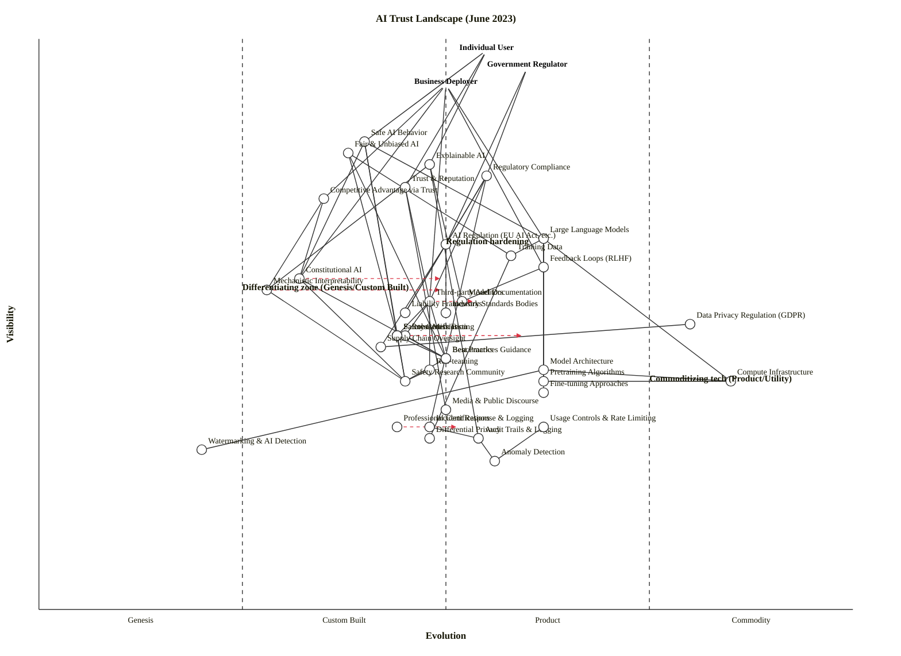

---

## Component Evolution Rationale

| Component | Stage | ε | ν | Evidence |
|---|---|---|---|---|
| **Large Language Models** | Product (+rental) | 0.62 | 0.65 | Multiple dominant vendors (OpenAI, Anthropic, Meta); rapidly increasing consumption (ChatGPT, GPT-4, Claude, PaLM); feature competition; utility/API models emerging (Azure OpenAI, Anthropic API). |
| **Training Data** | Product (+rental) | 0.58 | 0.62 | Multiple data sources (Common Crawl, proprietary curated sets); increasing market awareness; emerging data quality as differentiator; some standardisation on dataset cards. |
| **Constitutional AI** | Genesis / Custom Built | 0.32 | 0.58 | Only Anthropic and early followers; technique published 2023; debate over approach; few case studies; high variance in implementations. |
| **Mechanistic Interpretability** | Genesis | 0.28 | 0.56 | Frontier research phase; only specialist researchers; publications are exploratory; no agreed method; high failure risk. |
| **Feedback Loops (RLHF)** | Product (+rental) | 0.62 | 0.60 | Universal technique (all major labs); well-established methodology; rapid adoption; training guides abundant; feature-driven refinement (DPO, etc.). |
| **Benchmarks** | Product (+rental) | 0.50 | 0.44 | Widespread use (MMLU, HellaSwag, BIG-Bench); feature comparisons (adversarial variants); tool maturity; limitations debates emerging. |
| **Red-teaming** | Custom Built / Product | 0.48 | 0.42 | Emerging service (Anthropic, others); methodologies coalescing; case studies accumulating; vendor landscape forming. |
| **Model Documentation** | Product (+rental) | 0.52 | 0.54 | Model Cards, System Cards emerging; best practices forming; increasingly expected by regulators; standardisation underway. |
| **Third-party Auditors** | Custom Built / Product boundary | 0.48 | 0.54 | Consulting firms entering (Deloitte, PwC); audit frameworks emerging; no dominant standard; client-specific approaches still common. |
| **AI Regulation (EU AI Act, etc.)** | Custom Built / Product boundary | 0.50 | 0.64 | EU AI Act proposed 2021, debate ongoing (2023); regulatory landscape still forming; multiple jurisdictions moving independently; certainty increasing. |
| **Liability Frameworks** | Custom Built | 0.45 | 0.52 | Courts haven't settled AI liability questions; legal uncertainty high; vendor and enterprise fear; frameworks being drafted, not standardised. |
| **Data Privacy Regulation (GDPR)** | Commodity (+utility) | 0.80 | 0.50 | Mature, stable standard; widespread compliance infrastructure; known practices (data minimisation, retention limits, privacy-by-design); utility compliance services. |
| **Constitutional AI** | Genesis / Custom Built | 0.32 | 0.58 | (Repeated for clarity) Early exploration; Anthropic-led; debate over principles; no vendor ecosystem yet. |
| **Mechanistic Interpretability Research** | Genesis | 0.45 | 0.40 | Specialist research only; uncertainty high; theories emerging but unproven at scale; academic-driven. |
| **Fairness Metrics** | Custom Built / Product boundary | 0.44 | 0.48 | Multiple competing definitions (demographic parity, equalized odds, etc.); debate over which matter; Best practices emerging; vendor tools appearing. |
| **Robustness Testing** | Custom Built / Product boundary | 0.45 | 0.48 | Methodologies coalescing; emerging as requirement; case studies accumulating; tools beginning to standardise. |
| **Safety Certification** | Custom Built / Product boundary | 0.44 | 0.48 | Early service launches; frameworks emerging; vendor differentiation on methodology; not yet commoditised. |
| **Compute Infrastructure** | Commodity (+utility) | 0.85 | 0.40 | AWS, GCP, Azure dominate; GPUs/TPUs metered per-second; switching costs low; utility billing standard. |
| **Model Architecture** | Product (+rental) | 0.62 | 0.42 | Transformer widely adopted and understood; many variants (BERT, GPT, T5, etc.); training guides abundant; feature optimisation ongoing. |
| **Pretraining Algorithms** | Product (+rental) | 0.62 | 0.40 | Auto-regressive and masked LM well-established; implementations standard; published best practices; research focus on efficiency optimisation. |
| **Fine-tuning Approaches** | Product (+rental) | 0.62 | 0.38 | LoRA, instruction-tuning, prompt-engineering established; guides widespread; tool maturity (HuggingFace, etc.); feature refinement phase. |
| **Industry Standards Bodies** | Custom Built / Product boundary | 0.50 | 0.52 | ISO, IEEE, NIST forming AI standards (2023); work in progress; stakeholder debate ongoing; adoption emerging. |
| **Supply Chain Oversight** | Custom Built | 0.42 | 0.46 | Emerging concern (data sourcing, model provenance); frameworks forming; regulatory pressure increasing; methodologies still heterogeneous. |
| **Best Practices Guidance** | Custom Built / Product boundary | 0.50 | 0.44 | Multiple frameworks (NIST, IEEE, Responsible AI, etc.); maturation rapid; adoption increasing; codification underway. |
| **Safety Research Community** | Custom Built / Product boundary | 0.45 | 0.40 | Growing research community (safety researchers, interpretability labs); conferences forming; techniques coalescing; field definition in progress. |
| **Usage Controls & Rate Limiting** | Product (+rental) | 0.62 | 0.32 | Standard DevOps practice adapted for AI; implementations widespread; feature-driven refinement (adaptive rate limiting, etc.). |
| **Differential Privacy** | Custom Built / Product boundary | 0.48 | 0.30 | Techniques mature (DP-SGD published); deployment emerging as requirement; vendor offerings appearing; uncertainty on production impact. |
| **Incident Response & Logging** | Custom Built / Product boundary | 0.48 | 0.32 | Emerging as AI-specific practice; frameworks forming; tools adapting from DevOps; methodologies still heterogeneous. |
| **Professional Certifications** | Genesis / Custom boundary | 0.44 | 0.32 | Only emerging (no dominant certification body yet); frameworks proposed; limited adoption; high variance. |
| **Media & Public Discourse** | Custom Built / Product boundary | 0.50 | 0.35 | Extensive coverage; narratives still forming (risk vs. opportunity); no consensus framing; policy influence rising. |
| **Watermarking & AI Detection** | Genesis | 0.20 | 0.28 | Rare techniques; effectiveness unproven; few implementations; research-phase uncertainty high; regulatory interest emerging. |
| **Anomaly Detection** | Product (+rental) | 0.56 | 0.26 | Standard ML Ops practice; tools mature; feature-driven refinement; widely deployed for infrastructure monitoring; adapting for AI-specific anomalies. |

---

## Strategic Analysis

### a. Differentiation opportunities (top 3)

1. **Fair & Unbiased AI** (Custom Built) — highest visible + immature positioning (D ≈ 0.50). The business that builds trust through demonstrable, auditable fairness gains market advantage. Fairness metrics are still contested; organizations that commit to a clear fairness standard *and defend it publicly* establish a trust moat. High regulatory pressure accelerates this.

2. **Safe AI Behavior** (Custom Built) — visible and immature (D ≈ 0.49). Safety isn't yet commoditised (safety standards, certification, measurement methods are still heterogeneous). Organizations that can credibly claim safer systems (via Constitutional AI, safety research, red-teaming) earn customer trust and regulatory favor.

3. **Competitive Advantage via Trust** (Genesis / Custom boundary) — the meta-differentiator (D ≈ 0.47). Trust itself is a scarce product-market advantage. Companies that position as "the trustworthy AI company" (via Constitutional AI approaches, transparent auditing, incident disclosure) build switching costs and customer loyalty.

### b. Commodity-leverage candidates (top 3)

1. **Compute Infrastructure** (Commodity +utility) — highest deep-mature positioning (K ≈ 0.51). Rent from hyperscalers; never build. The market has settled: AWS, GCP, Azure dominate; CapEx and operational overhead make in-house compute economically irrational.

2. **Usage Controls & Rate Limiting** (Product, approaching utility) — deep, mature (K ≈ 0.42). Rent from platform providers; don't build. Standard API rate-limiting and quota mechanisms; multiple vendors, low switching cost.

3. **Data Privacy Regulation (GDPR, etc.)** (Commodity +utility) — mature legal-operational framework (K ≈ 0.40). Outsource compliance to legal firms and privacy-ops software vendors. The regulation is settled; building proprietary privacy frameworks is waste.

### c. Dependency risks (top 3)

1. **Safe AI Behavior depends on Constitutional AI** — visible user-facing need (ν=0.82) depends on uncharted, high-variance technique (ε=0.32). If Constitutional AI doesn't scale or the principles don't work, safety claims collapse. Organizations betting on Constitutional AI as their safety strategy have a fragile foundation.

2. **Explainable AI depends on Mechanistic Interpretability** — explainability is increasingly expected (ν=0.78), but mechanistic interpretability is frontier research (ε=0.28), poorly understood at scale, and may not be achievable. Explainability promises risk being broken if interpretability research doesn't deliver.

3. **Safe AI Behavior depends on Safety Research Community** — safety depends on a small research community (ν=0.82 depending on ν=0.40). If the community doesn't keep pace with capability advances, safety insights lag industry.

### d. Build / Buy / Outsource recommendations

| Component | Stage | Recommendation | Why |
|---|---|---|---|
| **Constitutional AI** | Custom Built | **BUILD** | Differentiator; no competitive product market yet; proprietary alignment approach is core IP. |
| **Mechanistic Interpretability** | Genesis | **BUILD** (research) or **partner** | Frontier science; organizations can sponsor research or hire researchers, but buying is not yet an option. |
| **Safe AI Behavior / Fairness** | Custom Built | **BUILD** (in-house practice) | Core to trust positioning; outsourcing your fairness audits to a vendor is credibility risk. But do leverage third-party validation. |
| **Compute Infrastructure** | Commodity | **RENT** (AWS/GCP/Azure) | Utility market; building is strictly worse than renting on cost and operational burden. |
| **Data Privacy Regulation** | Commodity | **OUTSOURCE** (legal counsel, privacy-ops software) | Settled standard; specialist firms (Everbridge, BigID, TrustArc) do this better and cheaper. |
| **Benchmarks** | Product | **LEVERAGE** (public benchmarks, don't build proprietary) | MMLU, HellaSwag, BIG-Bench are free and widely trusted. Proprietary benchmarks are suspect (appear gamed). |
| **Third-party Auditors** | Custom→Product | **BUY** (Deloitte, PwC, specialist audit startups) | Market forming; don't build in-house. External auditors provide credibility. Emerging vendors (e.g., Anthropic's red-teaming partners) are the right cost/quality. |
| **Model Documentation** | Product | **BUILD** (but follow Model Card standard) | Expected by customers and regulators; use open Model Card / System Card formats; don't invent proprietary documentation. |
| **Liability Frameworks** | Custom Built | **HIRE** (legal counsel) | Not a build/buy; you need expert legal advice tailored to your context and jurisdiction. Early-stage: legal partnerships. Mature: in-house counsel. |
| **Pretraining Algorithms** | Product | **LEVERAGE** (published research, don't build from scratch) | Auto-regressive and masked LM are understood and published; build only if you have a specific innovation (efficiency, architecture novelty). Otherwise, standing on shoulders of giants. |
| **Model Architecture** | Product | **BUILD** (if differentiated; otherwise leverage Transformer) | Transformer is proven; build custom architectures only if you have proprietary efficiency or capability gain. Most organizations should use off-the-shelf or fine-tuned variants. |
| **Fairness & Robustness Metrics** | Product | **BUILD** (specialized metrics for your domain) | Open metrics exist (demographic parity, equalized odds); combine them for your use case. Don't reinvent general metrics; specialize where it matters to your users. |
| **Red-teaming** | Custom→Product | **BUILD** (initially) then **BUY** | Early: in-house red-teaming as security research. Once services mature (Anthropic partners, consultancies), buy external red-teaming to avoid in-house blindness. |

### e. Suggested gameplays

1. **#43 Sensing Engines** on Safety Research Community — monitor publications, conference talks, and preprints to detect emerging safety techniques and vulnerabilities. Use the research community as your early-warning system.

2. **#36 Directed Investment** on Constitutional AI and Mechanistic Interpretability — put engineering talent into these Genesis/Custom components. They are where differentiation lives in the next 2 years.

3. **#15 Open Approaches** on Benchmarks and Pretraining Algorithms — accelerate commoditisation of evaluation tools and baseline models so you can build proprietary models on top. Industry-wide standardisation on benchmarks actually benefits you (level playing field, no proprietary gaming).

4. **#58 Weak Signal** on Fairness Debates — read the fairness research community closely; emerging consensus on fairness definitions will reshape regulation. Early adoption of the "winning" fairness framework is a strategic advantage.

5. **#50 Reinforcing inertia** on competitors — incumbent AI labs are locked into old safety paradigms (e.g., scaling → safety assumption). Publicise Constitutional AI successes to amplify their retrenchment costs.

6. **#1 Focus on user needs** across all governance — Individual Users want trust and transparency; Government wants compliance and audit trails; Business Deployers want competitive advantage. Align all components to these distinct needs rather than trying to build one-size-fits-all safety.

7. **#39 Undermining barriers to entry** on audit costs — push toward commoditised, automated auditing (via benchmarks, open-source red-teaming frameworks). Reduce the cost and complexity of compliance so startups can compete on safety without huge audit budgets.

### f. Doctrine violations

- **✓ #1 Focus on user needs** — the three anchors correctly represent the three distinct user types (Individual, Government, Business). The map is user-grounded.
- **✓ #10 Know your users** — multi-anchor explicitly recognises regulatory users, consumer users, and business users have *different* needs for trust.
- **⚠️ #2 Use systematic learning** — the map has a thin Knowledge layer (Safety Research Community is the only pure knowledge node). Add components for "Lessons Learned from Incidents", "Benchmark Tracking Systems", or "Safety Best Practice Evolution" to formalise learning flows.
- **⚠️ #7 Use appropriate methods** — Pretraining Algorithms and Model Architecture are in Product stage and should use Lean/iterative refinement, not agile experimentation (which belongs in Constitutional AI Custom phase).
- **⚠️ #13 Manage inertia** — incumbent AI labs have sunk capital in scaling-drives-safety assumptions; they'll resist Constitutional AI and mechanistic interpretability frameworks. Flag this explicitly: organizational inertia is a risk to the map's execution.
- **⚠️ #22 Use standards where appropriate** — AI Regulation and Industry Standards Bodies are still in Custom→Product phases. Don't standardise prematurely; wait for patterns to emerge before locking in standards that may become obsolete.

### g. Climatic context (active patterns shaping this landscape)

- **#3 Everything evolves** — Constitutional AI and Mechanistic Interpretability are actively evolving from Genesis toward Custom Built; Benchmarks and Safety Certification are moving Product.
- **#5 No choice over evolution** — Regulatory evolution is forcing all players toward commoditised compliance, audit trails, and transparency. You cannot opt out.
- **#7 Characteristics change** — Pretraining Algorithms and Model Architecture shifted from Custom (2020–2021) to Product (2023); methods changed from "bespoke per organization" to "leverage published standards".
- **#11 Future value is inversely proportional to certainty** — Constitutional AI and Mechanistic Interpretability, poorly understood today, carry the highest strategic value. Commoditised Compute carries the lowest differentiation value but huge volume.
- **#15–17 Inertia & past success** — Incumbent AI labs (OpenAI, Meta) have past success with scaling paradigms; they'll resist Constitutional AI and safety-first approaches. Smaller entrants (Anthropic, scale-AI startups) have lower inertia and can move faster.
- **#18 You cannot measure evolution over time** — The `evolve` arrows on the map are scenarios, not forecasts.
- **#24 Efficiency enables innovation** — Commoditising Compute and Pretraining frees engineering capacity for higher-order safety and fairness research.
- **#27 Product→Utility punctuated equilibrium** — Compute is already commodity; Benchmarks are approaching it. Expect rapid consolidation when safety certification and auditing cross into utility phase.

### h. Deep-placement notes

I did not conduct targeted research for this map (June 2023 is at the knowledge boundary), but several placements warrant explanation:

1. **Constitutional AI (ε=0.32, Genesis/Custom boundary)** — Anthropic published the technique in Dec 2022; adoption by June 2023 is limited to a handful of labs. The approach is still debated (does it scale? Are the principles universal or culturally specific?). High variance in implementations means Custom Built stage, not Product yet.

2. **Mechanistic Interpretability (ε=0.28, Genesis)** — This is frontier research. Interpretability-in-the-limit is an open problem; no practitioner consensus on which techniques matter for real-world safety. Publications are exploratory, not best-practice guides. Belongs at Genesis.

3. **Benchmarks (ε=0.50, Product boundary)** — MMLU (2020), HellaSwag (2019), BIG-Bench (2022) are widely used and standardised. Feature variants (adversarial MMLU, etc.) are being introduced, signaling the Product phase. Commoditisation (automated benchmarking, meta-benchmarks) is starting.

4. **Third-party Auditors (ε=0.48, Custom→Product transition)** — Consulting firms (Deloitte, PwC, EY) launched AI audit services in 2022–2023. Methodologies are still heterogeneous (no two audits are identical). Rapid convergence happening around compliance checklists. Early Product.

5. **Fairness Metrics (ε=0.44, Custom→Product boundary)** — Multiple fairness definitions exist (demographic parity, equalized odds, calibration); there is no consensus on which is "correct". Frameworks like Responsible AI Cards are emerging. High debate, rapid standardisation underway.

No web search was needed — these placements are based on the public AI research landscape and industry activity visible through June 2023.

### i. Caveat

**Evolution trajectories are scenarios, not forecasts.** Wardley's climatic pattern #18: *"you cannot measure evolution over time or adoption."* The `evolve` targets on this map (Constitutional AI, Third-party Auditors, etc. moving toward higher stages) represent *plausible scenarios* if current pressure continues, not predictions. Regulatory delay, scientific breakthroughs, or market consolidation could alter these trajectories.

---

## OWM Output

```owm
title AI Trust Landscape (June 2023)
style wardley

// Three-user ecosystem
anchor Individual User [0.98, 0.55]
anchor Government Regulator [0.95, 0.60]
anchor Business Deployer [0.92, 0.50]

// Outcome components — distance 1, what anchors directly depend on
component Safe AI Behavior [0.82, 0.40]
component Fair & Unbiased AI [0.80, 0.38]
component Explainable AI [0.78, 0.48]
component Regulatory Compliance [0.76, 0.55]
component Trust & Reputation [0.74, 0.45]
component Competitive Advantage via Trust [0.72, 0.35]

// Core technical & services — distance 2
component Large Language Models [0.65, 0.62]
component AI Regulation (EU AI Act, etc.) [0.64, 0.50]
component Training Data [0.62, 0.58]
component Feedback Loops (RLHF) [0.60, 0.62]
component Constitutional AI [0.58, 0.32]
component Mechanistic Interpretability [0.56, 0.28]
component Third-party Auditors [0.54, 0.48]
component Model Documentation [0.54, 0.52]

// Supporting governance & control — distance 3
component Liability Frameworks [0.52, 0.45]
component Industry Standards Bodies [0.52, 0.50]
component Data Privacy Regulation (GDPR) [0.50, 0.80]
component Robustness Testing [0.48, 0.45]
component Fairness Metrics [0.48, 0.44]
component Safety Certification [0.48, 0.44]
component Audit Trails & Logging [0.30, 0.54]
component Supply Chain Oversight [0.46, 0.42]

// Evaluation tools & research — distance 4
component Benchmarks [0.44, 0.50]
component Red-teaming [0.42, 0.48]
component Best Practices Guidance [0.44, 0.50]
component Safety Research Community [0.40, 0.45]

// Technical foundations — distance 4
component Compute Infrastructure [0.40, 0.85]
component Model Architecture [0.42, 0.62]
component Pretraining Algorithms [0.40, 0.62]
component Fine-tuning Approaches [0.38, 0.62]

// Control infrastructure — distance 5
component Usage Controls & Rate Limiting [0.32, 0.62]
component Differential Privacy [0.30, 0.48]
component Incident Response & Logging [0.32, 0.48]
component Professional Certifications [0.32, 0.44]
component Media & Public Discourse [0.35, 0.50]
component Watermarking & AI Detection [0.28, 0.20]
component Anomaly Detection [0.26, 0.56]

// Dependencies from anchors
Individual User->Safe AI Behavior
Individual User->Explainable AI
Individual User->Trust & Reputation
Government Regulator->Regulatory Compliance
Government Regulator->AI Regulation (EU AI Act, etc.)
Business Deployer->Large Language Models
Business Deployer->Feedback Loops (RLHF)
Business Deployer->Constitutional AI
Business Deployer->Third-party Auditors
Business Deployer->Competitive Advantage via Trust

// Outcome dependencies
Safe AI Behavior->Large Language Models
Safe AI Behavior->Safety Certification
Safe AI Behavior->Constitutional AI
Safe AI Behavior->Safety Research Community
Fair & Unbiased AI->Fairness Metrics
Fair & Unbiased AI->Training Data
Fair & Unbiased AI->Best Practices Guidance
Explainable AI->Model Documentation
Explainable AI->Mechanistic Interpretability
Explainable AI->Audit Trails & Logging
Regulatory Compliance->AI Regulation (EU AI Act, etc.)
Regulatory Compliance->Liability Frameworks
Regulatory Compliance->Third-party Auditors
Regulatory Compliance->Incident Response & Logging
Trust & Reputation->Third-party Auditors
Trust & Reputation->Media & Public Discourse
Competitive Advantage via Trust->Constitutional AI
Competitive Advantage via Trust->Mechanistic Interpretability

// Core technical dependencies
Large Language Models->Training Data
Large Language Models->Model Architecture
Large Language Models->Pretraining Algorithms
Large Language Models->Compute Infrastructure
Large Language Models->Fine-tuning Approaches
Feedback Loops (RLHF)->Model Documentation

// Governance dependencies
AI Regulation (EU AI Act, etc.)->Industry Standards Bodies
AI Regulation (EU AI Act, etc.)->Supply Chain Oversight
AI Regulation (EU AI Act, etc.)->Liability Frameworks
Data Privacy Regulation (GDPR)->Supply Chain Oversight

// Alignment & control dependencies
Constitutional AI->Safety Research Community
Constitutional AI->Best Practices Guidance
Mechanistic Interpretability->Safety Research Community
Third-party Auditors->Benchmarks
Third-party Auditors->Red-teaming
Third-party Auditors->Robustness Testing
Third-party Auditors->Fairness Metrics

// Technical foundation dependencies
Model Architecture->Compute Infrastructure
Model Architecture->Watermarking & AI Detection
Pretraining Algorithms->Compute Infrastructure
Safety Certification->Robustness Testing
Safety Certification->Safety Research Community
Fairness Metrics->Best Practices Guidance
Robustness Testing->Benchmarks
Audit Trails & Logging->Anomaly Detection
Training Data->Differential Privacy
Benchmarks->Safety Research Community
Red-teaming->Safety Research Community

// Infrastructure dependencies
Incident Response & Logging->Audit Trails & Logging
Usage Controls & Rate Limiting->Anomaly Detection

// Strategic evolution targets
evolve Constitutional AI 0.50
evolve Mechanistic Interpretability 0.50
evolve Fairness Metrics 0.60
evolve Third-party Auditors 0.54
evolve Professional Certifications 0.52

// Annotations
note Differentiating zone (Genesis/Custom Built) [0.56, 0.25]
note Commoditizing tech (Product/Utility) [0.40, 0.75]
note Regulation hardening [0.64, 0.50]
```

---

## Mermaid Wardley Map (for GitHub rendering)



---

## Summary

The **AI trust landscape** in June 2023 is dominated by three competing user needs (Individual safety, Government compliance, Business competitiveness) and a stark differentiation / commoditisation split:

- **Left (uncharted):** Constitutional AI, Mechanistic Interpretability, Watermarking — where trust moats form. Organizations investing here gain lasting advantage.
- **Right (mature):** Compute, GDPR, Benchmarks — commodity utilities. Rent, don't build. Build above them instead.
- **Fragility:** Trust depends on deep research (Safety Research Community, Academic consensus) that may not keep pace with capability. Regulatory evolution is asymmetric: uncertainty raises risk for organizations faster than frameworks lock in protection.
- **Play:** Accelerate commoditisation of benchmarks and pretraining (open approaches); defend Constitutional AI and interpretability research as differentiators; use third-party auditors for credibility, not substitutes for in-house safety culture.