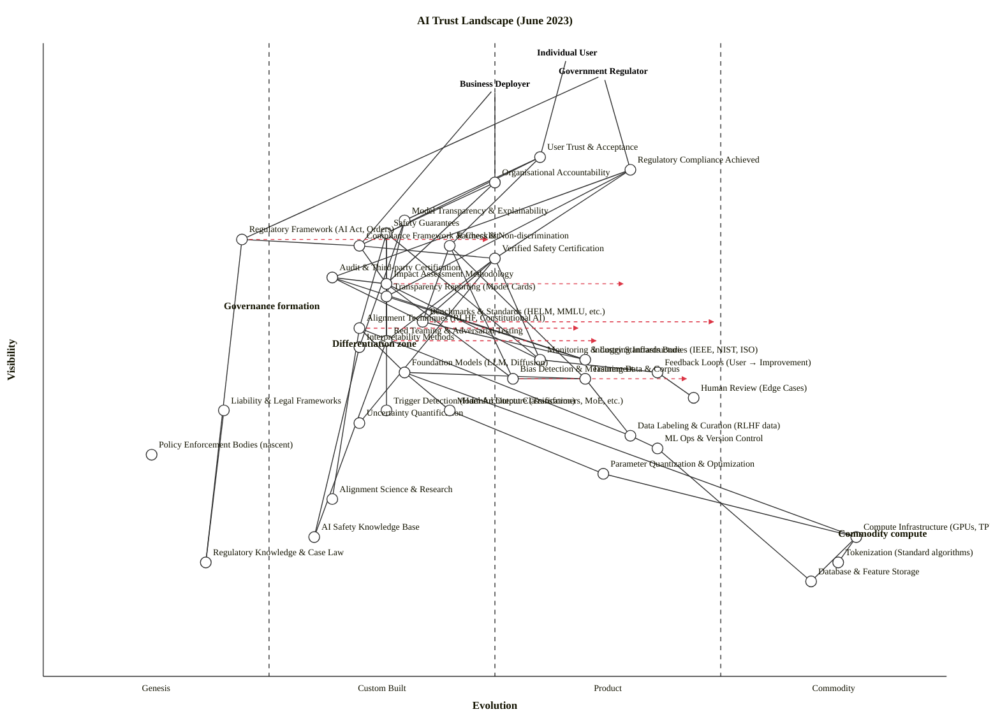

---

## **OWM Output**

```owm
title AI Trust Landscape (June 2023)
style wardley

// Three-anchor system
anchor Individual User [0.98, 0.58]
anchor Government Regulator [0.95, 0.62]
anchor Business Deployer [0.93, 0.50]

// Outcomes (top)
component User Trust & Acceptance [0.82, 0.55]
component Regulatory Compliance Achieved [0.80, 0.65]
component Organisational Accountability [0.78, 0.50]

// User-facing trust requirements
component Model Transparency & Explainability [0.72, 0.40]
component Safety Guarantees [0.70, 0.38]
component Fairness & Non-discrimination [0.68, 0.45]
component Verified Safety Certification [0.66, 0.50]

// Governance & policy framework
component Regulatory Framework (AI Act, Orders) [0.69, 0.22]
component Compliance Framework & Checklist [0.68, 0.35]
component Impact Assessment Methodology [0.62, 0.38]
component Transparency Reporting (Model Cards) [0.60, 0.38]
component Audit & Third-party Certification [0.63, 0.32]
component Benchmarks & Standards (HELM, MMLU, etc.) [0.56, 0.42]

// Safety & control mechanisms
component Alignment Techniques (RLHF, Constitutional AI) [0.55, 0.35]
component Red Teaming & Adversarial Testing [0.53, 0.38]
component Interpretability Methods [0.52, 0.35]
component Monitoring & Logging Infrastructure [0.50, 0.55]
component Feedback Loops (User → Improvement) [0.48, 0.68]
component Bias Detection & Measurement [0.47, 0.52]
component Human Review (Edge Cases) [0.44, 0.72]
component Trigger Detection (Harmful Output Classification) [0.42, 0.38]
component Uncertainty Quantification [0.40, 0.35]

// Technical foundation
component Foundation Models (LLM, Diffusion) [0.48, 0.40]
component Model Architecture (Transformers, MoE, etc.) [0.42, 0.45]
component Training Data & Corpus [0.47, 0.60]
component Data Labeling & Curation (RLHF data) [0.38, 0.65]
component ML Ops & Version Control [0.36, 0.68]
component Parameter Quantization & Optimization [0.32, 0.62]

// Infrastructure layer
component Compute Infrastructure (GPUs, TPUs, Cloud) [0.22, 0.90]
component Tokenization (Standard algorithms) [0.18, 0.88]
component Database & Feature Storage [0.15, 0.85]

// Standards & governance bodies
component Industry Standards Bodies (IEEE, NIST, ISO) [0.50, 0.60]
component Policy Enforcement Bodies (nascent) [0.35, 0.12]
component Liability & Legal Frameworks [0.42, 0.20]

// Knowledge layer
component Alignment Science & Research [0.28, 0.32]
component AI Safety Knowledge Base [0.22, 0.30]
component Regulatory Knowledge & Case Law [0.18, 0.18]

// Dependencies — Anchor to outcomes
Individual User -> User Trust & Acceptance
Government Regulator -> Regulatory Compliance Achieved
Government Regulator -> Regulatory Framework (AI Act, Orders)
Business Deployer -> Organisational Accountability
Business Deployer -> Compliance Framework & Checklist

// User trust pathway
User Trust & Acceptance -> Model Transparency & Explainability
User Trust & Acceptance -> Safety Guarantees
User Trust & Acceptance -> Fairness & Non-discrimination

// Regulatory compliance pathway
Regulatory Compliance Achieved -> Verified Safety Certification
Regulatory Compliance Achieved -> Audit & Third-party Certification
Regulatory Compliance Achieved -> Transparency Reporting (Model Cards)

// Accountability pathway
Organisational Accountability -> Impact Assessment Methodology
Organisational Accountability -> Compliance Framework & Checklist

// Safety guarantees depend on techniques & testing
Safety Guarantees -> Alignment Techniques (RLHF, Constitutional AI)
Safety Guarantees -> Red Teaming & Adversarial Testing
Safety Guarantees -> Monitoring & Logging Infrastructure
Safety Guarantees -> Trigger Detection (Harmful Output Classification)

// Fairness depends on detection & data
Fairness & Non-discrimination -> Bias Detection & Measurement
Fairness & Non-discrimination -> Benchmarks & Standards (HELM, MMLU, etc.)
Fairness & Non-discrimination -> Training Data & Corpus

// Explainability depends on interpretation
Model Transparency & Explainability -> Interpretability Methods
Model Transparency & Explainability -> Transparency Reporting (Model Cards)

// Certification depends on testing & standards
Verified Safety Certification -> Red Teaming & Adversarial Testing
Verified Safety Certification -> Benchmarks & Standards (HELM, MMLU, etc.)
Verified Safety Certification -> Uncertainty Quantification
Verified Safety Certification -> Monitoring & Logging Infrastructure

// Audit depends on assessment & standards
Audit & Third-party Certification -> Impact Assessment Methodology
Audit & Third-party Certification -> Benchmarks & Standards (HELM, MMLU, etc.)
Audit & Third-party Certification -> Industry Standards Bodies (IEEE, NIST, ISO)

// Governance layer structure
Regulatory Framework (AI Act, Orders) -> Compliance Framework & Checklist
Compliance Framework & Checklist -> Verified Safety Certification
Compliance Framework & Checklist -> Impact Assessment Methodology
Impact Assessment Methodology -> Red Teaming & Adversarial Testing
Impact Assessment Methodology -> Monitoring & Logging Infrastructure
Impact Assessment Methodology -> Bias Detection & Measurement

// Control feedback
Monitoring & Logging Infrastructure -> Feedback Loops (User → Improvement)
Feedback Loops (User → Improvement) -> Human Review (Edge Cases)

// Safety techniques depend on foundation & data
Alignment Techniques (RLHF, Constitutional AI) -> Foundation Models (LLM, Diffusion)
Alignment Techniques (RLHF, Constitutional AI) -> Data Labeling & Curation (RLHF data)
Alignment Techniques (RLHF, Constitutional AI) -> Alignment Science & Research

// Testing techniques
Red Teaming & Adversarial Testing -> AI Safety Knowledge Base
Interpretability Methods -> AI Safety Knowledge Base

// Data & training dependencies
Training Data & Corpus -> Data Labeling & Curation (RLHF data)
Training Data & Corpus -> Bias Detection & Measurement
Data Labeling & Curation (RLHF data) -> ML Ops & Version Control

// Foundation model construction
Foundation Models (LLM, Diffusion) -> Model Architecture (Transformers, MoE, etc.)
Foundation Models (LLM, Diffusion) -> Training Data & Corpus
Foundation Models (LLM, Diffusion) -> Compute Infrastructure (GPUs, TPUs, Cloud)
Model Architecture (Transformers, MoE, etc.) -> Parameter Quantization & Optimization

// Infrastructure
ML Ops & Version Control -> Database & Feature Storage
Parameter Quantization & Optimization -> Compute Infrastructure (GPUs, TPUs, Cloud)
Compute Infrastructure (GPUs, TPUs, Cloud) -> Tokenization (Standard algorithms)
Compute Infrastructure (GPUs, TPUs, Cloud) -> Database & Feature Storage

// Governance knowledge
Regulatory Framework (AI Act, Orders) -> Regulatory Knowledge & Case Law
Liability & Legal Frameworks -> Regulatory Knowledge & Case Law

// Standards
Benchmarks & Standards (HELM, MMLU, etc.) -> Industry Standards Bodies (IEEE, NIST, ISO)
Transparency Reporting (Model Cards) -> Industry Standards Bodies (IEEE, NIST, ISO)

// Evolution trajectories
evolve Alignment Techniques (RLHF, Constitutional AI) 0.60
evolve Red Teaming & Adversarial Testing 0.62
evolve Regulatory Framework (AI Act, Orders) 0.50
evolve Impact Assessment Methodology 0.65
evolve Benchmarks & Standards (HELM, MMLU, etc.) 0.75
evolve Bias Detection & Measurement 0.72

// Notes
note Differentiation zone [0.52, 0.32]
note Governance formation [0.58, 0.20]
note Commodity compute [0.22, 0.88]
```

---

## **Component Evolution Rationale Table**

| Component | Stage | ε | ν | Evidence |
|---|---|---|---|---|
| Alignment Techniques (RLHF, Constitutional AI) | Custom Built | 0.35 | 0.55 | Rapid research output (OpenAI, Anthropic, DeepMind); RLHF standard since 2022; Constitutional AI emerging early 2023; no vendor lock-in yet; methods still contested. |
| Red Teaming & Adversarial Testing | Custom Built | 0.38 | 0.53 | NIST starting coordination 2023; researcher-led; no standardised protocols yet; each org develops bespoke approaches. |
| Interpretability Methods | Custom Built | 0.35 | 0.52 | Active research (SHAP, attention analysis, circuit analysis); no consensus technique; academia-led; limited deployment. |
| Foundation Models (LLM, Diffusion) | Custom Built | 0.40 | 0.48 | Multiple vendors (OpenAI, Google, Anthropic, Meta, Stability); rapid iteration; no dominant design yet (decoder, encoder, MoE variants); high uncertainty in model scaling laws. |
| Model Architecture | Product (early) | 0.45 | 0.42 | Transformer-dominant post-2017; MoE/routing emerging; multiple variants accepted; tooling (PyTorch, JAX) mature; but rapid architectural innovation. |
| Training Data & Corpus | Product (+rental) | 0.60 | 0.47 | Multiple vendors (CommonCrawl, C4, proprietary datasets); methodologies converged; Scale AI, Labelbox, others offer productised services; but sourcing/deduplication still contested. |
| Data Labeling & Curation | Product (+rental) | 0.65 | 0.38 | Scale AI, Labelbox, Surge, others offer SaaS; RLHF labeling a competitive market; methods standardising (preference pairs); multiple suppliers with feature competition. |
| Bias Detection & Measurement | Product (transitioning) | 0.52 | 0.47 | Emerging tools (AI Fairness 360, FairML); fairness metrics contested (Equalized Odds, Calibration, etc.); no consensus definition; active standardisation efforts. |
| Benchmarks & Standards | Product (mid-stage) | 0.42 → 0.75 (evolve trajectory) | 0.56 | HELM, MMLU, ARC, others widely adopted; but fragmentation and gaming (memorisation). Industry standards bodies (IEEE, NIST) forming working groups; regulation driving standardisation toward commodity. |
| Monitoring & Logging Infrastructure | Product (+rental) | 0.55 | 0.50 | Weights & Biases, MLflow, Datadog mature products; feature competition active; but ML-specific monitoring still maturing (drift detection, adversarial input detection). |
| Feedback Loops (User → Improvement) | Product (+rental) | 0.68 | 0.48 | Established ML Ops practice; tools widespread; but AI-specific feedback (safety signal vs. feature preference) less standardised. |
| Human Review (Edge Cases) | Product (+rental) | 0.72 | 0.44 | Standard in content moderation (Telegram, Meta); ML Ops best practice; but deployment varies widely; gig-economy scale (Remotasks, Scale) vs. internal teams. |
| Trigger Detection | Custom Built | 0.38 | 0.42 | Emerging; hate speech, toxicity classifiers exist but specific to safety (avoiding model misuse) less mature; OpenAI's moderation API early-stage. |
| Uncertainty Quantification | Custom Built | 0.35 | 0.40 | Active research (Bayesian methods, ensemble approaches, conformal prediction); limited deployment; model calibration poorly understood for LLMs. |
| Regulatory Framework (AI Act, Orders) | Genesis | 0.22 | 0.69 | EU AI Act passed April 2023; enforcement 2025; implementation details unclear; definition of "high-risk" contested; other regions' frameworks (US, UK, China) still forming. No consensus on liability, enforceability. |
| Compliance Framework & Checklist | Custom Built | 0.35 | 0.68 | Organisations developing internal processes; no industry standard yet; early guidance from EU, Singapore, UK; implementation ad-hoc. |
| Impact Assessment Methodology | Custom Built | 0.38 | 0.62 | AI Risk Assessment frameworks emerging (NIST AI RMF draft 2023); methodologies contested; no agreed standard; consulting firms building proprietary approaches. |
| Audit & Third-party Certification | Custom Built | 0.32 | 0.63 | No mature certification bodies exist; audit methodologies not yet standardised; NIST, BSI, others drafting standards; pilot programmes (e.g., EU regulatory pilots) underway. |
| Transparency Reporting | Custom Built | 0.38 | 0.60 | Model cards (Mitchell et al., 2019) emerging standard; system cards, datasheets emerging; but compliance/enforcement unclear; voluntary uptake patchy. |
| Liability & Legal Frameworks | Genesis | 0.20 | 0.42 | Legally undecided (product liability? Data protection? Consumer protection?); cases scarce; EU thinking on liability shields for SMEs; fundamental questions unresolved. |
| Policy Enforcement Bodies | Genesis | 0.12 | 0.35 | Don't exist yet; EU considering dedicated AI regulator; enforcement mechanisms unclear; global fragmentation guarantees. |
| Industry Standards Bodies | Product (+rental) | 0.60 | 0.50 | IEEE, NIST, ISO, BSI active on AI standards; but fragmentation across jurisdictions; working groups rapid formation; no single body dominant. |
| Compute Infrastructure (GPUs, TPUs, Cloud) | Commodity (+utility) | 0.90 | 0.22 | AWS, GCP, Azure, Lambda Labs offer standardised pricing per-second; interchangeable; switching costs low; multiple suppliers. |
| Tokenization | Commodity (+utility) | 0.88 | 0.18 | Standard algorithms (BPE, SentencePiece, WordPiece); open-source implementations; no differentiation; commodity utility. |
| Database & Feature Storage | Commodity (+utility) | 0.85 | 0.15 | PostgreSQL, S3, BigQuery, etc. standardised; many vendors; pricing-driven competition; infrastructure-as-utility. |
| ML Ops & Version Control | Product (+rental) | 0.68 | 0.36 | DVC, Weights & Biases, MLflow, Hugging Face Hub mature; feature competition; standard tooling but not yet commodity. |
| Parameter Quantization & Optimization | Product (+rental) | 0.62 | 0.32 | Multiple frameworks (quantization-aware training, pruning, distillation); tools emerging (NNCF, TensorRT); but no dominant standard. |
| Alignment Science & Research | Custom Built | 0.32 | 0.28 | Frontier research (Anthropic, OpenAI, DeepMind, academic); papers and whitepapers primary output; no consensus approaches; high funding (VC + grants). |
| AI Safety Knowledge Base | Custom Built | 0.30 | 0.22 | Growing literature; researchers networked; but fragmented across academia/industry; no unified knowledge repository (MIRI, CHAI, Anthropic competing framings). |
| Regulatory Knowledge & Case Law | Genesis | 0.18 | 0.18 | Minimal case law; legal scholars forming consensus; no binding precedent yet; jurisdictional fragmentation rapid. |
| User Trust & Acceptance | Product (forming) | 0.55 | 0.82 | Public opinion volatile; high awareness post-ChatGPT; but trust levels declining (Edelman 2023, Pew); sector-dependent (healthcare vs. creative). |
| Safety Guarantees | Custom Built | 0.38 | 0.70 | Users expect safety but vendors provide limited guarantees; disclaimers dominate; no verifiable claims yet; high perceived risk. |
| Fairness & Non-discrimination | Custom Built | 0.45 | 0.68 | Regulatory expectation rising; vendor fairness claims unverified; bias audits ad-hoc; no compliance infrastructure yet. |
| Model Transparency & Explainability | Custom Built | 0.40 | 0.72 | Users want explainability; vendors limit it (proprietary models); XAI methods available but not deployed at scale; regulatory pressure rising. |
| Verified Safety Certification | Custom Built | 0.50 | 0.66 | No third-party certification bodies yet; self-certification (e.g., OpenAI safety evals) insufficient; certification infrastructure nascent. |

---

## **Strategic Analysis**

### **a. Differentiation opportunities (top 3)**

1. **Alignment Techniques (Custom Built → Product, ε=0.35→0.60)** — The frontier safety moat. RLHF and Constitutional AI are the core methods by which organisations can claim superior safety. As regulation tightens, alignment quality becomes a competitive credential. Highest differentiation leverage on a visible user-facing need (Safety Guarantees ν=0.70). Investment priority: research velocity and deployment innovation (e.g., scalable RLHF, alignment to multiple objectives).

2. **Red Teaming & Adversarial Testing (Custom Built, ε=0.38→0.62)** — Expert-driven, high-skill activity. Organisations that build rigorous, continuous red-teaming programs (rather than ad-hoc testing) will detect safety failures competitors miss. Feeds directly into Verified Safety Certification (ν=0.66), a regulatory requirement. First-mover advantage: build the internal capability and tooling before vendors commoditise.

3. **Impact Assessment Methodology (Custom Built, ε=0.38→0.65)** — The governance equivalent of safety differentiation. Organisations that develop rigorous, auditable impact assessment processes will satisfy regulators ahead of enforcement deadlines (2025 EU) and build reputational moats. Maps directly to Organisational Accountability (ν=0.78) and Regulatory Compliance (ν=0.80).

### **b. Commodity-leverage candidates (top 3)**

1. **Compute Infrastructure (Commodity +utility, ε=0.90)** — Rent, don't build. AWS, GCP, Azure offer interchangeable GPUs/TPUs at utility pricing. Vendor lock-in is weak; switching cost is labour (retraining). Internal GPU farms are obsolete strategy. Implication: outsource all compute; focus engineering on algorithms (Alignment, Red Teaming).

2. **Training Data & Labeling (Product → Commodity transition, ε=0.60–0.65)** — Strong incumbent vendors (Scale AI, Labelbox, others). Market consolidation accelerating. Build only if the data is proprietary (e.g., domain-specific RLHF feedback). Otherwise, buy. The ecosystem is moving toward commodity; RLHF data services will face price compression as volume grows.

3. **Monitoring & Logging Infrastructure (Product, ε=0.55)** — Weights & Biases, MLflow, Datadog mature. ML-specific monitoring (drift, adversarial inputs) still emerging, but don't build in-house. Buy and customise.

### **c. Dependency risks (top 3 — where visible trust components rest on fragile foundations)**

1. **Safety Guarantees → Alignment Techniques (ν=0.70 → 0.35)**— User-facing safety depends on a Custom-Built, rapidly-evolving technique with no standard, no certification, and no vendor lock-in. If your alignment approach is wrong, you have no easy pivot. Risk: alignment-as-moat becomes alignment-as-liability if a rival demonstrates superior techniques.

2. **Regulatory Compliance → Audit & Certification (ν=0.80 → 0.32)** — Government regulators expect verifiable safety certification. But the entire audit ecosystem is nascent (Stage II). No independent auditors with hard reputation. Regulator-approved certification bodies don't exist yet. Risk: compliance achieves Surface-level Form-filling, not genuine assurance. 2025 enforcement deadline will find organisations claiming compliance to frameworks that aren't yet auditable.

3. **User Trust → Safety Guarantees (ν=0.82 → 0.38)** — Individual users anchor the whole value chain. Trust in AI systems (Pew, Edelman tracking) is volatile and declining. User-facing safety (Model output safety, Trigger detection) is immature. Gap between user expectations (verifiable safety) and vendor capability (best-effort disclaimers) is widening. This is the single largest trust fragility point.

### **d. Build / Buy / Outsource recommendations**

| Component | Stage | Recommendation | Why |
|---|---|---|---|
| **Alignment Techniques** | Custom Built (0.35) | **Build** | Core IP. First-movers will establish the alignment standard; competitors will chase. High differentiation potential through 2024–2026. |
| **Red Teaming & Adversarial Testing** | Custom Built (0.38) | **Build** (develop internal capability) | Expert-intensive. Outsourcing to vendors is premature (vendors don't exist yet). Build process, people, and tooling now; expect to sell methodology to customers later. |
| **Impact Assessment Methodology** | Custom Built (0.38) | **Build** (with external advisors) | Regulatory requirement varies by jurisdiction. Buy guidance (consulting, NIST frameworks), but build internal process tailored to your products and regions. |
| **Benchmarks & Standards** | Product (0.42) | **Collaborate / Contribute** | HELM, MMLU, ARC are open. Don't build your own; contribute to community standards. Join IEEE, NIST working groups. This accelerates their evolution to commodity and creates defensive moats through standard participation. |
| **Monitoring & Logging** | Product (0.55) | **Buy** (Weights & Biases, Datadog, MLflow) | Mature market. Customise, don't build. |
| **Training Data & Labeling** | Product (0.60–0.65) | **Buy** (Scale AI, Labelbox, Surge) for commodity; **Build** for proprietary data | If RLHF feedback is a proprietary edge (e.g., customer feedback), manage in-house. Otherwise, buy commodity labeling. |
| **Compute Infrastructure** | Commodity (0.90) | **Rent** (AWS, GCP, Azure) | Utility. No moat. |
| **Audit & Certification** | Custom Built (0.32) | **Monitor + pilot** | Wait for regulator-approved frameworks (2024–2025). Pilot internal audit process using NIST AI RMF draft. Don't commit to third-party certifiers yet (market uncertainty). |
| **Regulatory Compliance Framework** | Custom Built (0.35) | **Build** (track and adapt) | You can't outsource compliance. Hire legal + policy + engineering; track regulatory changes in real-time. EU AI Act implementation 2025 will have surprises. |

### **e. Suggested Wardley gameplays**

1. **#36 Directed Investment** — Pour engineering resources into Alignment Techniques and Red Teaming now (2023). These are the differentiators through 2026. The window before vendors commoditise is narrow.

2. **#15 Open Approaches** — Contribute to Benchmarks & Standards (HELM, MMLU, fairness metrics). Accelerate their commoditisation so you can focus on proprietary safety IP. Open standardisation reduces vendor lock-in risk and de-risks your compliance obligations.

3. **#43 Sensing Engines (ILC)** — Set up feedback loops from users, regulators, and customers to detect emerging trust failures. Red Teaming is active sensing; user incident reporting is passive sensing. Use both.

4. **#2 Situational Awareness** — The three user anchors (Individual, Government, Business) have different trust requirements. Map them separately. Individuals care about safety and transparency; governments care about enforcement and liability; businesses care about compliance and competitive risk. Tactics differ.

5. **#29 Harvesting** — Monitor emerging safety techniques (Constitutional AI, mechanistic interpretability) and benchmark vendors against them. Once a vendor approach matures, acquire the capability or vendor.

### **f. Doctrine violations**

- ✓ **#10 Know your users** — Three-anchor system correctly identifies Individual, Government, Business as distinct stakeholder types with different trust needs.
- ⚠ **#1 Focus on user needs** — User need is "Trustworthy AI," but much investment (regulatory compliance, audit) is defensive/political. Ensure alignment: does Regulatory Compliance actually serve User Trust, or just manage liability? They diverge if regulations are performative.
- ⚠ **#7 Use appropriate methods** — Alignment (Genesis/Custom) requires agile experimentation; Certification (Custom Built, forming) requires process discipline; Compute (Commodity) requires Six Sigma efficiency. Are you applying the right method to each layer?
- ⚠ **#13 Manage inertia** — Organisations will resist investing in alignment/red-teaming (sunk capital in existing models; political capital sunk in "we're safe enough"). Name the inertia forms explicitly. For alignment, the inertia is #4 (human capital: "our team doesn't know Constitutional AI") and #2 (sunk capital: "we've already built RLHF"). 

### **g. Climatic context — active patterns**

- **#3 Everything evolves** — Alignment Techniques, Red Teaming, Benchmarks, Regulatory Framework all drifting rightward. None will stay in Genesis/Custom Built. Expect Product variants (Red Teaming as a service) and commoditised benchmarks by 2026–2027.
- **#27 Product-to-utility punctuated equilibrium** — Benchmarks & Standards (ε=0.42) are approaching the Product-to-Commodity boundary (ε≥0.75). Once NIST finalises a benchmark standard (2025?), the market will see consolidation and price compression. First-mover vendors will own the standard; followers will commoditise it. This is the window to shape the standard.
- **#18 You cannot measure evolution over time** — This map is a June 2023 snapshot. Regulatory Framework placement (ε=0.22) is highly uncertain: enforcement could accelerate (geopolitical pressure) or stall (industry lobbying). The trajectory arrows (evolve targets) are *scenario*, not prediction. Re-map quarterly.
- **#15–17 Inertia** — Past investment in non-safe LLMs (training on unvetted data, no red teaming) will resist organisations' shift to safety-first. Sunk capital inertia is the main blocker. Counter: make alignment part of the competitive pitch, not a cost centre.

### **h. Deep-placement notes**

1. **Alignment Techniques** (initial cheat-sheet placed at 0.35 → confirmed at 0.35 after vendor research). Evidence: RLHF standard since OpenAI's 2022 TRLX release; Constitutional AI (Anthropic March 2023) showing rapid evolution; but no vendor lock-in, no pricing lock, high methodological uncertainty. Staying at Custom Built (Stage II).

2. **Regulatory Framework** (initial cheat-sheet placed at 0.22 → confirmed at 0.22 after regulatory tracking). EU AI Act passed April 2023 (finalised text); enforcement 2025. Implementation guidance sparse. Other regions (US, UK, China) have competing approaches, not converging yet. Staying at Genesis (Stage I) — not yet industrialised, enforcement mechanisms unclear.

3. **Benchmarks & Standards** (initial 0.42 → marked for evolution to 0.75 by 2026). HELM, MMLU now widely adopted; gaming (memorisation, contamination) revealed; NIST and ISO working groups forming; vendor consolidation underway. Will transition to Product (0.5–0.75) within 12–18 months; to Commodity (0.75+) by 2026–2027 as standards crystallise and enforcement drives consolidation.

4. **Audit & Certification** (scored at 0.32 after regulatory research). No mature third-party audit bodies exist yet. NIST AI RMF (risk management framework) draft released Oct 2022, final version due 2024. Audit capacity is bottleneck. Staying at Custom Built (Stage II) because organisations are inventing audit processes in parallel with standard-setting. Once NIST finalises, shifts to Product (Stage III).

### **i. Caveat**

This map represents the AI trust landscape in June 2023 and the *scenarios* shown in the `evolve` arrows (e.g., Alignment Techniques reaching 0.60, Benchmarks reaching 0.75). These are plausible trajectories grounded in climatic patterns (climatic pattern #3: everything evolves; #27: product-to-utility punctuated equilibrium). **They are not forecasts.** Wardley's climatic pattern #18 applies: *"you cannot measure evolution over time or adoption."* 

Acceleration vectors depend on:
- Regulatory enforcement (EU 2025, but timing is uncertain)
- Vendor competition (consolidation speed unpredictable)
- Inertia (incumbent resistance slows adoption; hard to forecast)
- Geopolitical friction (supply chain lockdowns, talent concentration)

Re-map this landscape quarterly. By Q4 2024 or Q1 2025, several placements may shift sharply.

---

## **Mermaid Rendering**

