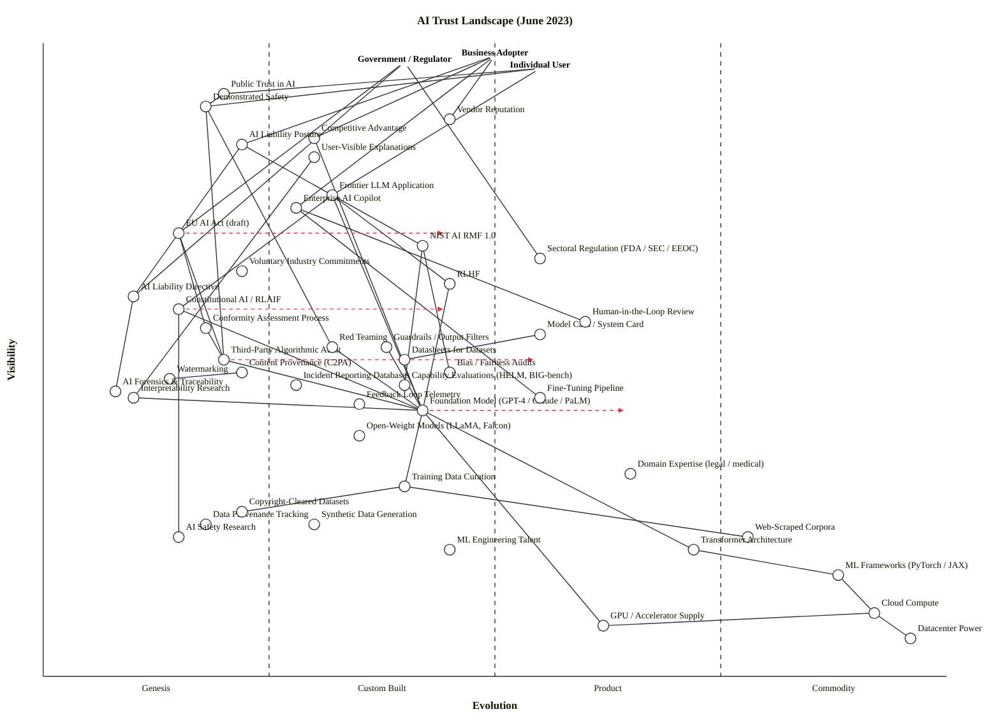

Everything clean. Here is the final output.

---

## Strategic context

- **Strategic question:** Where is trust in AI built, what's defensible vs. commoditising, and where are the fragile dependencies that could collapse public, regulator, or business confidence in mid-2023?
- **User anchors:** Three — Individual User, Government / Regulator, Business Adopter. Trust means different things to each, and the map only works with all three.
- **Core needs:** Demonstrated safety, vendor reputation, legal/liability posture, explanations of decisions, competitive advantage from AI use.
- **Scope:** The full landscape of foundation-model AI as of June 2023 — frontier LLMs, governance scaffolding, control techniques, audit ecosystem, and the data/compute substrate.

**Key assumption flagged:** "Trust" is treated as a *user-facing outcome* (Public Trust in AI, Vendor Reputation, Demonstrated Safety), not as a single component. The map shows what produces trust, not trust itself.

---

## The map

```owm
title AI Trust Landscape (June 2023)
style wardley

// Three user anchors
anchor Individual User [0.96, 0.55]
anchor Government / Regulator [0.97, 0.40]
anchor Business Adopter [0.98, 0.50]

// === USER-FACING TRUST OUTCOMES ===
component Public Trust in AI [0.92, 0.20]
component Vendor Reputation [0.88, 0.45]
component Competitive Advantage [0.85, 0.30]
component Demonstrated Safety [0.90, 0.18]
component User-Visible Explanations [0.82, 0.30]
component AI Liability Posture [0.84, 0.22]

// === DEPLOYED AI PRODUCTS ===
component Frontier LLM Application [0.76, 0.32]
component Enterprise AI Copilot [0.74, 0.28]

// === GOVERNANCE LAYER ===
component EU AI Act (draft) [0.70, 0.15]
component NIST AI RMF 1.0 [0.68, 0.42]
component Sectoral Regulation (FDA / SEC / EEOC) [0.66, 0.55]
component Voluntary Industry Commitments [0.64, 0.22]
component AI Liability Directive [0.60, 0.10]
component Conformity Assessment Process [0.55, 0.18]

// === CONTROL & ALIGNMENT MECHANISMS ===
component Constitutional AI / RLAIF [0.58, 0.15]
component RLHF [0.62, 0.45]
component Model Card / System Card [0.54, 0.55]
component Datasheets for Datasets [0.50, 0.40]
component Content Provenance (C2PA) [0.48, 0.22]
component Watermarking [0.47, 0.14]
component Guardrails / Output Filters [0.52, 0.38]
component Human-in-the-Loop Review [0.56, 0.60]

// === AUDIT, EVALUATION & FORENSICS ===
component Third-Party Algorithmic Audit [0.50, 0.20]
component Red Teaming [0.52, 0.32]
component Bias / Fairness Audits [0.48, 0.45]
component Capability Evaluations (HELM, BIG-bench) [0.46, 0.40]
component Incident Reporting Databases [0.46, 0.28]
component AI Forensics & Traceability [0.45, 0.08]
component Interpretability Research [0.44, 0.10]
component Feedback Loop Telemetry [0.43, 0.35]

// === FOUNDATION MODEL LAYER ===
component Foundation Model (GPT-4 / Claude / PaLM) [0.42, 0.42]
component Open-Weight Models (LLaMA, Falcon) [0.38, 0.35]
component Fine-Tuning Pipeline [0.44, 0.55]

// === DATA LAYER ===
component Training Data Curation [0.30, 0.40]
component Data Provenance Tracking [0.24, 0.18]
component Copyright-Cleared Datasets [0.26, 0.22]
component Synthetic Data Generation [0.24, 0.30]
component Web-Scraped Corpora [0.22, 0.78]

// === ALGORITHM LAYER ===
component Transformer Architecture [0.20, 0.72]
component ML Frameworks (PyTorch / JAX) [0.16, 0.88]

// === COMPUTE & INFRA ===
component GPU / Accelerator Supply [0.08, 0.62]
component Cloud Compute [0.10, 0.92]
component Datacenter Power [0.06, 0.96]

// === KNOWLEDGE ===
component AI Safety Research [0.22, 0.15]
component ML Engineering Talent [0.20, 0.45]
component Domain Expertise (legal / medical) [0.32, 0.65]

// === DEPENDENCIES ===
Individual User->Public Trust in AI
Individual User->User-Visible Explanations
Individual User->Demonstrated Safety
Individual User->Frontier LLM Application
Government / Regulator->Public Trust in AI
Government / Regulator->EU AI Act (draft)
Government / Regulator->AI Liability Directive
Government / Regulator->Sectoral Regulation (FDA / SEC / EEOC)
Government / Regulator->Demonstrated Safety
Business Adopter->Vendor Reputation
Business Adopter->Competitive Advantage
Business Adopter->AI Liability Posture
Business Adopter->Enterprise AI Copilot
Business Adopter->Frontier LLM Application

Public Trust in AI->Demonstrated Safety
Public Trust in AI->Vendor Reputation
Demonstrated Safety->Red Teaming
Demonstrated Safety->Third-Party Algorithmic Audit
Demonstrated Safety->Capability Evaluations (HELM, BIG-bench)
Vendor Reputation->Voluntary Industry Commitments
Vendor Reputation->Model Card / System Card
Competitive Advantage->Foundation Model (GPT-4 / Claude / PaLM)
Competitive Advantage->Fine-Tuning Pipeline
User-Visible Explanations->Interpretability Research
User-Visible Explanations->Model Card / System Card
AI Liability Posture->AI Liability Directive
AI Liability Posture->Conformity Assessment Process
AI Liability Posture->NIST AI RMF 1.0

Frontier LLM Application->Foundation Model (GPT-4 / Claude / PaLM)
Frontier LLM Application->Guardrails / Output Filters
Frontier LLM Application->Constitutional AI / RLAIF
Frontier LLM Application->RLHF
Enterprise AI Copilot->Foundation Model (GPT-4 / Claude / PaLM)
Enterprise AI Copilot->Fine-Tuning Pipeline
Enterprise AI Copilot->Guardrails / Output Filters
Enterprise AI Copilot->Human-in-the-Loop Review

EU AI Act (draft)->Conformity Assessment Process
EU AI Act (draft)->Third-Party Algorithmic Audit
EU AI Act (draft)->Red Teaming
NIST AI RMF 1.0->Bias / Fairness Audits
NIST AI RMF 1.0->Capability Evaluations (HELM, BIG-bench)
NIST AI RMF 1.0->Incident Reporting Databases
Sectoral Regulation (FDA / SEC / EEOC)->Bias / Fairness Audits
Sectoral Regulation (FDA / SEC / EEOC)->Human-in-the-Loop Review
Voluntary Industry Commitments->Red Teaming
Voluntary Industry Commitments->Model Card / System Card
AI Liability Directive->AI Forensics & Traceability
Conformity Assessment Process->Third-Party Algorithmic Audit
Conformity Assessment Process->Model Card / System Card

Constitutional AI / RLAIF->Foundation Model (GPT-4 / Claude / PaLM)
Constitutional AI / RLAIF->AI Safety Research
RLHF->Foundation Model (GPT-4 / Claude / PaLM)
RLHF->ML Engineering Talent
Model Card / System Card->Foundation Model (GPT-4 / Claude / PaLM)
Model Card / System Card->Datasheets for Datasets
Datasheets for Datasets->Training Data Curation
Content Provenance (C2PA)->Watermarking
Content Provenance (C2PA)->Data Provenance Tracking
Guardrails / Output Filters->Foundation Model (GPT-4 / Claude / PaLM)
Human-in-the-Loop Review->Domain Expertise (legal / medical)

Third-Party Algorithmic Audit->Foundation Model (GPT-4 / Claude / PaLM)
Third-Party Algorithmic Audit->Training Data Curation
Third-Party Algorithmic Audit->Capability Evaluations (HELM, BIG-bench)
Red Teaming->Foundation Model (GPT-4 / Claude / PaLM)
Red Teaming->ML Engineering Talent
Bias / Fairness Audits->Training Data Curation
Bias / Fairness Audits->Foundation Model (GPT-4 / Claude / PaLM)
Capability Evaluations (HELM, BIG-bench)->Foundation Model (GPT-4 / Claude / PaLM)
Incident Reporting Databases->Feedback Loop Telemetry
AI Forensics & Traceability->Data Provenance Tracking
AI Forensics & Traceability->Feedback Loop Telemetry
Interpretability Research->AI Safety Research
Interpretability Research->Foundation Model (GPT-4 / Claude / PaLM)
Feedback Loop Telemetry->Foundation Model (GPT-4 / Claude / PaLM)

Foundation Model (GPT-4 / Claude / PaLM)->Training Data Curation
Foundation Model (GPT-4 / Claude / PaLM)->Transformer Architecture
Foundation Model (GPT-4 / Claude / PaLM)->GPU / Accelerator Supply
Foundation Model (GPT-4 / Claude / PaLM)->ML Engineering Talent
Open-Weight Models (LLaMA, Falcon)->Transformer Architecture
Open-Weight Models (LLaMA, Falcon)->Training Data Curation
Open-Weight Models (LLaMA, Falcon)->GPU / Accelerator Supply
Fine-Tuning Pipeline->Foundation Model (GPT-4 / Claude / PaLM)
Fine-Tuning Pipeline->ML Frameworks (PyTorch / JAX)

Training Data Curation->Web-Scraped Corpora
Training Data Curation->Copyright-Cleared Datasets
Training Data Curation->Synthetic Data Generation
Training Data Curation->Data Provenance Tracking
Copyright-Cleared Datasets->Data Provenance Tracking

Transformer Architecture->ML Frameworks (PyTorch / JAX)
ML Frameworks (PyTorch / JAX)->Cloud Compute
GPU / Accelerator Supply->Datacenter Power
Cloud Compute->GPU / Accelerator Supply
Cloud Compute->Datacenter Power

AI Safety Research->ML Engineering Talent
Watermarking->Foundation Model (GPT-4 / Claude / PaLM)

evolve EU AI Act (draft) 0.45
evolve Constitutional AI / RLAIF 0.45
evolve Third-Party Algorithmic Audit 0.55
evolve Foundation Model (GPT-4 / Claude / PaLM) 0.65
evolve Content Provenance (C2PA) 0.50
evolve Watermarking 0.45
evolve AI Forensics & Traceability 0.40
evolve Interpretability Research 0.35

note Trust moat (differentiation) [0.75, 0.20]
note Governance forming [0.62, 0.20]
note Commodity infra [0.10, 0.90]
```



*(The Mermaid block above is a simplified view of the OWM map — same coordinates, a representative edge subset to keep the GitHub render readable. The OWM block is canonical.)*

**Validator:** OK — 49 components/anchors, 95 edges, no visibility violations. **Layout checker:** OK — no rendering warnings.

---

## Component evolution rationale

| Component | Stage | ε | ν | Evidence |
|---|---|---|---|---|
| Public Trust in AI | Genesis | 0.20 | 0.92 | Chaotic perception; survey data wildly divergent post-ChatGPT; no shared definition of "trustworthy AI". |
| Vendor Reputation | Custom Built | 0.45 | 0.88 | OpenAI/Anthropic/Google trust signals are bespoke per vendor; no rating standard. |
| Competitive Advantage | Custom Built | 0.30 | 0.85 | Early adopters claiming AI moats; no standardised measurement of AI-derived advantage. |
| Demonstrated Safety | Genesis | 0.18 | 0.90 | No accepted definition; DEF CON 31 public red-team upcoming as first large-scale exercise. |
| User-Visible Explanations | Custom Built | 0.30 | 0.82 | XAI tooling exists; production deployments rare; varies per system. |
| AI Liability Posture | Genesis | 0.22 | 0.84 | EU AI Liability Directive still proposed; no case law on LLM outputs. |
| Frontier LLM Application | Custom Built | 0.32 | 0.76 | ChatGPT, Claude, Bard — productised but each unique, no standard interface. |
| Enterprise AI Copilot | Custom Built | 0.28 | 0.74 | Microsoft 365 Copilot announced March 2023, GitHub Copilot established; deployments still bespoke. |
| EU AI Act (draft) | Genesis | 0.15 | 0.70 | Parliament voted to adopt its negotiating position on 14 June 2023, triggering trilogue negotiations between Commission, Council and Parliament; not yet law. |
| NIST AI RMF 1.0 | Custom Built | 0.42 | 0.68 | Released January 26, 2023, intended for voluntary use; becoming a de facto international standard but adoption patterns still emerging. |
| Sectoral Regulation (FDA/SEC/EEOC) | Product (+rental) | 0.55 | 0.66 | Mature sectoral regulators applying existing rules to AI (FDA SaMD framework, EEOC bias guidance). |
| Voluntary Industry Commitments | Genesis | 0.22 | 0.64 | White House Blueprint for AI Bill of Rights (Oct 2022); July 2023 White House voluntary commitments imminent. |
| AI Liability Directive | Genesis | 0.10 | 0.60 | EU proposal Sep 2022; not adopted; no implementation. |
| Conformity Assessment Process | Genesis | 0.18 | 0.55 | Required by draft AI Act; no notified bodies yet; CE-marking analogue undefined. |
| Constitutional AI / RLAIF | Genesis | 0.15 | 0.58 | Anthropic's CAI paper (April 2023 v2); trains a model using natural language principles comprising the model's "constitution"; one vendor, novel technique. |
| RLHF | Custom Built | 0.45 | 0.62 | Industry standard for aligning models with human preferences; multiple labs using it, no productised RLHF-as-a-service yet. |
| Model Card / System Card | Custom Built | 0.55 | 0.54 | Mitchell et al. 2019 paper widely cited; GPT-4 System Card published March 2023; format converging. |
| Datasheets for Datasets | Custom Built | 0.40 | 0.50 | Gebru et al. proposal known but inconsistently adopted. |
| Content Provenance (C2PA) | Genesis | 0.22 | 0.48 | C2PA spec exists since 2022; Adobe/Microsoft pilots; not in mainstream LLM outputs. |
| Watermarking | Genesis | 0.14 | 0.47 | Kirchenbauer et al. paper March 2023; OpenAI explored, deprioritised; no production deployment. |
| Guardrails / Output Filters | Custom Built | 0.38 | 0.52 | NeMo Guardrails (April 2023), Guardrails AI emerging; per-application bespoke. |
| Human-in-the-Loop Review | Product (+rental) | 0.60 | 0.56 | Established in content moderation and high-risk workflows; vendors exist (Scale, Surge). |
| Third-Party Algorithmic Audit | Genesis | 0.20 | 0.50 | A handful of firms (ORCAA, Eticas, BABL); leading AI companies' terms of service prohibit independent evaluation into most sensitive model flaws... auditors fear that releasing findings could lead to accounts being suspended. |
| Red Teaming | Custom Built | 0.32 | 0.52 | DEF CON's largest AI red-teaming exercise upcoming in August 2023; in-house at major labs; not standardised. |
| Bias / Fairness Audits | Custom Built | 0.45 | 0.48 | NYC Local Law 144 active; Fairlearn / AIF360 toolkits; methodology still varies. |
| Capability Evaluations (HELM, BIG-bench) | Custom Built | 0.40 | 0.46 | Stanford HELM, BIG-bench, MMLU established; NIST programs like ARIA and GenAI Challenge just being operationalised. |
| Incident Reporting Databases | Custom Built | 0.28 | 0.46 | AI Incident Database (Partnership on AI / responsibleai.org); voluntary, sparse coverage. |
| AI Forensics & Traceability | Genesis | 0.08 | 0.45 | Research-stage; no productised forensics pipeline for LLM outputs. |
| Interpretability Research | Genesis | 0.10 | 0.44 | Mechanistic interpretability (Anthropic, OpenAI) deep in research; no shipping product feeds it back to users. |
| Feedback Loop Telemetry | Custom Built | 0.35 | 0.43 | Per-vendor instrumentation; OpenAI/Anthropic collect, no shared standard. |
| Foundation Model (GPT-4/Claude/PaLM) | Custom Built | 0.42 | 0.42 | GPT-4 March 2023, Claude March 2023, PaLM 2 May 2023 — productising rapidly but each unique. |
| Open-Weight Models (LLaMA, Falcon) | Custom Built | 0.35 | 0.38 | LLaMA Feb 2023 (leaked), Falcon May 2023; open ecosystem coalescing but unstable. |
| Fine-Tuning Pipeline | Product (+rental) | 0.55 | 0.44 | OpenAI fine-tuning API mature for older models; PEFT / LoRA libraries widely used; commercial tooling (W&B, Hugging Face) exists. |
| Training Data Curation | Custom Built | 0.40 | 0.30 | Each lab curates differently; The Pile and C4 known but recipes proprietary. |
| Data Provenance Tracking | Genesis | 0.18 | 0.24 | C2PA / Data Nutrition Project early-stage; not adopted in training pipelines. |
| Copyright-Cleared Datasets | Genesis | 0.22 | 0.26 | Getty v. Stability lawsuit Jan 2023; no established licensed-corpus marketplace yet. |
| Synthetic Data Generation | Custom Built | 0.30 | 0.24 | Used in training (e.g., Self-Instruct, Alpaca April 2023); methods diverging. |
| Web-Scraped Corpora | Product (+rental) | 0.78 | 0.22 | Common Crawl mature; commodity input despite licensing disputes. |
| Transformer Architecture | Product (+rental) | 0.72 | 0.20 | "Attention is All You Need" 2017; ubiquitous, well-understood. |
| ML Frameworks (PyTorch/JAX) | Commodity (+utility) | 0.88 | 0.16 | PyTorch under Linux Foundation Sept 2022; commodity infrastructure. |
| GPU / Accelerator Supply | Product (+rental) | 0.62 | 0.08 | Nvidia H100 supply-constrained but a clear product market; TPU/Trainium emerging. |
| Cloud Compute | Commodity (+utility) | 0.92 | 0.10 | AWS/GCP/Azure utility; per-second billing. |
| Datacenter Power | Commodity (+utility) | 0.96 | 0.06 | Utility commodity. |
| AI Safety Research | Genesis | 0.15 | 0.22 | Anthropic, DeepMind safety teams, ARC Evals; field still small and unstandardised. |
| ML Engineering Talent | Custom Built | 0.45 | 0.20 | Scarce, high-priced; specialist labour market; no commodity sourcing. |
| Domain Expertise (legal/medical) | Product (+rental) | 0.65 | 0.32 | Professional services markets mature; AI-specific application bespoke. |

---

## Strategic analysis

### a. Differentiation opportunities (top 5)

Trust differentiation lives in the upper-left of the map — visible to users, still uncharted.

1. **Demonstrated Safety** (Genesis) — the single most valuable trust component for any vendor. No one yet knows how to prove an AI system is safe; the lab that solves this defines the category.
2. **Constitutional AI / RLAIF** (Genesis) — currently Anthropic-specific. Gives an AI system a set of principles against which it can evaluate its own outputs, enabling AI systems to generate useful responses while minimising harm. A differentiator for Anthropic specifically and a candidate for becoming a category.
3. **Interpretability Research** (Genesis) — deep but high-leverage; if any lab cracks mechanistic interpretability into a shippable explanation layer, every "User-Visible Explanation" downstream gets stronger.
4. **AI Forensics & Traceability** (Genesis) — almost no one is building this, yet liability law is heading directly at the question "what did the model see, and when?" The EU AI Liability Directive will create the market.
5. **Vendor Reputation** (Custom Built) — visible and still being constructed. Reputation built now (system cards, voluntary commitments, audit cooperation) compounds for years.

### b. Commodity-leverage candidates (top 5)

Deep, mature — rent or consume; do not engineer.

1. **Datacenter Power** (Commodity +utility) — utility, never build.
2. **Cloud Compute** (Commodity +utility) — AWS/GCP/Azure; rent.
3. **ML Frameworks (PyTorch/JAX)** (Commodity +utility) — open source, foundation-managed; consume.
4. **Transformer Architecture** (Product +rental) — published, well-understood; do not reinvent.
5. **Web-Scraped Corpora** (Product +rental) — Common Crawl exists; the value is in *curation*, not in the scrape itself.

### c. Dependency risks (top 5)

Visible components on fragile foundations — where trust is structurally fragile in mid-2023.

1. **Demonstrated Safety → Third-Party Algorithmic Audit** — the user-visible safety claim depends on an audit industry that barely exists. Leading AI companies' terms of service prohibit independent evaluation into most sensitive model flaws; auditors fear that releasing findings could lead to their accounts being suspended. The institution required for trust is being legally blocked from forming.
2. **AI Liability Posture → AI Liability Directive** — businesses' legal posture depends on a directive that hasn't been adopted. No case law on LLM-caused harm yet exists.
3. **User-Visible Explanations → Interpretability Research** — the "explainable AI" promise is built on Genesis-stage mechanistic interpretability. Today's "explanations" are mostly post-hoc rationalisations, not faithful accounts of model behaviour.
4. **AI Liability Posture → Conformity Assessment Process** — even after the AI Act is adopted, *no notified bodies exist yet* to perform conformity assessments. The regulatory regime exists on paper above an empty implementation layer.
5. **Frontier LLM Application → Constitutional AI / RLAIF** — Anthropic's user-facing product hangs off a single-vendor, Genesis-stage alignment technique; if CAI fails at scale, the safety story collapses.

The broader pattern: **every user-facing trust outcome traces down to one or two Genesis-stage components**. That is what makes mid-2023 AI trust fragile.

### d. Build / Buy / Outsource

| Component | Stage | Recommendation | Why |
|---|---|---|---|
| Foundation Model | Custom Built | **Build OR buy via API** | If you're a frontier lab, build is your moat. Everyone else: rent via API. The middle (training a mid-tier model) is the worst position. |
| Constitutional AI / RLAIF | Genesis | **Build (if you're a frontier lab)** | Pure differentiation zone. An earliest documented, large-scale use of synthetic data for RLHF training; no commercial alternative exists. |
| Guardrails / Output Filters | Custom Built | **Buy / open-source collaborate** | NeMo Guardrails, Guardrails AI — converging fast; don't build in-house. |
| Red Teaming | Custom Built | **Outsource (vetted vendors) + DEF CON** | In-house red teams don't catch what outsiders catch. Use HackerOne-style services + community exercises. |
| Third-Party Algorithmic Audit | Genesis | **Buy (ORCAA, Eticas, BABL)** | Compliance forcing function; you need an independent name on the report regardless of quality. |
| Bias / Fairness Audits | Custom Built | **Buy specialist + open-source toolkit** | Fairlearn, AIF360 are the workhorses; NYC LL 144 is forcing a vendor market into existence. |
| Capability Evaluations | Custom Built | **Open-source collaborate** | HELM, BIG-bench, MMLU — join the standard, don't fork. |
| Watermarking | Genesis | **Wait / collaborate** | Don't build alone; C2PA + research community will produce the standard. |
| Fine-Tuning Pipeline | Product | **Buy** (OpenAI fine-tuning API, Hugging Face, W&B) | Mature tooling; building yours is undifferentiated work. |
| Cloud Compute / GPUs | Commodity / Product | **Rent** | AWS/GCP/Azure + Nvidia API. Owning the metal makes sense only at frontier-lab scale. |
| Training Data Curation | Custom Built | **Build** | The recipe is the moat. Common Crawl + your curation pipeline + RLHF dataset = differentiation. |
| Copyright-Cleared Datasets | Genesis | **Build / acquire licences** | Getty v. Stability is a warning. Build a clean-corpus moat now while it's cheap. |
| ML Engineering Talent | Custom Built | **Build (centres of gravity)** | Scarce; you compete for it with money and mission. No outsourcing path. |

### e. Suggested gameplays

Drawing from Wardley's 61 named plays:

- **#36 Directed investment** on Interpretability Research and AI Forensics — both Genesis-stage components with disproportionate downstream leverage on trust outcomes.
- **#43 Sensing Engines (ILC)** — frontier labs (OpenAI, Anthropic, Google) are already running this on API usage data, watching which downstream applications emerge.
- **#15 Open Approaches** on **Capability Evaluations** (HELM/BIG-bench), **Guardrails**, **Datasheets** — accelerate commoditisation of the supporting trust scaffolding so labs can compete on the actual model, not on undifferentiated infra.
- **#56 First mover** on **Conformity Assessment** services — the AI Act will mandate it; whoever builds the first credible notified-body operation captures a recurring-revenue position.
- **#30 Standards game** on **Watermarking / C2PA** — the lab that drives the content-provenance standard owns a major part of the generative-AI trust layer.
- **#41 Alliances** on **Voluntary Industry Commitments** — White House July 2023 commitments are imminent; participate to shape, not to react.
- **#13 Lobbying** — the EU AI Act is in trilogue (literally as this map is drawn). Foundation-model providers are actively lobbying on the general-purpose AI tiering. This is a textbook deceleration play.
- **#33 Raising barriers to entry** — incumbent labs benefit from compute-cost and audit-burden requirements in regulation. Watch which provisions they support.

### f. Doctrine violations to flag

- **#10 Know your users** — ✓ three anchors used (individual, government, business). Good. If anything, "AI workers / employees subject to AI decisions" could be a fourth anchor.
- **#13 Manage inertia** — Web-Scraped Corpora is a high-inertia component: sunk capital (#2), and abandoning it would cost incumbents enormously. Copyright litigation is the mechanism that may force the move. Map it explicitly.
- **#22 Use standards where appropriate** — there is genuine risk of *premature* standardisation around Constitutional AI / RLAIF / red-teaming methodology, all still Genesis-stage. The EU AI Act references audits and red-teaming without an audit industry existing. **Standardising at Stage I kills the variation needed to find what works.**
- **#7 Use appropriate methods** — the regulatory layer is applying Stage IV management (compliance, conformity) to Stage I components (interpretability, demonstrated safety). This is a mismatch that will produce false-assurance results.

### g. Climatic context

The dominant patterns shaping this map:

- **#3 Everything evolves** — Foundation Models are mid-Custom Built and visibly racing toward Product. The trust scaffolding (audits, guardrails) lags.
- **#4 Multiple waves of diffusion with many chasms** — we are inside a Wonder phase (post-ChatGPT) where a new generation of AI is taking off before the old one (narrow ML) has fully matured. Governance is being built for a moving target.
- **#11 Future value is inversely proportional to certainty** — Constitutional AI, interpretability, and forensics carry the highest potential value precisely because nobody is sure they'll work.
- **#15–17 Inertia** — incumbent labs have huge sunk cost in current training pipelines; copyright settlement could trigger a punctuated shift.
- **#22 Two forms of disruption** — both at once: Genesis disruption (LLMs themselves) AND product-to-utility disruption coming for traditional ML.
- **#27 Punctuated equilibrium product → utility** — *this is not yet happening for foundation models* but is starting for ML frameworks. Watch the API-pricing collapse over 18 months as the early signal.

### h. Deep-placement notes

Components I researched directly to defend the placement:

- **EU AI Act (draft) — confirmed Genesis (ε ≈ 0.15) at June 2023.** 14 June 2023 Parliament vote adopted negotiating position, triggering trilogues; Spanish presidency aiming for a deal before end of 2023. Not yet law in June 2023; the regulatory regime exists as proposal text, not as binding rules — Stage I.
- **NIST AI RMF 1.0 — placed at Custom Built (ε ≈ 0.42).** Released January 26, 2023, becoming a de facto international standard — but only 5 months old at map time; adoption patterns still forming. Stronger than Genesis (it has structure: Govern/Map/Measure/Manage), weaker than Product (no certification regime, voluntary). Mid Stage II.
- **Constitutional AI / RLAIF — placed at Genesis (ε ≈ 0.15).** Anthropic's CAI v2 April 2023; trains a model using natural language principles comprising the constitution; earliest documented, large-scale use of synthetic data for RLHF training. Single vendor, novel technique, no industry replication yet — solidly Genesis.
- **Third-Party Algorithmic Audit — placed at Genesis (ε ≈ 0.20).** Research confirmed structural fragility: terms of service prohibit independent evaluation; auditors fear releasing findings could lead to suspension or lawsuits. A few vendors exist but the institutional preconditions for the industry to mature are actively being blocked.
- **Red Teaming — placed at Custom Built (ε ≈ 0.32).** Largest AI red-teaming exercise ever organised at DEF CON (Aug 2023, upcoming at map time); in-house at major labs; vendor market just forming. Stronger than Genesis (techniques are known), weaker than Product (no standardised methodology).

### i. Caveat

Evolution trajectories shown via `evolve` arrows are scenarios, not forecasts. Wardley's climatic pattern #18: *"you cannot measure evolution over time or adoption."* The EU AI Act may move to Stage II by end-2024 — or it may stall. Foundation Models may commoditise rapidly via open-weight pressure — or proprietary moats may harden. The map is a snapshot of June 2023; re-map every 6 months while the landscape is this volatile.