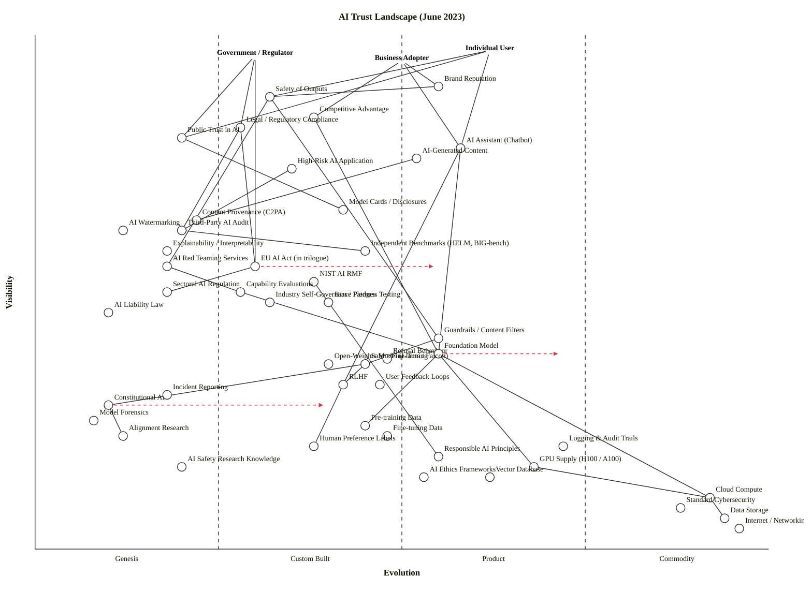

Now let me write the final output.

---

## Strategic context

**Strategic question.** What components determine whether individuals, governments, and businesses can trust AI systems in mid-2023, where is the differentiation moat, where is trust most fragile, and what is commoditising fast?

**User anchors.** Three. Each has a fundamentally different trust need:
- **Individual user** — wants safe outputs, no manipulation, recourse when wrong.
- **Government / Regulator** — wants compliance, oversight, public protection, sovereign control.
- **Business adopter** — wants brand-safe deployment, competitive edge, defensible compliance posture.

**Core needs.** Safety of outputs · legal/regulatory compliance · brand reputation · competitive advantage · public trust in AI as an institution.

**Scope boundary.** Cross-industry AI trust landscape as of **June 2023** — frontier LLMs (GPT-4 released March 2023, Claude launched, Llama 2 not yet out until July). EU AI Act in trilogue negotiations. NIST AI RMF 1.0 voted in 5 months ago. No US federal AI law.

**Assumption flagged for correction.** I'm scoring the *frontier-LLM* trust landscape (general-purpose AI). Narrow-AI trust (medical imaging, credit scoring, ADAS) sits further right on most axes and would warrant a sibling map.

---

## The map

```owm
title AI Trust Landscape (June 2023)
style wardley

// Three anchors — three distinct user types with different trust needs
anchor Individual User [0.97, 0.62]
anchor Government / Regulator [0.96, 0.30]
anchor Business Adopter [0.95, 0.50]

// === User-facing trust outcomes ===
component Safety of Outputs [0.88, 0.32]
component Brand Reputation [0.90, 0.55]
component Competitive Advantage [0.84, 0.38]
component Legal / Regulatory Compliance [0.82, 0.28]
component Public Trust in AI [0.80, 0.20]

// === Visible AI products & interfaces ===
component AI Assistant (Chatbot) [0.78, 0.58]
component AI-Generated Content [0.76, 0.52]
component High-Risk AI Application [0.74, 0.35]

// === Transparency & disclosure ===
component Model Cards / Disclosures [0.66, 0.42]
component AI Watermarking [0.62, 0.12]
component Content Provenance (C2PA) [0.64, 0.22]
component Explainability / Interpretability [0.58, 0.18]

// === Governance components ===
component EU AI Act (in trilogue) [0.55, 0.30]
component NIST AI RMF [0.52, 0.38]
component Sectoral AI Regulation [0.50, 0.18]
component Industry Self-Governance Pledges [0.48, 0.32]
component AI Liability Law [0.46, 0.10]

// === Audit & assurance ===
component Third-Party AI Audit [0.62, 0.20]
component Independent Benchmarks (HELM, BIG-bench) [0.58, 0.45]
component AI Red Teaming Services [0.55, 0.18]
component Capability Evaluations [0.50, 0.28]
component Bias / Fairness Testing [0.48, 0.40]

// === Control mechanisms (the alignment stack) ===
component Constitutional AI [0.28, 0.10]
component RLHF [0.32, 0.42]
component Safety Fine-Tuning [0.36, 0.45]
component Guardrails / Content Filters [0.41, 0.55]
component Refusal Behaviour [0.37, 0.48]

// === Feedback & forensics ===
component User Feedback Loops [0.32, 0.47]
component Incident Reporting [0.30, 0.18]
component Model Forensics [0.25, 0.08]
component Logging & Audit Trails [0.20, 0.72]

// === Foundation models & training ===
component Foundation Model (GPT-4 / Claude / PaLM 2) [0.38, 0.55]
component Open-Weights Model (Llama / Falcon) [0.36, 0.40]
component Alignment Research [0.22, 0.12]
component Pre-training Data [0.24, 0.45]
component Fine-tuning Data [0.22, 0.48]
component Human Preference Labels [0.20, 0.38]

// === Knowledge layer ===
component Responsible AI Principles [0.18, 0.55]
component AI Safety Research Knowledge [0.16, 0.20]
component AI Ethics Frameworks [0.14, 0.53]

// === Infrastructure / commodity layer ===
component GPU Supply (H100 / A100) [0.16, 0.68]
component Cloud Compute [0.10, 0.92]
component Vector Database [0.14, 0.62]
component Standard Cybersecurity [0.08, 0.88]
component Data Storage [0.06, 0.94]
component Internet / Networking [0.04, 0.96]

// === Dependencies ===
Individual User->AI Assistant (Chatbot)
Individual User->AI-Generated Content
Individual User->Safety of Outputs
Individual User->Public Trust in AI

Government / Regulator->Legal / Regulatory Compliance
Government / Regulator->High-Risk AI Application
Government / Regulator->Public Trust in AI
Government / Regulator->EU AI Act (in trilogue)
Government / Regulator->Sectoral AI Regulation

Business Adopter->Brand Reputation
Business Adopter->Competitive Advantage
Business Adopter->Legal / Regulatory Compliance
Business Adopter->AI Assistant (Chatbot)
Business Adopter->High-Risk AI Application

Safety of Outputs->Guardrails / Content Filters
Safety of Outputs->Refusal Behaviour
Safety of Outputs->AI Red Teaming Services
Brand Reputation->Safety of Outputs
Brand Reputation->Incident Reporting
Competitive Advantage->Foundation Model (GPT-4 / Claude / PaLM 2)
Competitive Advantage->Fine-tuning Data
Legal / Regulatory Compliance->EU AI Act (in trilogue)
Legal / Regulatory Compliance->NIST AI RMF
Legal / Regulatory Compliance->Third-Party AI Audit
Public Trust in AI->Industry Self-Governance Pledges
Public Trust in AI->Model Cards / Disclosures
Public Trust in AI->AI Watermarking

AI Assistant (Chatbot)->Foundation Model (GPT-4 / Claude / PaLM 2)
AI Assistant (Chatbot)->Guardrails / Content Filters
AI Assistant (Chatbot)->RLHF
AI-Generated Content->Foundation Model (GPT-4 / Claude / PaLM 2)
AI-Generated Content->Content Provenance (C2PA)
High-Risk AI Application->Bias / Fairness Testing
High-Risk AI Application->Explainability / Interpretability
High-Risk AI Application->Third-Party AI Audit

Model Cards / Disclosures->Capability Evaluations
Content Provenance (C2PA)->AI Watermarking
Explainability / Interpretability->AI Safety Research Knowledge

EU AI Act (in trilogue)->Sectoral AI Regulation
NIST AI RMF->Responsible AI Principles
Industry Self-Governance Pledges->Responsible AI Principles
Sectoral AI Regulation->AI Liability Law

Third-Party AI Audit->Independent Benchmarks (HELM, BIG-bench)
Third-Party AI Audit->Bias / Fairness Testing
Third-Party AI Audit->Capability Evaluations
AI Red Teaming Services->Capability Evaluations
Independent Benchmarks (HELM, BIG-bench)->Foundation Model (GPT-4 / Claude / PaLM 2)
Capability Evaluations->Foundation Model (GPT-4 / Claude / PaLM 2)
Bias / Fairness Testing->Pre-training Data

Guardrails / Content Filters->Safety Fine-Tuning
Refusal Behaviour->Safety Fine-Tuning
Safety Fine-Tuning->RLHF
Safety Fine-Tuning->Constitutional AI
RLHF->Human Preference Labels
Constitutional AI->Alignment Research
Constitutional AI->Responsible AI Principles

User Feedback Loops->Logging & Audit Trails
Incident Reporting->Logging & Audit Trails
Model Forensics->Logging & Audit Trails
Model Forensics->Alignment Research

Foundation Model (GPT-4 / Claude / PaLM 2)->Pre-training Data
Foundation Model (GPT-4 / Claude / PaLM 2)->GPU Supply (H100 / A100)
Foundation Model (GPT-4 / Claude / PaLM 2)->Cloud Compute
Foundation Model (GPT-4 / Claude / PaLM 2)->Alignment Research
Open-Weights Model (Llama / Falcon)->Pre-training Data
Open-Weights Model (Llama / Falcon)->GPU Supply (H100 / A100)
Fine-tuning Data->Human Preference Labels
Alignment Research->AI Safety Research Knowledge

Responsible AI Principles->AI Ethics Frameworks

GPU Supply (H100 / A100)->Cloud Compute
Cloud Compute->Data Storage
Cloud Compute->Internet / Networking
Vector Database->Cloud Compute
Logging & Audit Trails->Data Storage
Logging & Audit Trails->Standard Cybersecurity

evolve EU AI Act (in trilogue) 0.55
evolve AI Red Teaming Services 0.50
evolve Constitutional AI 0.40
evolve Content Provenance (C2PA) 0.55
evolve Third-Party AI Audit 0.55
evolve Foundation Model (GPT-4 / Claude / PaLM 2) 0.72

note Differentiation [0.55, 0.20]
note Commodity utilities [0.10, 0.90]
```

**Validator:** `OK: 49 components/anchors, 75 edges — no violations.`
**Layout check:** `LAYOUT OK: 3 anchors, 46 components — no layout warnings.`



*(Mermaid block is edge-trimmed for rendering; the OWM above is canonical. The Mermaid converter splits unquoted parenthesised names, so I replaced "Foundation Model (GPT-4 / Claude / PaLM 2)" with "Foundation Model" in the Mermaid block only.)*

---

## Component evolution rationale

| Component | Stage | ε | ν | Evidence |
|---|---|---|---|---|
| Safety of Outputs | Custom Built | 0.32 | 0.88 | No agreed safety standard; vendor-by-vendor definitions; "harmlessness" still a research term. |
| Brand Reputation | Product (+rental) | 0.55 | 0.90 | Well-understood concept; PR/comms is mature; AI-specific brand crises (Bing chat Feb 2023, Bard demo flub) novel. |
| Competitive Advantage | Custom Built | 0.38 | 0.84 | AI advantage thesis emerging; "AI moat" debated in VC press; no settled playbook. |
| Legal / Regulatory Compliance | Custom Built | 0.28 | 0.82 | No binding AI regulation in force yet (EU AI Act in trilogue, US has only voluntary RMF). |
| Public Trust in AI | Genesis | 0.20 | 0.80 | Sharply uncharted post-ChatGPT; Pew/Edelman surveys show wide volatility 2022→2023. |
| AI Assistant (Chatbot) | Product (+rental) | 0.58 | 0.78 | ChatGPT, Claude, Bing Chat, Bard all live; consumption rapidly increasing; clear product category. |
| High-Risk AI Application | Custom Built | 0.35 | 0.74 | EU AI Act defines the category but enforcement years away; vendor-specific implementations. |
| Model Cards / Disclosures | Custom Built | 0.42 | 0.66 | Mitchell et al. 2019 paper; HuggingFace adopting; no standard format; voluntary. |
| AI Watermarking | Genesis | 0.12 | 0.62 | Active research (Kirchenbauer 2023, OpenAI exploring); no deployed standard; easily defeated. |
| Content Provenance (C2PA) | Genesis→Custom | 0.22 | 0.64 | C2PA spec published, Adobe/Microsoft/BBC backing, but minimal deployment in AI outputs in June 2023. |
| Explainability / Interpretability | Genesis | 0.18 | 0.58 | Mechanistic interp is research-stage (Anthropic, Redwood); no production tooling for LLMs. |
| EU AI Act (in trilogue) | Custom Built | 0.30 | 0.55 | Parliament adopted negotiating position 14 June 2023 with 499 votes in favor, 28 against, and 93 abstentions; trilogues just began; not law. |
| NIST AI RMF | Custom Built | 0.38 | 0.52 | Released January 26, 2023; voluntary, unlike the binding EU AI Act; rapid uptake, no enforcement. |
| Sectoral AI Regulation | Genesis | 0.18 | 0.50 | FTC, FDA, EEOC have stated AI views but no AI-specific rules; UK approach paper March 2023 explicitly pro-innovation. |
| Industry Self-Governance Pledges | Custom Built | 0.32 | 0.48 | White House voluntary commitments (announced July 2023, days after this snapshot); PAI Tenets; ad-hoc. |
| AI Liability Law | Genesis | 0.10 | 0.46 | EU AI Liability Directive proposal Sep 2022; section 230 disputes; no live AI-specific liability regime. |
| Third-Party AI Audit | Genesis→Custom | 0.20 | 0.62 | ORCAA, Babl, Holistic AI emerging; no certification standard; mostly bias-audit consultancies. |
| Independent Benchmarks (HELM, BIG-bench) | Custom Built | 0.45 | 0.58 | HELM (Stanford 2022), BIG-bench (Google 2022), MMLU widely cited; gameable, contested but converging. |
| AI Red Teaming Services | Genesis | 0.18 | 0.55 | Frontier labs do in-house; red teaming AI systems… landscape is still emerging, and the offerings vary widely in approach, maturity, and integration; DEF CON Generative AI red team scheduled Aug 2023 still upcoming. |
| Capability Evaluations | Custom Built | 0.28 | 0.50 | ARC Evals doing GPT-4 dangerous-capability evals; METR (then ARC) nascent; no standard. |
| Bias / Fairness Testing | Product (+rental) | 0.40 | 0.48 | Aequitas, Fairlearn, IBM AIF360 mature for tabular ML; LLM bias eval much less settled. |
| Constitutional AI | Genesis | 0.10 | 0.28 | April 2023 Anthropic paper; reduces tension between helpfulness and harmlessness; single vendor (Anthropic); not adopted elsewhere yet. |
| RLHF | Custom Built | 0.42 | 0.32 | OpenAI, Anthropic, Google all use it; described as 'current industry standard' for aligning models with human preferences; tooling immature, recipes bespoke. |
| Safety Fine-Tuning | Custom Built | 0.45 | 0.36 | Standard practice at frontier labs; methods diverge; no shared dataset/tooling. |
| Guardrails / Content Filters | Product (+rental) | 0.55 | 0.41 | NeMo Guardrails (Nvidia), Guardrails AI, Azure Content Safety launched 2023; clear product category emerging. |
| Refusal Behaviour | Custom Built | 0.48 | 0.37 | Heavy iteration at OpenAI/Anthropic; refusal-rate well-studied; tuning is craft. |
| User Feedback Loops | Custom Built | 0.47 | 0.32 | Thumbs-up/down in ChatGPT, Claude; emerging design pattern; no standard. |
| Incident Reporting | Genesis | 0.18 | 0.30 | AIID (AI Incident Database) volunteer-run; no mandatory reporting regime. |
| Model Forensics | Genesis | 0.08 | 0.25 | Research-stage (influence functions, training data attribution); no commercial tooling. |
| Logging & Audit Trails | Product (+rental) | 0.72 | 0.20 | Mature for traditional software; LLM-specific (Helicone, LangSmith, Arize) launching 2023. |
| Foundation Model (GPT-4 / Claude / PaLM 2) | Product (+rental) | 0.55 | 0.38 | Multiple commercial vendors with clear feature differentiation; API pricing standard; consumption rapidly increasing. |
| Open-Weights Model (Llama / Falcon) | Custom Built | 0.40 | 0.36 | LLaMA leaked Feb 2023, Falcon-40B May 2023, Llama 2 not yet released; in-house fine-tuning bespoke. |
| Alignment Research | Genesis | 0.12 | 0.22 | Active research field; no settled methods; methods make it easier to train pernicious systems noted as dual-use concern. |
| Pre-training Data | Custom Built | 0.45 | 0.24 | Common Crawl + RefinedWeb + The Pile widely used; provenance/copyright disputed; recipes bespoke. |
| Fine-tuning Data | Custom Built | 0.48 | 0.22 | Each lab curates own; Anthropic HH-RLHF open-sourced; no marketplace yet. |
| Human Preference Labels | Custom Built | 0.38 | 0.20 | Scale AI, Surge, Invisible Technologies emerging vendors; quality varies; collecting human feedback is both costly and time-consuming, and manual labels can be noisy. |
| Responsible AI Principles | Product (+rental) | 0.55 | 0.18 | OECD AI Principles (2019), Asilomar, Microsoft RAI standard — many overlapping codes, well-understood concept. |
| AI Safety Research Knowledge | Genesis | 0.20 | 0.16 | Concentrated in <10 labs; not a textbook field. |
| AI Ethics Frameworks | Product (+rental) | 0.53 | 0.14 | Multiple competing frameworks (IEEE, EU HLEG, UNESCO); academic discipline mature. |
| GPU Supply (H100 / A100) | Product (+rental) | 0.68 | 0.16 | Nvidia near-monopoly; H100 supply-constrained in 2023; AWS/Azure/GCP rent them. |
| Cloud Compute | Commodity (+utility) | 0.92 | 0.10 | AWS/Azure/GCP, utility billing. |
| Vector Database | Product (+rental) | 0.62 | 0.14 | Pinecone (2021), Weaviate, Chroma, Qdrant; rapidly increasing consumption; clear product category. |
| Standard Cybersecurity | Commodity (+utility) | 0.88 | 0.08 | SOC 2, ISO 27001, mature vendor stack. |
| Data Storage | Commodity (+utility) | 0.94 | 0.06 | S3-class utility. |
| Internet / Networking | Commodity (+utility) | 0.96 | 0.04 | Foundational utility. |

---

## Strategic analysis

### a. Differentiation opportunities (top 3)

1. **Constitutional AI / Alignment Research (Genesis)** — Anthropic's CAI is the clearest example of a *trust technology* that is uncharted, deeply technical, and a real moat. Trains a harmless but non-evasive AI assistant that engages with harmful queries by explaining its objections; chain-of-thought style reasoning improves AI decision making. Single-vendor right now. **This is where trust differentiation lives.**

2. **Capability Evaluations + AI Red Teaming Services (Genesis → early Custom Built)** — Whoever industrialises rigorous capability evals (dangerous capability uplift, autonomous-replication, persuasion) wins regulatory positioning. ARC Evals had GPT-4 access pre-launch; that relationship is the moat.

3. **Content Provenance (C2PA) / Watermarking (Genesis)** — If this becomes the standard for AI-generated content, the firm that owns the working implementation captures a trust layer the entire creative-tools industry depends on. Adobe is positioned but contested.

### b. Commodity-leverage candidates (top 3)

1. **Cloud Compute, Data Storage, Internet / Networking (all Commodity +utility)** — rent, never build. Cleanly utility-priced from hyperscalers.
2. **Standard Cybersecurity (Commodity +utility)** — buy SOC 2 / ISO 27001 / pen-testing off-the-shelf. The *AI-specific* security layer (red teaming) is a separate Genesis bet.
3. **Bias / Fairness Testing (Product +rental, for tabular)** — open-source libraries (Fairlearn, AIF360) do this well for traditional ML. Don't reinvent for that segment. LLM-specific fairness *is* still Custom Built.

### c. Dependency risks (top 3)

1. **Safety of Outputs → AI Red Teaming Services** — visible trust outcome (`ν=0.88`) depends on a Genesis-stage assurance practice (`ε=0.18`). The biggest fragility in the map: companies *claim* their AI is safe, but the assurance machinery to verify that claim is barely past research-stage.

2. **Legal / Regulatory Compliance → EU AI Act (in trilogue)** — every business depends on regulation that hasn't been enacted. The provisional agreement states that the Act should apply two years after entry into force… likely to come into effect in 2026. Compliance teams are designing against a moving target.

3. **AI Assistant (Chatbot) → RLHF → Human Preference Labels** — a fully Product-stage user experience hangs on a Custom-Built training procedure that depends on a still-immature labelling vendor market. RLHF's idiosyncrasies (sycophancy, mode collapse, reward hacking) propagate straight to user-visible behaviour, and collecting human feedback is both costly and time-consuming, and manual labels can be noisy, resulting in a poor balance between helpfulness and harmfulness.

Honorable mentions for fragility: **Public Trust in AI → Industry Self-Governance Pledges** (voluntary, no enforcement); **High-Risk AI Application → Explainability** (production LLMs are not meaningfully interpretable in June 2023).

### d. Build / Buy / Outsource

| Component | Stage | Recommendation | Why |
|---|---|---|---|
| Alignment Research / Constitutional AI | Genesis | **Build** (frontier labs) | No vendor; this is the moat. |
| RLHF + Safety Fine-Tuning | Custom Built | **Build** internally, **buy** the labellers | Recipe is differentiating; data labour is rentable from Scale/Surge. |
| AI Red Teaming | Genesis | **Build + open-source collaborate** | DEF CON event, OpenAI Preparedness, ARC — join the emergent network; pure-buy market not ready. |
| Capability Evaluations | Custom Built | **Open-source collaborate** | METR / EleutherAI / HELM — accelerate the standard, don't own it. |
| Foundation Model | Product (+rental) | **Buy/rent** for most enterprises; **build** only at frontier-lab scale | API consumption mature; building from scratch is a $100M+ bet. |
| Guardrails / Content Filters | Product (+rental) | **Buy** (NeMo, Guardrails AI, Azure CS) | Active vendor market; in-house provides no edge. |
| Logging & Audit Trails | Product (+rental) | **Buy** (Helicone, LangSmith, Arize, Datadog) | Vendor market mature; observability is a commodity job. |
| Vector Database | Product (+rental) | **Buy** (Pinecone, Weaviate, Qdrant) | Active competition. |
| GPU Supply | Product (+rental) | **Rent** via clouds; **negotiate reserved capacity** for serious workloads | Supply-constrained; relationships matter. |
| Cloud / Storage / Networking | Commodity (+utility) | **Rent** | Utility. |
| EU AI Act / NIST RMF compliance posture | Custom Built | **Build with external counsel** | Regulation in flux; in-house expertise + external advisors. |
| Watermarking / C2PA | Genesis | **Open-source collaborate** | Standards game (#30) — being on the standards body matters more than custom implementation. |

### e. Suggested gameplays

- **#15 Open Approaches** on **Capability Evaluations** and **Watermarking/C2PA**. Frontier labs share interest in industry-wide assurance because (i) it pre-empts heavy-handed regulation, (ii) it commoditises safety overhead, (iii) it lets them compete on actual capability. The Frontier Model Forum (announced July 2023) is this play live.
- **#30 Standards Game** on **C2PA + watermarking**. Whoever sets the provenance standard captures positional advantage across every downstream creative tool.
- **#36 Directed Investment** on **Alignment Research / Mechanistic Interpretability**. Anthropic, OpenAI Superalignment (announced July 2023), DeepMind are doing this; it's the highest-D component on the map.
- **#43 Sensing Engines (ILC)** on the foundation-model ecosystem. OpenAI's plugin/GPT store strategy (later in 2023) is harvesting innovation built atop the API.
- **#33 Raising Barriers to Entry** via *compute-threshold regulation*. Incumbents have an interest in EU AI Act thresholds (10^25 FLOPs) that gate only frontier players. Whether this is a stable equilibrium is the open political question.
- **#55 Land Grab** on **Third-Party AI Audit** — the firm that becomes the "Big 4 for AI audit" before EU AI Act enforcement is the winner of that market. ORCAA, Holistic AI, Babl are running this play.
- **#11 FUD** is being deployed in both directions — frontier labs warning of existential risk (Future of Life letter, May 2023 Senate testimony), open-source advocates warning of regulatory capture. Both are gameplays, not climatic patterns.

### f. Doctrine violations and notes

- ✓ **#10 Know your users** — three anchors (Individual, Government, Business) correctly identified; each has fundamentally different trust requirements.
- ⚠ **#13 Manage inertia** — Public Trust in AI is currently sustained largely by **inertia form #11 (suitability doubt)** and **#15 (cannibalisation fear)**. Big tech's caution on aggressive deployment is partly self-interest (they have a lot to lose); flag this when reading their safety messaging.
- ⚠ **#22 Use standards where appropriate** — Watermarking and C2PA are being standardised *while still in Genesis*. Wardley's rule of thumb is to standardise at `ε ≥ 0.75`; here we're seeing premature standardisation driven by regulatory pressure. This often locks in a sub-optimal first attempt (cf. early SSL).
- ⚠ **#2 Use a systematic mechanism of learning** — The feedback loop from **Incident Reporting → Alignment Research** is broken. There is no mandatory AI-incident reporting regime; AIID is volunteer-run. Until that closes, the safety side of the map is flying blind.

### g. Climatic context

The June 2023 map is dominated by a small set of climatic patterns from `references/climatic-patterns.md`:

- **#3 Everything evolves + #5 No choice over evolution.** The foundation model layer is industrialising before our eyes (ChatGPT Nov 2022 → GPT-4 March 2023 → enterprise rollouts mid-2023). Trust components on its left are being *pulled rightward* by the speed of the underlying tech.
- **#21 Peace / War / Wonder cycles.** This is a Wonder phase for foundation models and a War phase for AI governance — two simultaneous cycles. The strategist's hardest job is not confusing them.
- **#22 Two forms of disruption.** Genesis-driven (alignment failures, novel misuse) AND product-to-utility (foundation models becoming utilities) are running in parallel. Different playbooks.
- **#26 Change is not linear.** Trust can collapse in a single incident (Bing Chat "Sydney" persona, Feb 2023). Linear extrapolation of public trust is meaningless.
- **#15–17 Past success breeds inertia.** Big tech's content-moderation playbook from social media is being inappropriately ported to AI. Watch for it.

### h. Deep-placement notes

I ran targeted searches on four components where placement was load-bearing:

1. **EU AI Act** — initial guess Custom Built, mid-stage. Confirmed: draft negotiating mandate, with the vote expected during the 12-15 June session, but interinstitutional talks ('trilogues') began in mid-June 2023. Final agreement not until Dec 2023. Held at ε=0.30 — it's emerging law, not law.

2. **NIST AI RMF** — confirmed released on January 26, 2023, with about 400 sets of formal comments from more than 240 different organizations shaping it, but it lacks enforcement mechanisms or certification mandates. Custom Built with significant uptake — placed at ε=0.38.

3. **Constitutional AI** — initial guess Genesis, deep-left. Confirmed: April 2023 paper, single-vendor (Anthropic), early replication attempts (Llama 3-8B study, etc.) all *later*. Strong Genesis placement at ε=0.10 supported.

4. **AI Red Teaming Services** — initial guess Custom Built (0.35). Search showed the *vendor* market was barely forming in mid-2023 — the landscape of AI red teaming tools is still emerging, and the offerings vary widely in approach, maturity, and integration (and that's from 2025 looking back). Moved *left* to ε=0.18 (Genesis). The frontier labs were doing red teaming internally; an external commercial market in mid-2023 was essentially research consultancies plus a few startups.

### Where trust is most fragile (synthesis)

Reading the map: **trust is fragile wherever a high-visibility outcome sits atop a Genesis-stage assurance practice.** Three load-bearing fragilities:

1. **The safety-claim gap.** "Our AI is safe" → audit → red teaming → capability evals. The user-facing claim lives at `ν=0.88`; the practices that would substantiate it sit at `ε=0.10–0.28`. Companies are writing cheques the assurance industry cannot yet cash.

2. **The compliance gap.** Businesses are designing compliance programmes against an EU AI Act that won't apply for two years and a NIST framework with no teeth. The whole governance column is `ε=0.10–0.38` — Genesis through Custom Built. Investments made now bet on stage transitions that may or may not happen as predicted.

3. **The forensics gap.** When something goes wrong with a deployed model, the ability to investigate *why* is at `ε=0.08` (Model Forensics) and `ε=0.20` (Logging mature, but LLM-specific tooling Custom Built). For a technology being deployed in production at hundreds of millions of users, this is the asymmetry to watch.

### i. Caveat

The evolution arrows on this map (EU AI Act → Product, AI Red Teaming → late Custom Built, Foundation Model → Commodity, Constitutional AI → Custom Built) are **scenarios, not forecasts.** Wardley's climatic pattern #18: *"you cannot measure evolution over time or adoption."* What you can do is plan options against multiple trajectories — particularly for the three fragilities above, where the difference between "industry self-corrects" and "regulator forces transition" determines who wins.

Re-map every six months. In a Wonder/War phase, the landscape has the half-life of a fruit fly.