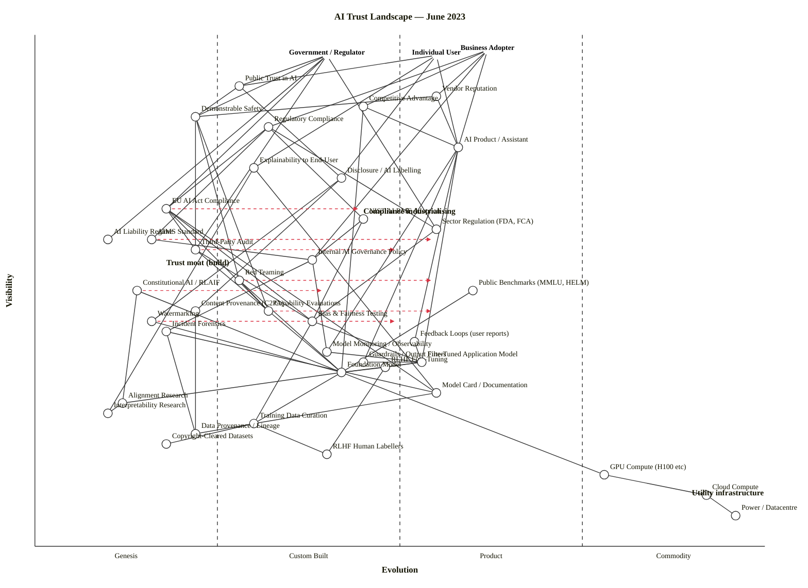

All clean. Now I'll produce the final output.

---

# AI Trust Landscape — Wardley Map (June 2023)

## 0. Strategic framing

**Assumptions** (flag for correction):

1. **Strategic question.** What components determine whether individuals, governments, and businesses can trust AI systems — and where are the strategic moats vs. commoditising layers?
2. **Anchors (three users).** Individual end-users, Government/Regulator, Business Adopter.
3. **Core needs.** For individuals: comprehensible, safe outputs; for regulators: demonstrable safety and an enforceable liability regime; for business: regulatory compliance, competitive advantage, vendor reputation.
4. **Scope.** Industry-wide landscape (foundation-model era, post-ChatGPT, mid-trilogue on EU AI Act). Snapshot at **June 2023** — a deliberately unstable moment where governance is forming and control techniques are emerging.

## 1. The map (OWM)

```owm
title AI Trust Landscape — June 2023
style wardley

// === Anchors: three user types ===
anchor Individual User [0.96, 0.55]
anchor Government / Regulator [0.96, 0.40]
anchor Business Adopter [0.97, 0.62]

// === Outcomes / trust signals (top of value chain) ===
component Public Trust in AI [0.90, 0.28]
component Vendor Reputation [0.88, 0.55]
component Competitive Advantage [0.86, 0.45]
component Demonstrable Safety [0.84, 0.22]
component Regulatory Compliance [0.82, 0.32]

// === User-visible AI products ===
component AI Product / Assistant [0.78, 0.58]
component Explainability to End-User [0.74, 0.30]
component Disclosure / AI Labelling [0.72, 0.42]

// === Governance components ===
component EU AI Act Compliance [0.66, 0.18]
component NIST AI RMF Adoption [0.64, 0.45]
component Sector Regulation (FDA, FCA) [0.62, 0.55]
component AI Liability Regime [0.60, 0.10]
component Third-Party Audit [0.58, 0.22]
component Internal AI Governance Policy [0.56, 0.38]
component AIMS Standard [0.60, 0.16]

// === Control mechanisms ===
component Red Teaming [0.52, 0.28]
component Constitutional AI / RLAIF [0.50, 0.14]
component RLHF Fine-Tuning [0.35, 0.48]
component Content Provenance (C2PA) [0.46, 0.22]
component Watermarking [0.44, 0.16]
component Incident Forensics [0.42, 0.18]
component Feedback Loops (user reports) [0.40, 0.52]
component Model Monitoring / Observability [0.38, 0.40]
component Guardrails / Output Filters [0.36, 0.45]

// === Evaluation & benchmarks ===
component Public Benchmarks (MMLU, HELM) [0.50, 0.60]
component Capability Evaluations [0.46, 0.32]
component Bias & Fairness Testing [0.44, 0.38]

// === Technical core ===
component Foundation Model [0.34, 0.42]
component Fine-Tuned Application Model [0.36, 0.53]
component Model Card / Documentation [0.30, 0.55]
component Alignment Research [0.28, 0.12]
component Interpretability Research [0.26, 0.10]

// === Data ===
component Training Data Curation [0.24, 0.30]
component Data Provenance / Lineage [0.22, 0.22]
component Copyright-Cleared Datasets [0.20, 0.18]
component RLHF Human Labellers [0.18, 0.40]

// === Infrastructure ===
component GPU Compute (H100 etc) [0.14, 0.78]
component Cloud Compute [0.10, 0.92]
component Power / Datacentre [0.06, 0.96]

// === Dependencies ===
Individual User->AI Product / Assistant
Individual User->Public Trust in AI
Individual User->Explainability to End-User
Individual User->Disclosure / AI Labelling

Government / Regulator->Public Trust in AI
Government / Regulator->EU AI Act Compliance
Government / Regulator->Sector Regulation (FDA, FCA)
Government / Regulator->AI Liability Regime
Government / Regulator->Third-Party Audit
Government / Regulator->Demonstrable Safety

Business Adopter->AI Product / Assistant
Business Adopter->Vendor Reputation
Business Adopter->Competitive Advantage
Business Adopter->Regulatory Compliance
Business Adopter->Internal AI Governance Policy

Public Trust in AI->Demonstrable Safety
Public Trust in AI->Disclosure / AI Labelling
Vendor Reputation->Demonstrable Safety
Vendor Reputation->AI Product / Assistant
Competitive Advantage->AI Product / Assistant
Competitive Advantage->Foundation Model
Demonstrable Safety->Third-Party Audit
Demonstrable Safety->Red Teaming
Demonstrable Safety->Capability Evaluations
Regulatory Compliance->EU AI Act Compliance
Regulatory Compliance->NIST AI RMF Adoption
Regulatory Compliance->Sector Regulation (FDA, FCA)
Regulatory Compliance->AIMS Standard

AI Product / Assistant->Fine-Tuned Application Model
AI Product / Assistant->Guardrails / Output Filters
AI Product / Assistant->Model Monitoring / Observability
AI Product / Assistant->Feedback Loops (user reports)
Explainability to End-User->Model Card / Documentation
Explainability to End-User->Interpretability Research
Disclosure / AI Labelling->Watermarking
Disclosure / AI Labelling->Content Provenance (C2PA)

EU AI Act Compliance->Third-Party Audit
EU AI Act Compliance->Capability Evaluations
EU AI Act Compliance->Bias & Fairness Testing
EU AI Act Compliance->Model Card / Documentation
NIST AI RMF Adoption->Internal AI Governance Policy
NIST AI RMF Adoption->Bias & Fairness Testing
AIMS Standard->Internal AI Governance Policy
Internal AI Governance Policy->Model Monitoring / Observability
Internal AI Governance Policy->Incident Forensics
Third-Party Audit->Capability Evaluations
Third-Party Audit->Bias & Fairness Testing
Sector Regulation (FDA, FCA)->Bias & Fairness Testing

Red Teaming->Foundation Model
Red Teaming->Capability Evaluations
Constitutional AI / RLAIF->Foundation Model
Constitutional AI / RLAIF->Alignment Research
RLHF Fine-Tuning->Foundation Model
RLHF Fine-Tuning->RLHF Human Labellers
Guardrails / Output Filters->Fine-Tuned Application Model
Model Monitoring / Observability->Fine-Tuned Application Model
Incident Forensics->Data Provenance / Lineage
Incident Forensics->Model Card / Documentation
Feedback Loops (user reports)->Fine-Tuned Application Model
Content Provenance (C2PA)->Data Provenance / Lineage
Watermarking->Foundation Model

Public Benchmarks (MMLU, HELM)->Foundation Model
Capability Evaluations->Foundation Model
Bias & Fairness Testing->Fine-Tuned Application Model
Bias & Fairness Testing->Training Data Curation

Foundation Model->Training Data Curation
Foundation Model->GPU Compute (H100 etc)
Foundation Model->Alignment Research
Fine-Tuned Application Model->Foundation Model
Fine-Tuned Application Model->RLHF Fine-Tuning
Model Card / Documentation->Training Data Curation
Alignment Research->Interpretability Research

Training Data Curation->Data Provenance / Lineage
Training Data Curation->Copyright-Cleared Datasets
Training Data Curation->RLHF Human Labellers

GPU Compute (H100 etc)->Cloud Compute
Cloud Compute->Power / Datacentre

evolve Constitutional AI / RLAIF 0.40
evolve EU AI Act Compliance 0.45
evolve Third-Party Audit 0.50
evolve Red Teaming 0.55
evolve AIMS Standard 0.55
evolve Watermarking 0.50
evolve Capability Evaluations 0.55

note Trust moat (build) [0.55, 0.18]
note Compliance industrialising [0.65, 0.45]
note Utility infrastructure [0.10, 0.90]
```

**Validator status:** `OK: 42 components/anchors, 77 edges — no violations.` Layout check: `LAYOUT OK — no layout warnings.`

## 2. Mermaid rendering (for GitHub viewers)



## 3. Component evolution rationale

| Component | Stage | ε | ν | Evidence (June 2023) |
|---|---|---:|---:|---|
| Public Trust in AI | Custom Built | 0.28 | 0.90 | Post-ChatGPT moral panic + AI Pause letter (Mar 2023); no shared methodology for measuring/establishing trust. |
| Vendor Reputation | Product (+rental) | 0.55 | 0.88 | Standard B2B trust signal applied to new category; OpenAI/Anthropic/Google brand differentiation active. |
| Competitive Advantage | Custom Built | 0.45 | 0.86 | Every business asking "what's our AI strategy?" — bespoke per firm. |
| Demonstrable Safety | Genesis | 0.22 | 0.84 | No agreed definition or measurement; "safety" means different things to ML researchers vs. regulators. |
| Regulatory Compliance | Custom Built | 0.32 | 0.82 | Patterns forming (NIST RMF released Jan 2023) but compliance is bespoke per company. |
| AI Product / Assistant | Product (+rental) | 0.58 | 0.78 | ChatGPT, Bard, Claude — clear product category with feature competition since Nov 2022. |
| Explainability to End-User | Custom Built | 0.30 | 0.74 | UX patterns emerging (citations, "I'm an AI"); no standard. |
| Disclosure / AI Labelling | Custom Built | 0.42 | 0.72 | Voluntary in most jurisdictions; EU AI Act draft mandates it but not yet binding. |
| EU AI Act Compliance | Genesis | 0.18 | 0.66 | Parliament adopted its negotiating position in June 2023; trilogue meetings took place in June, July, September, October and December 2023 — no compliance market yet exists because the law isn't passed. |
| NIST AI RMF Adoption | Custom Built | 0.45 | 0.64 | NIST AI RMF released January 26, 2023, after a multi-stage open process; voluntary framework, referenced by regulators and standards bodies as a baseline. Adoption patterns just forming. |
| Sector Regulation (FDA, FCA) | Product (+rental) | 0.55 | 0.62 | Mature in healthcare/finance pre-AI; being extended to AI use-cases. |
| AI Liability Regime | Genesis | 0.10 | 0.60 | EU AI Liability Directive draft only; US has no federal AI liability law; common-law uncertainty. |
| Third-Party Audit | Genesis | 0.22 | 0.58 | NYC bias-audit Local Law 144 just enforced (July 2023); no established AI audit profession; methodology bespoke. |
| Internal AI Governance Policy | Custom Built | 0.38 | 0.56 | Every large enterprise drafting one; consultancies advising; patterns forming. |
| AIMS Standard (ISO/IEC 42001) | Genesis | 0.16 | 0.60 | ISO/IEC 42001, published in 2023, as the first global standard for an AI management system — but not published until late 2023; in June it's draft. |
| Red Teaming | Custom Built | 0.28 | 0.52 | Less than a year later, the largest AI red teaming exercise ever was organized at DEF CON (Aug 2023); in June 2023 the practice is bespoke, no vendor market. |
| Constitutional AI / RLAIF | Genesis | 0.14 | 0.50 | CAI reduces the tension between helpfulness and harmlessness by creating AI assistants that are significantly less evasive; introduced in arXiv paper 2212.08073 (Dec 2022); only Anthropic's Claude uses it in production. |
| RLHF Fine-Tuning | Custom Built | 0.48 | 0.35 | Reinforcement Learning from Human Feedback (RLHF), which is the 'current industry standard' for aligning models with human preferences — patterns published, several labs replicating; not yet commodity. |
| Content Provenance (C2PA) | Custom Built | 0.22 | 0.46 | C2PA standard exists since 2021; Adobe/Microsoft pilots; adoption sparse. |
| Watermarking | Genesis | 0.16 | 0.44 | Active research; no production-grade scheme that survives paraphrase; voluntary White House commitments coming July 2023. |
| Incident Forensics | Genesis | 0.18 | 0.42 | AI Incident Database exists (PAI) but no industrial forensics practice. |
| Feedback Loops (user reports) | Product (+rental) | 0.52 | 0.40 | Thumbs-up/down in ChatGPT, Bard standard; pattern well understood. |
| Model Monitoring / Observability | Custom Built | 0.40 | 0.38 | Arize, WhyLabs, Fiddler exist as vendors but cover classic ML; LLM observability still custom. |
| Guardrails / Output Filters | Custom Built | 0.45 | 0.36 | NeMo Guardrails (April 2023), Guardrails.ai (early 2023), Azure Content Safety — first products. |
| Public Benchmarks (MMLU, HELM) | Product (+rental) | 0.60 | 0.50 | MMLU (2020), HELM (2022), BIG-bench widely used; saturation of traditional AI benchmarks like MMLU, GSM8K, and HumanEval already becoming a concern. |
| Capability Evaluations | Custom Built | 0.32 | 0.46 | METR/ARC Evals (formerly ARC) doing this for OpenAI/Anthropic; bespoke methodology per evaluator. |
| Bias & Fairness Testing | Product (+rental) | 0.38 | 0.44 | IBM AIF360 (2018), Microsoft Fairlearn — established for classic ML; LLM bias testing still emerging. |
| Foundation Model | Product (+rental) | 0.42 | 0.34 | GPT-4, Claude, PaLM 2, Llama all released or available; product market exists, rapid feature competition. |
| Fine-Tuned Application Model | Product (+rental) | 0.53 | 0.36 | OpenAI/Anthropic fine-tuning APIs and HuggingFace PEFT — standard pattern. |
| Model Card / Documentation | Product (+rental) | 0.55 | 0.30 | Model Cards (Mitchell 2019) widely adopted; HuggingFace enforces; mature pattern. |
| Alignment Research | Genesis | 0.12 | 0.28 | RLHF, CAI, scalable oversight — active research; no settled science. |
| Interpretability Research | Genesis | 0.10 | 0.26 | Anthropic mech interp, attribution methods — frontier research, no production tooling. |
| Training Data Curation | Custom Built | 0.30 | 0.24 | Common Crawl + bespoke filtering per lab; no shared standard. |
| Data Provenance / Lineage | Genesis | 0.22 | 0.22 | NYT v. OpenAI suit filed late 2023; provenance tooling early-stage. |
| Copyright-Cleared Datasets | Genesis | 0.18 | 0.20 | Adobe Firefly's "commercially safe" claim (Mar 2023) is the first major commercial offer. |
| RLHF Human Labellers | Custom Built | 0.40 | 0.18 | Scale AI, Surge, Invisible — vendor market exists; show human raters two model responses, ask them to pick the better one, and do this millions of times. |
| GPU Compute (H100 etc) | Product (+rental) | 0.78 | 0.14 | H100 in massive shortage June 2023; Nvidia has near-monopoly on training-class accelerators. Product market, not yet commodity. |
| Cloud Compute | Commodity (+utility) | 0.92 | 0.10 | AWS/GCP/Azure utility pricing; standard procurement. |
| Power / Datacentre | Commodity (+utility) | 0.96 | 0.06 | Electricity and colocation are utilities. |

## 4. Strategic analysis

### a. Differentiation opportunities (top 3) — where trust IS the moat

1. **Demonstrable Safety** (Genesis) — the single most important high-visibility / low-evolution component. Whoever can credibly claim "safer than the alternative" wins individuals, regulators, and risk-averse enterprises simultaneously. No standard exists; the lab that establishes the methodology shapes the market.
2. **Constitutional AI / RLAIF** (Genesis) — Anthropic's wedge. CAI training can produce a Pareto improvement (i.e., win-win situation) where Constitutional RL is both more helpful and more harmless than reinforcement learning from human feedback. In our tests, our CAI-model responded more appropriately to adversarial inputs while still producing helpful answers and not being evasive. The model received no human data on harmlessness, meaning all results on harmlessness came purely from AI supervision. Genuine technique-as-moat in June 2023.
3. **Capability Evaluations** (Custom Built, in transition) — the firm that defines how to evaluate dangerous capabilities defines what "safe-enough-to-release" means. METR/ARC Evals are doing this for OpenAI and Anthropic; whoever industrialises this practice owns the kingmaker role.

### b. Commodity-leverage candidates (top 3) — rent, don't build

1. **Cloud Compute** (Commodity +utility) — rent from hyperscalers; nobody outside hyperscalers should build datacentre infra.
2. **Power / Datacentre** (Commodity +utility) — utility.
3. **Public Benchmarks (MMLU, HELM)** (Product +rental) — use, don't reinvent. They're saturating but still the lingua franca.

### c. Dependency risks (top 3) — visible components on fragile foundations

1. **Public Trust in AI → Demonstrable Safety** — the most consequential edge on the map. Society-level trust depends on a Genesis-stage capability with no agreed definition. **Trust itself is structurally fragile** because its primary input is unbuilt.
2. **EU AI Act Compliance → Third-Party Audit** — a forthcoming legal obligation depending on a near-Genesis service market. Once the AI Act passes (Dec 2023), demand for audits will explode against a supply of essentially zero qualified providers.
3. **AI Product / Assistant → Guardrails / Output Filters** — every shipped chatbot depends on jailbreak-prone, Custom-Built filters; this is where reputational damage is one screenshot away.

A fourth deserves naming: **Foundation Model → GPU Compute (H100)**. The entire technical stack depends on a single-vendor supply-constrained Product (+rental) market. Nvidia is the choke point.

### d. Build / Buy / Outsource

| Component | Stage | Recommendation | Why |
|---|---|---|---|
| Constitutional AI / RLAIF | Genesis | **Build** (if you're a lab); **wait or partner** (if you're an adopter) | Genuine differentiation zone — no vendor sells this yet. |
| Capability Evaluations | Custom Built | **Build internally + commission externally** | Two evidence sources strengthen defensibility; the practice is forming. |
| Red Teaming | Custom Built → Product | **Buy services + run internal** | Vendors emerging (HackerOne, Hacken, Mindgard, etc.); industrialising fast. |
| Third-Party Audit | Genesis → Product | **Buy** when regulatory deadlines force it; pick early to lock in capacity | Market will be supply-constrained the moment EU AI Act lands. |
| Internal AI Governance Policy | Custom Built | **Build on a framework** (NIST RMF, forthcoming AIMS Standard) | Don't reinvent; use the structures. |
| RLHF Human Labellers | Custom Built | **Buy** (Scale, Surge, Invisible) | Mature vendor market. |
| Guardrails / Output Filters | Custom Built | **Buy + customise** (NeMo Guardrails, Azure Content Safety, Guardrails.ai) | First products exist; differentiation is in policy, not implementation. |
| Foundation Model | Product (+rental) | **Rent** (API) unless you have a domain moat | leading open-weight models lagged significantly behind their closed-weight counterparts in 2023; renting closed models was strictly better for most businesses. |
| GPU Compute | Product (+rental) | **Rent from hyperscalers** + book capacity contracts | H100 shortage means spot is unreliable; long-term commits matter. |
| Cloud Compute | Commodity (+utility) | **Rent** | Utility. |
| Watermarking | Genesis | **Wait** (research) — adopt voluntary standards if regulators pressure you | Premature to commit to a scheme. |
| AIMS Standard (ISO 42001) | Genesis | **Track and prepare**, certify when published | Standardising — early certification will be a trust signal. |

### e. Suggested gameplays

- **#36 Directed investment** on **Constitutional AI / RLAIF** and **Capability Evaluations** — both Genesis with high D; both define the trust moat.
- **#15 Open Approaches** on **Bias & Fairness Testing** and **Public Benchmarks** — accelerate commoditisation of evaluation so trust signals are cheap and comparable. This is what HELM, MLCommons, and BIG-bench effectively are.
- **#30 Standards Game** on **AIMS Standard** and **Disclosure / AI Labelling** — whichever lab shapes ISO 42001 and C2PA's defaults sets the cost-of-entry for everyone else.
- **#43 Sensing Engines (ILC)** on **Red Teaming vendor market** — let DEF CON and the consultancies surface what works, harvest the winners. The largest AI red teaming exercise ever was organized at DEF CON in August 2023 — a textbook ILC sensing event.
- **#13 Lobbying** on **EU AI Act trilogues** — frontier labs are explicitly trying to shape Article 28b on foundation models during exactly this window.
- **#41 Alliances** on **AI Liability Regime** — labs collectively need to define how liability flows between model provider, fine-tuner, and deployer or face a chaotic patchwork.
- **#56 First mover** on **Third-Party Audit** — Holistic AI, Credo AI, and Trail are positioning for the audit market that doesn't yet exist; first credible methodology + regulatory blessing wins.

### f. Doctrine notes

- ✓ **#10 Know your users** — three anchors (individual, government, business) correctly capture distinct trust calculus.
- ⚠ **#13 Manage inertia** — multiple inertia forms are simultaneously active:
  - *Form #2 Sunk capital* — labs have invested heavily in RLHF pipelines; CAI/RLAIF threatens that.
  - *Form #15 Past-success / cannibalisation fear* — frontier labs profit from opacity; transparency tools erode pricing power.
  - *Form #11 Suitability doubt* — regulators question whether AI is "really suitable" for high-stakes domains.
- ⚠ **#22 Use standards where appropriate** — AIMS Standard is in Genesis (ε ≈ 0.16); standardising on it now would be premature for capabilities but appropriate for management-system scaffolding.
- ⚠ **#31 Strategy is complex** — high variance across components; uncertainty ranges, not points, would be more honest for Genesis components (Demonstrable Safety, AI Liability Regime, Interpretability Research). I've plotted points; treat them as central estimates with ±0.10 envelopes.

### g. Climatic context

The map sits at a textbook **#27 punctuated equilibrium** moment — product-to-utility transition compressed into months. Specifically active climatic patterns:

- **#3 Everything evolves & #5 No choice** — every Genesis trust component will move right; labs cannot opt out by claiming AI is "different".
- **#22 Two forms of disruption** — both kinds are running at once. Foundation models are Genesis-driven disruption (new uncharted capability). Cloud-for-AI and bias-testing are product-to-utility disruption. Different responses needed for each.
- **#21 Peace, War, Wonder** — we are in a *Wonder* phase for foundation models (new generation emerging) AND a *War* for governance (industrialisation boundary, EU AI Act forcing structural change).
- **#15–17 Inertia is fatal** — Anthropic's CAI bet against the RLHF orthodoxy is a classic "exploit the incumbent's sunk capital" move. Whoever is over-invested in pure-RLHF pipelines has form #2 inertia stacked against form #16 (rewards & culture) — both consumer-side and supplier-side.
- **#18 You cannot measure evolution over time** — the `evolve` arrows on the map are the most fragile claims in this analysis. They're scenarios.

### h. Deep-placement notes

Components I researched (rather than guessed):

- **Constitutional AI / RLAIF** — confirmed Genesis. Constitutional AI (CAI), which Anthropic uses in their Claude models, is the earliest documented, large-scale use of synthetic data for RLHF training. As of June 2023 only Anthropic ships it; open-source replications and the broader RLAIF field came later. ε held at 0.14.
- **EU AI Act Compliance** — confirmed Genesis. Parliament's negotiating position adopted in June 2023... Trilogue meetings took place in June, July, September, October and December 2023; the Council presidency and the European Parliament's negotiators reached a provisional agreement on the AI act on 9 December 2023. In June there is no law to comply with — vendors are positioning, not delivering. ε held at 0.18.
- **NIST AI RMF Adoption** — confirmed Custom Built. The NIST AI Risk Management Framework was released on January 26, 2023; only ~5 months old in June. Pattern is published, adoption is forming. ε set at 0.45.
- **AIMS Standard (ISO/IEC 42001)** — placed at Genesis (ε 0.16) because it wasn't yet published. ISO/IEC 42001, published in 2023, as the first global standard for an AI management system — but it landed in December 2023, so in June it's draft/Genesis.
- **Red Teaming** — Custom Built with strong rightward pressure. AI red teaming dominates conversations in academia, think tank advice, and popular media articles. The notion of red teaming is being touted as a panacea to many of the problems AI might have. The August DEF CON exercise is just ahead; vendor market essentially doesn't exist yet. ε 0.28.
- **Foundation Model** — Product (+rental) ε 0.42. GPT-4 (Mar 2023), Claude (Mar 2023), Bard, PaLM 2, LLaMA 2 (July 2023) — clear product competition. Not commodity because leading open-weight models lagged significantly behind their closed-weight counterparts. By 2024, this gap had nearly disappeared. In June 2023 the gap was wide; closed-model competition is what mattered.

### i. Where trust itself is fragile — the summary view

The map shows trust is fragile in four structurally distinct places:

1. **The trust outcomes (top-right area) depend on Genesis-stage substrates.** Public Trust → Demonstrable Safety → Capability Evaluations / Red Teaming / Alignment Research. The whole chain rests on practices that don't have agreed methodology in June 2023.
2. **The regulatory enforcement layer is structurally incomplete.** EU AI Act Compliance and AI Liability Regime are both Genesis; without them, "trustworthy" has no legal teeth. Trust signals are voluntary and therefore selectively reported.
3. **The disclosure stack is structurally weak.** Watermarking is Genesis and probably evadable; C2PA is Custom Built with low adoption. Users cannot reliably tell AI-generated content from human-generated content, so consent-to-AI is theoretical.
4. **The single-vendor compute dependency.** Foundation Model → GPU Compute → Nvidia is a one-firm single-point-of-failure for the entire AI economy in 2023.

What's differentiating (build): Constitutional AI, Capability Evaluations, Demonstrable Safety methodology, Interpretability Research, Alignment Research, in-house Foundation Models.

What's commoditising (buy / rent): Foundation Model APIs, Cloud Compute, Public Benchmarks, RLHF Human Labellers, Model Cards, Bias & Fairness Testing toolkits, RLHF Fine-Tuning pipelines.

What's industrialising fast and worth tracking: Red Teaming (vendor market forming), Third-Party Audit (regulatory-driven), AIMS Standard, Guardrails / Output Filters.

### Caveat

Evolution trajectories (`evolve` arrows) are scenarios, not forecasts. Wardley's climatic pattern #18: *"you cannot measure evolution over time or adoption."* In a domain moving as fast as AI in mid-2023, every component's stage is a snapshot with a short half-life — re-map quarterly.