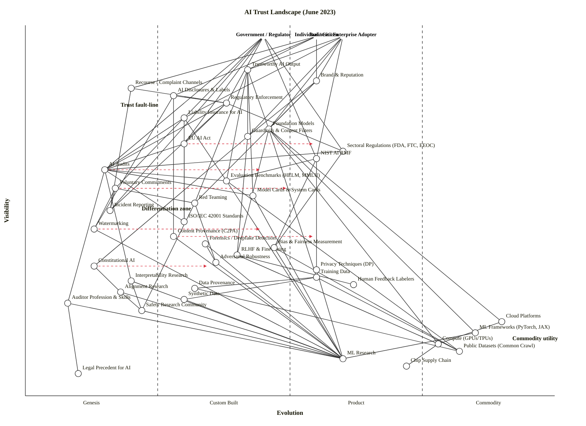

Validator and layout checker both clean. Here is the map and analysis.

---

## Assumptions

The scenario didn't fully pin down four framing points; I made the following defensible choices and flag them so you can correct them:

1. **Strategic question:** *"Where is trust in AI fragile, what is differentiating vs. commoditising, and where should investment flow to harden the trust stack?"* — board-level positioning, not architecture.
2. **User anchors:** three, because trust is judged differently by **Individuals/Citizens**, **Government/Regulators**, and **Business/Enterprise Adopters**. A single-anchor map would hide the conflicts between them.
3. **Core needs:** Individuals need non-harm, agency, and recourse. Government needs public safety, sovereignty, and accountability. Business needs reliable AI, liability protection, and competitive advantage.
4. **Scope:** the global AI trust landscape as of **June 2023** — i.e., post-GPT-4, post-NIST AI RMF release, the very week the EU AI Act began its trilogue, and one month before the US voluntary commitments.

---

## The map (OWM — canonical)

```owm
title AI Trust Landscape (June 2023)
style wardley

// Three anchors — trust is judged by three distinct user types
anchor Individual / Citizen [0.97, 0.55]
anchor Government / Regulator [0.97, 0.45]
anchor Business / Enterprise Adopter [0.97, 0.60]

// User-facing outcomes & touchpoints
component Trustworthy AI Output [0.88, 0.42]
component Brand & Reputation [0.85, 0.55]
component Recourse / Complaint Channels [0.83, 0.20]
component AI Disclosures & Labels [0.81, 0.28]
component Regulatory Enforcement [0.79, 0.38]
component Liability Insurance for AI [0.75, 0.30]

// Governance & control layer
component Foundation Models [0.72, 0.46]
component Guardrails & Content Filters [0.70, 0.42]
component EU AI Act [0.68, 0.30]
component Sectoral Regulations (FDA, FTC, EEOC) [0.66, 0.60]
component NIST AI RMF [0.64, 0.55]
component AI Audits [0.61, 0.15]
component Evaluation Benchmarks (HELM, MMLU) [0.58, 0.38]
component Voluntary Commitments [0.56, 0.17]
component Model Cards & System Cards [0.54, 0.43]
component Red Teaming [0.52, 0.32]
component Incident Reporting [0.50, 0.16]
component ISO/IEC 42001 Standards [0.47, 0.30]
component Watermarking [0.45, 0.13]
component Content Provenance (C2PA) [0.43, 0.28]
component Forensics / Deepfake Detection [0.41, 0.34]

// Technical / research layer
component RLHF & Fine-tuning [0.38, 0.40]
component Bias & Fairness Measurement [0.40, 0.47]
component Adversarial Robustness [0.36, 0.36]
component Constitutional AI [0.35, 0.13]
component Privacy Techniques (DP) [0.34, 0.55]
component Interpretability Research [0.31, 0.20]
component Alignment Research [0.28, 0.18]
component Training Data [0.32, 0.55]
component Data Provenance [0.29, 0.32]
component Synthetic Data [0.26, 0.30]
component Human Feedback Labelers [0.30, 0.62]
component Auditor Profession & Skills [0.25, 0.08]
component Safety Research Community [0.23, 0.22]

// Deep infrastructure / commodity
component Cloud Platforms [0.20, 0.90]
component ML Frameworks (PyTorch, JAX) [0.17, 0.85]
component Compute (GPUs/TPUs) [0.14, 0.78]
component Public Datasets (Common Crawl) [0.12, 0.82]
component Chip Supply Chain [0.08, 0.72]

// Knowledge
component ML Research [0.10, 0.60]
component Legal Precedent for AI [0.06, 0.10]

// Individual dependencies
Individual / Citizen->Trustworthy AI Output
Individual / Citizen->AI Disclosures & Labels
Individual / Citizen->Recourse / Complaint Channels
Individual / Citizen->Brand & Reputation

// Government dependencies
Government / Regulator->Regulatory Enforcement
Government / Regulator->EU AI Act
Government / Regulator->NIST AI RMF
Government / Regulator->Sectoral Regulations (FDA, FTC, EEOC)
Government / Regulator->AI Audits
Government / Regulator->Voluntary Commitments
Government / Regulator->Incident Reporting

// Business dependencies
Business / Enterprise Adopter->Trustworthy AI Output
Business / Enterprise Adopter->Brand & Reputation
Business / Enterprise Adopter->Liability Insurance for AI
Business / Enterprise Adopter->Foundation Models
Business / Enterprise Adopter->Guardrails & Content Filters
Business / Enterprise Adopter->NIST AI RMF

// Trustworthy Output edges
Trustworthy AI Output->Foundation Models
Trustworthy AI Output->Guardrails & Content Filters
Trustworthy AI Output->Evaluation Benchmarks (HELM, MMLU)
Trustworthy AI Output->Model Cards & System Cards
Trustworthy AI Output->Red Teaming

// Disclosure / labels
AI Disclosures & Labels->Watermarking
AI Disclosures & Labels->Content Provenance (C2PA)
AI Disclosures & Labels->Regulatory Enforcement

// Recourse
Recourse / Complaint Channels->Incident Reporting
Recourse / Complaint Channels->Regulatory Enforcement

// Liability insurance
Liability Insurance for AI->AI Audits
Liability Insurance for AI->ISO/IEC 42001 Standards
Liability Insurance for AI->Evaluation Benchmarks (HELM, MMLU)

// Regulatory enforcement
Regulatory Enforcement->AI Audits
Regulatory Enforcement->Incident Reporting
Regulatory Enforcement->EU AI Act
Regulatory Enforcement->Sectoral Regulations (FDA, FTC, EEOC)

// Brand
Brand & Reputation->Foundation Models
Brand & Reputation->Guardrails & Content Filters
Brand & Reputation->Red Teaming

// Guardrails
Guardrails & Content Filters->RLHF & Fine-tuning
Guardrails & Content Filters->Constitutional AI

// Foundation models
Foundation Models->RLHF & Fine-tuning
Foundation Models->Training Data
Foundation Models->Cloud Platforms
Foundation Models->Compute (GPUs/TPUs)
Foundation Models->ML Frameworks (PyTorch, JAX)

// EU AI Act
EU AI Act->ISO/IEC 42001 Standards
EU AI Act->AI Audits

// NIST RMF
NIST AI RMF->Evaluation Benchmarks (HELM, MMLU)
NIST AI RMF->Bias & Fairness Measurement
NIST AI RMF->Privacy Techniques (DP)

// Sectoral regs
Sectoral Regulations (FDA, FTC, EEOC)->Bias & Fairness Measurement
Sectoral Regulations (FDA, FTC, EEOC)->AI Audits

// Voluntary commitments
Voluntary Commitments->Red Teaming
Voluntary Commitments->Watermarking
Voluntary Commitments->Incident Reporting

// AI Audits
AI Audits->Auditor Profession & Skills
AI Audits->Model Cards & System Cards
AI Audits->Evaluation Benchmarks (HELM, MMLU)
AI Audits->Interpretability Research
AI Audits->ISO/IEC 42001 Standards

// Eval benchmarks
Evaluation Benchmarks (HELM, MMLU)->ML Research
Evaluation Benchmarks (HELM, MMLU)->Public Datasets (Common Crawl)

// Model cards
Model Cards & System Cards->ML Research

// Red teaming
Red Teaming->Adversarial Robustness
Red Teaming->Safety Research Community

// Watermarking
Watermarking->ML Research

// Content provenance
Content Provenance (C2PA)->ML Research

// Forensics
Forensics / Deepfake Detection->ML Research
Forensics / Deepfake Detection->Adversarial Robustness

// RLHF
RLHF & Fine-tuning->Human Feedback Labelers
RLHF & Fine-tuning->Compute (GPUs/TPUs)

// Constitutional AI
Constitutional AI->Alignment Research

// Interpretability
Interpretability Research->ML Research
Interpretability Research->Safety Research Community

// Alignment
Alignment Research->Safety Research Community
Alignment Research->ML Research

// Adversarial
Adversarial Robustness->ML Research

// Bias
Bias & Fairness Measurement->ML Research
Bias & Fairness Measurement->Public Datasets (Common Crawl)

// Privacy
Privacy Techniques (DP)->ML Research

// Training data
Training Data->Public Datasets (Common Crawl)
Training Data->Data Provenance
Training Data->Synthetic Data

// Data provenance
Data Provenance->Public Datasets (Common Crawl)

// Synthetic data
Synthetic Data->ML Research

// Auditor profession
Auditor Profession & Skills->Legal Precedent for AI
Auditor Profession & Skills->ML Research

// Safety research
Safety Research Community->ML Research

// Cloud
Cloud Platforms->Compute (GPUs/TPUs)

// Compute
Compute (GPUs/TPUs)->Chip Supply Chain

// ML Frameworks
ML Frameworks (PyTorch, JAX)->ML Research

// Evolution targets — where each is heading over the next 18–24 months
evolve EU AI Act 0.55
evolve Watermarking 0.45
evolve AI Audits 0.45
evolve Constitutional AI 0.35
evolve Voluntary Commitments 0.50
evolve Content Provenance (C2PA) 0.55

note Differentiation zone [0.50, 0.22]
note Commodity utility [0.15, 0.92]
note Trust fault-line [0.78, 0.18]
```

**Validator:** `OK: 44 components/anchors, 90 edges — no violations.` Layout check clean.

## Rendered view (Mermaid `wardley-beta`, for GitHub)



## Component evolution rationale

| Component | Stage | ε | ν | Evidence |
|---|---|---:|---:|---|
| Trustworthy AI Output | Custom Built | 0.42 | 0.88 | Aspiration without an agreed measurement standard; hallucinations and jailbreaks still everyday news. |
| Brand & Reputation | Product (+rental) | 0.55 | 0.85 | OpenAI, Anthropic, Google brands are differentiated assets; reputation is the *de facto* trust proxy. |
| Recourse / Complaint Channels | Genesis | 0.20 | 0.83 | No AI-specific ombudsman in any major jurisdiction; users have nowhere to go after harm. |
| AI Disclosures & Labels | Custom Built | 0.28 | 0.81 | California bot-disclosure law and China's draft rules exist; no global pattern. |
| Regulatory Enforcement | Custom Built | 0.38 | 0.79 | FTC has begun signalling AI enforcement under existing authority; no AI-specific powers yet. |
| Liability Insurance for AI | Custom Built | 0.30 | 0.75 | Munich Re, Vouch piloting AI-error policies; bespoke and expensive. |
| Foundation Models | Custom Built → Product | 0.46 | 0.72 | Foundation models were a major sticking point in EU trilogue negotiations; provisional agreement on regulating general-purpose AI systems came later — GPT-4 and Claude productised, ecosystem still bespoke. |
| Guardrails & Content Filters | Custom Built | 0.42 | 0.70 | Each lab rolls its own; Llama Guard, Constitutional classifiers, content filter APIs all incompatible. |
| EU AI Act | Custom Built | 0.30 | 0.68 | First trilogue meeting took place on 14 June 2023; Spain takes over Council presidency on 1 July 2023, aiming for a deal before end of 2023. Not yet law. |
| Sectoral Regulations (FDA, FTC, EEOC) | Product (+rental) | 0.60 | 0.66 | Decades-old sectoral regimes (FDA medical-device, FTC Section 5) being extended to AI; mature playbook. |
| NIST AI RMF | Product (+rental) | 0.55 | 0.64 | NIST AI RMF released January 26 2023 for voluntary use, to incorporate trustworthiness into AI design and evaluation; Trustworthy and Responsible AI Resource Center launched March 30 2023. Off-the-shelf framework, but no compliance pressure. |
| AI Audits | Genesis | 0.15 | 0.61 | Babl AI, ORCAA, Holistic AI exist but methodology is pre-paradigmatic; no certification body. |
| Evaluation Benchmarks (HELM, MMLU) | Custom Built | 0.38 | 0.58 | HELM (Stanford CRFM 2022), MMLU, BIG-bench established but no agreed "trust benchmark". |
| Voluntary Commitments | Genesis | 0.17 | 0.56 | White House voluntary commitments still under negotiation in June 2023 (announced July 21). |
| Model Cards & System Cards | Custom Built | 0.43 | 0.54 | Mitchell et al. 2019 standard; OpenAI's GPT-4 System Card sets the bar; spreading but inconsistent. |
| Red Teaming | Custom Built | 0.32 | 0.52 | DEF CON 31 GRT planned for August 2023; Anthropic, OpenAI internal teams; no certified profession. |
| Incident Reporting | Genesis | 0.16 | 0.50 | AIAAIC and AI Incident Database are crowdsourced; no mandatory reporting regime. |
| ISO/IEC 42001 Standards | Custom Built | 0.30 | 0.47 | Draft International Standard in 2023 (published Dec 2023); not yet a buyable certification. |
| Watermarking | Genesis | 0.13 | 0.45 | Kirchenbauer et al. (UMD, June 2023) is research; no production-deployed cross-vendor scheme. |
| Content Provenance (C2PA) | Custom Built | 0.28 | 0.43 | C2PA 1.3 spec exists; Adobe, Microsoft adopting; mass deployment absent. |
| Forensics / Deepfake Detection | Custom Built | 0.34 | 0.41 | Reality Defender, Sensity, Truepic offer products; arms race with generation outpaces detection. |
| RLHF & Fine-tuning | Custom Built | 0.40 | 0.38 | InstructGPT paper (2022), Anthropic HH; methods converging but each lab's recipe is proprietary. |
| Bias & Fairness Measurement | Custom Built | 0.47 | 0.40 | Mature toolkits (Fairlearn, AIF360); no agreed metric per use case. |
| Adversarial Robustness | Custom Built | 0.36 | 0.36 | NeurIPS-grade research; Madry lab, Robust Bench; not turnkey. |
| Constitutional AI | Genesis | 0.13 | 0.35 | Anthropic's Bai et al. December 2022 paper; single-lab method as of June 2023. |
| Privacy Techniques (DP) | Product (+rental) | 0.55 | 0.34 | Differential privacy deployed by Apple, Google, US Census; mature toolkits (TensorFlow Privacy). |
| Interpretability Research | Genesis | 0.20 | 0.31 | Mechanistic interpretability is academic; Anthropic, Apollo Research nascent; no audit-grade tooling. |
| Alignment Research | Genesis | 0.18 | 0.28 | ARC, MIRI, Anthropic alignment teams; pre-paradigmatic, no shared theory of success. |
| Training Data | Product (+rental) | 0.55 | 0.32 | Common Crawl, The Pile, RefinedWeb well-known; curation and licensing wars (NYT v. OpenAI looming). |
| Data Provenance | Custom Built | 0.32 | 0.29 | Data Provenance Initiative (MIT, Sept 2023); audit trails patchy. |
| Synthetic Data | Custom Built | 0.30 | 0.26 | Gretel, Mostly AI exist; quality and bias-laundering concerns unresolved. |
| Human Feedback Labelers | Product (+rental) | 0.62 | 0.30 | Scale AI, Surge, Sama mature commercial markets; labour-rights scrutiny rising. |
| Auditor Profession & Skills | Genesis | 0.08 | 0.25 | No accredited "AI auditor" credential; ForHumanity certificate emerging; <100 globally. |
| Safety Research Community | Custom Built | 0.22 | 0.23 | <50 dedicated researchers globally; Anthropic, DeepMind, MIRI, ARC, Redwood are the field. |
| Cloud Platforms | Commodity (+utility) | 0.90 | 0.20 | AWS, Azure, GCP — metered utility for AI workloads. |
| ML Frameworks (PyTorch, JAX) | Commodity (+utility) | 0.85 | 0.17 | PyTorch (Linux Foundation, Sept 2022), JAX, TensorFlow open-source utility. |
| Compute (GPUs/TPUs) | Commodity (+utility) | 0.78 | 0.14 | H100/A100 priced per-hour; allocation-constrained but a commodity. |
| Public Datasets (Common Crawl) | Commodity (+utility) | 0.82 | 0.12 | Free, standardised, used by every major lab. |
| Chip Supply Chain | Product (+rental) → Commodity | 0.72 | 0.08 | TSMC-concentrated; US export controls (Oct 2022) make it strategic, not freely commodity. |
| ML Research | Product (+rental) | 0.60 | 0.10 | Mature institutions, NeurIPS/ICML cycle, arXiv flow — standard practice. |
| Legal Precedent for AI | Genesis | 0.10 | 0.06 | No appellate AI cases of consequence in mid-2023; doctrine being invented in real time. |

---

## Strategic analysis

### a. Differentiation opportunities (top 3)

1. **Constitutional AI / Alignment Research** (Genesis) — high-ν-relative-to-stage components that *uniquely* produce trustworthy outputs. As of June 2023 only Anthropic has published a credible Constitutional AI recipe; this is patentable, hireable, and publishable IP that is genuinely scarce.
2. **AI Audits** (Genesis, ν = 0.61) — a *governance-side* differentiator. The first credible third-party AI audit firms will set the methodology that EU AI Act notified bodies adopt; first-mover advantage is large and Wardley-classic.
3. **Interpretability Research** (Genesis) — the only credible technical path to "I can show the regulator *why* the model said that". Whoever industrialises mechanistic interpretability into an audit-grade product owns a high-margin trust moat.

### b. Commodity-leverage candidates (top 3)

1. **Cloud Platforms** (Commodity +utility) — rent, never build. Hyperscaler training credits are the cost-effective path.
2. **ML Frameworks (PyTorch / JAX)** (Commodity +utility) — consume the open-source standard. Don't fork.
3. **Compute (GPUs/TPUs)** (Commodity +utility) — rent capacity; building your own AI chip programme is a Genesis bet, not a trust bet.

### c. Dependency risks (top 3) — *where trust is fragile*

1. **Trustworthy AI Output → Foundation Models** — the user-visible output ($\nu = 0.88$) sits on Custom Built foundation models ($\varepsilon = 0.46$) whose behaviour even their builders don't fully understand. **This is the trust fault-line.** No matter how good your guardrails, the substrate is non-deterministic.
2. **Recourse / Complaint Channels → Incident Reporting** — a citizen's only path to remedy ($\nu = 0.83$) depends on a Genesis-stage incident-reporting infrastructure ($\varepsilon = 0.16$). When something goes wrong with AI, *there is nowhere to go*. This is doctrine #1 ("Focus on user needs") failing at the population level.
3. **Liability Insurance → AI Audits** — the business's risk-transfer mechanism ($\nu = 0.75$) depends on Genesis-stage audits ($\varepsilon = 0.15$). Insurers can't price what they can't measure; the market clears via wide exclusions or extreme premiums.

### d. Build / Buy / Outsource

| Component | Stage | Recommendation | Why |
|---|---|---|---|
| Foundation Models (frontier) | Custom Built → Product | **Buy** (API) **or partner**, unless you are one of ~5 labs | Capital intensity is now Stage-III scale; differentiation is downstream. |
| RLHF & Fine-tuning | Custom Built | **Build in-house** | Where your domain-specific safety calibration lives — this is your moat. |
| Constitutional AI / Alignment | Genesis | **Build OR open-source collaborate** | Genesis bets; open-sourcing methods (gameplay #15) accelerates the field, helps you recruit. |
| Guardrails & Content Filters | Custom Built | **Build thin layer on top of bought primitives** | Domain context lives here; generic guardrails miss it. |
| Bias & Fairness Measurement | Custom → Product | **Buy** (Fairlearn, Holistic AI, Credo AI) | Mature vendor market; no moat in re-implementing. |
| Privacy Techniques (DP) | Product | **Buy / Open-source consume** | OpenDP, Google DP libraries; rent the math. |
| Red Teaming | Custom Built | **Hybrid: in-house + buy specialist** | Domain-specific red teams + Trail of Bits / HiddenLayer for adversarial expertise. |
| AI Audits | Genesis | **Buy (when you're audited); partner (if you do the auditing)** | Don't expect a mature audit market for 18–24 months. |
| Watermarking / C2PA | Genesis / Custom | **Open-source collaborate** | Industry standard or nothing; building proprietary watermarking is value-destructive. |
| Auditor Profession | Genesis | **Invest in talent pipeline** | <100 people globally; gameplay #28 (Seek the best) and #38 (Centres of gravity) apply. |
| Cloud / Compute / ML Frameworks | Commodity (+utility) | **Rent** | Industrialised; building is strict-worse. |

### e. Suggested gameplays (cited by number and name)

- **#15 Open Approaches** on **Watermarking** and **C2PA** — the standards game (#30) only resolves if the major labs cooperate. Microsoft, Adobe, OpenAI on C2PA is the model.
- **#43 Sensing Engines (ILC)** on the audit ecosystem — Anthropic, OpenAI, Google all running their own variant; watch which audit-methodology wins, then commoditise.
- **#36 Directed Investment** on **Constitutional AI** and **Interpretability Research** — the two Genesis components with highest D-score.
- **#41 Alliances** + **#17 Co-operation** for **Voluntary Commitments** — the July 2023 White House commitments are precisely this play executed at industry scale; brace for repeat.
- **#56 First Mover** on **EU AI Act compliance** for any vendor selling into the EU — once the trilogue concludes (Q4 2023 per current trajectory), the implementation window opens.
- **#11 FUD / #50 Reinforcing Inertia** are being run *against* AI by incumbents and *against* open-source AI by closed labs — name them when you see them, but be wary of using them yourself: high reputational cost.
- **#7 Education** is critical: most consumer-side inertia in adopting AI safety practices is form #6 (confusion over method). The lab/regulator that successfully educates wins legitimacy.

### f. Doctrine violations

- **#1 Focus on user needs / #10 Know your users:** the entire industry is debating "AI safety" without distinguishing whose safety. Three anchors is the minimum honest representation; many published frameworks effectively use only one (the developer's).
- **#13 Manage inertia:** Foundation Models carry massive supplier-side inertia (#15 past-success data, #17 financial-market expectations). The "pause AI" letter exemplifies what happens when inertia isn't named — debates become about pace rather than which inertia form is operative.
- **#22 Use standards where appropriate:** there is active pressure to standardise (e.g., regulate) Foundation Models *while they are still Custom Built*. Doctrine warns explicitly against this — premature standardisation freezes the field at a sub-optimal point.
- **#2 Use a systematic mechanism of learning:** Incident Reporting (ε = 0.16) is the systematic-learning loop for the whole landscape. Its absence is a doctrine-violation at field scale.

### g. Climatic context

The dominant patterns shaping this map (per `references/climatic-patterns.md`):

- **#3 Everything evolves / #5 No choice over evolution** — Foundation Models *will* commoditise. The question is on what timeline (3 yr? 10 yr?) and what regulatory shape forces it.
- **#11 Future value is inversely proportional to certainty** — Alignment, Interpretability, Constitutional AI are exactly where future trust value concentrates *because* nobody yet knows how to do them.
- **#15–17 Past success breeds inertia** — closed-AI incumbents have the most to lose from open-weights commoditisation; expect them to deploy #11 FUD and #20 Patents.
- **#22 Two forms of disruption** — AI is *both* Genesis-driven (capabilities) AND product-to-utility (cloud → AI cloud). Most strategy memos confuse the two.
- **#27 Product-to-utility punctuated equilibrium** — when the EU AI Act lands (late 2023 / early 2024), the audit market will industrialise inside 24 months. Today's bespoke audit firms either scale or get acquired.

### h. Deep-placement notes

Four components warranted targeted verification beyond the cheat sheet:

- **EU AI Act (ε = 0.30, Custom Built):** verified that the first Trilogue took place on 14 June 2023, with four political Trilogues and many technical meetings completing through that autumn. As of the user's scenario month, it is *literally just entering* trilogue. Custom Built confirmed.
- **NIST AI RMF (ε = 0.55, Product +rental):** verified released January 26, 2023, voluntary, with the Trustworthy and Responsible AI Resource Center launching March 30, 2023. Off-the-shelf product, voluntary uptake — Product confirmed, but adoption pressure is light.
- **AI Audits (ε = 0.15, Genesis):** kept at Genesis. The audit *firms* exist (Babl AI, ORCAA, Holistic AI, ForHumanity) but methodology, accreditation, and a recognised auditor profession do not. The Brookings reading of the EU AI Act enforcement architecture noted the notified-body ecosystem is of "extremely limited scope" and that direct oversight via MSA/NSAs is likely more useful — confirms that even the EU regulators have low confidence in third-party audits at this point.
- **Foundation Models (ε = 0.46, Custom Built → Product boundary):** kept on the boundary. Productised products exist (GPT-4 API, Claude API) but every meaningful deployment is still custom integration. The trilogue eventually agreed provisional terms for general-purpose AI systems and a tiered approach with stricter rules for systemic-risk models — confirming foundation models are an active regulatory category, supporting the late-Custom placement.

### i. Caveat

The `evolve` arrows are **scenarios, not forecasts**. Wardley's climatic pattern #18 is explicit: *"you cannot measure evolution over time or adoption."* The placements above are seeds for argument, not predictions. Re-run this map every 6 months — in this landscape, every component except the deepest infrastructure will have moved.

---

### TL;DR — what's differentiating, what's commoditising, where trust is fragile

- **Differentiating right now:** Constitutional AI, Interpretability, Alignment Research, Audit methodology, brand-level trust capital.
- **Commoditising fast:** Foundation Models (visibly mid-transition), Human Feedback Labelers, NIST RMF as a framework template, Privacy Techniques.
- **Already commodity:** Cloud, Compute, Frameworks, Public Datasets.
- **Where trust is fragile (the fault-line):** the user-visible output sits at $\nu = 0.88$ on top of a Custom-Built substrate at $\varepsilon = 0.46$, with the citizen's *only* paths to recourse (Complaint Channels, Incident Reporting, Liability Insurance) all sitting in Genesis. **Visible promises on invisible foundations.** That gap is what every AI trust strategy in 2023 is implicitly trying — and mostly failing — to close.