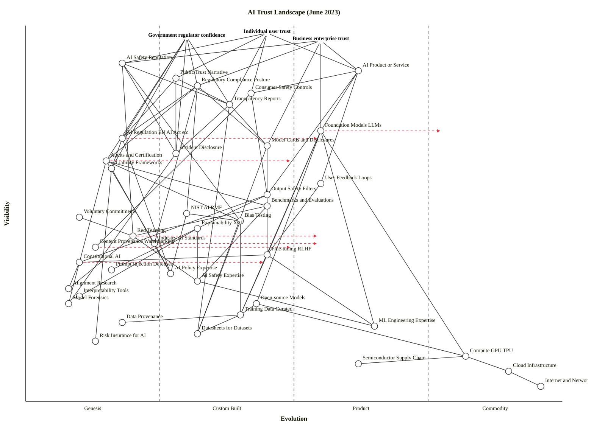

Validator clean, layout clean, Mermaid renders. Here's the map and strategic analysis.

---

## Framing

**Strategic question:** What components determine whether the three main user types (individuals, governments, businesses) can trust AI systems — and which are differentiating moats versus utilities to consume?

**User anchors:** (1) Individual user trust, (2) Government/regulator confidence, (3) Business/enterprise trust. The needs differ: individuals want safety and honesty in outputs; governments want enforceability and accountability; businesses want predictable risk and competitive advantage.

**Scope:** the global AI trust landscape as of **June 2023** — GPT-4 has been live ~3 months, Claude is new, the EU AI Act is in trilogue, NIST AI RMF v1.0 is 5 months old, the White House voluntary commitments and the Bletchley summit have not yet happened. This map will be obsolete by Q4 2023.

**Assumptions** (correct me if wrong): we map the *landscape*, not a single AI vendor's stack; "trust" means combined assurance across safety, accuracy, accountability, and security, not just AI safety in the alignment sense.

---

## OWM map

```owm
title AI Trust Landscape (June 2023)
style wardley

// =========== ANCHORS (three user types) ===========
anchor Individual user trust [0.98, 0.45]
anchor Government regulator confidence [0.97, 0.30]
anchor Business enterprise trust [0.96, 0.55]

// =========== LAYER 1 — User-visible outcomes & products ===========
component AI Safety Reputation [0.90, 0.18]
component Public Trust Narrative [0.86, 0.28]
component AI Product or Service [0.88, 0.62]
component Regulatory Compliance Posture [0.84, 0.32]
component Consumer Safety Controls [0.82, 0.42]
component Transparency Reports [0.79, 0.38]

// =========== LAYER 2 — Governance & disclosure layer ===========
component Foundation Models LLMs [0.72, 0.55]
component AI Regulation EU AI Act etc [0.70, 0.18]
component Model Cards and Disclosures [0.68, 0.45]
component Incident Disclosure [0.66, 0.28]
component Audits and Certification [0.64, 0.15]
component Liability Frameworks [0.62, 0.16]

// =========== LAYER 3 — Control mechanisms & evaluation ===========
component User Feedback Loops [0.58, 0.55]
component Output Safety Filters [0.55, 0.45]
component Benchmarks and Evaluations [0.52, 0.45]
component NIST AI RMF [0.50, 0.30]
component Voluntary Commitments [0.49, 0.10]
component Bias Testing [0.48, 0.40]
component Explainability XAI [0.46, 0.32]
component Red Teaming [0.44, 0.20]
component Industry AI Standards [0.42, 0.24]
component Content Provenance Watermarking [0.41, 0.13]

// =========== LAYER 4 — Research, expertise, alignment ===========
component Fine-tuning RLHF [0.39, 0.45]
component Constitutional AI [0.37, 0.10]
component Prompt Injection Defenses [0.35, 0.16]
component AI Policy Expertise [0.34, 0.27]
component AI Safety Expertise [0.32, 0.32]
component Alignment Research [0.30, 0.08]
component Interpretability Tools [0.28, 0.10]
component Model Forensics [0.26, 0.08]

// =========== LAYER 5 — Data, talent, open ecosystem ===========
component Open-source Models [0.26, 0.43]
component Training Data Curated [0.23, 0.40]
component Data Provenance [0.21, 0.18]
component ML Engineering Expertise [0.20, 0.65]
component Datasheets for Datasets [0.18, 0.32]
component Risk Insurance for AI [0.16, 0.13]

// =========== LAYER 6 — Deep infrastructure ===========
component Compute GPU TPU [0.12, 0.82]
component Semiconductor Supply Chain [0.10, 0.62]
component Cloud Infrastructure [0.08, 0.90]
component Internet and Networking [0.04, 0.96]

// Dependencies (abbreviated header; full list as below)
Individual user trust->AI Safety Reputation
Individual user trust->AI Product or Service
Individual user trust->Public Trust Narrative
Individual user trust->Consumer Safety Controls
Individual user trust->Transparency Reports
Government regulator confidence->Regulatory Compliance Posture
Government regulator confidence->AI Regulation EU AI Act etc
Government regulator confidence->Audits and Certification
Government regulator confidence->Incident Disclosure
Government regulator confidence->Liability Frameworks
Government regulator confidence->Transparency Reports
Business enterprise trust->AI Product or Service
Business enterprise trust->Regulatory Compliance Posture
Business enterprise trust->AI Safety Reputation
Business enterprise trust->Foundation Models LLMs
Business enterprise trust->Model Cards and Disclosures
AI Product or Service->Foundation Models LLMs
AI Product or Service->Output Safety Filters
AI Product or Service->User Feedback Loops
AI Product or Service->Consumer Safety Controls
Consumer Safety Controls->Output Safety Filters
Consumer Safety Controls->Content Provenance Watermarking
AI Safety Reputation->Red Teaming
AI Safety Reputation->Incident Disclosure
AI Safety Reputation->Transparency Reports
AI Safety Reputation->Bias Testing
Public Trust Narrative->Incident Disclosure
Public Trust Narrative->AI Regulation EU AI Act etc
Public Trust Narrative->Transparency Reports
Regulatory Compliance Posture->AI Regulation EU AI Act etc
Regulatory Compliance Posture->Audits and Certification
Regulatory Compliance Posture->Model Cards and Disclosures
Regulatory Compliance Posture->NIST AI RMF
Regulatory Compliance Posture->Industry AI Standards
Transparency Reports->Model Cards and Disclosures
Transparency Reports->Incident Disclosure
Transparency Reports->Datasheets for Datasets
Foundation Models LLMs->Training Data Curated
Foundation Models LLMs->Compute GPU TPU
Foundation Models LLMs->Fine-tuning RLHF
Foundation Models LLMs->ML Engineering Expertise
Foundation Models LLMs->Open-source Models
AI Regulation EU AI Act etc->AI Policy Expertise
AI Regulation EU AI Act etc->Liability Frameworks
Audits and Certification->Benchmarks and Evaluations
Audits and Certification->Bias Testing
Audits and Certification->Model Forensics
Audits and Certification->Industry AI Standards
Model Cards and Disclosures->Benchmarks and Evaluations
Model Cards and Disclosures->Datasheets for Datasets
Incident Disclosure->Model Forensics
Liability Frameworks->Risk Insurance for AI
Liability Frameworks->AI Policy Expertise
Output Safety Filters->Fine-tuning RLHF
Output Safety Filters->Constitutional AI
Output Safety Filters->Prompt Injection Defenses
User Feedback Loops->Fine-tuning RLHF
Benchmarks and Evaluations->Red Teaming
Benchmarks and Evaluations->AI Safety Expertise
Bias Testing->Training Data Curated
Bias Testing->Datasheets for Datasets
Explainability XAI->Interpretability Tools
Explainability XAI->AI Safety Expertise
Red Teaming->AI Safety Expertise
Red Teaming->Alignment Research
NIST AI RMF->AI Policy Expertise
NIST AI RMF->Bias Testing
Industry AI Standards->AI Policy Expertise
Voluntary Commitments->Red Teaming
Fine-tuning RLHF->Constitutional AI
Fine-tuning RLHF->Training Data Curated
Fine-tuning RLHF->ML Engineering Expertise
Constitutional AI->Alignment Research
AI Safety Expertise->ML Engineering Expertise
Open-source Models->Training Data Curated
Open-source Models->Compute GPU TPU
Training Data Curated->Data Provenance
Training Data Curated->Datasheets for Datasets
Compute GPU TPU->Semiconductor Supply Chain
Compute GPU TPU->Cloud Infrastructure
Cloud Infrastructure->Internet and Networking

evolve AI Regulation EU AI Act etc 0.55
evolve Audits and Certification 0.50
evolve Foundation Models LLMs 0.78
evolve Constitutional AI 0.45
evolve Content Provenance Watermarking 0.50
evolve Industry AI Standards 0.55
evolve Red Teaming 0.55

note Differentiation zone [0.78, 0.10]
note Commodity utilities [0.10, 0.93]
note Trust crisis fault line [0.55, 0.16]
```

**Validator:** OK: 43 components/anchors, 81 edges — no violations. Layout: clean.



---

## Component evolution rationale

| Component | Stage | ε | ν | Evidence (June 2023) |
|---|---|---|---|---|
| AI Safety Reputation | Genesis | 0.18 | 0.90 | Per-vendor reputational asset; no standard way to measure or compare; Anthropic, OpenAI, Google differentiate explicitly on this. |
| Public Trust Narrative | Genesis→Custom | 0.28 | 0.86 | Highly contested; "pause letter" March 2023, Italy ChatGPT ban March 2023, no settled framing. |
| AI Product or Service | Product (+rental) | 0.62 | 0.88 | ChatGPT (Nov 2022), GPT-4 API (Mar 2023), Claude (Mar 2023), Bard (Mar 2023) — clear API/subscription product market. |
| Regulatory Compliance Posture | Custom Built | 0.32 | 0.84 | Becoming bespoke per company (GDPR + voluntary + sector rules); no compliance product market yet. |
| Consumer Safety Controls | Custom→Product | 0.42 | 0.82 | Content filters, refusal training, age gates emerging across products; no standard yet. |
| Transparency Reports | Custom Built | 0.38 | 0.79 | Anthropic, OpenAI, Google publish ad-hoc; no required format. |
| Foundation Models (LLMs) | Product (+rental) | 0.55 | 0.72 | Multiple paying vendors (OpenAI, Anthropic, Cohere, AI21, Google); pricing per-token; rapid feature iteration. |
| AI Regulation | Genesis | 0.18 | 0.70 | EU AI Act in trilogue (not yet adopted); US has no statute; China interim measures Apr 2023. |
| Model Cards & Disclosures | Custom→Product | 0.45 | 0.68 | Mitchell et al. 2019 paper widely adopted; Hugging Face surfaces them; not yet mandatory or standardised. |
| Incident Disclosure | Custom Built | 0.28 | 0.66 | AI Incident Database exists; no required reporting; vendors disclose selectively. |
| Audits & Certification | Genesis | 0.15 | 0.64 | NYC bias audit law (2023) live but narrow; no certified AI auditor profession; methods unsettled. |
| Liability Frameworks | Genesis | 0.16 | 0.62 | EU AI Liability Directive proposed Sep 2022 (not adopted); US tort law unclear on LLM outputs. |
| User Feedback Loops | Product (+rental) | 0.55 | 0.58 | Thumbs-up/down, RLHF data collection standard across products. |
| Output Safety Filters | Custom→Product | 0.45 | 0.55 | Moderation APIs (OpenAI Moderation, Azure Content Safety) productising; in-house variants common. |
| Benchmarks & Evaluations | Custom→Product | 0.45 | 0.52 | MMLU, HELM, BIG-bench, LMSYS Chatbot Arena (May 2023); many overlap; no industry standard. |
| NIST AI RMF | Custom Built | 0.30 | 0.50 | NIST AI RMF 1.0 released Jan 2023; voluntary; uptake just beginning. |
| Voluntary Commitments | Genesis | 0.10 | 0.49 | Pre-White House commitments (those come July 2023); informal lab-by-lab pledges only. |
| Bias Testing | Custom Built | 0.40 | 0.48 | Fairness toolkits (AIF360, Fairlearn) mature; applied per-model; no universal protocol. |
| Explainability (XAI) | Custom Built | 0.32 | 0.46 | SHAP/LIME mature for tabular; LLM explainability largely unsolved; mostly research output. |
| Red Teaming | Genesis→Custom | 0.20 | 0.44 | OpenAI GPT-4 system card describes red team; Anthropic, DeepMind do internal red teams; no standard methodology. |
| Industry AI Standards | Custom Built | 0.24 | 0.42 | ISO/IEC 42001 draft (publishes Dec 2023); IEEE 7000 series partially out; nothing widely adopted. |
| Content Provenance / Watermarking | Genesis | 0.13 | 0.41 | C2PA spec exists; OpenAI removed its classifier July 2023 citing low accuracy; no working watermark for text. |
| Fine-tuning (RLHF) | Custom→Product | 0.45 | 0.39 | RLHF technique well-known post-InstructGPT; vendors offering fine-tuning APIs; methods still hand-crafted. |
| Constitutional AI | Genesis | 0.10 | 0.37 | Anthropic paper Dec 2022; only Anthropic deploys; one approach in a field of many. |
| Prompt Injection Defenses | Genesis | 0.16 | 0.35 | Simon Willison's coverage since 2022; no robust defense exists; live research problem. |
| AI Policy Expertise | Custom Built | 0.27 | 0.34 | Think tanks (CSET, GovAI, FLI) maturing; small labour pool; few certified programs. |
| AI Safety Expertise | Custom Built | 0.32 | 0.32 | Anthropic, DeepMind, OpenAI safety teams growing; MATS, ARENA training programs new. |
| Alignment Research | Genesis | 0.08 | 0.30 | Open problem; many approaches (RLHF, debate, scalable oversight); no agreed theory. |
| Interpretability Tools | Genesis | 0.10 | 0.28 | Anthropic mech-interp papers, Neel Nanda's TransformerLens; research artifacts, not products. |
| Model Forensics | Genesis | 0.08 | 0.26 | Almost no commercial offerings; needed for audit-after-incident but doesn't really exist. |
| Open-source Models | Custom→Product | 0.43 | 0.26 | LLaMA leak Feb 2023; Falcon, MPT, Vicuna released; rapid emergence but quality lags closed. |
| Training Data (Curated) | Custom Built | 0.40 | 0.23 | Common Crawl, The Pile, RedPajama; quality/legal status disputed (NYT vs OpenAI not yet filed, but lawsuits forming). |
| Data Provenance | Genesis | 0.18 | 0.21 | No working provenance for web-scale training data; copyright suits beginning. |
| ML Engineering Expertise | Product (+rental) | 0.65 | 0.20 | Mature labour market; consulting firms, bootcamps, courses; salaries spiking but supply functional. |
| Datasheets for Datasets | Custom Built | 0.32 | 0.18 | Gebru et al. 2018 framework; uptake patchy outside academia. |
| Risk Insurance for AI | Genesis | 0.13 | 0.16 | Munich Re, AXA exploring AI policies; no standard product; underwriters lack actuarial data. |
| Compute (GPU/TPU) | Commodity (+utility) | 0.82 | 0.12 | H100, A100 rental from AWS/GCP/Azure/CoreWeave; per-hour pricing; supply-constrained but commoditised. |
| Semiconductor Supply Chain | Product (+rental) | 0.62 | 0.10 | TSMC + ASML chokepoint; NVIDIA monopoly on training-grade GPUs; US export controls Oct 2022 reshaping geopolitics — not yet commodity. |
| Cloud Infrastructure | Commodity (+utility) | 0.90 | 0.08 | AWS/GCP/Azure utility pricing for 15+ years. |
| Internet and Networking | Commodity (+utility) | 0.96 | 0.04 | Foundational utility. |

---

## a. Differentiation opportunities (top 3)

1. **AI Safety Reputation** (Genesis, ν 0.90) — the single most user-visible and least industrialised component on the map. Anthropic has built an entire commercial identity around it; OpenAI and Google compete on it indirectly. No standard to compare against means whoever defines the standard captures the position. This is *the* moat.
2. **Constitutional AI** (Genesis, ν 0.37) — Anthropic's specific approach is one of several Genesis-stage alignment techniques. Currently sole-source; either it becomes the de-facto method (huge IP value), or it gets out-evolved by RLHF variants and open methods.
3. **Interpretability Tools / Model Forensics** (both Genesis, deep) — invisible to users today but the prerequisite for any meaningful audit regime. Whoever builds usable mech-interp tooling first will be in a position dominate the audit-vendor market that doesn't yet exist.

## b. Commodity-leverage candidates (top 3)

1. **Cloud Infrastructure** and **Internet/Networking** (Commodity +utility) — rent from AWS/GCP/Azure; the rule is the same as it has been for 15 years.
2. **Compute (GPU/TPU)** (Commodity +utility) — rent per-hour from hyperscalers or specialty providers (CoreWeave, Lambda). *Caveat:* supply-constrained in 2023, but the consumption model is utility.
3. **ML Engineering Expertise** (Product +rental) — hire or contract; large global talent market. Don't try to "own" generic ML engineering.

## c. Dependency risks (top 3)

These are the fault lines where a high-visibility component sits on top of an immature foundation.

1. **AI Product or Service → Foundation Models** — every consumer-facing AI experience depends on Stage III (early Product) models that hallucinate, drift, and get jailbroken. The cost of failure is high (user trust); the foundation is still maturing.
2. **Audits & Certification → Model Forensics** — regulators want auditors; auditors need forensics; **forensics barely exists**. The audit regime is being built on top of a Genesis component. Any actual post-incident audit today produces narrative, not evidence.
3. **Consumer Safety Controls → Content Provenance/Watermarking** — labels and provenance are being promised to users and regulators, but text watermarking doesn't reliably work (OpenAI shut down its classifier July 2023 for low accuracy). The "trust crisis fault line" annotated at [0.55, 0.16] marks this band — multiple user-facing controls leaning on Genesis-stage research.

## d. Build / Buy / Outsource

| Component | Stage | Recommendation | Why |
|---|---|---|---|
| Foundation Models (general capability) | Product (+rental) | **Rent** (OpenAI / Anthropic / Bedrock) unless you're a frontier lab | Capex prohibitive; vendor competition gives buyer leverage |
| Fine-tuning on your domain | Custom Built | **Build** with rented base | This is where domain advantage compounds |
| Constitutional AI / specific alignment method | Genesis | **Build** if you're a lab; **partner** otherwise | Pre-commercial; no buying it yet |
| Output Safety Filters | Custom→Product | **Buy** (OpenAI Moderation, Azure Content Safety, Lakera) | Vendor market is forming and good enough |
| Benchmarks & Evaluations | Custom Built | **Open-source collaborate** (HELM, LMSYS, OpenAI Evals) | Pre-standardisation — join the ecosystem rather than fragment it |
| Red Teaming | Genesis→Custom | **Build internal capability + hire specialists** | Pre-commodity; no certified red-team firm to outsource to safely yet |
| Bias Testing | Custom Built | **Buy** open toolkits (AIF360, Fairlearn) + domain customisation | Methods mature; application is bespoke |
| Compliance Posture | Custom Built | **Build with policy hire** + retain external counsel | Per-jurisdiction; no compliance product yet |
| Audits & Certification | Genesis | **Wait & track** — pilot with NIST RMF self-assessment | The audit market doesn't really exist yet; early certification has limited value |
| Compute / Cloud | Commodity (+utility) | **Rent** | Settled |
| Model Cards & Datasheets | Custom→Product | **Adopt the open templates** | No reason to invent your own format |
| Risk Insurance | Genesis | **Defer**; track Munich Re/Lloyd's products | Products will arrive in 2024-25; today's coverage is shallow |

## e. Suggested gameplays

- **#15 Open Approaches** on **Benchmarks** and **Model Cards** — accelerate standardisation around shared evaluations; this prevents any single vendor (or regulator) from defining the rules of trust unilaterally.
- **#43 Sensing Engines (ILC)** on **Open-source Models** — watch which Hugging Face leaderboard models gain traction; the ecosystem will tell you which capabilities are commoditising before the closed labs admit it.
- **#36 Directed investment** on **Interpretability Tools** and **Model Forensics** — these are deep Genesis components that the entire audit regime will depend on; whoever industrialises them captures a chokepoint.
- **#30 Standards game** on **Audits & Certification** — regulators want auditable AI but lack the technical apparatus; whoever supplies the audit standard (NIST + ISO 42001 are the candidates) anchors the regime.
- **#56 First mover** on **EU AI Act compliance** — high-risk-system obligations create a narrow compliance window once the Act is adopted (later in 2023). Early movers convert compliance from cost into competitive moat.
- **#42 Co-creation** on **Public Trust Narrative** — the narrative is currently being set by media and the loudest labs; deliberate engagement with civil society and academia shapes the frame your company is then judged against.
- **#11 FUD watch (defensive)** — competitors will use safety incidents to harm rivals' Reputation. The defence is incident-disclosure infrastructure that lets you get ahead of the story, not silence.

## f. Doctrine violations to watch (per Wardley's 40)

- **#10 Know your users** — the most common mistake in AI strategy decks is collapsing the three stakeholders into one. Each has different needs from the same components; the multi-anchor map is the corrective.
- **#13 Manage inertia** — the *consumer-side* inertias dominate: #7 supplier-trust concerns, #11 suitability doubt, and #15 past-success cannibalisation fears (search engines, media, education). Generic "change management" won't move them.
- **#7 Use appropriate methods** — applying enterprise-software audit methodology to Genesis-stage components produces theatre, not assurance. Audit a product-stage model with audit methods; treat Genesis components with experiment-and-disclosure, not certification.
- **#22 Use standards where appropriate** — pushing for ISO 42001 certification *now* is premature for components still in Genesis. Standards belong above ε ≈ 0.75.

## g. Climatic context

Active patterns shaping this map:

- **#3 Everything evolves** + **#27 Product-to-utility punctuated equilibrium** — Foundation Models are mid-transition from Custom to Product, with the inflection from Product to Utility (per-token utility pricing already arriving) compressed by competitive dynamics. The window is short.
- **#11 Future value is inversely proportional to certainty** — the most valuable trust components (Constitutional AI, Interpretability, Model Forensics) are also the most uncertain. The market is currently mispricing them.
- **#15–17 Inertia of past success** — incumbents in search, media, and customer service face the classic "Kodak in the new paradigm" trap; their existing trust assets become liabilities if the new paradigm settles differently.
- **#22 Two forms of disruption** — both are running simultaneously. Genesis-driven (LLMs themselves disrupt search, support, code) AND Product-to-utility (the LLM API itself commoditising under hyperscaler pressure).
- **#21 War cycle** — we are in a "war" phase for AI trust components: rapid structural change, M&A acceleration, regulatory entry. The post-war equilibrium will likely be a small number of trusted providers + a utility tier + a sovereign tier.

## h. Deep-placement notes

Three components I checked more carefully against June-2023 evidence:

- **Constitutional AI** — kept Genesis. Single publisher (Anthropic, paper Dec 2022); not deployed by anyone else; no certification or product market. Some practitioners would put RLHF + ConstitutionalAI together; I separated them because the diffusion pattern is different (RLHF is industry-wide; CAI is mono-vendor).
- **Audits & Certification** — initial cheat-sheet score suggested 0.25 (a real audit profession). Evidence: only NYC Local Law 144 is live (and narrow); no certified AI auditor profession exists; methods are unsettled. Moved to 0.15 (Genesis). This shift matters: it means the regulatory dependency in (c) is more fragile than typical compliance maps suggest.
- **Semiconductor Supply Chain** — I considered Commodity but kept Product (0.62). NVIDIA's effective monopoly on training-grade GPUs, TSMC's monopoly on advanced-node fab, ASML's monopoly on EUV, and the Oct 2022 US export controls all mean this is *not* a commodity market — supply is concentrated and politically managed. This is a hidden chokepoint in the AI trust stack that few maps surface.

## i. Where trust itself is most fragile

Three observations that don't fit cleanly in (a)–(h):

1. **The trust crisis fault line** (annotation at ε ≈ 0.15, ν ≈ 0.55) is real. Audits, Liability, Watermarking, Constitutional AI, Voluntary Commitments — every one of these is sub-0.25 evolution but being promised by labs and demanded by regulators as if it were Stage III. The gap between *what is being promised* and *what exists* is the largest single risk on this map.
2. **AI Safety Reputation is a leading indicator, not a lagging one.** It sits at ν 0.90, Genesis. One major incident at a top lab redraws the entire map for 12–18 months. This is brittle.
3. **The three anchors will diverge.** Today, "trust" is treated as one thing. Once the EU AI Act is adopted, government-confidence requirements (auditable, certified, traceable) will diverge sharply from individual trust (honest, helpful, not creepy) and business trust (predictable, indemnifiable). Vendors who maintain a single "trust" story will be exposed; vendors who build distinct narratives per stakeholder will compound advantage.

## Caveat

Evolution trajectories shown by `evolve` arrows are scenarios, not forecasts. Per Wardley's climatic pattern #18: *"you cannot measure evolution over time or adoption."* This map is a June 2023 snapshot — re-map at any major regulatory event (EU AI Act adoption, US executive order, a frontier incident) because the landscape will shift.