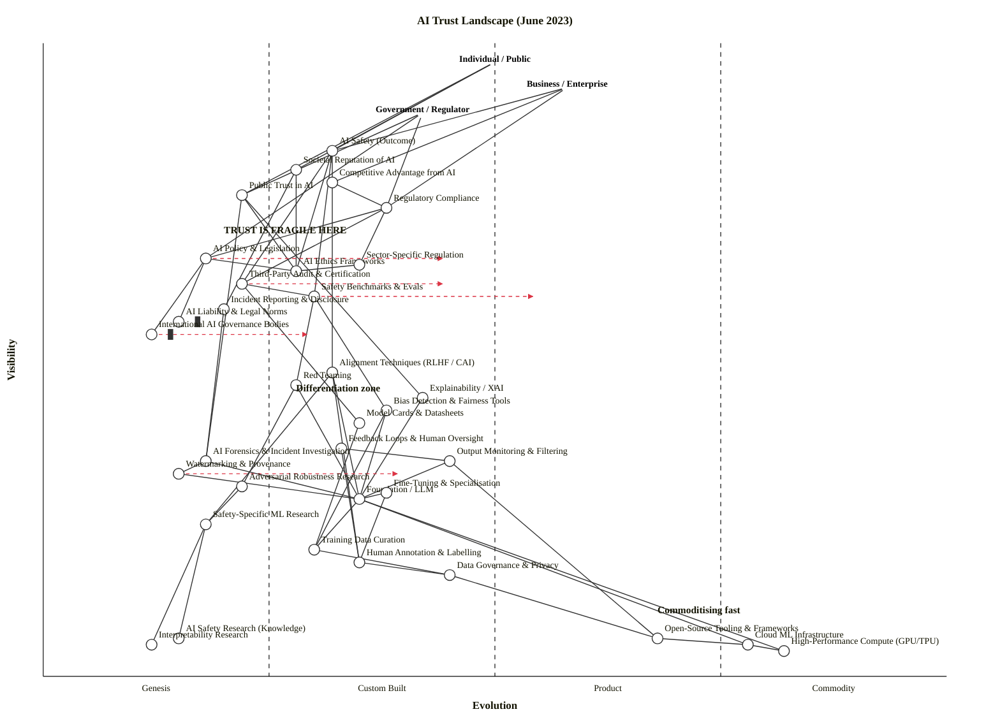

All clean. Now I'll write the complete output.

---

## Assumptions

| Assumption | Value chosen | Can override? |
|---|---|---|
| **Strategic question** | What determines whether individuals, businesses, and governments can trust AI systems — and where in the stack is trust currently fragile or defensible? | Yes — if your question is narrower (e.g., "should we build or buy our RAI stack?") the map still serves |
| **User anchors** | Three: **Individual / Public**, **Business / Enterprise**, **Government / Regulator** | Yes — a single-deployer view would use one anchor |
| **Core needs** | Safety assurance, accountability, competitive legitimacy, compliance | Yes |
| **Scope** | Landscape view (AI industry as a whole, June 2023); not one company's architecture | Yes |
| **Time anchor** | June 2023 — GPT-4 just launched (March), EU AI Act final debate underway, Biden AI Safety commitments being drafted, no comprehensive national legislation in force anywhere | Fixed per the prompt |

---

## OWM Map

```owm
title AI Trust Landscape (June 2023)
style wardley

// === ANCHORS — three user types ===
anchor Individual / Public [0.97, 0.50]
anchor Business / Enterprise [0.93, 0.58]
anchor Government / Regulator [0.89, 0.42]

// ========================================================
// OUTCOME LAYER  (ν 0.82–0.72)
// ========================================================
component AI Safety (Outcome) [0.83, 0.32]
component Societal Reputation of AI [0.80, 0.28]
component Competitive Advantage from AI [0.78, 0.32]
component Public Trust in AI [0.76, 0.22]
component Regulatory Compliance [0.74, 0.38]

// ========================================================
// GOVERNANCE LAYER  (ν 0.68–0.50)
// ========================================================
component AI Policy & Legislation [0.66, 0.18]
component AI Ethics Frameworks [0.64, 0.28]
component Third-Party Audit & Certification [0.62, 0.22]
component Safety Benchmarks & Evals [0.60, 0.30]
component Incident Reporting & Disclosure [0.58, 0.20]
component AI Liability & Legal Norms [0.56, 0.15] inertia
component International AI Governance Bodies [0.54, 0.12] inertia
component Sector-Specific Regulation [0.65, 0.35]

// ========================================================
// CONTROL / ASSURANCE MECHANISMS  (ν 0.48–0.36)
// ========================================================
component Alignment Techniques (RLHF / CAI) [0.48, 0.32]
component Red Teaming [0.46, 0.28]
component Explainability / XAI [0.44, 0.42]
component Bias Detection & Fairness Tools [0.42, 0.38]
component Model Cards & Datasheets [0.40, 0.35]
component Output Monitoring & Filtering [0.34, 0.45]
component Feedback Loops & Human Oversight [0.36, 0.33]

// ========================================================
// FORENSICS / PROVENANCE  (ν 0.34–0.26)
// ========================================================
component AI Forensics & Incident Investigation [0.34, 0.18]
component Watermarking & Provenance [0.32, 0.15]
component Adversarial Robustness Research [0.30, 0.22]

// ========================================================
// TECHNICAL — MODELS & ALGORITHMS  (ν 0.28–0.18)
// ========================================================
component Foundation / LLM [0.28, 0.35]
component Fine-Tuning & Specialisation [0.29, 0.38]
component Safety-Specific ML Research [0.24, 0.18]

// ========================================================
// TECHNICAL — DATA  (ν 0.20–0.12)
// ========================================================
component Training Data Curation [0.20, 0.30]
component Human Annotation & Labelling [0.18, 0.35]
component Data Governance & Privacy [0.16, 0.45]

// ========================================================
// TECHNICAL — COMPUTE & INFRASTRUCTURE  (ν 0.12–0.04)
// ========================================================
component High-Performance Compute (GPU/TPU) [0.04, 0.82]
component Cloud ML Infrastructure [0.05, 0.78]
component Open-Source Tooling & Frameworks [0.06, 0.68]

// ========================================================
// KNOWLEDGE FOUNDATIONS  (ν 0.06–0.04)
// ========================================================
component AI Safety Research (Knowledge) [0.06, 0.15]
component Interpretability Research [0.05, 0.12]

// ========================================================
// DEPENDENCIES
// ========================================================

// Users → Outcomes
Individual / Public->AI Safety (Outcome)
Individual / Public->Public Trust in AI
Individual / Public->Societal Reputation of AI
Business / Enterprise->Competitive Advantage from AI
Business / Enterprise->Regulatory Compliance
Business / Enterprise->AI Safety (Outcome)
Government / Regulator->AI Policy & Legislation
Government / Regulator->Regulatory Compliance
Government / Regulator->Public Trust in AI

// Outcomes ← Governance
AI Safety (Outcome)->Third-Party Audit & Certification
AI Safety (Outcome)->Safety Benchmarks & Evals
AI Safety (Outcome)->Alignment Techniques (RLHF / CAI)
AI Safety (Outcome)->AI Ethics Frameworks
Societal Reputation of AI->Incident Reporting & Disclosure
Societal Reputation of AI->AI Ethics Frameworks
Competitive Advantage from AI->Regulatory Compliance
Public Trust in AI->AI Ethics Frameworks
Public Trust in AI->Explainability / XAI
Public Trust in AI->AI Forensics & Incident Investigation
Regulatory Compliance->Sector-Specific Regulation
Regulatory Compliance->AI Policy & Legislation
Regulatory Compliance->Third-Party Audit & Certification

// Governance internal dependencies
AI Policy & Legislation->AI Ethics Frameworks
AI Policy & Legislation->International AI Governance Bodies
AI Policy & Legislation->AI Liability & Legal Norms
Third-Party Audit & Certification->Safety Benchmarks & Evals
Third-Party Audit & Certification->Model Cards & Datasheets
Safety Benchmarks & Evals->Red Teaming
Safety Benchmarks & Evals->Bias Detection & Fairness Tools
Incident Reporting & Disclosure->AI Forensics & Incident Investigation
Sector-Specific Regulation->AI Ethics Frameworks

// Control / Assurance
Alignment Techniques (RLHF / CAI)->Safety-Specific ML Research
Alignment Techniques (RLHF / CAI)->Human Annotation & Labelling
Alignment Techniques (RLHF / CAI)->Foundation / LLM
Red Teaming->Foundation / LLM
Red Teaming->Adversarial Robustness Research
Explainability / XAI->Foundation / LLM
Bias Detection & Fairness Tools->Training Data Curation
Bias Detection & Fairness Tools->Foundation / LLM
Model Cards & Datasheets->Training Data Curation
Output Monitoring & Filtering->Foundation / LLM
Output Monitoring & Filtering->Open-Source Tooling & Frameworks
Feedback Loops & Human Oversight->Human Annotation & Labelling
Feedback Loops & Human Oversight->Output Monitoring & Filtering

// Forensics
AI Forensics & Incident Investigation->Watermarking & Provenance
AI Forensics & Incident Investigation->Foundation / LLM
Watermarking & Provenance->Foundation / LLM
Adversarial Robustness Research->Safety-Specific ML Research

// Technical — Models
Foundation / LLM->Training Data Curation
Foundation / LLM->High-Performance Compute (GPU/TPU)
Foundation / LLM->Cloud ML Infrastructure
Fine-Tuning & Specialisation->Foundation / LLM
Fine-Tuning & Specialisation->Human Annotation & Labelling
Safety-Specific ML Research->AI Safety Research (Knowledge)
Safety-Specific ML Research->Interpretability Research

// Technical — Data
Training Data Curation->Data Governance & Privacy
Human Annotation & Labelling->Data Governance & Privacy
Data Governance & Privacy->Open-Source Tooling & Frameworks

// Technical — Compute
Cloud ML Infrastructure->High-Performance Compute (GPU/TPU)
Open-Source Tooling & Frameworks->Cloud ML Infrastructure

// evolve signals
evolve AI Policy & Legislation 0.45
evolve Safety Benchmarks & Evals 0.55
evolve Third-Party Audit & Certification 0.45
evolve Watermarking & Provenance 0.40
evolve International AI Governance Bodies 0.30

// notes — fragility callouts
note TRUST IS FRAGILE HERE [0.70, 0.20]
note Commoditising fast [0.10, 0.68]
note Differentiation zone [0.45, 0.28]
```

> **Validator:** OK: 37 components/anchors, 60 edges — no violations. Layout: 3 anchors, 34 components — no layout warnings.

---

## Component Evolution Rationale Table

| Component | Stage | ε | ν | Evidence |
|---|---|---|---|---|
| AI Safety (Outcome) | Custom Built | 0.32 | 0.83 | No agreed metric for "safe AI"; Anthropic/OpenAI/DeepMind each define safety differently; no settled standard. |
| Societal Reputation of AI | Custom Built | 0.28 | 0.80 | Entirely perception-driven; no standard measurement; shifts with each major incident (Bing/Sydney, GPT-4 launch fallout). |
| Competitive Advantage from AI | Custom Built | 0.32 | 0.78 | Perceived advantage varies wildly by sector; many firms using AI as marketing narrative with no settled benchmarks. |
| Public Trust in AI | Genesis | 0.22 | 0.76 | Edelman AI Trust Index 2023 showed trust highly fragmented across geographies and age groups; no established trust baseline. |
| Regulatory Compliance | Custom Built | 0.38 | 0.74 | EU AI Act in political trilogue; US had no federal AI law; compliance varies by firm and jurisdiction. |
| AI Policy & Legislation | Genesis→Custom | 0.18 | 0.66 | EU AI Act near passage; UK published white paper (pro-innovation approach); US Biden EO in preparation; no enacted comprehensive law globally as of June 2023. |
| AI Ethics Frameworks | Custom Built | 0.28 | 0.64 | OECD AI Principles (2019) adopted by G20; many company-level frameworks diverge; no shared verification method. |
| Third-Party Audit & Certification | Genesis | 0.22 | 0.62 | No recognised AI audit standard in force; NIST AI RMF published Jan 2023 but voluntary; ISO/IEC 42001 in development. |
| Safety Benchmarks & Evals | Custom Built | 0.30 | 0.60 | BIG-Bench, HELM, TruthfulQA emerging; no agreed canonical eval set; Anthropic and OpenAI using proprietary red-team benchmarks. |
| Incident Reporting & Disclosure | Genesis | 0.20 | 0.58 | No mandatory AI incident reporting framework; voluntary AI Incident Database operated by AIID; model cards only self-reported. |
| AI Liability & Legal Norms | Genesis (inertia) | 0.15 | 0.56 | No clear liability regime for AI harm anywhere; product liability vs. service vs. operator debates ongoing; high legal inertia. |
| International AI Governance Bodies | Genesis (inertia) | 0.12 | 0.54 | GPAI operational but advisory only; UN Secretary-General's AI advisory board formed mid-2023; no treaty body exists. |
| Sector-Specific Regulation | Custom Built | 0.35 | 0.65 | Finance (SEC guidance on AI), healthcare (FDA SaMD framework), employment (EEOC guidance) — fragmented across sectors; no unified approach. |
| Alignment Techniques (RLHF / CAI) | Custom Built | 0.32 | 0.48 | RLHF dominant (OpenAI InstructGPT paper 2022); Anthropic's Constitutional AI published Dec 2022; active research; multiple competing approaches, no settled winner. |
| Red Teaming | Custom Built | 0.28 | 0.46 | Adopted by major labs (OpenAI, Anthropic, DeepMind) but practices vary widely; no standardised methodology or shared taxonomy. |
| Explainability / XAI | Custom Built→Product | 0.42 | 0.44 | LIME/SHAP commoditising; LIME used widely; interpretable-ML market growing; foundation model explainability (attention ≠ explanation) still Genesis. |
| Bias Detection & Fairness Tools | Product (+rental) | 0.38 | 0.42 | IBM AI Fairness 360, Microsoft Fairlearn, Google What-If Tool; multiple open-source libraries; increasingly expected feature in ML platforms. |
| Model Cards & Datasheets | Custom Built | 0.35 | 0.40 | Proposed by Mitchell et al. (Google, 2018); widely used but voluntary; no enforcement; format varies. |
| Output Monitoring & Filtering | Product (+rental) | 0.45 | 0.34 | Perspective API, Llama Guard, Azure Content Safety — multiple commercial products; rapidly becoming expected infrastructure. |
| Feedback Loops & Human Oversight | Custom Built | 0.33 | 0.36 | HITL practices vary; EU AI Act mandates human oversight for high-risk systems; implementation approaches unspecified. |
| AI Forensics & Incident Investigation | Genesis | 0.18 | 0.34 | No established forensic tools; post-incident investigation typically ad hoc; AIID database exists but limited. |
| Watermarking & Provenance | Genesis | 0.15 | 0.32 | C2PA standard gaining momentum; SynthID by Google DeepMind announced July 2023; no deployment standard in force June 2023. |
| Adversarial Robustness Research | Custom Built | 0.22 | 0.30 | Active academic field (NeurIPS workshops); Cleverhans/FoolBox tools exist; jailbreaking taxonomy emerging; not productised. |
| Foundation / LLM | Custom Built→Product | 0.35 | 0.28 | GPT-4, Claude, PaLM 2 launched early 2023; 3–5 major providers; APIs widely accessible but capabilities differ; not yet commodity. |
| Fine-Tuning & Specialisation | Custom Built | 0.38 | 0.29 | PEFT/LoRA techniques emerging (Hu et al. 2021+); Alpaca, Vicuna demonstrate low-cost fine-tuning; no dominant platform standard yet. |
| Safety-Specific ML Research | Genesis | 0.18 | 0.24 | Small community (MIRI, ARC, Anthropic alignment team); most publications describe novel approaches; no accepted safety theory. |
| Training Data Curation | Custom Built | 0.30 | 0.20 | Common Crawl, The Pile, LAION widely used; curation practices vary; data governance for training data remains bespoke. |
| Human Annotation & Labelling | Product (+rental) | 0.35 | 0.18 | Scale AI, Surge AI, Appen — established industry with multiple vendors; pricing competitive; increasingly commodity. |
| Data Governance & Privacy | Product (+rental) | 0.45 | 0.16 | GDPR in force; CCPA operationalising; data governance platforms (Collibra, Alation) maturing; not yet commodity but close. |
| High-Performance Compute (GPU/TPU) | Commodity (+utility) | 0.82 | 0.04 | NVIDIA H100 dominant but rented via AWS/GCP/Azure; commodity hardware with constrained supply; priced per-hour. |
| Cloud ML Infrastructure | Commodity (+utility) | 0.78 | 0.05 | AWS SageMaker, GCP Vertex AI, Azure ML — utility pricing, interoperable APIs; large but converging ecosystem. |
| Open-Source Tooling & Frameworks | Product (+rental) | 0.68 | 0.06 | PyTorch dominant; HuggingFace ecosytem maturing fast; near-commodity for standard workflows. |
| AI Safety Research (Knowledge) | Genesis | 0.15 | 0.06 | Published knowledge thin; alignment theory contested; constitutionalism vs scalable oversight vs RLHF debate unresolved. |
| Interpretability Research | Genesis | 0.12 | 0.05 | Anthropic mechanistic interpretability, Neel Nanda's work; very small field; circuit-level understanding extremely nascent. |

---

## 4. Strategic Analysis

### a. Differentiation Opportunities (Top 3)

1. **Public Trust in AI** (Genesis, ε ≈ 0.22, D ≈ 0.59) — The highest-visibility, most immature component on the entire map. There is no agreed measure of public trust, no established way to earn it, and it is the terminal outcome that all three user types actually care about. Any organisation that develops a credible, auditable, repeatable *trust signal* — not marketing, but verifiable evidence — will own the most valuable position in this landscape. It is, in June 2023, completely unoccupied.

2. **AI Safety Benchmarks & Evals** (Custom Built, ε ≈ 0.30) — Safety evaluations are currently bespoke per lab and not interoperable. The organisation that achieves standard-setter status here (comparable to what OWASP did for web security, or Common Criteria did for InfoSec) will exert decisive influence on every element above it in the stack — Third-Party Audit, Regulatory Compliance, AI Policy. There is a narrow window before regulation forces a winner.

3. **Alignment Techniques (RLHF / CAI)** (Custom Built, ε ≈ 0.32) — RLHF is the industry standard as of June 2023, Constitutional AI is the emerging challenger. Neither is settled. The lab that demonstrates reliably superior alignment — measurable, reproducible — will be the sole credible supplier to governments, highly regulated industries, and safety-critical deployments. This is the AI trust stack's deepest moat position.

---

### b. Commodity-Leverage Candidates (Top 3)

1. **Cloud ML Infrastructure** (Commodity (+utility), ε ≈ 0.78) — AWS SageMaker, GCP Vertex AI, Azure ML are all priced per-usage and largely interchangeable for standard training pipelines. Rent, never build. Any engineering resources spent here are waste.

2. **High-Performance Compute / GPU** (Commodity (+utility), ε ≈ 0.82) — Despite H100 supply constraints in June 2023, this is fundamentally a utility market: hardware is rented per-hour from hyperscalers. The scarcity is temporary (supply-chain, not Genesis). Do not attempt to own compute; secure committed capacity agreements instead.

3. **Human Annotation & Labelling** (Product (+rental), ε ≈ 0.35, fast approaching Commodity) — Scale AI, Appen, Surge AI have made this a competitive vendor market with quoted rates. This should be purchased, not built. The exception is annotation of very sensitive or novel safety-relevant data where the vendor ecosystem hasn't yet formed.

---

### c. Dependency Risks (Top 3)

1. **Public Trust in AI → AI Ethics Frameworks** — *The most fragile edge on the entire map.* Public Trust is the highest-visibility outcome (ν ≈ 0.76) and it depends critically on AI Ethics Frameworks, which are themselves in Custom Built stage with no enforcement mechanism, fragmented across organisations, and unverifiable from the outside. A single high-profile incident — a jailbreak causing real harm, a discriminatory hiring outcome publicised — can collapse Public Trust through a governance layer that has no structural robustness. The whole stack is one bad incident away from a major trust crisis.

2. **AI Safety (Outcome) → Alignment Techniques (RLHF / CAI)** — The headline safety outcome depends on an alignment layer that, as of June 2023, is functionally a thin veneer. RLHF and Constitutional AI made LLMs usable for chat, but they did not solve alignment in any deep sense, and the research community is increasingly explicit about that gap — teams building on top of these models should assume alignment is a thin layer and build accordingly. If this is the primary safety mechanism, and it is gameable (reward hacking, jailbreaks, prompt injection), then AI Safety as an outcome is structurally unsecured.

3. **Regulatory Compliance → AI Policy & Legislation** — Regulatory Compliance (ν ≈ 0.74, a top business and government need) depends on AI Policy & Legislation which is firmly in Genesis (ε ≈ 0.18). The lack of technical capabilities to regulate the sector despite the urgency to do so has resulted in regulatory inertia. Every business trying to "comply" is complying with a framework that doesn't yet formally exist, creating a false sense of security. As of mid-2023, there were no comprehensive federal laws or regulations in the US that have been enacted specifically to regulate AI. The EU AI Act was in final trilogue — binding obligation was still years away.

---

### d. Build / Buy / Outsource Recommendations

| Component | Stage | Recommendation | Why |
|---|---|---|---|
| Alignment Techniques (RLHF / CAI) | Custom Built | **Build** | Core trust infrastructure; no market yet; whoever does this well becomes the industry safety supplier |
| Safety Benchmarks & Evals | Custom Built | **Build + Open-Source collaborate** | Standard-setter advantage; open the eval suite (#15) to build ecosystem credibility while retaining curation control |
| Red Teaming | Custom Built | **Build internal + partner** | Proprietary red team knowledge is a moat; but talent is scarce, so use specialist third parties (e.g. Anthropic-style red teams) |
| Explainability / XAI | Custom Built→Product | **Buy** (SHAP, LIME, InterpretML) | Commoditising fast; no differentiation in re-implementing LIME |
| Bias Detection & Fairness Tools | Product (+rental) | **Buy** (IBM AI Fairness 360, Fairlearn) | Competitive market; open-source solutions are excellent |
| Output Monitoring & Filtering | Product (+rental) | **Buy** (Perspective API, Azure Content Safety) | Multiple vendors; a commodity within 18 months |
| Model Cards & Datasheets | Custom Built | **Build lightly** | Cheap to produce; reputational signal; no standard to comply with yet, so adopt Mitchell et al. template |
| Third-Party Audit & Certification | Genesis | **Open-source collaborate** | No standard exists; help create the standard (#15, #41) to avoid being audited against someone else's criteria |
| Watermarking & Provenance | Genesis | **Build + patent early** | C2PA forming; embed early and become a standard contributor |
| Human Annotation & Labelling | Product (+rental) | **Rent** (Scale AI, Surge AI) | Competitive vendor market; building in-house is strictly worse for commodity annotation |
| Cloud ML Infrastructure | Commodity (+utility) | **Rent** (AWS/GCP/Azure) | Utility market; no engineering value in owning |
| High-Performance Compute | Commodity (+utility) | **Rent** (committed reservations) | Commodity; secure capacity at scale via cloud agreements, not ownership |
| AI Liability & Legal Norms | Genesis (inertia) | **Monitor + lobby** | No building is possible; engage in standards bodies and legislative consultations to shape the norms |
| Interpretability Research | Genesis | **Fund externally / acqui-hire** | Too early to build a team; fund frontier researchers (Anthropic, Neel Nanda's group) and watch for acquisition targets |

---

### e. Suggested Gameplays

**#15 Open Approaches** on **Safety Benchmarks & Evals** — Release an open evaluation framework (comparable to HELM or BIG-Bench but safety-focused). Accelerate the commoditisation of basic safety evals so that labs compete on alignment quality, not on hiding their eval methodology. This positions the standard-setter as the reference point for government procurement requirements. Pairs with **#30 Standards game** (drive the market to your benchmark as the reference).

**#36 Directed investment** on **Watermarking & Provenance** — This component is in Genesis with a narrow window before C2PA or a government mandate picks a winner. Heavy early investment in a deployable watermarking standard creates a lock-in position across the entire content-authenticity supply chain. Pairs with **#56 First mover**.

**#43 Sensing Engines (ILC)** applied to the **Alignment Techniques** layer — Run the Innovate-Leverage-Commoditise cycle: invest in novel alignment research (#37 Experimentation), use deployment telemetry to detect what failure modes appear at scale (#43), then commoditise the safe variant of alignment techniques via open release (#15). This is approximately what Anthropic is attempting with Constitutional AI.

**#41 Alliances** on **International AI Governance Bodies** — The GPAI, OECD, and G7 AI frameworks are all in Genesis with heavy inertia. Any single actor cannot move this alone. Multi-stakeholder alliance-building (labs + civil society + governments) is the only available mechanism. The UK's AI Safety Summit (November 2023, already being planned as of June) is an example of this play.

**#50 Reinforcing inertia** applied to **AI Liability & Legal Norms** — Incumbents (large labs) have an interest in reinforcing the legal uncertainty here: vague liability norms prevent new entrants from making safety claims that could be legally tested. Watch for this play being deployed by actors who benefit from the status quo.

**#55 Land grab** on **Third-Party Audit & Certification** — There is no dominant AI audit standard. The organisation that establishes itself as the reference auditor (comparable to what BSI did for ISO 27001 or PCI-DSS for payment security) will have a structural advantage as regulation matures and mandates external audit. The window is open in June 2023; it will close once legislation enforces a specific framework.

---

### f. Doctrine Violations

**⚠ Doctrine #10 — Know your users (partial)** — The AI trust landscape is typically mapped as a single system serving "users." In reality, the three anchors (Individual, Business, Government) have deeply different trust needs: individuals need safety and dignity; businesses need compliance and competitive legitimacy; governments need sovereignty and democratic accountability. Designs that treat these as one stakeholder will satisfy none of them. The multi-anchor approach in this map is the minimum viable disaggregation.

**⚠ Doctrine #9 — Think small (know the details)** — "AI Ethics Frameworks" is a strategically critical but dangerously coarse component. Inside it are: value statements (virtue ethics vs. consequentialist), process frameworks (impact assessments), technical requirements (fairness metrics), and governance mechanisms (board oversight). Each of these is at a different evolution stage. Decomposition would reveal that the "process" part (impact assessments) is earlier-stage than the "value statements" part, and that they need different management approaches.

**⚠ Doctrine #13 — Manage inertia** — Two components are explicitly flagged `inertia` on the map: **AI Liability & Legal Norms** and **International AI Governance Bodies**. The inertia forms are: **#3 (political capital)** — the individuals who negotiated current IP/product liability regimes will resist new frameworks that diminish their authority; **#15 (past-success data)** — current self-regulatory models are defended by labs with significant financial interest in maintaining them; **#5 (barrier-to-entry erosion)** — smaller actors benefit from unclear liability norms that larger actors can absorb but which would kill smaller entrants if made precise. Managing this inertia requires named interventions, not generic "change management."

**⚠ Doctrine #2 — Use a systematic mechanism of learning** — As of June 2023, there is no standardised feedback loop from AI incidents back to alignment training. The Feedback Loops & Human Oversight component is weakly connected to Alignment Techniques. This means the same failure modes recur (jailbreaks, hallucinations, bias incidents) without systematic remediation. Organisations building AI products should explicitly design for this loop.

**⚠ Doctrine #7 — Use appropriate methods** — The AI trust stack spans four evolution stages: Genesis knowledge (Interpretability Research) through Commodity infrastructure (Cloud ML). Applying uniform risk management processes — or, worse, applying enterprise waterfall governance to Genesis-stage alignment research — is a pervasive and documented failure mode in large organisations.

---

### g. Climatic Context

**Pattern #3 — Everything evolves** is actively visible across the stack. Cloud compute has already crossed the product-to-utility boundary. Foundation models are visibly industrialising from Custom Built toward Product (+rental) at extraordinary speed — GPT-3.5 to GPT-4 in under 12 months represents one of the fastest evolution trajectories ever observed for a commercially significant technology.

**Pattern #27 — Shifts from product to utility demonstrate a punctuated equilibrium** — The Foundation / LLM layer is in the middle of this transition. We are at the Product (+rental) entry point for foundation models (multiple vendors, API access, feature competition) but the transition to Commodity (+utility) is not yet complete. This is the most important inflection point on the map. When LLMs become commodity utilities, the value migrates entirely upward to alignment quality, governance, and differentiated applications — making the current window for trust-stack investment critically short.

**Patterns #15 and #16 — Past success breeds inertia / Inertia increases with success** — The dominant approach to alignment, RLHF, relied heavily on human annotators, creating bottlenecks and raising scalability questions. The alignment challenge in 2022–2023 stemmed from a fundamental tension between capability and controllability — as language models grew more powerful, they also became more difficult to steer. The labs most invested in RLHF (OpenAI, with InstructGPT/ChatGPT) have the most inertia in moving away from it, even as Constitutional AI and other methods show promise.

**Pattern #22 — Two forms of disruption** — Both types are live simultaneously. *Product-to-utility disruption* is happening in cloud compute and approaching in foundation models (predictable, inertia-manageable). *Genesis disruption* is happening in interpretability, adversarial robustness, and alignment techniques (unpredictable, option-thinking required). Treating them with the same strategic posture is a mistake.

**Pattern #11 — Future value is inversely proportional to certainty** — The highest-value long-run positions on this map are the ones most uncertain today: interpretability research, AI liability norms, international governance. The organisations investing in these Genesis components now are making options bets that will be either worthless or enormously valuable when the regulatory and legal landscape clarifies. In 2023, global spending on AI compliance was estimated to range between $1.2 billion and $1.5 billion — this is money being spent on Custom Built compliance in the absence of clear law. The organisations positioning upstream of that spend (at the governance layer) will capture it.

**Pattern #18 — You cannot measure evolution over time or adoption** — The most common mistake in AI trust discourse is projecting regulatory timelines ("the EU AI Act will be enforced by 2026") and treating them as evolution forecasts. Regulatory timelines describe *legal deadlines*, not the evolution of the underlying components. Safety benchmarks, alignment techniques, and interpretability research evolve on their own logic, independent of legislative calendars.

---

### h. Deep-Placement Notes

**1. AI Policy & Legislation (placed Genesis, ε = 0.18)** — The temptation is to place this higher (Custom Built) given EU AI Act momentum and Biden EO preparation. Research confirms the Genesis placement: as of mid-2023, there were no comprehensive federal laws or regulations in the US specifically to regulate AI, with enforcement relying on application of existing non-AI-specific statutes. The EU Act was still in political trilogue. The G7 statement from April 2023 was advisory only. ε = 0.18 reflects the absence of any in-force comprehensive legislation anywhere globally as of June 2023. The `evolve` arrow to 0.45 reflects Custom Built trajectory as the EU Act approaches passage.

**2. Alignment Techniques — RLHF / CAI (placed Custom Built, ε = 0.32)** — Initial cheat-sheet suggested this might be closer to Product (+rental) given wide adoption. RLHF relied heavily on human annotators for preference labels, creating bottlenecks and raising questions about scalability and consistency. Deeper review confirms Custom Built: multiple competing approaches (RLHF, Constitutional AI, RLAIF, DPO), no dominant standard, active research disagreement on efficacy, and documented failure modes (reward hacking, sycophancy). Stayed at 0.32.

**3. Safety Benchmarks & Evals (placed Custom Built, ε = 0.30)** — Research confirmed this. Red-teaming practices vary widely across the industry, and there are few established standards or best practices — this is due in part to the versatility and flexibility of the methodology, such that red-team designers and testers have to make many decisions. BIG-Bench, HELM, TruthfulQA each target different things; no agreed canonical set. The `evolve` arrow to 0.55 reflects the active standardisation pressure from NIST AI RMF and the incoming EU Act's evaluation requirements.

**4. Third-Party Audit & Certification (placed Genesis, ε = 0.22)** — Placed Genesis despite some ISO activity. ISO/IEC 42001 was still in development in June 2023. NIST AI RMF published January 2023 is voluntary guidance, not a certification regime. No recognised third-party AI audit body existed. This is unambiguously Genesis. The `evolve` arrow to 0.45 reflects the expected trajectory once the EU Act's conformity assessment requirements create demand for a certification market.

---

### i. Caveat

All `evolve` arrows on this map are **scenarios, not forecasts**. Per Wardley's climatic pattern #18: *"you cannot measure evolution over time or adoption."* The directions are directionally plausible given the signals as of June 2023; the speeds are not predictable. The AI trust landscape is also subject to Genesis disruption (pattern #22) — a novel alignment breakthrough or a catastrophic public incident could shift multiple components simultaneously in ways no map can anticipate. Use this map as a thinking tool for current positioning decisions, not a roadmap.

---

## Optional — Mermaid Rendering



---

## Reading the Map: The Structural Insight

The most important thing this map reveals is **the gap between where trust lives and where investment goes**. In June 2023:

- **99% of capital and engineering** flows into the bottom half of the map: foundation models, compute, fine-tuning, annotation — all mid-to-right on the evolution axis.
- **Trust itself** — Public Trust in AI, AI Safety as outcome, Societal Reputation — sits at the **top-left**: highly visible, Genesis or Custom Built, fragile, and completely dependent on a governance and control layer that is itself underdeveloped.

This is the classic Wardley trap: industrialising the foundation while leaving the user-facing differentiation zone bare. The practical consequence is that every incident (a jailbreak, a discriminatory outcome, a hallucination causing harm) collapses the entire visible trust stack because the invisible structural layer (benchmarks, liability norms, audit standards, interpretability) cannot absorb the shock.

The window to fix this — to build the trust infrastructure before it is needed in a crisis — was open in June 2023. Whether it was used is a different story.