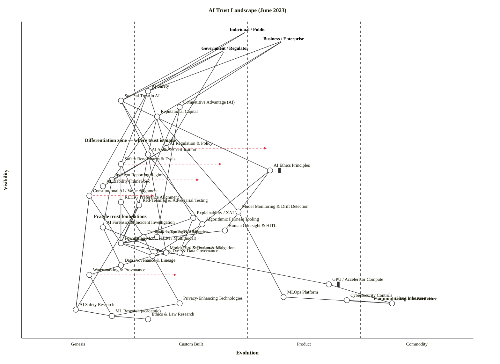

All clean. Here is the complete output.

---

## Framing — Strategic Context

**Assumptions block**

| Decision | This map's answer |
|---|---|
| **Strategic question** | Where is trust in AI systems currently manufactured vs. absent — and where should builders, policymakers, and deployers invest to make AI trustworthy at scale? |
| **User anchors** | Three: **Individual / Public** (end-users, citizens), **Business / Enterprise** (deployers, developers), **Government / Regulator** (oversight bodies, standard-setters). All three have fundamentally different trust demands — the public wants safety and intelligibility; business wants reputational capital and competitive advantage; government wants societal legitimacy and regulatory grip. A single-anchor map would miss the multi-stakeholder dynamics that define this landscape in June 2023. |
| **Core needs** | (1) That AI systems do not cause harm. (2) That decisions can be explained and challenged. (3) That liability can be attributed. (4) That competitive use of AI does not create unacceptable societal externalities. |
| **Scope boundary** | The global AI trust *landscape* as of June 2023 — pre-EU AI Act final vote, post-ChatGPT-3.5 consumer explosion, mid-GPT-4 enterprise rollout. Covers all layers: foundation model → technical controls → governance machinery → outcomes. |

---

## OWM Map

```owm
title AI Trust Landscape (June 2023)
style wardley

// ─── ANCHORS (three user types) ───────────────────────────────────────────────
anchor Individual / Public [0.97, 0.50]
anchor Business / Enterprise [0.94, 0.58]
anchor Government / Regulator [0.91, 0.45]

// ─── OUTCOME LAYER (d=1, ν ~0.55) ────────────────────────────────────────────
component AI Safety [0.78, 0.28]
component Societal Trust in AI [0.75, 0.22]
component Competitive Advantage (AI) [0.73, 0.35]
component Reputational Capital [0.70, 0.30]

// ─── GOVERNANCE LAYER (d=2, ν ~0.45–0.55) ────────────────────────────────────
component AI Regulation & Policy [0.60, 0.32]
component AI Audit & Certification [0.58, 0.28]
component Safety Benchmarks & Evals [0.55, 0.22]
component AI Ethics Principles [0.53, 0.55] inertia
component Incident Reporting Regime [0.50, 0.20]
component AI Liability Framework [0.48, 0.18]

// ─── CONTROL / ASSURANCE LAYER (d=2–3, ν ~0.38–0.48) ─────────────────────────
component Constitutional AI / Value Alignment [0.45, 0.15]
component RLHF / Preference Alignment [0.43, 0.22]
component Red-Teaming & Adversarial Testing [0.42, 0.26]
component Model Monitoring & Drift Detection [0.40, 0.48]
component Explainability / XAI [0.38, 0.38]
component Algorithmic Fairness Tooling [0.36, 0.40]
component AI Forensics & Incident Investigation [0.35, 0.18]
component Human Oversight & HITL [0.34, 0.45]
component Feedback Loops & RLHF Data [0.32, 0.27]

// ─── TECHNICAL LAYER (d=3–4, ν ~0.20–0.32) ───────────────────────────────────
component Foundation Model (LLM / Multimodal) [0.30, 0.22]
component Fine-Tuning & Adaptation [0.32, 0.30]
component Training Data & Data Governance [0.26, 0.29]
component Bias Detection & Mitigation [0.27, 0.35]
component Data Provenance & Lineage [0.23, 0.22]
component Model Card & Documentation [0.27, 0.32]
component Watermarking & Provenance [0.20, 0.15]

// ─── INFRASTRUCTURE LAYER (d=4–5, ν ~0.10–0.18) ─────────────────────────────
component GPU / Accelerator Compute [0.17, 0.68] inertia
component Cloud Infrastructure [0.11, 0.82]
component MLOps Platform [0.13, 0.58]
component Cybersecurity Controls [0.12, 0.72]
component Privacy-Enhancing Technologies [0.11, 0.35]

// ─── KNOWLEDGE LAYER (d=5, ν ~0.06–0.09) ─────────────────────────────────────
component AI Safety Research [0.09, 0.12]
component ML Research (academic) [0.07, 0.20]
component Ethics & Law Research [0.06, 0.28]

// ─── DEPENDENCIES ─────────────────────────────────────────────────────────────
Individual / Public->AI Safety
Individual / Public->Societal Trust in AI
Business / Enterprise->Competitive Advantage (AI)
Business / Enterprise->Reputational Capital
Business / Enterprise->AI Safety
Government / Regulator->AI Safety
Government / Regulator->Societal Trust in AI
Government / Regulator->AI Regulation & Policy

AI Safety->AI Regulation & Policy
AI Safety->Safety Benchmarks & Evals
AI Safety->Constitutional AI / Value Alignment
Societal Trust in AI->AI Audit & Certification
Societal Trust in AI->Explainability / XAI
Societal Trust in AI->AI Ethics Principles
Competitive Advantage (AI)->Foundation Model (LLM / Multimodal)
Competitive Advantage (AI)->Fine-Tuning & Adaptation
Reputational Capital->AI Audit & Certification
Reputational Capital->Model Monitoring & Drift Detection
Reputational Capital->Incident Reporting Regime

AI Regulation & Policy->AI Liability Framework
AI Regulation & Policy->Incident Reporting Regime
AI Audit & Certification->Red-Teaming & Adversarial Testing
AI Audit & Certification->Model Card & Documentation
AI Audit & Certification->Algorithmic Fairness Tooling
Safety Benchmarks & Evals->Red-Teaming & Adversarial Testing
Safety Benchmarks & Evals->Foundation Model (LLM / Multimodal)
AI Ethics Principles->Algorithmic Fairness Tooling
AI Ethics Principles->Human Oversight & HITL
Incident Reporting Regime->AI Forensics & Incident Investigation
AI Liability Framework->AI Forensics & Incident Investigation

Constitutional AI / Value Alignment->Foundation Model (LLM / Multimodal)
Constitutional AI / Value Alignment->AI Safety Research
RLHF / Preference Alignment->Feedback Loops & RLHF Data
RLHF / Preference Alignment->Foundation Model (LLM / Multimodal)
Red-Teaming & Adversarial Testing->Foundation Model (LLM / Multimodal)
Model Monitoring & Drift Detection->MLOps Platform
Explainability / XAI->Foundation Model (LLM / Multimodal)
Explainability / XAI->Bias Detection & Mitigation
Algorithmic Fairness Tooling->Bias Detection & Mitigation
Algorithmic Fairness Tooling->Training Data & Data Governance
AI Forensics & Incident Investigation->Model Card & Documentation
AI Forensics & Incident Investigation->Data Provenance & Lineage
Human Oversight & HITL->Foundation Model (LLM / Multimodal)
Feedback Loops & RLHF Data->Training Data & Data Governance

Foundation Model (LLM / Multimodal)->GPU / Accelerator Compute
Foundation Model (LLM / Multimodal)->Training Data & Data Governance
Fine-Tuning & Adaptation->Foundation Model (LLM / Multimodal)
Training Data & Data Governance->Data Provenance & Lineage
Training Data & Data Governance->Privacy-Enhancing Technologies
Bias Detection & Mitigation->Training Data & Data Governance
Data Provenance & Lineage->Watermarking & Provenance
Model Card & Documentation->Training Data & Data Governance
Watermarking & Provenance->ML Research (academic)
GPU / Accelerator Compute->Cloud Infrastructure
MLOps Platform->Cloud Infrastructure
Cybersecurity Controls->Cloud Infrastructure

AI Safety Research->ML Research (academic)
ML Research (academic)->Ethics & Law Research
Constitutional AI / Value Alignment->AI Safety Research
Red-Teaming & Adversarial Testing->AI Safety Research
Privacy-Enhancing Technologies->ML Research (academic)

// Evolve signals
evolve AI Regulation & Policy 0.55
evolve Safety Benchmarks & Evals 0.45
evolve Incident Reporting Regime 0.40
evolve Constitutional AI / Value Alignment 0.30
evolve Watermarking & Provenance 0.35

// Notes
note Differentiation zone — where trust is made [0.62, 0.14]
note Fragile trust foundations [0.38, 0.16]
note Commoditising infrastructure [0.12, 0.78]
```

**Validator:** ✅ OK — 37 components/anchors, 61 edges, no violations.
**Layout check:** ✅ OK — no warnings.

---

## Mermaid rendering (GitHub / preview)



---

## Component Evolution Rationale Table

| Component | Stage | ε | ν | Evidence |
|---|---|---|---|---|
| **AI Safety** | Custom Built | 0.28 | 0.78 | Understood as a goal but no settled definition; NIST AI RMF (Jan 2023) is non-binding; Anthropic/OpenAI safety orgs are nascent. |
| **Societal Trust in AI** | Custom Built | 0.22 | 0.75 | Gallup/Edelman surveys show falling public trust post-ChatGPT launch; no standard measure; varies sharply by use-case and demographic. |
| **Competitive Advantage (AI)** | Custom Built | 0.35 | 0.73 | Feature differentiation is fierce (GPT-4 vs PaLM2 vs Claude); advantage is real but transient; no settled market shape. |
| **Reputational Capital** | Custom Built | 0.30 | 0.70 | Samsung/Bing/Air Canada incidents show reputation is volatile; no standard framework for AI reputational risk management. |
| **AI Regulation & Policy** | Custom Built → Product | 0.32 | 0.60 | EU AI Act in trilogues (June 2023); US has no federal AI law; G7 called for "risk-based" frameworks in April 2023; multiple draft frameworks globally. |
| **AI Audit & Certification** | Genesis → Custom Built | 0.28 | 0.58 | No standard accredited AI audit body exists; Big 4 launching AI assurance practices; ISO/IEC 42001 under development. |
| **Safety Benchmarks & Evals** | Genesis | 0.22 | 0.55 | HELM, AdvBench in academic use only; no industry-wide mandatory benchmark; MLCommons safety WG just forming; no dominant standard. |
| **AI Ethics Principles** | Product (+rental) *(inertia)* | 0.55 | 0.53 | OECD AI Principles (2019), IEEE Ethically Aligned Design, dozens of corporate principles; widely adopted *in name* but implementation inconsistent — classic inertia pattern. |
| **Incident Reporting Regime** | Genesis | 0.20 | 0.50 | No mandatory AI incident reporting anywhere; AVID/AIA databases are voluntary; aviation-style reporting under discussion only. |
| **AI Liability Framework** | Genesis | 0.18 | 0.48 | EU AI Liability Directive in draft (June 2023); US relies on existing tort law; no AI-specific strict liability regime in force anywhere. |
| **Constitutional AI / Value Alignment** | Genesis | 0.15 | 0.45 | Anthropic's Constitutional AI paper (2022) is the primary reference; no other major lab has adopted the term; technique not standardised. |
| **RLHF / Preference Alignment** | Custom Built | 0.22 | 0.43 | InstructGPT (2022) proved the method; OpenAI, Anthropic, DeepMind all use RLHF; no off-the-shelf product; each implementation custom. |
| **Red-Teaming & Adversarial Testing** | Custom Built | 0.26 | 0.42 | White-box teams at OpenAI/Anthropic/Google; no accredited third-party market yet (mid-2023); Biden EO would mandate it in Oct 2023. |
| **Model Monitoring & Drift Detection** | Product (+rental) | 0.48 | 0.40 | Fiddler, Arize, WhyLabs, Arthur AI — product market is forming; multiple vendors competing on features; not yet commodity. |
| **Explainability / XAI** | Product (+rental) | 0.38 | 0.38 | Market valued ~$6.5B in 2023; SHAP/LIME are open-source standards; IBM Watson, Azure ML, SageMaker Clarify embed it — productised but still differentiating. |
| **Algorithmic Fairness Tooling** | Product (+rental) | 0.40 | 0.36 | IBM AI Fairness 360, Google What-If Tool, Microsoft Fairlearn — open-source, widely adopted; productised; not commodity (still requires expert tuning). |
| **AI Forensics & Incident Investigation** | Genesis | 0.18 | 0.35 | No specialist tooling market; academic work only (AVID, MITRE ATLAS); forensic methodology is undefined. |
| **Human Oversight & HITL** | Product (+rental) | 0.45 | 0.34 | Mechanical Turk, Scale AI, Labelbox as HITL platforms; well-understood practice; becoming an expected enterprise requirement. |
| **Feedback Loops & RLHF Data** | Custom Built | 0.27 | 0.32 | Data collection pipelines for preference ranking are bespoke per lab; Scale AI/Surge provide labellers but no turnkey RLHF pipeline product. |
| **Foundation Model (LLM / Multimodal)** | Custom Built | 0.22 | 0.30 | GPT-4, PaLM 2, Claude, Llama — several vendors; no dominant standard; each training run unique; clearly not genesis (multiple exist) nor product (no standardised API contract). |
| **Fine-Tuning & Adaptation** | Custom Built | 0.30 | 0.32 | LoRA, QLoRA, PEFT techniques published but not productised; Hugging Face PEFT library nascent; still specialist knowledge. |
| **Training Data & Data Governance** | Custom Built | 0.29 | 0.26 | Common Crawl, The Pile, RedPajama used but governance is ad hoc; legal challenges (NYT suit imminent) reveal lack of standards; clearly not commodity. |
| **Bias Detection & Mitigation** | Product (+rental) | 0.35 | 0.27 | SHAP-based bias detection embedded in cloud ML platforms; IBM AI Fairness 360 open-source; competitive vendor market forming. |
| **Data Provenance & Lineage** | Custom Built | 0.22 | 0.23 | Delta Lake, Pachyderm, custom metadata stores; no AI-specific provenance standard; data cards informal. |
| **Model Card & Documentation** | Product (+rental) | 0.32 | 0.27 | Google's Model Card format (2019) is de facto standard; Hugging Face model cards widely used; simple tooling exists. |
| **Watermarking & Provenance** | Genesis | 0.15 | 0.20 | C2PA watermarking spec just published; AI-generated content detection is unreliable; no enforcement; academic research stage. |
| **GPU / Accelerator Compute** | Product (+rental) *(inertia)* | 0.68 | 0.17 | NVIDIA H100 dominates; AMD MI300 emerging; cloud GPU rental from AWS/GCP/Azure — product market, transitioning toward commodity; NVIDIA supply constraint creates inertia. |
| **Cloud Infrastructure** | Commodity (+utility) | 0.82 | 0.11 | AWS, GCP, Azure — priced per-second; utility billing; ISO/SOC2 standardised; no differentiation. |
| **MLOps Platform** | Product (+rental) | 0.58 | 0.13 | MLflow, Kubeflow, Weights & Biases, Vertex AI, SageMaker — active vendor market; consolidating but not commodity. |
| **Cybersecurity Controls** | Product (+rental) | 0.72 | 0.12 | SOC 2, ISO 27001 well-established; AI-specific controls (prompt injection, model theft) still Custom Built; overall sits early Commodity. |
| **Privacy-Enhancing Technologies** | Custom Built | 0.35 | 0.11 | Differential privacy, federated learning — active research (Apple, Google, academic); no turnkey product for most AI use cases. |
| **AI Safety Research** | Genesis | 0.12 | 0.09 | MIRI, ARC, Anthropic, DeepMind alignment teams; pre-paradigmatic; rival frameworks (RLHF, constitutional AI, interpretability) compete for primacy. |
| **ML Research (academic)** | Custom Built | 0.20 | 0.07 | ArXiv-first publication, NeurIPS/ICML/ICLR as venues — well-established academic pipeline; not yet industrialised into standards. |
| **Ethics & Law Research** | Custom Built | 0.28 | 0.06 | Fairness/accountability/transparency (FAccT) conference since 2018; law review articles proliferating; no settled doctrine. |

---

## Strategic Analysis

### a. Differentiation opportunities (top 3)

1. **Constitutional AI / Value Alignment (Genesis, ε = 0.15)** — the highest differentiation pressure on the map (high visibility, far left). This is the most upstream trust-manufacturing mechanism. Whoever establishes the dominant alignment methodology shapes the trust architecture of every downstream component. In June 2023, Anthropic holds a temporary lead but no standard exists. **This is where the trust moat is built or lost.** D is at its theoretical maximum for a Genesis component that directly supports a Tier-1 outcome.

2. **Safety Benchmarks & Evals (Genesis, ε = 0.22)** — visible to all three user types (government needs it for regulation, business needs it for procurement, individuals need it for accountability), and yet deeply immature. The entity that defines the canonical safety evaluation suite controls the bar every AI system is judged against. In June 2023 HELM and AdvBench exist, but no authoritative standard exists. First-mover who converts this from academic to institution wins an asymmetric influence position.

3. **AI Forensics & Incident Investigation (Genesis, ε = 0.18)** — currently invisible infrastructure for a function every regulatory regime will eventually mandate. Aviation-style incident investigation for AI does not exist. The first credible forensic service provider — able to reconstruct "what did the model do and why" after a harm event — will find government and enterprise demand guaranteed by regulation as the EU AI Act and liability frameworks industrialise.

---

### b. Commodity-leverage candidates (top 3)

1. **Cloud Infrastructure (Commodity +utility, ε = 0.82)** — AWS/GCP/Azure. Utility pricing, per-second billing, ISO/SOC2 standardised. Do not build, do not operate. This is a pure rent-and-forget layer for every AI trust application.

2. **Cybersecurity Controls (early Commodity +utility, ε = 0.72)** — SOC 2 Type II, ISO 27001, pen-testing vendors all exist as commodity services. Procure off-the-shelf. The AI-specific layer (prompt injection, model-theft defences) is still Custom Built and worth building; the underlying infosec baseline is not.

3. **AI Ethics Principles (Product +rental, ε = 0.55, marked inertia)** — the irony of the map. Ethics principles are *over-commoditised* — a near-universal adoption of published frameworks (OECD, IEEE, EU, corporate) has turned them into a checkbox commodity rather than a differentiator. Stop investing engineering resource in writing new principles; they are table-stakes. The differentiating work is in the components that actually *implement* those principles (Constitutional AI, Red-Teaming, Explainability / XAI). The inertia flag reflects how corporate AI ethics programmes get stuck at the principles layer without executing on the implementation layer beneath.

---

### c. Dependency risks (top 3)

These are edges `(a, b)` where a highly-visible component depends on a Genesis or early-Custom component.

1. **AI Safety → Constitutional AI / Value Alignment (ν = 0.78 → ε = 0.15)** — The entire AI Safety outcome — visible to all three user anchors — depends on a Genesis-stage alignment technique that has no independent validation, no third-party audit market, and only one significant practitioner (Anthropic). If Constitutional AI fails to generalise (alignment collapse under fine-tuning, for instance), the component underpinning the primary user need collapses with it. This is the single highest R score on the map.

2. **Reputational Capital → Incident Reporting Regime (ν = 0.70 → ε = 0.20)** — Business reputation depends on a regime that doesn't exist. Without mandatory incident reporting, companies cannot demonstrate what they've learned from failures, and regulators cannot distinguish responsible from irresponsible deployers. Any significant AI harm event during 2023–2024 will expose this gap publicly.

3. **AI Audit & Certification → Red-Teaming & Adversarial Testing (ν = 0.58 → ε = 0.26)** — The audit machinery that governments and enterprise procurement want to rely on depends on a red-teaming practice that is still largely ad hoc, conducted in-house by labs with an obvious conflict of interest. "AI developers control both the design and disclosure of dangerous capability evaluations, creating inherent incentives to underreport alarming results"; "regulators, investors, and the public face a critical information asymmetry." Independent external red-teaming barely exists in June 2023.

---

### d. Build / Buy / Outsource recommendations

| Component | Stage | Recommendation | Why |
|---|---|---|---|
| Constitutional AI / Value Alignment | Genesis | **Build** (if you're a frontier lab) | Core IP; nobody else has a validated method; this is the source of trust moat. Non-frontier deployers: **wait and use** the first productised version. |
| Safety Benchmarks & Evals | Genesis | **Build + open-source-collaborate** | First mover shapes the standard. Open the benchmark to gain adoption (#15 Open Approaches). Don't make it proprietary — credibility requires independence. |
| RLHF / Preference Alignment | Custom Built | **Build** (if you train models); **Buy** (if you deploy them) | Training labs must own RLHF pipelines; deployers should acquire preference data from Scale AI/Surge rather than building in-house. |
| Red-Teaming & Adversarial Testing | Custom Built | **Buy external expertise now; build standard internally** | In-house red teams have a conflict of interest. Bring external specialists (government labs, academic groups). Budget for this to become mandatory by 2024. |
| Model Monitoring & Drift Detection | Product (+rental) | **Buy** (Fiddler / Arize / Arthur AI) | Competitive vendor market; off-the-shelf products cover 80% of use cases; in-house builds have no moat. |
| Explainability / XAI | Product (+rental) | **Buy** (SHAP, Azure ML Clarify, IBM AI Fairness 360) | Open-source library market is mature; the market was ~$6.5B in 2023; no need to build. |
| AI Audit & Certification | Genesis → Custom Built | **Co-create with regulators** | Neither build alone nor buy — the standard doesn't exist yet. Join BSI/NIST/ISO working groups. Shape ISO/IEC 42001. |
| AI Forensics & Incident Investigation | Genesis | **Build** (first-mover opportunity) | Massive guaranteed demand from incoming regulation; no competitive product exists; early entrant can own the space. |
| Foundation Model (LLM / Multimodal) | Custom Built | **Build** (frontier labs); **Rent** (everyone else) | Non-frontier organisations should consume GPT-4/Claude/PaLM via API; the training cost and expertise required make in-house foundation models strictly worse for 99% of deployers. |
| Watermarking & Provenance | Genesis | **Open-source-collaborate** | C2PA is the natural standards home; no competitive advantage in proprietary watermarking; ecosystem wins when everyone interoperates. |
| GPU / Accelerator Compute | Product (+rental) | **Rent** from cloud providers | NVIDIA supply constraint creates inertia (marked) but cloud rental abstracts it; spot instances or reserved capacity on AWS/GCP. Do not buy bare-metal H100s unless you're a frontier lab. |
| Cloud Infrastructure | Commodity (+utility) | **Rent** (AWS / GCP / Azure) | Pure commodity; utility billing; building is strictly worse. |

---

### e. Suggested gameplays

| # | Play | Target components | Mechanism |
|---|---|---|---|
| **#15 Open Approaches** | Safety Benchmarks & Evals | Release the benchmark openly to gain adoption and de facto standard status. Accelerates ε rightward and creates the credibility a proprietary benchmark can never have. |
| **#56 First Mover** | AI Forensics & Incident Investigation | Occupy the "aviation-style AI incident investigation" space before regulation mandates it. Regulatory demand will be forced by the first major AI harm event; whoever has a functioning methodology will be the default. |
| **#43 Sensing Engines (ILC)** | Constitutional AI / Value Alignment + Red-Teaming | Use your own deployment data as a feedback loop — observe which prompts defeat alignment, feed back into RLHF and constitutional revision. This is the ILC cycle applied to safety itself. |
| **#30 Standards game** | AI Audit & Certification | Join ISO/IEC JTC 1/SC 42 (AI standards committee) now. The entity that drafts ISO/IEC 42001 and 42005 effectively writes the audit checklist every enterprise will be measured against. |
| **#36 Directed investment** | AI Safety Research → Constitutional AI / Value Alignment | The path from foundational safety research to deployed alignment technique is still open. Concentrated research investment here creates durable differentiation that is hard to replicate. |
| **#50 Reinforcing inertia** | AI Ethics Principles *(used against competitors)* | Incumbents with large published ethics corpora can use the compliance cost of ethics-principle alignment as a barrier to new entrants who don't have the documentation. Not recommended as a primary play — but understand that competitors may deploy it. |
| **#29 Harvesting** | Red-Teaming & Adversarial Testing | Fund/seed independent red-team labs now; when regulation mandates third-party red-teaming, the funded labs become your preferred suppliers and you retain strategic influence over the emerging standards they produce. |
| **#40 Fool's mate** | Watermarking & Provenance | Lobby for mandatory provenance labelling in AI-generated content regulation (as C2PA proposes). If adopted, every competitor must implement a standard you helped design — and if you own the tooling, you win the compliance market. |

---

### f. Doctrine violations

| Doctrine principle | Violation observed | Fix |
|---|---|---|
| **#1 Focus on user needs** | Many corporate "AI trust" programmes are anchored on internal compliance deliverables (ethics policies, model cards) rather than on the actual user need (not being harmed by an AI decision). The map shows this as components like AI Ethics Principles floating high without tracing down to the safety research that would actually make them work. | Re-anchor design to the three user-need types, not to the governance layer. |
| **#7 Use appropriate methods** | Agile experimentation is being applied to Commodity (+utility) infrastructure (cloud, cybersecurity) while waterfall procurement thinking is being applied to Genesis-stage safety research — the inverse of correct. | Agile/FIRE for Constitutional AI and Safety Benchmarks; utility procurement for Cloud and Cybersecurity. |
| **#9 Think small (know details)** | "AI Ethics Principles" is too coarse a component in most corporate roadmaps — it hides the work of implementing fairness tooling, RLHF, and oversight separately. The map decomposes it but most organisations treat it as one deliverable. | Decompose into the sub-components shown. Each has a different sourcing decision. |
| **#13 Manage inertia** | Two components are flagged with inertia: **AI Ethics Principles** (over-adopted as text, under-implemented as mechanism — organisational culture inertia form #16) and **GPU / Accelerator Compute** (NVIDIA supply-chain lock-in — inertia forms #2 sunk capital, #14 strategic-control loss). Neither is being actively managed as inertia in most organisations. | Name the inertia form; build a specific counter-measure for each. |
| **#22 Use standards where appropriate** | Standards are being proposed or applied to Genesis-stage components (AI Liability, AI Forensics) where no patterns have yet stabilised. Premature standardisation will entrench wrong approaches. | Standards are appropriate only at ε ≥ 0.50. Push for voluntary best-practice frameworks at Genesis/Custom stages; reserve mandatory standards for Product stage and above. |
| **#31 Strategy is complex** | Single-point ε estimates mask significant uncertainty. Constitutional AI, Foundation Models, and AI Safety all have very wide variance across the 19-row cheat sheet (the components show strong Stage I–II disagreement). | Express placements as ranges; plan for multiple scenarios, not a single trajectory. |

---

### g. Climatic context

The following climatic patterns are actively shaping this map in June 2023:

| Pattern | How it's operating |
|---|---|
| **#3 Everything evolves** | Foundation models are moving visibly left-to-right during the map's lifetime: GPT-2 (Genesis, 2019) → GPT-4 (Custom Built, 2023). Every trust mechanism built for a prior generation may not work on the next. |
| **#5 No choice over evolution** | Regulators cannot opt out of AI regulation just because the technology moves faster than their institutions. The risks of commercial exploitation or unknown technological dangers have led many jurisdictions to seek a legal response before measurable harm occurs; however, "the lack of technical capabilities to regulate this sector despite the urgency to do so resulted in regulatory inertia." The climatic pattern is forcing evolution of governance even where governments are reluctant. |
| **#7 Characteristics change as components evolve** | As Foundation Models move from Genesis to Custom Built, the management style required shifts: you can no longer "explore" safety — you must systematise it. The entire control/assurance layer only works if it co-evolves with the model layer (climatic pattern #9). |
| **#10 Higher-order systems create new sources of worth** | Cloud commoditisation (2010s) enabled the foundation model era (2020s). The AI trust layer is the *next* higher-order system this enables — whoever builds the trusted AI infrastructure layer enables the next generation of applications to be built on top of it. |
| **#15–17 Past success breeds inertia / can be fatal** | The AI Ethics Principles inertia flag is exactly this: organisations successful at producing ethics documents are *most resistant* to the harder implementation work beneath them. The gap between the principles layer and the technical layer is the canonical form of inertia-from-past-success. |
| **#22 Two forms of disruption** | Both are present simultaneously: (a) *Genesis disruption* — Constitutional AI and safety-alignment techniques are new uncharted approaches that could make current guardrails obsolete. (b) *Product-to-utility disruption* — Cloud, MLOps, and Explainability / XAI are in active Product → Commodity transitions that will commoditise the operational layer underneath every AI system. |
| **#27 Product-to-utility punctuated equilibrium** | The `evolve` arrows on AI Regulation & Policy (toward 0.55) and Safety Benchmarks & Evals (toward 0.45) signal pending punctuated jumps. The UK organised the first global AI Safety Summit in November 2023, and the EU AI Act trilogues were nearing conclusion — when these tip, regulatory compliance will jump from Genesis to a mandatory Product-stage requirement very rapidly. Organisations that wait for the standard to ship before building the capability will face a compressed transition window with no time to adapt.

---

### h. Deep-placement notes

Four components were researched beyond the cheat-sheet pass:

1. **AI Regulation & Policy — initial cheat sheet: ε ≈ 0.30 (Custom Built). Deep placement confirmed.** Regulators increasingly focused on AI ethics in 2023; the EU's regulation was "the world's first comprehensive AI law." Dozens of bills considered during 2023 state legislative sessions; every jurisdiction pursuing a "risk-based approach." Market is forming but not growing — confirmed Custom Built at 0.32, with evolve arrow to 0.55 (Product) when the EU AI Act finalises.

2. **Explainability / XAI — initial cheat sheet: ε ≈ 0.42 (Product). Deep placement shifted slightly downward to 0.38.** The XAI market was $6.2B in 2023 with 20.9% CAGR, driven by regulatory demand. Multiple vendors (Microsoft, IBM, AWS, Google) compete on features; SHAP/LIME are open-source standards. However, for *LLM-era* explainability (as opposed to classical ML), the field is far less mature — the product market applies to structured ML, not to generative models. Shifted to early Product at 0.38 to reflect this bifurcation.

3. **Safety Benchmarks & Evals — initial cheat sheet: ε ≈ 0.18 (Genesis). Confirmed Genesis.** In June 2023, HELM (Stanford), AdvBench, and BIG-Bench are academic projects. Prior work in automated red teaming uses "disparate evaluation pipelines, rendering comparison difficult"; "there is an urgent need for a high-quality standardized benchmark." MLCommons safety WG not yet formed. Placement at 0.22 (upper Genesis) is justified — some work exists but no convergence on standards.

4. **Red-Teaming & Adversarial Testing — initial cheat sheet: ε ≈ 0.28 (Custom Built). Confirmed Custom Built, placed at 0.26.** Primarily conducted by in-house teams at OpenAI, Anthropic, Google DeepMind. Regulators and the public face "a critical information asymmetry"; "independent external scrutiny can address this trust deficit." A third-party market is nascent in June 2023. The Biden EO (October 2023) would formally mandate this, signalling the imminent Custom → Product transition.

---

### i. Caveat

Evolution trajectories (all `evolve` arrows and the analysis above) are **scenarios, not forecasts**. Wardley's climatic pattern #18: *you cannot measure evolution over time or adoption.* The `evolve` arrows on Regulation, Benchmarks, Incident Reporting, and Watermarking represent high-probability scenario directions given the regulatory signals in motion in June 2023 — not timed predictions. The map is a thinking tool, not a roadmap. Revalidate quarterly against the actual signal set (publication type shifts, regulatory announcements, vendor consolidation, open-source activity).