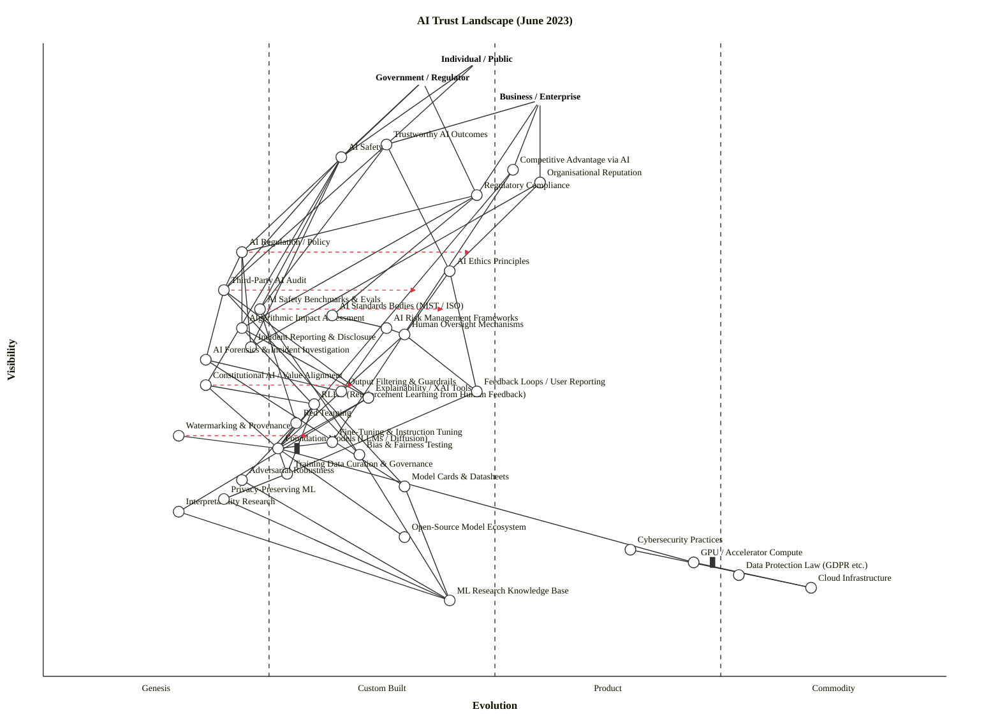

Both checks pass cleanly (OK: 39 components/anchors, 65 edges — no violations; LAYOUT OK). Here is the complete output.

---

## Assumptions (flag for correction)

| # | Assumption | Basis |
|---|---|---|
| 1 | **Strategic question:** *"What must be true — technically, institutionally, and politically — for AI systems to be trusted by individuals, governments, and enterprises in June 2023, and where is that trust most fragile?"* | Drawn from scenario description |
| 2 | **Three anchors:** Individual/Public, Government/Regulator, Business/Enterprise — each with materially different trust needs | June 2023 public debate structure |
| 3 | **Scope:** The global AI trust landscape as a whole, not one company's product | Multi-stakeholder framing |
| 4 | **Time-snapshot:** June 2023 — EU AI Act has Parliament's negotiating position but is not yet law; NIST AI RMF just published; GPT-4 and Claude 2 recently released; Constitutional AI (Anthropic) published April 2023 | Confirmed by research |

---

## OWM Map

```
title AI Trust Landscape (June 2023)
style wardley

// === ANCHORS — three user types ===
anchor Individual / Public [0.97, 0.48]
anchor Government / Regulator [0.94, 0.42]
anchor Business / Enterprise [0.91, 0.55]

// === OUTCOME LAYER — what the anchors actually need ===
component Trustworthy AI Outcomes [0.84, 0.38]
component AI Safety [0.82, 0.33]
component Competitive Advantage via AI [0.80, 0.52]
component Organisational Reputation [0.78, 0.55]
component Regulatory Compliance [0.76, 0.48]

// === GOVERNANCE LAYER ===
component AI Regulation / Policy [0.67, 0.22]
component AI Ethics Principles [0.64, 0.45]
component Third-Party AI Audit [0.61, 0.20]
component AI Safety Benchmarks & Evals [0.58, 0.24]
component Algorithmic Impact Assessment [0.55, 0.22]
component Incident Reporting & Disclosure [0.52, 0.23]
component AI Standards Bodies (NIST / ISO) [0.57, 0.32]
component AI Risk Management Frameworks [0.55, 0.38]
component Human Oversight Mechanisms [0.54, 0.40]

// === CONTROL & ASSURANCE LAYER ===
component Constitutional AI / Value Alignment [0.46, 0.18]
component RLHF (Reinforcement Learning from Human Feedback) [0.43, 0.30]
component Red Teaming [0.40, 0.28]
component Explainability / XAI Tools [0.44, 0.36]
component AI Forensics & Incident Investigation [0.50, 0.18]
component Output Filtering & Guardrails [0.45, 0.33]
component Feedback Loops / User Reporting [0.45, 0.48]
component Watermarking & Provenance [0.38, 0.15]

// === TECHNICAL LAYER — model + data + compute ===
component Foundation Models (LLMs / Diffusion) [0.36, 0.26] inertia
component Fine-Tuning & Instruction Tuning [0.37, 0.32]
component Training Data Curation & Governance [0.32, 0.27]
component Bias & Fairness Testing [0.35, 0.35]
component Model Cards & Datasheets [0.30, 0.40]
component Interpretability Research [0.26, 0.15]
component Adversarial Robustness [0.31, 0.22]
component Privacy-Preserving ML [0.28, 0.20]

// === INFRASTRUCTURE / KNOWLEDGE BASE ===
component GPU / Accelerator Compute [0.18, 0.72] inertia
component Cloud Infrastructure [0.14, 0.85]
component Open-Source Model Ecosystem [0.22, 0.40]
component Cybersecurity Practices [0.20, 0.65]
component Data Protection Law (GDPR etc.) [0.16, 0.77]
component ML Research Knowledge Base [0.12, 0.45]

// DEPENDENCIES
Individual / Public->Trustworthy AI Outcomes
Individual / Public->AI Safety
Government / Regulator->AI Safety
Government / Regulator->AI Regulation / Policy
Government / Regulator->Regulatory Compliance
Business / Enterprise->Competitive Advantage via AI
Business / Enterprise->Organisational Reputation
Business / Enterprise->Regulatory Compliance
Business / Enterprise->Trustworthy AI Outcomes

Trustworthy AI Outcomes->AI Ethics Principles
Trustworthy AI Outcomes->Third-Party AI Audit
Trustworthy AI Outcomes->AI Safety Benchmarks & Evals
AI Safety->Constitutional AI / Value Alignment
AI Safety->AI Safety Benchmarks & Evals
AI Safety->Third-Party AI Audit
AI Safety->Incident Reporting & Disclosure
Competitive Advantage via AI->Foundation Models (LLMs / Diffusion)
Competitive Advantage via AI->Fine-Tuning & Instruction Tuning
Organisational Reputation->AI Ethics Principles
Organisational Reputation->Incident Reporting & Disclosure
Regulatory Compliance->AI Regulation / Policy
Regulatory Compliance->Algorithmic Impact Assessment
Regulatory Compliance->AI Standards Bodies (NIST / ISO)

AI Regulation / Policy->Algorithmic Impact Assessment
AI Regulation / Policy->Third-Party AI Audit
AI Regulation / Policy->Incident Reporting & Disclosure
AI Ethics Principles->Human Oversight Mechanisms
AI Ethics Principles->Feedback Loops / User Reporting
AI Safety Benchmarks & Evals->Red Teaming
AI Safety Benchmarks & Evals->Bias & Fairness Testing
Third-Party AI Audit->Explainability / XAI Tools
Third-Party AI Audit->AI Forensics & Incident Investigation
Third-Party AI Audit->Model Cards & Datasheets
Algorithmic Impact Assessment->Bias & Fairness Testing
Algorithmic Impact Assessment->Explainability / XAI Tools
AI Standards Bodies (NIST / ISO)->AI Risk Management Frameworks
AI Risk Management Frameworks->Human Oversight Mechanisms
AI Risk Management Frameworks->Output Filtering & Guardrails

Constitutional AI / Value Alignment->RLHF (Reinforcement Learning from Human Feedback)
Constitutional AI / Value Alignment->Foundation Models (LLMs / Diffusion)
RLHF (Reinforcement Learning from Human Feedback)->Foundation Models (LLMs / Diffusion)
RLHF (Reinforcement Learning from Human Feedback)->Training Data Curation & Governance
Red Teaming->Foundation Models (LLMs / Diffusion)
Red Teaming->Adversarial Robustness
Explainability / XAI Tools->Foundation Models (LLMs / Diffusion)
Explainability / XAI Tools->Interpretability Research
AI Forensics & Incident Investigation->Model Cards & Datasheets
AI Forensics & Incident Investigation->Output Filtering & Guardrails
Human Oversight Mechanisms->Output Filtering & Guardrails
Human Oversight Mechanisms->Feedback Loops / User Reporting
Output Filtering & Guardrails->Foundation Models (LLMs / Diffusion)
Watermarking & Provenance->Foundation Models (LLMs / Diffusion)
Feedback Loops / User Reporting->Training Data Curation & Governance

Foundation Models (LLMs / Diffusion)->Training Data Curation & Governance
Foundation Models (LLMs / Diffusion)->GPU / Accelerator Compute
Foundation Models (LLMs / Diffusion)->Open-Source Model Ecosystem
Fine-Tuning & Instruction Tuning->Foundation Models (LLMs / Diffusion)
Training Data Curation & Governance->Privacy-Preserving ML
Bias & Fairness Testing->ML Research Knowledge Base
Model Cards & Datasheets->ML Research Knowledge Base
Interpretability Research->ML Research Knowledge Base
Adversarial Robustness->ML Research Knowledge Base
Privacy-Preserving ML->ML Research Knowledge Base
GPU / Accelerator Compute->Cloud Infrastructure
Cybersecurity Practices->Cloud Infrastructure

evolve AI Regulation / Policy 0.48
evolve Third-Party AI Audit 0.42
evolve Constitutional AI / Value Alignment 0.35
evolve AI Safety Benchmarks & Evals 0.45
evolve Watermarking & Provenance 0.30

note Differentiation Zone: Genesis to Custom Built [0.52, 0.10]
note Fragile Trust Junctions [0.62, 0.16]
note Commoditising Fast - Rent [0.12, 0.80]
```

> **Validator:** OK — 39 components/anchors, 65 edges — no violations. Layout: clean.

---

## Mermaid (GitHub rendering)



---

## Component Evolution Rationale Table

| Component | Stage | ε | ν | Evidence (June 2023) |
|---|---|---|---|---|
| Trustworthy AI Outcomes | Custom Built | 0.38 | 0.84 | Concept widely cited but no agreed definition, no standard measurement; NIST AI RMF (Jan 2023) just introduced a framework, not settled practice. |
| AI Safety | Custom Built | 0.33 | 0.82 | Frontier labs (Anthropic, OpenAI, DeepMind) all running safety teams with divergent approaches; no universal safety standard; still research-stage. |
| Competitive Advantage via AI | Product (+rental) | 0.52 | 0.80 | GPT-4 API, Bard, Claude all commercially available mid-2023; enterprise AI differentiation rapidly feature-competitive. |
| Organisational Reputation | Product (+rental) | 0.55 | 0.78 | Reputation management via ESG/responsible-AI frameworks spreading; PR playbook for AI incidents forming but not standardised. |
| Regulatory Compliance | Custom Built → Product | 0.48 | 0.76 | EU AI Act in Parliament negotiation position (June 14, 2023); NIST AI RMF voluntary. No binding global standard yet. |
| AI Regulation / Policy | Genesis → Custom Built | 0.22 | 0.67 | EU AI Act not yet law; US Executive Order not yet issued; UK white paper published but non-binding. Regulatory landscape fragmented and forming. |
| AI Ethics Principles | Product (+rental) | 0.45 | 0.64 | Dozens of published ethics frameworks (UNESCO, OECD, IEEE); pattern convergence on fairness/transparency/accountability but no enforcement. |
| Third-Party AI Audit | Genesis | 0.20 | 0.61 | Market nascent; no agreed audit standard; Stanford HAI, ARC, METR just forming; no accredited auditor market yet. NYC bias audit law isolated example. |
| AI Safety Benchmarks & Evals | Genesis → Custom Built | 0.24 | 0.58 | BIG-Bench, TruthfulQA, HELM published; but no consensus on what to measure; many proprietary eval suites; field actively debated. |
| Algorithmic Impact Assessment | Genesis → Custom Built | 0.22 | 0.55 | Canada, EU pushing AIA requirements but methodology unstandardised; academic frameworks (Reisman et al.) not yet operational. |
| Incident Reporting & Disclosure | Genesis | 0.23 | 0.52 | AIAAIC database is volunteer-run; no mandatory reporting regime in any major jurisdiction as of June 2023; analogous to early cybersecurity incident reporting c.2005. |
| AI Standards Bodies (NIST / ISO) | Custom Built | 0.32 | 0.57 | NIST AI RMF published Jan 2023; ISO/IEC 42001 in development; CEN/CENELEC mandated in May 2023. Standards forming, not yet established. |
| AI Risk Management Frameworks | Custom Built | 0.38 | 0.55 | NIST AI RMF 1.0 released; company-internal RAI frameworks (Google, Microsoft) exist but diverge; no single dominant framework. |
| Human Oversight Mechanisms | Custom Built | 0.40 | 0.54 | HITL (human-in-the-loop) practices varied; EU AI Act proposes HITL for high-risk systems; no standardised implementation. |
| Constitutional AI / Value Alignment | Genesis | 0.18 | 0.46 | Anthropic's Constitutional AI paper published April 2023; Anthropic is effectively the only organisation deploying this approach at scale. Deep Genesis. |
| RLHF | Custom Built | 0.30 | 0.43 | Used by OpenAI (InstructGPT, ChatGPT), Anthropic, DeepMind; patterns emerging but implementation varies widely; no commodity RLHF service yet. |
| Red Teaming | Custom Built | 0.28 | 0.40 | Growing practice (OpenAI, Anthropic, Google all run red teams); DEF CON AI Village (August 2023) first public event; no standard methodology or certification. |
| Explainability / XAI Tools | Custom Built → Product | 0.36 | 0.44 | SHAP, LIME, Captum available as open-source tools; DARPA XAI programme; market forming but not dominant vendor or standard. |
| AI Forensics & Incident Investigation | Genesis | 0.18 | 0.50 | No established AI forensics profession; techniques borrowed from cyber forensics; largely ad hoc. |
| Output Filtering & Guardrails | Custom Built | 0.33 | 0.45 | Moderation APIs (OpenAI Moderation, Perspective API); custom filters at major labs; Llama Guard not yet released; no standard interface. |
| Feedback Loops / User Reporting | Product (+rental) | 0.48 | 0.45 | Thumbs up/down UX ubiquitous in consumer AI; RLHF data collection operationalised; but feedback-to-retraining pipelines still proprietary. |
| Watermarking & Provenance | Genesis | 0.15 | 0.38 | C2PA specification draft; Google DeepMind SynthID not yet public; academic research stage; no deployed standard. |
| Foundation Models (LLMs / Diffusion) | Custom Built | 0.26 | 0.36 | GPT-4, Claude, PaLM 2, Llama all launched early 2023; multiple competing approaches; no dominant architecture standard; inertia from training investment. |
| Fine-Tuning & Instruction Tuning | Custom Built | 0.32 | 0.37 | Instruction tuning patterns (FLAN, Alpaca, Vicuna) widely published; LoRA/PEFT tools available; still requires significant expertise. |
| Training Data Curation & Governance | Custom Built | 0.27 | 0.32 | LAION, Common Crawl, proprietary corpora; multiple lawsuits filed (Getty, authors); no standard data governance framework for AI training. |
| Bias & Fairness Testing | Custom Built | 0.35 | 0.35 | Aequitas, Fairlearn, IBM AI Fairness 360 exist; academic methods abundant; no regulatory mandate on methodology as of mid-2023. |
| Model Cards & Datasheets | Custom Built → Product | 0.40 | 0.30 | Google model card format published 2019; Hugging Face adopted; growing norm but not mandatory or standardised globally. |
| Interpretability Research | Genesis | 0.15 | 0.26 | Anthropic's mechanistic interpretability, Anthropic's superposition work; nascent field; no operational tools for practitioners. |
| Adversarial Robustness | Custom Built | 0.22 | 0.31 | Academic literature rich (adversarial examples since 2014); CleverHans, ART toolkits; but no standard robustness test for LLMs. |
| Privacy-Preserving ML | Custom Built | 0.20 | 0.28 | Federated learning (Google), differential privacy (Apple, Google); tools exist but complex; not standard practice. |
| GPU / Accelerator Compute | Product (+rental) → Commodity | 0.72 | 0.18 | NVIDIA H100 dominant; AWS/Azure/GCP GPU instances; market growing but concentrated (NVIDIA ~80% GPU market); inertia from supply constraints. |
| Cloud Infrastructure | Commodity (+utility) | 0.85 | 0.14 | AWS, Azure, GCP — fully commoditised; utility pricing; standard for all AI workloads. |
| Open-Source Model Ecosystem | Custom Built | 0.40 | 0.22 | LLaMA/Alpaca released spring 2023; Hugging Face Hub; Mistral not yet; ecosystem forming rapidly but unstable. |
| Cybersecurity Practices | Product (+rental) | 0.65 | 0.20 | SOC 2, ISO 27001 well established; SIEM/EDR market mature; AI-specific security norms nascent but baseline cyber practice commoditised. |
| Data Protection Law (GDPR etc.) | Commodity (+utility) | 0.77 | 0.16 | GDPR enforced since 2018; CCPA; global adoption spreading; legal compliance infrastructure commoditised. |
| ML Research Knowledge Base | Product (+rental) | 0.45 | 0.12 | arXiv, NeurIPS, ICML, ICLR — established channels; training resources, courses widely available; becoming infrastructure. |

---

## Strategic Analysis

### Step 0 context recap

**Strategic question:** What determines whether AI can be trusted — and what is differentiating versus commoditising in that trust stack — as of June 2023?
**Anchors:** Individual/Public, Government/Regulator, Business/Enterprise.
**Core needs:** Safety from harm; regulatory certainty; competitive access; accountability when things go wrong.
**Scope:** Global AI trust landscape — technical, governance, control, and outcome layers.

---

### a. Differentiation Opportunities (Top 3)

**1. Constitutional AI / Value Alignment (Genesis, ε ≈ 0.18, D ≈ 0.38)**
The highest-ranked differentiation opportunity on the map. Anthropic has almost exclusive operational deployment of Constitutional AI as of June 2023. This is a Genesis-stage component that sits directly in the value chain of AI Safety — the anchor need most visible to *all three user types*. An organisation that cracks verifiable, scalable value alignment before rivals will define the standard. No competitive product exists; the IP and talent moat is real.

**2. Third-Party AI Audit (Genesis, ε ≈ 0.20, D ≈ 0.49)**
Visible directly to the Government/Regulator anchor and demanded by Trustworthy AI Outcomes. With no accredited audit market yet, the first organisation(s) to establish credible, independent AI audit methodology — and the institutional credibility to back it — will own the trust infrastructure that regulation eventually mandates. Standards for how companies should work with third-party AI assessment organisations are nascent, and developers can substantially influence the timing, scope, and publication of any assessments conducted that involve non-public information. That gap is the opportunity.

**3. AI Safety Benchmarks & Evals (Genesis → Custom Built, ε ≈ 0.24, D ≈ 0.44)**
Every trust claim in the map — from regulatory compliance to competitive advantage — requires evaluations that can be trusted. BIG-Bench and HELM exist but are contested. The organisation or consortium that sets the *de facto* eval suite for safety properties (not just capability) will gate which models pass the trust bar. This is a standards-game opportunity (#30) with strong network effects.

---

### b. Commodity-Leverage Candidates (Top 3) — "Rent, Don't Build"

**1. Cloud Infrastructure (Commodity (+utility), ε ≈ 0.85)**
AWS, GCP, Azure. Fully commoditised. There is no scenario in which a trust-focused AI organisation gains advantage by owning its own data centre. Rent as utility.

**2. Data Protection Law / Compliance Infrastructure (Commodity (+utility), ε ≈ 0.77)**
GDPR compliance tooling, DPA legal frameworks — these are a *constraint* on Training Data Curation, not a differentiator. Buy legal counsel and compliance SaaS; do not reinvent.

**3. Cybersecurity Practices (Product (+rental), ε ≈ 0.65)**
SOC 2 Type II, ISO 27001, endpoint security — these are table-stakes. The market is mature and the tooling is available from specialists. AI-specific security adaptations are differentiating; baseline cybersecurity is not.

---

### c. Dependency Risks (Top 3) — Where Trust is Fragile

**1. AI Safety → Constitutional AI / Value Alignment (fragile Genesis foundation)**
AI Safety (ν = 0.82, visible to all three anchors) depends directly on Constitutional AI / Value Alignment (ε = 0.18, Genesis). The entire "safe AI" value proposition rests on alignment techniques that are: in active research, not independently verified, and largely proprietary to one or two labs. Dependency risk R = ν(AI Safety) × (1 − ε(Constitutional AI)) ≈ 0.82 × 0.82 ≈ 0.67 — the highest R on the map. *If alignment techniques fail silently, or if they are circumvented by adversarial prompting, the safety claim collapses with almost no external signal.* RLHF and alignment techniques "make jailbreaking more difficult but not impossible."

**2. Trustworthy AI Outcomes → Third-Party AI Audit (no independent verification infrastructure)**
Every trust claim — by individuals, governments, enterprises — ultimately requires independent verification. But Third-Party AI Audit sits at Genesis (ε = 0.20) with no standard methodology, no accreditation body, and no legal standing. There is no clear sense of expectations as to what a quality audit entails or who is qualified to execute audit work. This means that all "our AI is trustworthy" claims in mid-2023 are essentially self-certified. The whole governance layer is hollow without this.

**3. Regulatory Compliance → AI Regulation / Policy (regulation not yet law)**
Regulatory Compliance (ν = 0.76) depends on AI Regulation / Policy (ε = 0.22, Genesis). On June 14, 2023, the European Parliament approved its negotiating position on the AI Act with 499 votes in favour, 28 against, and 93 abstentions — but the Act was not yet law. Organisations building compliance programmes in June 2023 are building against a moving target. The risk: invest heavily in GDPR-style compliance infrastructure, then find the final regulation requires something different.

---

### d. Build / Buy / Outsource Recommendations

| Component | Stage | Recommendation | Why |
|---|---|---|---|
| Constitutional AI / Value Alignment | Genesis | **Build** (lab-specific) | No external market; pure differentiation zone; defines your safety claim. |
| Third-Party AI Audit | Genesis | **Open-source collaborate** + **Build the standard** | Standards-game opportunity (#30); first mover who shapes the methodology wins the market. |
| AI Safety Benchmarks & Evals | Genesis → Custom Built | **Build + open collaborate** | Eval legitimacy requires community buy-in; proprietary evals are not trusted. |
| Red Teaming | Custom Built | **Build internal + hire external** | Internal red teams miss systematic blind spots; bring in adversarial specialists, but don't fully outsource. |
| RLHF | Custom Built | **Build** (if frontier); **Buy/API** (if deployer) | Frontier labs must own this; enterprise deployers can consume via API (OpenAI, Anthropic). |
| Explainability / XAI Tools | Custom Built → Product | **Buy** (SHAP, LIME, Captum) | Open-source tools cover 80% of enterprise needs; differentiation is in *how* you apply them, not building them. |
| Output Filtering & Guardrails | Custom Built | **Buy for baseline; build for domain** | Moderation APIs cover generic harm; domain-specific filters (legal, medical, financial) must be built. |
| Foundation Models | Custom Built | **Build** (if frontier lab); **Rent API** (if enterprise) | Building a foundation model is a multi-hundred-million-dollar bet. Most enterprises should fine-tune, not pre-train. |
| GPU / Accelerator Compute | Product (+rental) → Commodity | **Rent** (cloud GPU instances) | NVIDIA supply constraints make ownership inertia-heavy; reserved instances on AWS/Azure are strictly better. |
| Cloud Infrastructure | Commodity (+utility) | **Rent** (AWS/GCP/Azure) | Utility; ownership is waste. |
| Model Cards & Datasheets | Custom Built → Product | **Adopt standard** (Hugging Face format) | Network effects favour the dominant format; don't invent your own. |
| Data Protection / GDPR compliance | Commodity (+utility) | **Buy legal counsel + compliance SaaS** | Table stakes; no moat possible. |

---

### e. Suggested Gameplays

**#55 Land Grab + #30 Standards Game — on AI Safety Benchmarks & Evals**
The organisation that defines the canonical eval suite for safety (not just capability) will gate trust claims industry-wide. June 2023 is the window before regulators pick a standard. Move fast to establish legitimacy (academic publication, open-source release, coalition building with NIST/ISO). Anthropic, Scale AI, and ARC Evals are already playing this game.

**#15 Open Approaches — on AI Safety Benchmarks & Evals and Watermarking & Provenance**
Open-sourcing eval suites and watermarking standards commoditises the *tools* while the business model moves up to *audit services* and *provenance verification infrastructure*. This is how trust infrastructure gets industrialised — the same pattern as open-source security scanning (then charge for the SOC).

**#43 Sensing Engines (ILC) — on Third-Party AI Audit ecosystem**
Watch which early audit organisations (ARC Evals, METR, Alignment Research Center, Stanford HAI) produce credible methodologies. The regulator-backed winner (EU AI Act will eventually mandate audit frameworks) will be acquisitionable or partnerable. Run the ILC cycle: innovate in audit methodology, leverage ecosystem development, commoditise the standard.

**#44 Tower and Moat — on Constitutional AI / Value Alignment**
Anthropic's position: publish enough theory to lead the discourse (tower), but keep the deployment implementation and RLHF preference data proprietary (moat). This creates a credibility advantage that attracts enterprise trust while the technical moat prevents replication.

**#56 First Mover — on Watermarking & Provenance**
C2PA, SynthID, and digital provenance for AI-generated content are Genesis. The election cycles of 2024 (US, EU, India) will create massive demand for deepfake provenance infrastructure. A credible provenance standard, deployed before the demand spike, becomes the trusted infrastructure layer.

**#36 Directed Investment — on Interpretability Research**
Mechanistic interpretability (Anthropic's superposition/features work) is the only path to verifiable alignment claims. It is currently deep Genesis but on the critical path of every governance regime. Concentrated investment here has asymmetric upside.

---

### f. Doctrine Violations

| Observed pattern | Doctrine violated | Diagnosis |
|---|---|---|
| Single labs self-certifying their own safety | #1 Focus on user needs, #4 Be transparent | The user (public, regulator) needs external verification; self-certification violates the spirit of both. |
| "Ethics principles" published without operational mechanisms | #9 Think small (know the details) | Coarse "ethics" components hide the real implementation gap. Explainability tools, audit processes, and incident disclosure are the details that matter. |
| Alignment techniques applied uniformly across model sizes | #7 Use appropriate methods | Agile/research-style RLHF for a 7B parameter model is not the same as for a 540B model; methods must scale with the component's characteristics. |
| No mandatory incident reporting regime | #14 Manage failure | Without structured incident reporting, there is no systematic learning mechanism. The sector is doctrine-violating on failure management. |
| Industry setting its own eval standards | #5 Challenge assumptions | Incumbents designing the benchmarks they will be evaluated against is a structural conflict of interest; assumption that "leading labs know best" goes unchallenged. |
| Missing anchor: Civil Society / Affected Communities | #10 Know your users | Three anchors are chosen, but communities directly harmed by AI systems (bias in hiring, criminal justice, healthcare) are a fourth user type largely absent from the governance discourse in June 2023. |

---

### g. Climatic Context

**#3 Everything evolves — the entire trust stack is moving.**
Every Genesis component on this map (Constitutional AI, Third-Party Audit, Watermarking, AI Regulation, Incident Reporting) will drift rightward. The question is only pace. Trust infrastructure that exists as "proprietary advantage" in June 2023 will be commodity compliance requirement by 2027.

**#22 Two forms of disruption are both active simultaneously.**
- *Genesis-driven* (Constitutional AI, interpretability, watermarking): genuinely new — nobody knows the right answer, and the organisations that find it first will lead.
- *Product-to-utility* (RLHF, cloud compute, model APIs): industrialising fast — the window for product differentiation on LLM APIs is closing rapidly.

**#27 Punctuated equilibrium — AI Regulation / Policy approaching a transition point.**
On June 14, 2023, the EU Parliament adopted its negotiating position on the AI Act. When the Act becomes law (provisionally agreed December 2023, formal adoption expected mid-2024), AI Regulation will jump from Genesis/Custom Built to an enforced Product (+rental) standard almost overnight. The window to shape that transition is now, in June 2023.

**#15 Past success breeds inertia — Foundation Models and GPU Compute.**
Foundation model training pipelines involve hundreds of millions of dollars of sunk compute cost (inertia form #2) and billions of tokens of proprietary preference data (form #15). This creates structural resistance to switching alignment approaches, even when evidence suggests the current approach has gaps. The `inertia` markers on Foundation Models and GPU Compute flag this explicitly.

**#10 Higher-order systems create new sources of worth.**
Cheap foundation model APIs (the commodity tier commoditising now) enable a new layer of trust infrastructure businesses: audit firms, eval providers, provenance networks, interpretability consultancies. The commoditisation of the model itself is what enables the trust-services market above it.

**#18 You cannot measure evolution over time or adoption.**
The `evolve` arrows on this map are directional scenarios, not forecasts. AI Regulation moving to ε = 0.48 does not mean "by 2025"; it means "when the market reaches that position". Regulatory punctuated equilibria make the timing particularly non-linear.

---

### h. Deep Placement Notes

Four components received targeted research before final placement:

1. **AI Regulation / Policy — initial cheat-sheet: Genesis (0.18). Post-research: Genesis (0.22).**
Research confirmed that as of June 14, 2023, the EU AI Act was in Parliament negotiating position but not law. NIST AI RMF was voluntary. No binding global standard existed. Slight upward nudge from 0.18 to 0.22 to reflect the volume of policy activity (US, EU, UK, G7 all active), while staying firmly Genesis — activity is not the same as settled law.

2. **Third-Party AI Audit — initial cheat-sheet: Genesis (0.15). Post-research: Genesis (0.20).**
Research found the market was forming but had "no clear sense of expectations as to what a quality audit entails." Nudged slightly right to 0.20 to reflect early-mover organisations (Stanford HAI, ARC Evals) but kept at Genesis given the absence of any accreditation standard or dominant methodology.

3. **Constitutional AI / Value Alignment — confirmed Genesis (0.18).**
Anthropic's Constitutional AI paper published April 2023 — essentially the founding document of the approach. Research confirmed this was a single-lab deployment with no competitive equivalents. Deep Genesis placement confirmed.

4. **GPU / Accelerator Compute — initial cheat-sheet: Commodity (0.85). Post-research: Product (+rental) → Commodity (0.72).**
Research surfaced that NVIDIA's H100 dominance (~80% market share) and severe supply constraints in mid-2023 mean compute is *priced like a product* (allocation queues, significant premium pricing) even though the use case (cloud GPU instances) is commodity-like. Marked with `inertia` to flag the supply-side constraint. Moved to 0.72 — solidly late Product (+rental), tracking toward Commodity (+utility) as supply expands.

---

### i. Caveat

All evolution positions on this map are scenario placements, not forecasts. Wardley's climatic pattern #18 stands: *you cannot measure evolution over time or adoption.* The `evolve` targets shown — AI Regulation to 0.48, Third-Party Audit to 0.42, Constitutional AI to 0.35, Safety Benchmarks to 0.45, Watermarking to 0.30 — describe a plausible direction of market pressure, not a predicted timeline. The pace of regulatory punctuated equilibria (climatic pattern #27) means these transitions could happen faster or slower than any reasonable projection, and are likely to be non-linear when they do occur.