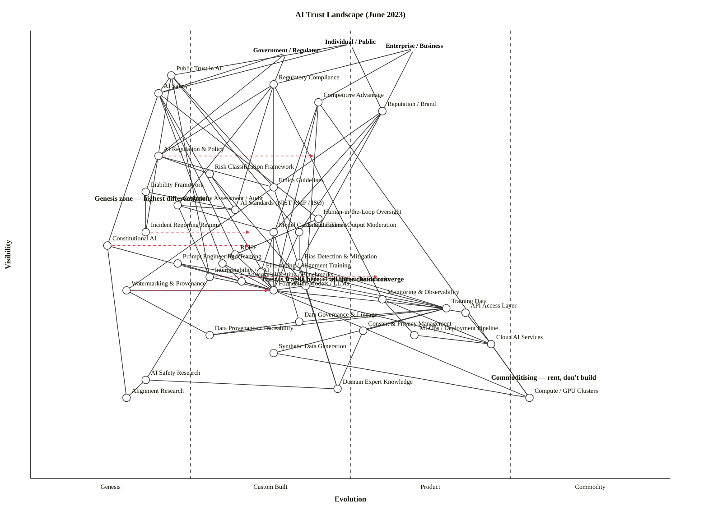

Both checks clean — 42 components/anchors, 84 edges, no violations. Here is the full output.

---

## Assumptions

| Assumption | Rationale |
|---|---|
| Scope is the **global AI trust landscape**, June 2023 | EU AI Act in trilogue; NIST AI RMF published January 2023; ISO 42001 not yet published; GPT-4 released March 2023; ChatGPT ~6 months old |
| Three anchors: **Individual/Public**, **Government/Regulator**, **Enterprise/Business** | Trust means categorically different things to each; a single-anchor map would collapse the most important distinctions |
| "Trust" is operationalised as the **set of components each stakeholder depends on to form a trust judgment** — not trust as a psychological property | This makes trust value-chain-mappable |
| Western/global regulatory environment | Primarily EU + US framing; China's AI governance is a real parallel system but out of scope |

---

## OWM Map

```owm
title AI Trust Landscape (June 2023)
style wardley

// Three user anchors — the three stakeholder types whose trust is at stake
anchor Individual / Public [0.97, 0.50]
anchor Government / Regulator [0.95, 0.40]
anchor Enterprise / Business [0.96, 0.60]

// ── OUTCOME LAYER ──────────────────────────────────────────────────────────
component Public Trust in AI [0.90, 0.22]
component Regulatory Compliance [0.88, 0.38]
component AI Safety [0.86, 0.20]
component Competitive Advantage [0.84, 0.45]
component Reputation / Brand [0.82, 0.55]

// ── GOVERNANCE LAYER ───────────────────────────────────────────────────────
component AI Regulation & Policy [0.72, 0.20]
component Risk Classification Framework [0.68, 0.28]
component Ethics Guidelines [0.65, 0.38]
component Liability Framework [0.64, 0.18]
component Conformity Assessment / Audit [0.61, 0.23]
component AI Standards (NIST RMF / ISO) [0.60, 0.32]
component Incident Reporting Regime [0.55, 0.18]

// ── CONTROL & TECHNICAL GOVERNANCE ────────────────────────────────────────
component Human-in-the-Loop Oversight [0.58, 0.45]
component Model Cards & Datasheets [0.55, 0.38]
component Content Filters / Output Moderation [0.55, 0.42]
component Constitutional AI [0.52, 0.12]
component RLHF [0.50, 0.32]
component Red Teaming [0.48, 0.30]
component Bias Detection & Mitigation [0.48, 0.42]
component Prompt Engineering [0.48, 0.23]
component Interpretability / XAI [0.45, 0.28]
component Fine-tuning / Alignment Training [0.46, 0.36]
component Adversarial Testing / Benchmarks [0.44, 0.33]
component Monitoring & Observability [0.40, 0.55]
component Watermarking & Provenance [0.42, 0.15]

// ── MODEL LAYER ────────────────────────────────────────────────────────────
component Model Evaluation Benchmarks [0.43, 0.43]
component Foundation Models / LLMs [0.42, 0.38]

// ── DATA LAYER ─────────────────────────────────────────────────────────────
component API Access Layer [0.37, 0.68]
component Training Data [0.38, 0.65]
component Data Governance & Lineage [0.35, 0.42]
component Consent & Privacy Management [0.33, 0.52]
component Data Provenance / Traceability [0.32, 0.28]
component Synthetic Data Generation [0.28, 0.38]

// ── KNOWLEDGE / RESEARCH LAYER ────────────────────────────────────────────
component AI Safety Research [0.22, 0.18]
component Domain Expert Knowledge [0.20, 0.48]
component Alignment Research [0.18, 0.15]

// ── INFRASTRUCTURE LAYER ──────────────────────────────────────────────────
component MLOps / Deployment Pipeline [0.32, 0.60]
component Cloud AI Services [0.30, 0.72]
component Compute / GPU Clusters [0.18, 0.78]

// ── DEPENDENCIES ──────────────────────────────────────────────────────────
Individual / Public->Public Trust in AI
Individual / Public->AI Safety
Individual / Public->Reputation / Brand
Government / Regulator->Regulatory Compliance
Government / Regulator->AI Safety
Government / Regulator->AI Regulation & Policy
Enterprise / Business->Competitive Advantage
Enterprise / Business->Regulatory Compliance
Enterprise / Business->Reputation / Brand

Public Trust in AI->AI Safety
Public Trust in AI->Interpretability / XAI
Public Trust in AI->Content Filters / Output Moderation
Public Trust in AI->Ethics Guidelines
Public Trust in AI->Incident Reporting Regime
AI Safety->Constitutional AI
AI Safety->RLHF
AI Safety->Red Teaming
AI Safety->Human-in-the-Loop Oversight
AI Safety->Foundation Models / LLMs
Regulatory Compliance->AI Regulation & Policy
Regulatory Compliance->Conformity Assessment / Audit
Regulatory Compliance->AI Standards (NIST RMF / ISO)
Regulatory Compliance->Ethics Guidelines
Regulatory Compliance->Monitoring & Observability
Competitive Advantage->Foundation Models / LLMs
Competitive Advantage->Fine-tuning / Alignment Training
Competitive Advantage->Model Evaluation Benchmarks
Competitive Advantage->Compute / GPU Clusters
Reputation / Brand->Content Filters / Output Moderation
Reputation / Brand->Bias Detection & Mitigation
Reputation / Brand->Model Cards & Datasheets
Reputation / Brand->Watermarking & Provenance

AI Regulation & Policy->Risk Classification Framework
AI Regulation & Policy->Liability Framework
AI Regulation & Policy->Ethics Guidelines
Risk Classification Framework->AI Standards (NIST RMF / ISO)
Risk Classification Framework->Model Evaluation Benchmarks
Conformity Assessment / Audit->Model Cards & Datasheets
Conformity Assessment / Audit->AI Standards (NIST RMF / ISO)
Conformity Assessment / Audit->Interpretability / XAI
Ethics Guidelines->Domain Expert Knowledge
Liability Framework->Incident Reporting Regime
Liability Framework->AI Standards (NIST RMF / ISO)

Human-in-the-Loop Oversight->RLHF
Constitutional AI->Foundation Models / LLMs
Constitutional AI->Alignment Research
RLHF->Foundation Models / LLMs
RLHF->Training Data
Red Teaming->Adversarial Testing / Benchmarks
Red Teaming->Foundation Models / LLMs
Content Filters / Output Moderation->Foundation Models / LLMs
Content Filters / Output Moderation->Bias Detection & Mitigation
Interpretability / XAI->Foundation Models / LLMs
Interpretability / XAI->AI Safety Research
Bias Detection & Mitigation->Training Data
Bias Detection & Mitigation->Model Evaluation Benchmarks
Adversarial Testing / Benchmarks->Foundation Models / LLMs
Watermarking & Provenance->Foundation Models / LLMs
Watermarking & Provenance->Data Provenance / Traceability
Monitoring & Observability->MLOps / Deployment Pipeline
Monitoring & Observability->Cloud AI Services
Model Cards & Datasheets->Foundation Models / LLMs
Model Cards & Datasheets->Data Governance & Lineage

Foundation Models / LLMs->Training Data
Foundation Models / LLMs->Compute / GPU Clusters
Foundation Models / LLMs->Cloud AI Services
Fine-tuning / Alignment Training->Foundation Models / LLMs
Fine-tuning / Alignment Training->Training Data
Model Evaluation Benchmarks->Foundation Models / LLMs
Model Evaluation Benchmarks->Domain Expert Knowledge
Prompt Engineering->Foundation Models / LLMs
Prompt Engineering->API Access Layer

Training Data->Data Governance & Lineage
Training Data->Consent & Privacy Management
Training Data->Data Provenance / Traceability
Training Data->Synthetic Data Generation
Data Governance & Lineage->Data Provenance / Traceability
Consent & Privacy Management->Domain Expert Knowledge

AI Safety Research->Alignment Research
AI Safety Research->Domain Expert Knowledge

Cloud AI Services->Compute / GPU Clusters
MLOps / Deployment Pipeline->Cloud AI Services
API Access Layer->Cloud AI Services
Synthetic Data Generation->Compute / GPU Clusters

// ── EVOLUTION ARROWS (near-horizon scenarios) ─────────────────────────────
evolve AI Regulation & Policy 0.45
evolve Constitutional AI 0.35
evolve Interpretability / XAI 0.55
evolve Watermarking & Provenance 0.38
evolve Incident Reporting Regime 0.35

// ── ANNOTATIONS ───────────────────────────────────────────────────────────
note Genesis zone — highest differentiation [0.62, 0.10]
note Trust is fragile here — all three chains converge [0.44, 0.36]
note Commoditising — rent, don't build [0.22, 0.72]
```

**Validator:** `OK: 42 components/anchors, 84 edges — no violations.`
**Layout:** `LAYOUT OK: 3 anchors, 39 components — no layout warnings.`

---

## Optional Mermaid Rendering (GitHub)



---

## Component Evolution Rationale Table

| Component | Stage | ε | ν | Evidence |
|---|---|---|---|---|
| Public Trust in AI | Genesis | 0.22 | 0.90 | No agreed measurement framework; sentiment surveys and academic proxies only; neither "AI Trustworthy" certifications nor public-facing trust scores exist at scale. |
| Regulatory Compliance (AI) | Custom Built | 0.38 | 0.88 | NIST AI RMF released January 2023; EU AI Act in trilogue (not law yet); ISO 42001 still in draft; compliance programmes exist but entirely bespoke. |
| AI Safety | Genesis | 0.20 | 0.86 | MIRI, Anthropic, DeepMind Safety, OpenAI Alignment teams active but no shared safety definition, metrics, or auditable standard; NIST AI RMF Trustworthiness characteristics are voluntary. |
| Competitive Advantage (AI) | Custom Built | 0.45 | 0.84 | Differentiation through fine-tuned LLMs is still real but compressing fast; GPT-4 and open-source LLaMA both shipped Q1 2023, commoditisation pressure building. |
| Reputation / Brand | Custom Built → Product | 0.55 | 0.82 | Brand-safety thinking around AI outputs is forming; ChatGPT and Bing incidents making headlines; corporate comms teams treating AI outputs as a reputational risk — early Product stage for management practices. |
| AI Regulation & Policy | Genesis | 0.20 | 0.72 | EU AI Act in trilogue June 2023 (passed June 2024); US AI Bill of Rights published Oct 2022 (non-binding); NIST AI RMF Jan 2023 (voluntary); no enacted binding AI-specific law anywhere. |
| Risk Classification Framework | Custom Built | 0.28 | 0.68 | EU risk tiers (unacceptable/high/limited/minimal) proposed but not enacted; no shared cross-jurisdictional taxonomy; NIST mapping to risk tiers voluntary. |
| Ethics Guidelines | Custom Built → Product | 0.38 | 0.65 | OECD AI Principles 2019, EU Ethics Guidelines 2019, Google/Microsoft/IBM internal ethics boards — many guidelines, no standard; beginning to converge toward Product-stage checklists. |
| Liability Framework | Genesis | 0.18 | 0.64 | EU AI Liability Directive proposed 2022 but not enacted; no jurisdiction has enacted AI-specific civil liability law; courts using general products-liability doctrine. |
| Conformity Assessment / Audit | Genesis | 0.23 | 0.61 | EU AI Act proposed conformity assessment requirements but not law; no accredited AI audit bodies; third-party audits are ad-hoc consulting engagements, not certified processes. |
| AI Standards (NIST RMF / ISO) | Custom Built | 0.32 | 0.60 | NIST AI RMF 1.0 published January 2023 (voluntary); ISO/IEC 42001 still in draft (published Dec 2023); no mandatory certification pathway yet. |
| Incident Reporting Regime | Genesis | 0.18 | 0.55 | No mandatory AI incident reporting regime anywhere; voluntary databases (AIAAIC, MIT AI Incidents DB) exist but sparse; analogy to aviation ASRS is aspirational, not operational. |
| Human-in-the-Loop Oversight | Custom Built → Product | 0.45 | 0.58 | GDPR Article 22 requires human review for automated decisions; best-practice guides (Accenture, Google) appearing; implementation varies wildly — approaching Product stage for the concept but not implementation. |
| Model Cards & Datasheets | Custom Built | 0.38 | 0.55 | Google/Hugging Face model cards adopted in practice; Meta and others using datasheets; no standard schema enforced; voluntary adoption pushing toward late Custom Built. |
| Content Filters / Output Moderation | Custom Built | 0.42 | 0.55 | Multiple vendors (Perspective API, OpenAI moderation endpoint, Anthropic filters); no standard API contract; each model has different filter behaviour — forming market but not Product yet. |
| Constitutional AI | Genesis | 0.12 | 0.52 | Anthropic published the technique in December 2022; no other major lab has adopted it by name; purely Genesis — single-lab innovation, unverified externally. |
| RLHF | Custom Built | 0.32 | 0.50 | First published 2017 (OpenAI); InstructGPT paper 2022; widely described in literature; OpenAI, Anthropic, DeepMind, Google all using; patterns converging but no off-the-shelf tooling — solid Custom Built. |
| Red Teaming | Custom Built | 0.30 | 0.48 | Practice borrowed from security; AI-specific red teaming being formalised (MITRE ATLAS, Anthropic Red Team report); no standard methodology yet. |
| Bias Detection & Mitigation | Custom Built | 0.42 | 0.48 | IBM AI Fairness 360, Google What-If Tool, Fairlearn (Microsoft) all exist as open-source; but LLM-specific bias testing is far less mature — mid Custom Built. |
| Prompt Engineering | Custom Built | 0.23 | 0.48 | Field emerged in late 2022; "Prompt Engineer" job listings spiking; no certification, curriculum, or standard vocabulary; deep Custom Built. |
| Interpretability / XAI | Custom Built | 0.28 | 0.45 | SHAP and LIME are mature for classical ML; LLM-specific interpretability is early Genesis (Anthropic mechanistic interpretability team formed 2022); treating as Custom Built on balance. |
| Fine-tuning / Alignment Training | Custom Built | 0.36 | 0.46 | LoRA and PEFT papers published 2021–22; HuggingFace PEFT library exists; not yet a clean Product but moving fast. |
| Adversarial Testing / Benchmarks | Custom Built | 0.33 | 0.44 | MMLU, HumanEval, BIG-bench exist; but safety-specific adversarial benchmarks (TruthfulQA, BBQ) are early; no agreed benchmark suite for trust. |
| Monitoring & Observability | Product (+rental) | 0.55 | 0.40 | Datadog, Prometheus, Grafana for MLOps; Fiddler, Arize for ML observability; Weights & Biases for training — reasonably mature Product market for general ML monitoring. |
| Watermarking & Provenance | Genesis | 0.15 | 0.42 | OpenAI watermarking research published 2022; no deployed commercial product; Biden EO (Oct 2023) would later mandate it — squarely Genesis in June 2023. |
| Model Evaluation Benchmarks | Custom Built | 0.43 | 0.43 | MMLU (Hendrycks 2020), HumanEval (OpenAI 2021), BIG-bench (Google 2022) exist; but trust-specific evaluation benchmarks non-existent; community consolidating but no standard. |
| Foundation Models / LLMs | Custom Built | 0.38 | 0.42 | GPT-4 (March 2023), Claude (March 2023), Bard (Feb 2023), LLaMA (Feb 2023) — multiple vendors; no dominant standard architecture, fine-tuning API, or deployment contract; early Custom Built to Product transition. |
| API Access Layer | Product (+rental) | 0.68 | 0.37 | OpenAI API, Anthropic API, Cohere API — REST patterns and SDK patterns converging; pricing-per-token model standardising; mid Product (+rental). |
| Training Data | Product (+rental) | 0.65 | 0.38 | Common Crawl, The Pile, licensed datasets well understood; data labelling platforms (Scale AI, Surge) well developed; Product (+rental) stage with ongoing legal battles on consent. |
| Data Governance & Lineage | Custom Built | 0.42 | 0.35 | dbt for lineage, Collibra/Alation for catalogues — Product stage for data governance generally; but AI-specific training-data governance (consent, copyright) is still Custom Built. |
| Consent & Privacy Management | Product (+rental) | 0.52 | 0.33 | GDPR framework (2018) well established; CCPA active; OneTrust/Cookiebot as Product offerings — this is more mature than most of the map, driven by data protection law predating AI. |
| Data Provenance / Traceability | Custom Built | 0.28 | 0.32 | No standard; C2PA (content provenance) launched 2021 for media, not training data; AI training data lineage tracking is ad-hoc. |
| Synthetic Data Generation | Custom Built | 0.38 | 0.28 | Mostly/Gretel/Synthesis AI as specialist vendors; growing use for privacy-preserving ML; no standard methodology; Custom Built. |
| AI Safety Research | Genesis | 0.18 | 0.22 | MIRI, Redwood Research, Anthropic safety, DeepMind safety — all publishing but no shared methodology, no peer-reviewed certification; field in active ferment. |
| Domain Expert Knowledge | Custom Built | 0.48 | 0.20 | Consulting firms, academic ethicists, domain experts — well understood concept but supply-constrained and not yet structured as a repeatable service. |
| Alignment Research | Genesis | 0.15 | 0.18 | RLHF, Constitutional AI, scalable oversight — multiple competing approaches, no convergence; AI alignment research is classic Genesis. |
| MLOps / Deployment Pipeline | Product (+rental) | 0.60 | 0.32 | MLflow, Kubeflow, Vertex AI Pipelines, SageMaker Pipelines — growing Product market; GitHub Actions integration normalising; mid Product (+rental). |
| Cloud AI Services | Product (+rental) | 0.72 | 0.30 | AWS SageMaker, GCP Vertex AI, Azure ML — well-established Product (+rental) services; approaching Commodity (+utility) end of stage III. |
| Compute / GPU Clusters | Commodity (+utility) | 0.78 | 0.18 | AWS, GCP, Azure GPU instances; NVIDIA H100 dominating but cloud access commoditised; priced per hour; strong Commodity (+utility) placement. |

---

## Strategic Analysis

### a. Differentiation Opportunities (top 3)

1. **Constitutional AI** (Genesis, ε=0.12) — the highest-D component on the map. The only lab with a published, named approach to alignment-via-constitution is Anthropic. For any organisation that wants a *defensible safety story* — to individuals, regulators, or enterprise procurement — having a named, auditable alignment technique is a uniquely visible differentiator right now. No one else has filed a comparable claim. If Interpretability / XAI and Constitutional AI converge, the first lab to produce an externally verifiable version owns the trust narrative for the next generation of enterprise contracts.

2. **Interpretability / XAI** (Custom Built, ε=0.28) — the highest-leverage governance enabler. All three stakeholder chains — public trust, regulatory compliance, and reputation — converge on this component. Leading AI labs like Anthropic are making bets that investments in XAI will pay off as a path to differentiation in a crowded field of foundation model builders. Yet the field for LLMs specifically is barely past Genesis. The first lab or tooling vendor to produce an LLM-native interpretability product that can be cited in a regulatory audit will reshape the conformity assessment market.

3. **AI Safety** (Genesis, ε=0.20) — the outcome node that all three anchors share. Public trust, regulatory compliance, and competitive advantage all feed into or out of AI Safety as a node. Right now it is poorly understood, contested, and has no measurable metric. The organisation that defines what "AI Safety" means — operationally, not philosophically — sets the standard everyone else will be audited against. This is a standards-game opportunity (#30), not just a research opportunity.

---

### b. Commodity-Leverage Candidates (top 3)

1. **Compute / GPU Clusters** (Commodity +utility, ε=0.78) — NVIDIA dominates silicon but cloud access is pure utility. AWS, GCP, Azure all price compute per-second. No organisation in the trust stack should own a GPU cluster unless it is operating a frontier training run. Rent from hyperscalers; the margin is in what runs on top.

2. **Cloud AI Services** (Product +rental, ε=0.72) — AWS SageMaker, GCP Vertex AI, Azure ML are late Product (+rental), nearly Commodity (+utility). The trust-specific work — alignment, evaluation, interpretability — sits above this layer. Consume Cloud AI Services as a platform, not a differentiator.

3. **Consent & Privacy Management** (Product +rental, ε=0.52) — GDPR-era vendors (OneTrust, Cookiebot, TrustArc) have already productised consent. For any new AI trust programme, buy rather than build consent management infrastructure; the differentiation is in how you apply it to training data consent, not the consent plumbing itself.

---

### c. Dependency Risks (top 3 — where trust is most fragile)

1. **AI Safety → Foundation Models / LLMs** — this is the single most dangerous edge on the map. AI Safety (ε=0.20, Genesis) depends directly on Foundation Models / LLMs (ε=0.38, Custom Built). The safety properties of a model are *not separable from the model itself*, but all current safety techniques — RLHF, Constitutional AI, Red Teaming — are applied on top of architectures whose internal behaviour is not yet understood. If a model capability advance outpaces alignment technique maturity (a likely event in 2023–2024), this edge breaks. One major issue is the increasing complexity of advanced large language models, which rely on deep neural networks and often operate as black boxes; the lack of access to the architecture of proprietary models makes it difficult to understand how they operate.

2. **Regulatory Compliance → AI Regulation & Policy** (Genesis) — regulatory compliance is a mid-chain visible outcome but its primary dependency is regulation that does not yet exist as binding law. The US has no federal AI statute; the landscape is a narrative of executive action, agency guidance, and a fundamental shift in regulatory philosophy between administrations. Enterprises that built compliance programmes around the *anticipated* EU AI Act are depending on a law that in June 2023 is still in trilogue. Any change in the trilogue (e.g., foundation model provisions added late in the process) invalidates months of compliance work. This is dependency on a Genesis component that is also politically volatile.

3. **Public Trust in AI → Incident Reporting Regime** (Genesis, ε=0.18) — public trust depends in part on the existence of a functional incident reporting regime (the ability for individuals to report and have AI harms investigated). There is no such regime. AIAAIC and MIT AI Incidents DB are voluntary, sparse databases. When a high-profile incident occurs — a biased hiring algorithm, a medical misdiagnosis, a deepfake — the public-facing trust chain has no institutional backstop. This is the governance equivalent of nuclear power with no safety inspector.

---

### d. Build / Buy / Outsource Recommendations

| Component | Stage | Recommendation | Why |
|---|---|---|---|
| Constitutional AI | Genesis | **Build** (if Anthropic-adjacent) / **Monitor** (everyone else) | Single-lab innovation; no market yet; the first to industrialise this owns the alignment audit market |
| Interpretability / XAI | Custom Built | **Build** (for LLM-native XAI); **Buy** SHAP/LIME tooling for classical ML | LLM interpretability has no vendor market; classical ML XAI is a solved product (IBM AI 360, InterpretML) |
| RLHF | Custom Built | **Build** if you run foundation models; **Buy** via fine-tuning API otherwise | No off-the-shelf RLHF product; but most enterprises don't need to run RLHF themselves — just buy a fine-tuned API endpoint |
| Red Teaming | Custom Built | **Buy** external expertise | Specialist skill; Anthropic, Scale AI red team services; building internal red team is expensive and slow |
| AI Regulation & Policy | Genesis | **Monitor + Engage** | Too early to build to; join NIST working groups and EU consultation processes (gameplay #17 Co-operation) |
| AI Standards (NIST RMF / ISO) | Custom Built | **Open-source collaborate** | NIST AI RMF is explicitly an open-standard instrument; contribute to it rather than build a proprietary alternative |
| Conformity Assessment / Audit | Genesis | **Establish early** (if you're a lab/deployer) | First movers set the audit criteria; waiting for standards means being audited on someone else's definition |
| Monitoring & Observability | Product (+rental) | **Buy** (Fiddler, Arize, Weights & Biases) | Mature Product (+rental) market; building this in-house is waste |
| Content Filters / Output Moderation | Custom Built | **Buy** OpenAI Moderation API / Perspective API for baseline; build domain-specific tuning on top | Generic moderation is approaching Product; domain-specific safety requires custom work |
| Watermarking & Provenance | Genesis | **Build or invest in C2PA** | No vendor exists; early Genesis; whoever establishes the standard wins — join the Coalition for Content Provenance and Authenticity |
| Training Data | Product (+rental) | **Buy + govern carefully** | Training data is available (Common Crawl, licensed sets, Scale AI); differentiation is in curation and consent governance, not raw data acquisition |
| Cloud AI Services | Product (+rental) | **Rent** (AWS / GCP / Azure) | Near-Commodity (+utility) infrastructure; no value in owning |
| Compute / GPU Clusters | Commodity (+utility) | **Rent** from hyperscalers | Utility market; NVIDIA H100s available on-demand via cloud |
| Alignment Research | Genesis | **Fund / partner with labs** | No vendor market; hire researchers or partner with Anthropic/DeepMind safety teams |

---

### e. Suggested Gameplays

| # | Play | Target Component(s) | Mechanism |
|---|---|---|---|
| **#15 Open Approaches** | AI Standards (NIST RMF / ISO), Adversarial Testing / Benchmarks | Open-source the benchmark suite and audit schema to accelerate commoditisation of the compliance layer, so the value migrates up to higher-order safety services you control. AWS/Google have run this playbook on infrastructure; run it on governance. |
| **#56 First Mover** | Conformity Assessment / Audit + Interpretability / XAI | The AI ecosystem is moving from voluntary guidelines to enforceable obligations. The organisation that defines what constitutes a passing AI audit — before regulation mandates the definition — writes the standard. |
| **#43 Sensing Engines (ILC)** | Red Teaming → Adversarial Testing / Benchmarks → AI Safety Research | Run a structured sensing operation: operate public AI systems, collect failure modes, feed them into benchmark construction, feed benchmarks into alignment research investment decisions. This is how you detect which AI risks are real before regulators do. |
| **#36 Directed Investment** | Constitutional AI, Alignment Research | Both are Genesis; both are strategically critical; both are underfunded relative to capability research. Directed capital here (safety research teams, not capability teams) is the asymmetric bet of June 2023. |
| **#30 Standards Game** | Incident Reporting Regime, Risk Classification Framework | No mandatory incident reporting exists; the first actor to propose a credible, implementable incident reporting taxonomy (analogous to CVSS in security) sets the definitional frame for all future regulation. This is a standards-game play targeting regulators, not competitors. |
| **#17 Co-operation** | AI Regulation & Policy | The EU–US Trade and Technology Council continues to serve as a forum for cooperation on technical standards, model evaluation, and AI safety research. Labs and deployers that participate in these forums shape regulation before it becomes mandatory. |
| **#7 Education** | Public Trust in AI, Interpretability / XAI | Public trust is currently blocked not by technology failure but by user confusion over what AI safety and interpretability mean. Structured education (not marketing) is the unblocking move — targeted at journalists, policymakers, and civil society, not consumers. |

---

### f. Doctrine Violations

| Doctrine | Status | Detail |
|---|---|---|
| **#1 Focus on user needs** | ⚠️ Partially violated by the industry | Most AI development maps user needs as "capabilities" (write better, analyse faster), not trust needs (be predictable, be accountable, be correctable). The trust value chain is invisible in most AI product roadmaps. |
| **#10 Know your users** | ⚠️ Widely violated | Single-stakeholder AI governance strategies (companies that only talk to regulators, or labs that only talk to developers) miss the three-anchor structure of this map. The AI ecosystem is moving from voluntary guidelines to enforceable obligations — enterprises that haven't mapped their individual/public anchor are not prepared. |
| **#7 Use appropriate methods** | ❌ Violated across the board | Agile / feature-driven development is being applied to safety-critical alignment work (Constitutional AI, RLHF, Red Teaming) that sits in Genesis and Custom Built. Six Sigma and operational excellence are being demanded of AI systems that are nowhere near Commodity (+utility) maturity. The method-stage mismatch is nearly universal. |
| **#13 Manage inertia** | ❌ Critically violated at Foundation Models / LLMs | This node carries inertia in at least four forms: **#2 Sunk capital** (billions in training runs), **#15 Past success** (GPT-3 → GPT-4 improvements validate continuing current trajectory), **#16 Rewards and culture** (capability researchers > safety researchers in status and salary), and **#17 Financial market expectations** (investor pressure on OpenAI/Anthropic/Google to ship product, not do safety). This is the most dangerous combination on the map. |
| **#22 Use standards where appropriate** | ⚠️ Violated by premature standardisation attempts | Some industry coalitions are attempting to standardise Constitutional AI and RLHF (both Genesis/Custom Built) before the community understands whether they work. Standards at this stage calcify the wrong approach. |
| **#9 Think small (know the details)** | ⚠️ Violated in AI governance | "AI governance" appears in many boardroom discussions as a single component. The map shows it decomposes into at least 12 distinct components (Risk Classification, Liability Framework, Conformity Assessment, Standards, Incident Reporting, Ethics Guidelines, etc.), each at different evolution stages requiring different strategies. |

---

### g. Climatic Context

| Pattern | How it shapes this map |
|---|---|
| **#3 Everything evolves** | Foundation Models / LLMs are moving from Custom Built toward Product (+rental) faster than any governance component is moving. The technical capability chain is evolving; the trust chain is not. This asymmetry is the defining tension of June 2023. |
| **#7 Characteristics change as components evolve** | As Foundation Models move from Custom Built to Product (+rental), the user perception shifts from "exciting/confusing" to "common/expected" — which *raises* the stakes for every trust failure. A ChatGPT hallucination in January 2023 was a curiosity; in 2024 it is a liability. |
| **#10 Higher-order systems create new sources of worth** | The commoditisation of Cloud AI Services and Compute creates the economic conditions for the entire trust stack to exist as a business. You cannot charge for Conformity Assessment until there is a market of deployed AI systems to audit. This pattern means: the market for trust-as-a-service is about to open. |
| **#15–17 Inertia / past success** | The Foundation Models / LLMs node carries multi-form inertia — financial, cultural, and political — that is actively resisting safety investment. This is the most acute application of climatic pattern #17 ("Inertia can kill an organisation") on this map. |
| **#18 You cannot measure evolution over time or adoption** | The `evolve` arrows on this map (AI Regulation & Policy → 0.45; Constitutional AI → 0.35) are scenario signals, not forecasts. They encode the *pressure* that was building in June 2023 — EU AI Act negotiation momentum, growing policy consensus on watermarking — not a timeline prediction. |
| **#22 Two forms of disruption** | This map exhibits *both*: (1) Genesis-driven disruption from Constitutional AI and Alignment Research — hard to predict, could reshape the whole stack; (2) Product-to-utility disruption of Compute and Cloud AI — already happening, enabling the entire trust market. |
| **#27 Punctuated equilibrium (Product-to-utility)** | Compute / GPU Clusters hitting Commodity (+utility) is the commodity boundary crossing that makes large-scale AI deployment possible at all. The trust governance gap (governance at Genesis vs. deployment at scale) is a textbook punctuated-equilibrium setup: a fast capability shift arriving before governance can respond. |

---

### h. Deep-Placement Research Notes

Four components received targeted research:

1. **AI Regulation & Policy** — initial cheat-sheet score: ~0.18 (Genesis). Research confirmed: in April 2021, the European Commission proposed the first EU artificial intelligence law, establishing a risk-based AI classification system, and as of June 2023, the EU AI Act was still in trilogue. On October 30, 2023, President Biden signed Executive Order 14110 — this had not yet happened in June 2023. Placement confirmed at 0.20, solidly Genesis. Evolve arrow to 0.45 reflects the strong regulatory momentum that would materialise by late 2023.

2. **AI Standards (NIST RMF / ISO)** — many organisations are using NIST's voluntary AI RMF to structure risk management programs, and ISO/IEC 42001, published in 2023, as the first global standard for an AI management system. The NIST AI RMF was published January 2023 (just months before our map date); ISO 42001 was still in draft. Placement at Custom Built (0.32) confirmed — standards exist and are referenced but not yet mandatory or broadly certified.

3. **Interpretability / XAI** — for classical ML: SHAP, LIME, IBM AI 360, Google What-If Tool are established Custom Built. For LLMs specifically: one major issue is the increasing complexity of advanced large language models, which rely on deep neural networks and often operate as black boxes, with opaque decision-making processes. Initial placement at Custom Built (0.28) confirmed; the evolve arrow to 0.55 reflects the regulatory pressure building from EU AI Act transparency requirements.

4. **Constitutional AI** — Anthropic published the Constitutional AI paper December 2022. The mission of the Interpretability team is to discover and understand how large language models work internally, as a foundation for AI safety and positive outcomes. No other lab had adopted this approach by name in June 2023. Genesis placement (0.12) confirmed — single-lab innovation, not yet peer-reviewed at scale.

---

### i. Caveat

The `evolve` arrows in this map are **scenarios, not forecasts**. Wardley's climatic pattern #18 is explicit: *"you cannot measure evolution over time or adoption."* The arrows encode the directional pressures visible in June 2023 — regulatory momentum, capability acceleration, growing XAI investment — but the rate of movement, the order of transitions, and whether any component skips a stage or regresses under political reversal (cf. on January 20, 2025, Trump revoked EO 14110 on his first day in office) cannot be predicted from the map. Use the scenarios to stress-test strategy, not to set timelines.