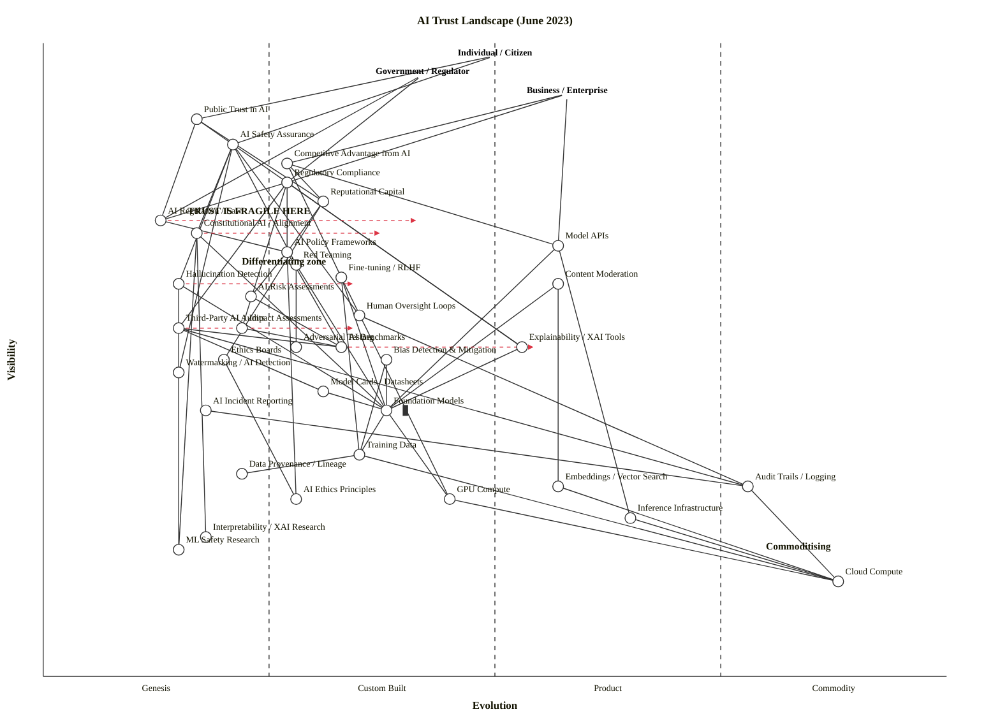

All checks pass: **OK: 39 components/anchors, 64 edges — no violations. LAYOUT OK.** Now producing the full output.

---

# AI Trust Landscape — Wardley Map (June 2023)

## Assumptions (correct any of these and the map shifts)

| Assumption | Rationale |
|---|---|
| Time-stamp: June 2023 | EU AI Act not yet law; GPT-4 and Claude API just launched; NIST AI RMF freshly published |
| "Trust" = scoreable components | Trust is not mapped as a feeling — it's decomposed into auditable, investable capabilities |
| Scope: global enterprise + government | Not any single jurisdiction; reflects the dominant landscape (US/EU) |
| Three anchors | Individuals/citizens, Government/regulators, and Businesses each have distinct and non-collapsible needs |

---

## OWM Map (paste into onlinewardleymaps.com)

```owm
title AI Trust Landscape (June 2023)
style wardley

// === THREE USER ANCHORS ===
anchor Individual / Citizen [0.98, 0.50]
anchor Government / Regulator [0.95, 0.42]
anchor Business / Enterprise [0.92, 0.58]

// === OUTCOME COMPONENTS ===
component Public Trust in AI [0.88, 0.17]
component AI Safety Assurance [0.84, 0.21]
component Competitive Advantage from AI [0.81, 0.27]
component Regulatory Compliance [0.78, 0.27]

// === GOVERNANCE LAYER ===
component Reputational Capital [0.75, 0.31]
component AI Regulation / Law [0.72, 0.13]
component Constitutional AI / Alignment [0.70, 0.17]
component Model APIs [0.68, 0.57]
component AI Policy Frameworks [0.67, 0.27]

// === CONTROL MECHANISMS ===
component Red Teaming [0.65, 0.28]
component Fine-tuning / RLHF [0.63, 0.33]
component Hallucination Detection [0.62, 0.15]
component Content Moderation [0.62, 0.57]
component AI Risk Assessments [0.60, 0.23]
component Human Oversight Loops [0.57, 0.35]
component Third-Party AI Audits [0.55, 0.15]
component Impact Assessments [0.55, 0.22]
component Explainability / XAI Tools [0.52, 0.53]
component Adversarial Testing [0.52, 0.28]
component AI Benchmarks [0.52, 0.33]

// === STANDARDS / TRANSPARENCY ===
component Ethics Boards [0.50, 0.20]
component Bias Detection & Mitigation [0.50, 0.38]
component Watermarking / AI Detection [0.48, 0.15]
component Model Cards / Datasheets [0.45, 0.31]
component AI Incident Reporting [0.42, 0.18]

// === TECHNICAL LAYER ===
component Foundation Models [0.42, 0.38] inertia
component Training Data [0.35, 0.35]
component Data Provenance / Lineage [0.32, 0.22]
component Embeddings / Vector Search [0.30, 0.57]
component Audit Trails / Logging [0.30, 0.78]
component GPU Compute [0.28, 0.45]
component AI Ethics Principles [0.28, 0.28]

// === KNOWLEDGE / RESEARCH LAYER ===
component Interpretability / XAI Research [0.22, 0.18]
component ML Safety Research [0.20, 0.15]

// === COMMODITY INFRASTRUCTURE ===
component Inference Infrastructure [0.25, 0.65]
component Cloud Compute [0.15, 0.88]

// ===== DEPENDENCIES =====

// Anchor → Outcomes
Individual / Citizen->Public Trust in AI
Individual / Citizen->AI Safety Assurance
Government / Regulator->Regulatory Compliance
Government / Regulator->AI Regulation / Law
Business / Enterprise->Competitive Advantage from AI
Business / Enterprise->Regulatory Compliance
Business / Enterprise->Model APIs

// Outcomes → Governance / Control
Public Trust in AI->AI Safety Assurance
Public Trust in AI->Reputational Capital
Public Trust in AI->AI Regulation / Law
AI Safety Assurance->Constitutional AI / Alignment
AI Safety Assurance->Red Teaming
AI Safety Assurance->Hallucination Detection
AI Safety Assurance->Human Oversight Loops
AI Safety Assurance->Watermarking / AI Detection
AI Safety Assurance->Explainability / XAI Tools
Competitive Advantage from AI->Model APIs
Competitive Advantage from AI->Fine-tuning / RLHF
Competitive Advantage from AI->Reputational Capital
Regulatory Compliance->AI Regulation / Law
Regulatory Compliance->AI Policy Frameworks
Regulatory Compliance->Third-Party AI Audits
Regulatory Compliance->Impact Assessments
Regulatory Compliance->Explainability / XAI Tools

// Governance layer
Reputational Capital->AI Policy Frameworks
Reputational Capital->Ethics Boards
AI Regulation / Law->AI Policy Frameworks
AI Policy Frameworks->AI Benchmarks
AI Policy Frameworks->AI Risk Assessments
AI Policy Frameworks->AI Ethics Principles
Constitutional AI / Alignment->Foundation Models
Constitutional AI / Alignment->ML Safety Research
Constitutional AI / Alignment->Interpretability / XAI Research
Model APIs->Foundation Models
Model APIs->Inference Infrastructure

// Control mechanisms
Red Teaming->Foundation Models
Red Teaming->Adversarial Testing
Hallucination Detection->Foundation Models
Hallucination Detection->ML Safety Research
Fine-tuning / RLHF->Foundation Models
Fine-tuning / RLHF->Training Data
Fine-tuning / RLHF->GPU Compute
Content Moderation->Foundation Models
Content Moderation->Embeddings / Vector Search
Human Oversight Loops->Audit Trails / Logging
Third-Party AI Audits->AI Benchmarks
Third-Party AI Audits->Audit Trails / Logging
Third-Party AI Audits->Model Cards / Datasheets
Explainability / XAI Tools->Foundation Models
Impact Assessments->AI Benchmarks
AI Risk Assessments->AI Benchmarks

// Standards / Transparency
Bias Detection & Mitigation->Training Data
Bias Detection & Mitigation->Foundation Models
Model Cards / Datasheets->Foundation Models
AI Incident Reporting->Audit Trails / Logging
Ethics Boards->AI Ethics Principles

// Technical layer
Foundation Models->Training Data
Foundation Models->GPU Compute
Training Data->Data Provenance / Lineage
Training Data->Cloud Compute
GPU Compute->Cloud Compute
Inference Infrastructure->Cloud Compute
Embeddings / Vector Search->Cloud Compute
Audit Trails / Logging->Cloud Compute

// === EVOLVE ANNOTATIONS ===
evolve Constitutional AI / Alignment 0.38
evolve AI Regulation / Law 0.42
evolve Third-Party AI Audits 0.35
evolve Hallucination Detection 0.35
evolve AI Benchmarks 0.55

// === NOTES ===
note TRUST IS FRAGILE HERE [0.73, 0.16]
note Differentiating zone [0.65, 0.22]
note Commoditising [0.20, 0.80]
```

**Validator:** ✅ OK: 39 components/anchors, 64 edges — no violations.

---

## Mermaid Rendering (GitHub / Mermaid Live)



---

## Component Evolution Rationale Table

| Component | Stage | ε | ν | Evidence |
|---|---|---|---|---|
| Public Trust in AI | Genesis | 0.17 | 0.88 | No standard metric exists; trust is context-specific and entirely fragile — the concept itself is contested across stakeholder groups. |
| AI Safety Assurance | Genesis | 0.21 | 0.84 | No certifications, no agreed definition; OpenAI, Anthropic, DeepMind all use incompatible frameworks; clinician analogies are absent. |
| Competitive Advantage from AI | Custom Built | 0.27 | 0.81 | Early deployments at Morgan Stanley, Khan Academy, Duolingo (GPT-4); no repeatable playbook; mostly bespoke integrations. |
| Regulatory Compliance (AI) | Custom Built | 0.27 | 0.78 | NIST AI RMF published Jan 2023 (voluntary); EU AI Act not in force; NYC LL144 (hiring tools) effective July 2023; patterns forming but no standard. |
| Reputational Capital | Custom Built | 0.31 | 0.75 | Safety-as-brand differentiation emerging (Anthropic vs. OpenAI positioning); no standard measure; driven by press coverage and voluntary commitments. |
| AI Regulation / Law | Genesis | 0.13 | 0.72 | No binding AI-specific law anywhere major in June 2023; EU AI Act still in parliamentary negotiation; US has no federal law; deepest Genesis on the map. |
| Constitutional AI / Alignment | Genesis | 0.17 | 0.70 | Anthropic's Constitutional AI paper (Dec 2022) is the primary public artifact; single-vendor approach, no competitors or standards; frontier research. |
| Model APIs | Product (+rental) | 0.57 | 0.68 | OpenAI API, Anthropic Claude API, Google PaLM API all launched with tiered pricing; multiple vendors; clear feature competition; most mature part of the stack. |
| AI Policy Frameworks | Custom Built | 0.27 | 0.67 | NIST AI RMF (Jan 2023) is voluntary; IBM, Microsoft, Google have proprietary frameworks; no dominant standard; early analyst coverage beginning. |
| Red Teaming | Custom Built | 0.28 | 0.65 | Practiced at OpenAI, Anthropic, Google for AI models; no standard methodology; no certification body; each team invents its own process. |
| Hallucination Detection | Genesis | 0.15 | 0.62 | Active research; no production-grade solutions; contested metrics; papers describe the "wonder" of the problem, not solutions. |
| Fine-tuning / RLHF | Custom Built | 0.33 | 0.63 | LoRA and RLHF techniques published; OpenAI fine-tuning API exists; implementations bespoke; early productisation beginning. |
| Content Moderation | Product (+rental) | 0.57 | 0.62 | Mature from social media era; OpenAI moderation API, Perspective API, Jigsaw; well-understood problem class; many vendors. |
| AI Risk Assessments | Custom Built | 0.23 | 0.60 | NIST RMF provides structure but implementations vary; no standard scoring rubric; largely internal and self-assessed. |
| Human Oversight Loops | Custom Built | 0.35 | 0.57 | HITL principles well-documented; Azure ML and SageMaker have tooling; but AI-specific HITL requirements are not standardised. |
| Third-Party AI Audits | Genesis | 0.15 | 0.55 | No standard practice, no certified auditors, no agreed methodology; Stanford's Foundation Model Transparency Index hadn't yet been published (Oct 2023). |
| Impact Assessments | Custom Built | 0.22 | 0.55 | Canada's Algorithmic Impact Assessment is a template; some frameworks in development; AI-specific assessments barely defined. |
| Explainability / XAI Tools | Product (+rental) | 0.53 | 0.52 | SHAP, LIME, IBM AI Explainability 360 are established for classical ML; LLM-specific explainability tools are Genesis-stage; placed at Product to reflect the split. |
| Adversarial Testing | Custom Built | 0.28 | 0.52 | Foolbox, ART frameworks exist for classical ML robustness; LLM-specific adversarial testing is bespoke and lab-internal. |
| AI Benchmarks | Custom Built | 0.33 | 0.52 | HELM, BIG-bench, MMLU, SuperGLUE exist but are contested; each vendor uses different benchmarks strategically; no standard. |
| Ethics Boards | Custom Built | 0.20 | 0.50 | Google's board dissolved 2019; various structures at Microsoft, IBM; no standard format, no audit mechanism. |
| Bias Detection & Mitigation | Custom Built | 0.38 | 0.50 | IBM AIF360, Fairlearn, What-If Tool exist; more mature than most governance components, but LLM-specific bias detection is early. |
| Watermarking / AI Detection | Genesis | 0.15 | 0.48 | C2PA forming; GPTZero launched Dec 2022; OpenAI watermarking research; no production-grade system in June 2023. |
| Model Cards / Datasheets | Custom Built | 0.31 | 0.45 | Google's 2019 paper launched the concept; Hugging Face requiring them; not standard, not regulated; inconsistent adoption. |
| AI Incident Reporting | Genesis | 0.18 | 0.42 | AIID (AI Incident Database) exists but is voluntary and sparse; no regulatory requirement; no standard taxonomy for incidents. |
| Foundation Models | Custom Built | 0.38 | 0.42 | GPT-4, Claude, PaLM 2 just released; OpenAI held >60% API market share by end of 2023; a few vendors, no dominant standard; architecture deliberately opaque. *Inertia flagged.* |
| Training Data | Custom Built | 0.35 | 0.35 | Data curation bespoke; C4, WebText, proprietary datasets; no standard for "good" training data; governance barely exists. |
| Data Provenance / Lineage | Custom Built | 0.22 | 0.32 | MLflow, DVC support ML pipelines; LLM-scale data provenance is barely theorised; very early tooling. |
| Embeddings / Vector Search | Product (+rental) | 0.57 | 0.30 | Pinecone, Weaviate, Chroma launched; multiple vendors; growing market; rapidly productising. |
| Audit Trails / Logging | Commodity (+utility) | 0.78 | 0.30 | Standard DevOps tooling (Datadog, Splunk, CloudWatch); utility pricing; no differentiation. |
| GPU Compute | Custom Built → Product | 0.45 | 0.28 | H100 shortages in June 2023; AWS, Azure, GCP all offer GPUs but scarce; not fully commodity; pricing premium persists. |
| AI Ethics Principles | Custom Built | 0.28 | 0.28 | Montreal Declaration, IEEE Ethics Guidelines, EU Ethics Guidelines all exist; non-binding; not standardised; proliferating without converging. |
| Interpretability / XAI Research | Genesis | 0.18 | 0.22 | Anthropic's mechanistic interpretability team; academic papers; tiny field; publication style is "wonder of the thing." |
| ML Safety Research | Genesis | 0.15 | 0.20 | ARC Evals, Anthropic safety team, MIRI, Redwood Research; very niche; academic; fewer than a few hundred active researchers globally. |
| Inference Infrastructure | Product (+rental) | 0.65 | 0.25 | BentoML, Triton, ONNX Runtime; growing market; not yet commodity due to GPU scarcity. |
| Cloud Compute | Commodity (+utility) | 0.88 | 0.15 | AWS, GCP, Azure; per-second utility pricing; published standards; no differentiation on compute itself. |

---

## Strategic Analysis

### a. Differentiation Opportunities (Top 3)

Ranked by differentiation pressure D(v) = ν × (1 − ε), filtered to components where a company can **actually invest to win**.

1. **Constitutional AI / Alignment** (Genesis, D ≈ 0.58) — This is the highest-leverage bet on the map. Whoever defines what alignment **means** — technically and culturally — will set the terms for every audit, every regulatory framework, and every competitor's product roadmap. Anthropic has first-mover advantage; everyone else is a fast-follower in a contest that hasn't crystallised. The prize for getting here first is enormous: it's not a component, it's a **standard-setting position**.

2. **Hallucination Detection** (Genesis, D ≈ 0.53) — Visible to all three user types, entirely unresolved. Every enterprise AI deployment depends on this; no credible solution exists in June 2023. The first team to produce a reliable, production-grade hallucination detection and mitigation pipeline will unlock an entire category of currently-blocked enterprise deployments (legal, medical, financial). This is where trust breaks down most visibly.

3. **Reputational Capital via Safety** (Custom Built, D ≈ 0.52) — As Public Trust in AI sits at Genesis, the companies that can claim a credible safety narrative will command premium pricing and preferential regulatory treatment. This is not a marketing play — it has to be substantiated by Constitutional AI / Alignment and Red Teaming practices. The window for differentiation here is narrow: once AI Regulation arrives, compliance becomes table stakes.

---

### b. Commodity-Leverage Candidates (Top 3)

Ranked by commodity leverage K(v) = (1 − ν) × ε — deep and mature.

1. **Cloud Compute** (Commodity +utility, K ≈ 0.75) — Utility infrastructure. AWS, GCP, Azure compete on price and SLA. No organisation should be building this; any that is has a severe doctrine #7 violation.

2. **Audit Trails / Logging** (Commodity +utility, K ≈ 0.55) — Standard DevOps tooling. Datadog, Splunk, CloudWatch provide everything you need for AI audit trails. The only trap is treating "logging for AI" as special when it's the same stack. Rent; don't build.

3. **Inference Infrastructure** (Product +rental, K ≈ 0.49) — Rapidly maturing. BentoML, Triton, ONNX Runtime, and the hyperscalers' own managed inference endpoints all serve this need. Differentiation on inference serving is fading fast; buy or rent the best price-performance option.

---

### c. Dependency Risks — Where Trust Is Fragile (Top 3)

| Edge | R score | Why it's dangerous |
|---|---|---|
| Public Trust → AI Regulation / Law | **0.77** | Public trust depends on regulation, but regulation is the deepest Genesis component on the map (ε=0.13). Public trust in AI literally rests on a void. When regulation arrives, the entire trust calculus re-prices. |
| AI Safety Assurance → Hallucination Detection | **0.71** | AI Safety Assurance (highly visible, all three anchors need it) rests on Hallucination Detection which is deep Genesis with no credible solutions. A visible outcome sitting on an unresolved technical problem is the definition of a trust fragility. |
| Regulatory Compliance → Third-Party AI Audits | **0.66** | Regulatory Compliance — which both Government and Business directly depend on — requires Third-Party AI Audits that don't yet exist as a practice (Genesis, ε=0.15). Businesses are claiming compliance to something that cannot yet be verified. |

**The structural pattern:** The entire top of the map (Public Trust, AI Safety Assurance, Regulatory Compliance) sits on Genesis-stage foundations with no established verification mechanisms. Trust is being asserted without being measurable.

---

### d. Build / Buy / Outsource Recommendations

| Component | Stage | Recommendation | Why |
|---|---|---|---|
| Constitutional AI / Alignment | Genesis | **Build** | Core IP; no market; whoever owns the standard owns the trust narrative. Only relevant for AI labs and large model providers. |
| Foundation Models | Custom Built | **Buy (API) or fine-tune open weights** | Training from scratch is strictly worse than renting GPT-4 or fine-tuning LLaMA for 99% of enterprises. Inertia warning: lock-in risk on proprietary APIs. |
| Hallucination Detection | Genesis | **Build** | No market exists; highest dependency risk; this is where you invest if safety is your differentiator. |
| Red Teaming | Custom Built | **Build capability; hire specialists** | No standard practice; no certified vendors; bespoke to your model deployment. |
| AI Benchmarks | Custom Built | **Open-source collaborate** | Join HELM, BIG-bench, MMLU consortia. Don't create a proprietary benchmark — it will be distrusted. The standard-setting game here favours open approaches. |
| Explainability / XAI Tools | Product (+rental) | **Buy** | SHAP, Fairlearn, IBM AIF360 for classical ML; for LLMs, watch and buy as the market matures. |
| Bias Detection & Mitigation | Custom Built | **Buy specialist tooling + build domain layer** | Tools exist (AIF360, Fairlearn); but the domain-specific bias definitions are yours to specify. |
| Content Moderation | Product (+rental) | **Buy** | OpenAI Moderation API, Jigsaw Perspective API. Commodity problem with commodity solutions. |
| Third-Party AI Audits | Genesis | **Build internal capability now** | No audit market exists; organisations that build their own audit-readiness capability will be ahead when regulation forces external audits. |
| Model Cards / Datasheets | Custom Built | **Build** (low cost) | Publish them proactively. Once regulation arrives, this becomes a compliance requirement. First-mover benefit is reputational. |
| Audit Trails / Logging | Commodity (+utility) | **Rent** | Datadog, Splunk, CloudWatch. No differentiation on logging itself. |
| Cloud Compute | Commodity (+utility) | **Rent** | AWS/GCP/Azure. Don't build data centres for AI trust purposes. |
| GPU Compute | Custom Built → Product | **Rent / reserve capacity** | H100 shortage creates short-term strategic pressure to reserve; long-term, this will commoditise. |

---

### e. Suggested Gameplays

| Play | Target Component(s) | Mechanism |
|---|---|---|
| **#55 Land Grab** (Positional) | Constitutional AI / Alignment | Pre-commit the space before it standardises. Anthropic is running this play; rivals should counter or concede the narrative. |
| **#15 Open Approaches** (Accelerators) | AI Benchmarks | Open benchmarks accelerate standardisation, removing incumbent advantage from opaque evaluation. Google's HELM strategy is the template. |
| **#43 Sensing Engines / ILC** (Ecosystem) | Foundation Models → Emerging control mechanisms | Use API consumption data to detect which safety/control mechanisms your enterprise users are building on top of your model. Harvest those into native features. |
| **#36 Directed Investment** (Attacking) | Hallucination Detection, Watermarking / AI Detection | These are the highest-risk Genesis components. Concentrated investment here creates a moat before the market forms. |
| **#30 Standards Game** (Market) | AI Policy Frameworks, AI Benchmarks | Whoever gets their framework adopted as the baseline (NIST RMF position is a start) shapes what "compliant" means for the next decade. |
| **#7 Education** (User Perception) | Regulatory Compliance → AI Regulation / Law | Regulators are confused by the Genesis nature of AI Regulation. Providing policy education is both a lobbying play and a genuine trust-building mechanism with government anchors. |
| **#50 Reinforcing Inertia** (Competitor) | Foundation Models (vendor lock-in) | Incumbent model vendors should be engineering API stickiness; challengers should be engineering portability to exploit inertia forms #2 (sunk capital) and #14 (strategic-control loss) in enterprise customers. |

---

### f. Doctrine Violations

| Doctrine | Violation Signal | Severity |
|---|---|---|
| **#10 Know your users** | Most AI deployments use a single anchor ("the user") when this map shows three incompatible user types with different needs. A map built for only Business misses the regulatory and citizen dimensions entirely — producing strategies that are compliant on paper but not trusted in practice. | 🔴 High |
| **#9 Think small (decompose)** | "AI Safety" is routinely treated as one program. This map reveals it decomposes into Constitutional AI, Hallucination Detection, Red Teaming, Human Oversight Loops, Watermarking — each at a different evolution stage requiring different management. | 🔴 High |
| **#13 Manage inertia** | Foundation Models carry **inertia forms #2** (sunk integration capital), **#7** (supplier-trust concerns), and **#14** (strategic-control loss). Most enterprises are adopting GPT-4 API without exit strategies. The inertia flag on Foundation Models is not decorative. | 🟡 Medium |
| **#22 Use standards where appropriate** | AI Benchmarks (ε=0.33) are being standardised too early. The benchmarks themselves are contested; standardising on MMLU or BIG-bench before they've been validated for safety creates a false floor of confidence. | 🟡 Medium |
| **#7 Use appropriate methods** | Agile sprints applied to Constitutional AI (Genesis) are correct. Agile applied to Cloud Compute provisioning (Commodity) is wasteful. Six Sigma applied to Hallucination Detection (Genesis) will kill innovation. Most organisations apply one method across all components. | 🟡 Medium |

---

### g. Climatic Context

| Pattern | How it shapes this map |
|---|---|
| **#3 Everything evolves** | Constitutional AI / Alignment, Hallucination Detection, and Third-Party AI Audits are all under evolutionary pressure. The Genesis cluster in this map's top-left will not stay Genesis. |
| **#5 No choice over evolution** | AI Regulation / Law (deepest Genesis on the map) **will** arrive. The EU AI Act is in negotiation in June 2023. Organisations that build their compliance posture now will be ahead of the punctuation; those that wait will be in the inertia trap. |
| **#11 Future value inversely proportional to certainty** | The highest-value positions are ML Safety Research and Constitutional AI / Alignment — exactly the most uncertain. The apparent "small" bets on alignment research are where asymmetric value accumulates. |
| **#15–17 Past success breeds inertia** | Foundation Models' inertia flag reflects this: OpenAI's lead makes it harder to move. Enterprises that built on GPT-3 APIs are already experiencing switching resistance. |
| **#22 Two forms of disruption** | AI Regulation crossing from Genesis to law (product-to-utility disruption) is **predictable** and imminent. This is a manageable risk. Genesis disruption (a new paradigm breaking current trust models entirely) is unpredictable — the question is whether current approaches to alignment survive the capability jump. |
| **#27 Product-to-utility punctuated equilibrium** | When AI Regulation becomes law (predicted: EU AI Act 2024, based on trajectory), expect rapid restructuring. Third-Party AI Audits will go from Genesis to mandatory Product (+rental) within 12–18 months of the law taking effect. The window to build capability before the punctuation is short. |

---

### h. Deep-Placement Notes

1. **Foundation Models** — Initial cheat-sheet scoring: Custom Built (ε≈0.38). OpenAI held more than sixty percent of the LLM API market by end of 2023, with a winner-takes-most dynamic. Leading organisations turned less transparent; GPT-4's technical report contained no architecture, dataset, or training details. These signals confirm Custom Built: a few dominant providers, rapid learning, no standardisation, publication style is "wonder of the thing." Placement confirmed at ε=0.38 with inertia flag.

2. **AI Regulation / Law** — Initial score: Genesis (ε≈0.13). Research confirms: the EU AI Act entered into force only on August 1, 2024 — i.e., not in force in June 2023. The NIST AI RMF was released January 26, 2023 as a voluntary framework that does not carry the force of law. Genesis placement confirmed; evolve arrow targets Custom Built (ε=0.42) as the trajectory.

3. **Explainability / XAI Tools** — Initial score: boundary-straddling (ε=0.50). For classical ML, SHAP and LIME are Product (+rental). For LLMs, tools barely exist. Placed at ε=0.53 (early Product) to reflect the split — this is genuinely a two-stage landscape collapsed into one component. A deeper map would split "Classical XAI" (Product) from "LLM Explainability" (Genesis).

4. **Third-Party AI Audits** — Initial score: Genesis (ε=0.15). No developer currently discloses significant information about downstream impact of its flagship model, such as the number of users, affected market sectors, or how users can seek redress for harm. The field's primary audit framework (Foundation Model Transparency Index) hadn't been published by June 2023. Genesis confirmed. Evolve arrow to ε=0.35 (Custom Built) anticipates post-regulation emergence of an audit market.

---

### i. Caveat

Wardley's climatic pattern #18 applies to every `evolve` arrow in this map: **"you cannot measure evolution over time or adoption."** The evolve annotations for Constitutional AI/Alignment (→ 0.38), AI Regulation/Law (→ 0.42), Third-Party AI Audits (→ 0.35), Hallucination Detection (→ 0.35), and AI Benchmarks (→ 0.55) are **strategic scenarios, not forecasts**. The key variables that accelerate or block them — a major AI incident, a surprise regulatory vote, a breakthrough in mechanistic interpretability, a compute cliff — are unknowable in advance. Use these arrows to stress-test your posture, not to build a roadmap.

---

## The One-Paragraph Strategic Read

The map's defining feature is a **trust paradox**: the three outcome components that all user types directly depend on (Public Trust, AI Safety Assurance, Regulatory Compliance) sit in the visible top-left of the map — high visibility, extremely low evolution — while the mechanisms that would make them credible (Constitutional AI, Hallucination Detection, Third-Party Audits, AI Regulation) are all deep Genesis with no production-grade solutions in June 2023. **Trust in AI systems is, at this moment, assertion without mechanism.** The strategic plays that matter most are not in the commoditising right of the map (Cloud Compute, Audit Trails — these are solved) or in the comfortable middle (Model APIs, Content Moderation — these are buying markets). They are in the Genesis cluster at top-left: whoever builds the instruments that make trust *verifiable* — alignment techniques, hallucination detection, audit methodologies — before regulation forces them into existence, will capture the governance layer of the AI stack just as AWS captured the compute layer in the 2010s. The window between now (June 2023) and the EU AI Act taking force is roughly 14 months.