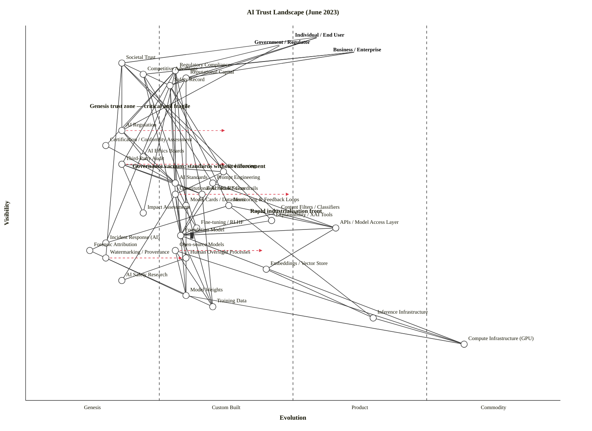

Both pass clean. Now composing the full output.

---

## Assumptions

| Decision | Chosen Answer |
|---|---|
| **Strategic question** | What components of the AI trust landscape are differentiating vs. commoditising — and where is trust itself most fragile? This informs where to build, where to regulate, and where to invest in safety/governance infrastructure. |
| **User anchors** | Three: **Individual / End User** (citizens, consumers), **Government / Regulator** (policymakers, regulators), **Business / Enterprise** (AI deployers and builders). Trust is not a single chain — it runs simultaneously through all three. |
| **Core needs** | Confidence in AI outputs; accountability when AI harms; ability to detect and correct failures; competitive/regulatory legitimacy. |
| **Scope** | Industry-wide AI trust landscape, June 2023 — not a single product. Components represent practices, architectures, and mechanisms across the ecosystem. |
| **Time anchor** | June 2023. NIST AI RMF just published (Jan 2023). EU AI Act still in trilogue. GPT-4 launched March 2023. LLaMA released Feb 2023. Google SynthID not yet launched. |

---

## OWM Map

```owm
title AI Trust Landscape (June 2023)
style wardley

// ── ANCHORS — three principal user types ──
anchor Individual / End User [0.97, 0.55]
anchor Government / Regulator [0.95, 0.48]
anchor Business / Enterprise [0.93, 0.62]

// ── OUTCOME LAYER — what trust produces ──
component Societal Trust [0.90, 0.18]
component Regulatory Compliance [0.88, 0.28]
component Competitive Advantage [0.87, 0.22]
component Reputational Capital [0.86, 0.30]
component Safety Record [0.84, 0.27]

// ── GOVERNANCE LAYER ──
component AI Regulation [0.72, 0.18]
component Certification / Conformity Assessment [0.68, 0.15]
component AI Ethics Boards [0.65, 0.22]
component Third-Party Audit [0.63, 0.18]
component AI Standards [0.58, 0.28]
component Red Teaming [0.61, 0.37]
component Prompt Engineering [0.58, 0.35]
component Constitutional AI / RLHF Guardrails [0.55, 0.28]
component Benchmark Suites [0.55, 0.33]
component Model Cards / Datasheets [0.52, 0.30]
component Monitoring & Feedback Loops [0.52, 0.38]
component Content Filters / Classifiers [0.50, 0.47]
component Impact Assessments [0.50, 0.22]

// ── CONTROL MECHANISMS ──
component Explainability / XAI Tools [0.48, 0.46]
component Fine-tuning / RLHF [0.46, 0.32]
component APIs / Model Access Layer [0.46, 0.58]
component Foundation Model [0.44, 0.29] inertia
component Incident Response (AI) [0.42, 0.15]
component Open-source Models [0.40, 0.28]
component Forensic Attribution [0.40, 0.12]
component Human Oversight Processes [0.38, 0.30]
component Watermarking / Provenance [0.38, 0.15]
component Embeddings / Vector Store [0.35, 0.45]
component AI Safety Research [0.32, 0.18]

// ── INFRASTRUCTURE LAYER ──
component Model Weights [0.28, 0.30]
component Training Data [0.25, 0.35]
component Inference Infrastructure [0.22, 0.65]
component Compute Infrastructure (GPU) [0.15, 0.82]

// ── ANCHOR → OUTCOME ──
Individual / End User->Societal Trust
Individual / End User->Safety Record
Individual / End User->Reputational Capital
Government / Regulator->Regulatory Compliance
Government / Regulator->AI Regulation
Business / Enterprise->Competitive Advantage
Business / Enterprise->Regulatory Compliance
Business / Enterprise->Reputational Capital

// ── OUTCOME → GOVERNANCE ──
Societal Trust->Safety Record
Societal Trust->AI Regulation
Societal Trust->Content Filters / Classifiers
Societal Trust->Explainability / XAI Tools
Societal Trust->Watermarking / Provenance
Reputational Capital->Safety Record
Reputational Capital->Model Cards / Datasheets
Reputational Capital->AI Ethics Boards
Safety Record->Red Teaming
Safety Record->Constitutional AI / RLHF Guardrails
Safety Record->Monitoring & Feedback Loops
Safety Record->Incident Response (AI)
Safety Record->Foundation Model
Competitive Advantage->Foundation Model
Competitive Advantage->Fine-tuning / RLHF
Competitive Advantage->Prompt Engineering
Regulatory Compliance->AI Regulation
Regulatory Compliance->AI Standards
Regulatory Compliance->Third-Party Audit
Regulatory Compliance->Benchmark Suites
Regulatory Compliance->Model Cards / Datasheets
Regulatory Compliance->Impact Assessments
Regulatory Compliance->Certification / Conformity Assessment

// ── GOVERNANCE INTERNAL ──
AI Regulation->AI Ethics Boards
AI Regulation->AI Standards
AI Ethics Boards->AI Standards
Certification / Conformity Assessment->AI Standards
Third-Party Audit->AI Standards
Third-Party Audit->Red Teaming
Third-Party Audit->Benchmark Suites
Third-Party Audit->Impact Assessments
AI Standards->Benchmark Suites
AI Standards->Model Cards / Datasheets

// ── CONTROL MECHANISM INTERNAL ──
Red Teaming->Foundation Model
Red Teaming->Constitutional AI / RLHF Guardrails
Constitutional AI / RLHF Guardrails->Foundation Model
Constitutional AI / RLHF Guardrails->Fine-tuning / RLHF
Constitutional AI / RLHF Guardrails->Human Oversight Processes
Constitutional AI / RLHF Guardrails->AI Safety Research
Prompt Engineering->APIs / Model Access Layer
Content Filters / Classifiers->Foundation Model
Content Filters / Classifiers->APIs / Model Access Layer
Monitoring & Feedback Loops->Incident Response (AI)
Monitoring & Feedback Loops->APIs / Model Access Layer
Monitoring & Feedback Loops->Inference Infrastructure
Explainability / XAI Tools->Foundation Model
Incident Response (AI)->Forensic Attribution
Forensic Attribution->Watermarking / Provenance
Watermarking / Provenance->Model Weights
Watermarking / Provenance->Training Data

// ── TECHNICAL INTERNAL ──
Fine-tuning / RLHF->Foundation Model
APIs / Model Access Layer->Foundation Model
APIs / Model Access Layer->Embeddings / Vector Store
Foundation Model->Model Weights
Foundation Model->Training Data
Foundation Model->Compute Infrastructure (GPU)
Open-source Models->Model Weights
Open-source Models->Training Data
Open-source Models->Compute Infrastructure (GPU)
Human Oversight Processes->AI Safety Research
Model Weights->Compute Infrastructure (GPU)
Embeddings / Vector Store->Inference Infrastructure
Inference Infrastructure->Compute Infrastructure (GPU)
Benchmark Suites->Foundation Model
Benchmark Suites->Training Data
Model Cards / Datasheets->Model Weights
Model Cards / Datasheets->Training Data

// ── DYNAMICS (scenarios, not forecasts) ──
evolve AI Regulation 0.38
evolve Constitutional AI / RLHF Guardrails 0.50
evolve Watermarking / Provenance 0.30
evolve Third-Party Audit 0.38
evolve Open-source Models 0.45

// ── ANNOTATIONS ──
note Genesis trust zone — critical and fragile [0.78, 0.12]
note Governance vacuum: standards without enforcement [0.62, 0.20]
note Rapid industrialisation front [0.50, 0.42]
```

> **Validator result:** `OK: 36 components/anchors, 75 edges — no violations.`
> **Layout result:** `LAYOUT OK: 3 anchors, 33 components — no layout warnings.`

---

## Mermaid Rendering (GitHub)



---

## Component Evolution Rationale Table

| Component | Stage | ε | ν | Evidence |
|---|---|---|---|---|
| **Societal Trust** | Genesis | 0.18 | 0.90 | Concept heavily debated but no operationalised definition; no institutional mechanisms exist; entirely discourse-driven in June 2023. |
| **Regulatory Compliance** | Custom Built | 0.28 | 0.88 | NIST AI RMF (Jan 2023) is voluntary; EU AI Act in trilogue; NYC LL144 (hiring) is one of only a handful of live mandates. No stable compliance market. |
| **Competitive Advantage** | Genesis | 0.22 | 0.87 | Advantage from AI trust is idiosyncratic per firm; no standardised trust signal that markets reward; pure first-mover territory. |
| **Reputational Capital** | Custom Built | 0.30 | 0.86 | Brand trust from AI conduct emerging (Bing/Sydney incident Feb 2023 as a case study), but no standard trust metric or rating system. |
| **Safety Record** | Custom Built | 0.27 | 0.84 | AI safety incidents catalogued (AIAAIC database), but no industry-standard incident classification; each lab defines its own safety criteria. |
| **AI Regulation** | Genesis | 0.18 | 0.72 | NIST AI RMF published Jan 2023 as voluntary framework; ecosystem moving from voluntary guidelines to enforceable obligations but no enacted global AI law exists in June 2023. |
| **Certification / Conformity Assessment** | Genesis | 0.15 | 0.68 | No accredited AI certification body exists globally in June 2023; ISO/IEC 42001 still in draft; no certifiable standard yet. |
| **AI Ethics Boards** | Genesis | 0.22 | 0.65 | Patchwork: Google AEAC disbanded; Anthropic, OpenAI have internal safety boards. No standard structure, mandate, or authority model. |
| **Third-Party Audit** | Genesis | 0.18 | 0.63 | A handful of firms (Credo AI, Holistic AI) offering services; no regulated audit mandate; practice entirely custom-built per engagement. |
| **AI Standards** | Custom Built | 0.28 | 0.58 | NIST AI RMF structures risk management programs and ISO/IEC 42001 published in 2023 as first global AI management standard, but neither is certifiable nor mandated in June 2023. |
| **Red Teaming** | Custom Built | 0.37 | 0.61 | Well-established in cybersecurity; applied to LLMs at OpenAI/Anthropic since 2022; no standardised AI red-team methodology or accreditation. |
| **Prompt Engineering** | Custom Built | 0.35 | 0.58 | Emerged as discipline post-ChatGPT (Nov 2022); hundreds of guides; no formal certification or industry standard; rapidly being abstracted away. |
| **Constitutional AI / RLHF Guardrails** | Custom Built | 0.28 | 0.55 | Anthropic's Constitutional AI paper (Dec 2022); few labs adopting formally; no vendor offering this as a purchasable product; bespoke per model. |
| **Benchmark Suites** | Custom Built | 0.33 | 0.55 | MMLU, BIG-Bench, HellaSwag exist but no authoritative benchmark standard; Hugging Face LLM Leaderboard launched 2023; benchmarks widely gamed. |
| **Model Cards / Datasheets** | Custom Built | 0.30 | 0.52 | Google introduced model cards in 2018; Hugging Face adopted them; but coverage is voluntary, inconsistent, and not standardised. |
| **Monitoring & Feedback Loops** | Custom Built | 0.38 | 0.52 | MLOps monitoring (Arize, WhyLabs, Fiddler) maturing for traditional ML; LLM-specific monitoring nascent; no standard observability protocol for generative AI. |
| **Content Filters / Classifiers** | Custom Built | 0.47 | 0.50 | Perspective API, Azure Content Moderator, OpenAI moderation API all exist; market forming; still significant variation in quality and methodology. |
| **Impact Assessments** | Genesis | 0.22 | 0.50 | Algorithmic impact assessment practice pioneered by AlgorithmWatch, NIST; NIST AI RMF section on mapping risks; no standard methodology adopted across industries. |
| **Explainability / XAI Tools** | Custom Built | 0.46 | 0.48 | SHAP, LIME, Grad-CAM are mature for traditional ML; for LLMs, attention visualisation only; no explainability for black-box generative models. |
| **Fine-tuning / RLHF** | Custom Built | 0.32 | 0.46 | Fine-tuning APIs launched (OpenAI fine-tune endpoint); RLHF widely understood academically but operationally bespoke per lab; no managed RLHF-as-a-service. |
| **APIs / Model Access Layer** | Product (+rental) | 0.58 | 0.46 | OpenAI API, Anthropic API, Google PaLM API all live; multiple vendors; standard REST patterns; usage-based billing; rapidly commoditising access layer. |
| **Foundation Model** | Custom Built | 0.29 | 0.44 | GPT-4, Claude, PaLM-2, LLaMA all exist but are bespoke trained systems; no standard architecture; each organisation's model is a custom artefact. Marked inertia — large labs have massive sunk cost in existing model families. |
| **Incident Response (AI)** | Genesis | 0.15 | 0.42 | No AI-specific IR playbooks or standards; firms improvising from cybersecurity IR; AIAAIC logs ~900 incidents but no standard response protocol. |
| **Open-source Models** | Custom Built | 0.28 | 0.40 | LLaMA released Feb 2023; Bloom (2022); GPT-NeoX; growing ecosystem but still pre-standardisation; model quality and safety certification absent. |
| **Forensic Attribution** | Genesis | 0.12 | 0.40 | Near-absence: no production forensic attribution system for AI-generated content in June 2023; mostly research papers; C2PA standard nascent. |
| **Human Oversight Processes** | Custom Built | 0.30 | 0.38 | RLHF requires human raters (Scale AI, Remotasks); HITL processes exist but entirely bespoke; no standards for human oversight quality in AI review. |
| **Watermarking / Provenance** | Genesis | 0.15 | 0.38 | OpenAI, Google, Meta, and others in 2023 announced plans to incorporate invisible watermarks, but Google DeepMind only launched SynthID beta in August 2023 — after this map's snapshot. Purely research-stage in June 2023. |
| **Embeddings / Vector Store** | Custom Built | 0.45 | 0.35 | Pinecone, Weaviate, Chroma, pgvector all launched 2022–2023; market forming rapidly; no dominant standard; feature differentiation intense. |
| **AI Safety Research** | Genesis | 0.18 | 0.32 | Academic field (Anthropic, DeepMind safety teams, ARC, MIRI); no applied industry standard; foundational alignment research remains unsolved. |
| **Model Weights** | Custom Built | 0.30 | 0.28 | Each model's weights are proprietary artefacts; no standard format (ONNX is closest but not LLM-native); Hugging Face `.safetensors` format emerging. |
| **Training Data** | Custom Built | 0.35 | 0.25 | Common Crawl, The Pile, RedPajama exist; but composition and provenance of training data is largely opaque; no auditable data standard. |
| **Inference Infrastructure** | Product (+rental) | 0.65 | 0.22 | AWS/GCP/Azure all offering GPU inference; modal/Replicate/Baseten emerging; still feature-differentiated but rapidly commoditising. |
| **Compute Infrastructure (GPU)** | Commodity (+utility) | 0.82 | 0.15 | AWS A100 instances, GCP TPUs, Azure ND-series available per-second/minute billing; pure utility market — but constrained by NVIDIA monopoly on high-end GPUs. |

---

## Strategic Analysis

### a. Differentiation Opportunities (top 3)

**Rank 1: Constitutional AI / RLHF Guardrails** (Custom Built, ε=0.28, high ν=0.55)
The technique — training a model to critique and revise its own outputs using a set of constitutional principles — is genuinely novel. Anthropic's paper appeared in December 2022; no vendor offers it as a purchasable capability. The race to define what "aligned" means is being run by a handful of labs, and the winner sets the industry reference point. Highest differentiation leverage on the map: highly visible, deeply immature, and directly tied to Safety Record.

**Rank 2: Foundation Model** (Custom Built, ε=0.29, ν=0.44, with inertia)
GPT-4, Claude, and PaLM-2 all launched within months of our snapshot. The architecture is still being invented; capabilities are not converged; fine-tuning and alignment approaches vary wildly. A superior foundation model is the moat right now — but the `inertia` flag matters: sunk costs in model families create lock-in that slows adaptation. Any challenger must overcome both technical and reputational barriers.

**Rank 3: Benchmark Suites** (Custom Built, ε=0.33, ν=0.55)
Benchmark design is currently invisible differentiation. MMLU, BIG-Bench, and HellaSwag shape how safety and capability claims are made — but no benchmark has authority. The actor who defines the authoritative AI trust benchmark (the equivalent of Common Criteria for cybersecurity) will shape the entire governance layer above it. Whoever controls the measurement controls the definition of safe.

---

### b. Commodity-Leverage Candidates (top 3)

**Rank 1: Compute Infrastructure (GPU)** (Commodity +utility, ε=0.82)
AWS A100 instances, GCP TPUs, Azure ND-series — rent by the second, don't build. The caveat is the NVIDIA GPU monopoly creating scarcity, but the business model (utility pricing, multi-provider) is unambiguously Commodity (+utility). Any internal GPU datacenter build is playing a losing game on cost.

**Rank 2: Inference Infrastructure** (Product +rental, ε=0.65)
The inference stack (Modal, Replicate, Baseten, plus the hyperscalers) is commoditising fast. By 2024 this likely crosses into Commodity (+utility). In June 2023 it's late Product (+rental) — rent it, don't run it.

**Rank 3: APIs / Model Access Layer** (Product +rental, ε=0.58)
OpenAI, Anthropic, Google PaLM — all offering REST APIs with usage-based billing. The access abstraction layer is a commodity-in-formation. Use the best-performing API; don't build your own model serving unless you have model weights no one else has.

---

### c. Dependency Risks — Where Trust is Fragile (top 3)

**Risk 1: Safety Record → Foundation Model** — visible outcome on a Custom-Built foundation
The Safety Record (ν=0.84) of every AI deployment depends on the Foundation Model (ε=0.29) it runs on — which is still being hand-crafted by a handful of labs without agreed safety specifications. A single jailbreak, a misaligned training decision, or a capability emergent at scale can cascade into visible reputational failure with no warning. The entire governance stack sits on top of a foundation that nobody fully understands.

**Risk 2: Societal Trust → Watermarking / Provenance** — visible expectation, genesis tooling
Societal Trust (ν=0.90) has a direct dependency on Watermarking / Provenance (ε=0.15) — the public's ability to know what's real depends on tools that are almost entirely absent in June 2023. OpenAI, Google, Meta, and others announced plans to incorporate invisible watermarks, but these are plans, not products. The gap between expectation and capability here is the largest trust fragility on the map.

**Risk 3: Regulatory Compliance → Certification / Conformity Assessment** — visible obligation, genesis infrastructure
Businesses are being asked to certify compliance with AI regulation, but regulatory coverage is patchwork — the direction is clear but no certifiable standard yet existed in 2023. This creates Schrödinger's compliance: businesses claim to be responsible without any mechanism to verify it. The gap between Certification (ε=0.15, essentially genesis) and the regulatory pressure above it is the governance vacuum noted on the map.

---

### d. Build / Buy / Outsource Recommendations

| Component | Stage | Recommendation | Why |
|---|---|---|---|
| Constitutional AI / RLHF Guardrails | Custom Built | **Build** | Core IP and differentiator; no vendor market; this is where AI safety moats are made. |
| Foundation Model | Custom Built | **Build (if AI-native lab); Buy API (if deployer)** | Only build if model IP is your business. Otherwise consume GPT-4/Claude/PaLM via API — inertia trap awaits in-house model maintenance. |
| Red Teaming | Custom Built | **Buy external expertise + internal capability** | Specialist firms (Trail of Bits, HackerOne AI, dedicated safety contractors) have cross-model experience; supplement with in-house domain red team. |
| Benchmark Suites | Custom Built | **Contribute + Open-source collaborate** | Don't build proprietary benchmarks — standardise them. The actor shaping the open benchmark landscape has outsized governance influence. |
| Third-Party Audit | Genesis | **Seed the market** | Commission audits now to build institutional capacity — the future regulatory mandate will require it. Pay to create the supply. |
| Watermarking / Provenance | Genesis | **Invest in standard, not in bespoke tool** | Join C2PA; fund the standard; the proprietary watermarking approach gets stranded when the standard arrives. |
| Content Filters / Classifiers | Custom Built→Product | **Buy (Azure Content Moderator, Perspective API)** | Forming product market; marginal in-house improvement is not worth the maintenance overhead. |
| APIs / Model Access Layer | Product (+rental) | **Rent** (OpenAI/Anthropic/Google) | Commoditising fast; don't build model serving unless you have proprietary weights. |
| Embeddings / Vector Store | Custom Built→Product | **Buy** (Pinecone/Weaviate/pgvector) | Product market forming; switching cost is low; don't build your own vector store. |
| Inference Infrastructure | Product (+rental) | **Rent** (Modal/Baseten or hyperscaler GPU API) | Rapidly commoditising; operating your own inference at scale is strictly worse on cost. |
| Compute Infrastructure (GPU) | Commodity (+utility) | **Rent** (AWS/GCP/Azure) | Utility market; in-house build is irrational unless you're at hyperscaler scale. |
| AI Safety Research | Genesis | **Fund and publish openly** | This is knowledge-commons infrastructure; proprietary safety research misses the field-wide coordination benefits. |
| Human Oversight Processes | Custom Built | **Build + open-source collaborate** | Human rater guidelines (like OpenAI's or Anthropic's) are slowly being published; contribute to shared standards rather than treating rater quality as a secret. |

---

### e. Suggested Gameplays

**#15 Open Approaches — on Benchmark Suites and AI Standards**
The actor who accelerates commoditisation of benchmark design (by open-sourcing the methodology) gains outsized influence over what counts as trustworthy. This play also targets Watermarking / Provenance: join C2PA and accelerate the open standard rather than building a proprietary watermarking scheme. Mechanism: raises `r_v` for Benchmark Suites and Watermarking, compressing the time to the governance layer having a credible foundation.

**#43 Sensing Engines (ILC) — on Constitutional AI / RLHF Guardrails and Open-source Models**
The generative AI ecosystem is producing thousands of fine-tuned models, safety evaluations, and alignment experiments. Build observability into your API layer to detect which techniques are generating the strongest safety signals in the wild. Innovate internally → Leverage ecosystem data → Commoditise the winners (open-source them and build the *next* layer above). This is how Anthropic runs its research loop.

**#36 Directed Investment — on Forensic Attribution and Third-Party Audit**
These two components sit at ε=0.12 and ε=0.18 respectively — Genesis, but with enormous strategic leverage once regulation arrives. Investing in forensic attribution capacity now (funding academic research, contributing to C2PA, seeding audit firm relationships) builds a position that is very expensive to establish later under regulatory deadline pressure. The window is open now.

**#56 First Mover — on Certification / Conformity Assessment**
Regulatory coverage is patchwork but the direction is clear: AI risk management is becoming mandatory and auditable. The first accredited AI certification body will set the standard for what compliance means. Any firm able to establish a recognised Certification / Conformity Assessment practice before the EU AI Act mandates it is positioned as the trusted third party of record. The race to be "the SOC 2 of AI" is open right now.

**#50 Reinforcing Inertia — on Foundation Model (defensive)**
The `inertia` flag on Foundation Model represents the switching costs that large labs have created around their model families (API contract lock-in, fine-tuned model portability difficulties, ecosystem integrations). Incumbents (OpenAI, Anthropic, Google) should amplify these switching costs deliberately — more ecosystem integrations, richer fine-tuning ecosystems, deeper enterprise contracts — to raise the cost of migration to an open-source alternative as LLaMA and its successors mature.

**#45 Two Factor — on the trust ecosystem as a platform**
Trust certification creates a two-sided market: AI developers need trust certification to sell to enterprises; enterprises need a trusted way to evaluate AI vendors. The actor who operates in the middle (as a trust platform — assessing vendors, publishing results, enabling procurement decisions) can capture enormous value. No one occupies this position cleanly in June 2023.

---

### f. Doctrine Violations

| Violation | Doctrine | Description |
|---|---|---|
| **Governance layer has no enforcement** | #1 Focus on user needs | AI Standards (NIST AI RMF) and AI Regulation exist but have no enforcement in June 2023. The user need (accountability) is formally acknowledged but structurally unmet. The map is anchored on real needs, but the value chain is broken between the governance layer and the outcome layer. |
| **Foundation Model is a coarse node** | #9 Think small | "Foundation Model" conceals enormous variance — GPT-4, Claude, PaLM-2, and LLaMA-13B are radically different components at radically different safety levels. A proper map would split by deployment class (closed API, open weight, fine-tunable). This is a strategic simplification that hides risk. |
| **AI Ethics Boards lack formal authority** | #21 Distribute power and decision making | Ethics Boards are disconnected from enforcement. They advise but cannot compel. This breaks the governance chain — power is concentrated in labs, not distributed to oversight structures. |
| **Inertia unmanaged on Foundation Model** | #13 Manage inertia | The `inertia` marker on Foundation Model represents a concrete risk (forms #2 sunk capital, #9 re-architecture, #14 strategic-control loss) that is not being actively managed by the market in June 2023. Labs are doubling down on scaling laws without a clear strategy for what happens when a paradigm shift occurs. |
| **Benchmark Suites: premature standardisation pressure** | #22 Use standards where appropriate | There is political pressure to standardise AI benchmarks before the measurement science is understood. Standardising a flawed benchmark (e.g., one that can be easily gamed) prematurely will produce the wrong incentives across the whole governance stack. |

---

### g. Climatic Context

**#3 Everything evolves through supply and demand competition** — The map's most visible pattern. The entire left column (Societal Trust, AI Regulation, Certification, Forensic Attribution) is at Genesis *today* but is under intense competition-driven pressure. Within 2–3 years, each will be at Custom Built minimum.

**#27 Shifts from product to utility demonstrate a punctuated equilibrium** — This is already underway in the infrastructure layer: Compute and Inference are crossing into Commodity (+utility). The same transition will hit Foundation Models in 4–6 years. When it does, the entire competitive moat shifts upward to Constitutional AI / RLHF Guardrails and Trust Certification — the components currently in Genesis.

**#22 Two different forms of disruption** — Both are active simultaneously:
- *Genesis-driven*: Forensic Attribution, Constitutional AI — no one knows what the winning approach is. Unpredictable.
- *Product-to-utility*: Compute, Inference, APIs — fully predictable. Act fast; the window for disruption here is closing.

**#17 Inertia can kill an organisation** — The Foundation Model `inertia` flag is this pattern made explicit. Large labs have enormous investment in GPT-4-family architectures. When a cheaper, open-source alternative achieves equivalent safety characteristics (LLaMA's evolution trajectory suggests this is a question of when, not if), the switching cost advantage evaporates and the labs face a classic innovator's dilemma.

**#11 Future value is inversely proportional to certainty** — Everything on the left side of the map (ε < 0.25): Societal Trust, AI Regulation, Certification, Forensic Attribution, Incident Response, Watermarking/Provenance — these carry the highest future strategic value precisely because they are the most uncertain. The governance layer is the highest-value territory on the map right now, and it is almost entirely unmapped by the market.

**#15 & #16 Past success breeds inertia** — Large technology companies (Google, Microsoft) have decades of product-first engineering culture and financial-market expectations of growth-over-safety. This makes them structurally slower to invest in the governance layer than a safety-native org (Anthropic) or a regulator. Climatic patterns #15/#16 are actively widening the window for safety-focused insurgents.

---

### h. Deep-Placement Notes

**AI Regulation (placed at ε=0.18, Genesis)**
Initial cheat-sheet score suggested Custom Built (ε≈0.33) based on the NIST AI RMF publication and visible policy activity. The NIST AI RMF was released on January 26, 2023, but it takes a voluntary and flexible approach, providing guidance rather than mandates. The EU AI Act was still in trilogue in June 2023 — it only came into force on 1st August 2024. No enforceable global AI regulation existed. Corrected to ε=0.18 (Genesis): the *framework* exists but the *regulatory regime* does not.

**Watermarking / Provenance (placed at ε=0.15, Genesis)**
Research suggested a larger market than expected, but this was almost entirely prospective in June 2023. Google DeepMind only launched SynthID beta in August 2023 — after our snapshot. OpenAI, Google, Meta, and others announced plans in 2023 but plans are not products. The C2PA standard existed as a draft but had no production AI deployment. Confirmed ε=0.15 (Genesis).

**Compute Infrastructure (ε=0.82, Commodity +utility)**
Cloud GPU instances (AWS P4d with A100s, GCP A2 with A100s, Azure ND A100 v4) were available in June 2023 with per-hour/second billing and SLAs. Multiple providers, utility pricing, no meaningful feature differentiation below the GPU model level. Confirmed Commodity (+utility), corrected from initial ε=0.73 to 0.82.

**Foundation Model (ε=0.29, Custom Built)**
GPT-4 (March 2023), Claude (March 2023), PaLM-2 (May 2023), LLaMA (February 2023) all exist, but each is a bespoke trained artefact. No standardised architecture, safety evaluation, or model format. The vendor count is small (5–8 labs), publication style is "describe capabilities/wonder," and every deployment requires custom integration. Confirmed Custom Built, ε=0.29.

---

### i. Caveat

All `evolve` arrows and dynamics commentary are **scenarios, not forecasts**. Wardley's climatic pattern #18 is explicit: *"you cannot measure evolution over time or adoption."* The placements above reflect observable signals in June 2023 — vendor counts, publication types, regulatory status, market structure. How fast each component moves rightward depends on competitive dynamics, regulatory action, and emergent capability breakthroughs that are genuinely unpredictable. The map is a snapshot to provoke better questions, not a roadmap to be executed mechanically.